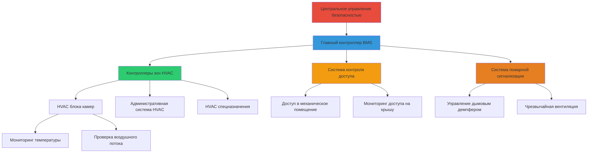
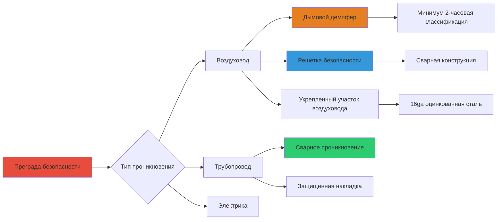

Системы HVAC в учреждениях юстиции представляют уникальные проблемы безопасности, требующие специализированных подходов к проектированию для предотвращения манипуляции системой, несанкционированного доступа и потенциальных нарушений безопасности. Эти системы должны уравновешивать эксплуатационные требования со строгими протоколами безопасности при сохранении соответствия нормам и надлежащих условий окружающей среды.

## Принципы проектирования безопасности

### Контроль физического доступа

Оборудование HVAC в учреждениях юстиции требует нескольких уровней физической защиты для предотвращения несанкционированного вмешательства, вандализма или использования в качестве путей побега. Все оборудование, доступное заключенным, должно быть укреплено или перемещено в защищенные зоны.

**Основные зоны безопасности:**

- Защищенные механические помещения с контролируемым доступом
- Зоны, доступные заключенным, требующие укрепленного оборудования
- Зоны только для персонала со стандартным коммерческим оборудованием
- Периметральные зоны безопасности с дополнительным мониторингом

Размещение оборудования следует иерархии, основанной на оценке риска безопасности. Компоненты высокого риска, такие как воздухоприемные устройства, демпферы и системы управления, расположены в ограниченных зонах, доступных только авторизованному техническому персоналу.

### Проектирование оборудования, защищенного от несанкционированного вмешательства

Все компоненты HVAC в зонах, доступных заключенным, должны соответствовать строгим требованиям против удушения и защиты от несанкционированного вмешательства.

| Компонент | Функция безопасности | Стандартное применение |
|-----------|----------------------|------------------------|
| Диффузоры | Сварная конструкция, винты безопасности | Все зоны содержания заключенных |
| Решетки | Минимум 16 ga, защищенные крепежи | Камеры, общие зоны |
| Термостаты | Утопленные, полукарбонатные крышки, ограниченный доступ | Общие площади |
| Воздуховоды | Усиленные, сварные швы, защищенное крепление | Выше потолков в камерах |
| Трубопроводы | Труба Schedule 80, сварные соединения | Открытые места |
| Панели доступа | Сварные каркасы, оборудование безопасности | Все доступные зоны |

Механическая целостность оборудования, защищенного от несанкционированного вмешательства, должна выдерживать попытки насильственного входа при сохранении тепловых характеристик. Протоколы испытания проверяют как структурную прочность, так и функциональность HVAC.

## Интеграция с системами безопасности

### Безопасность системы управления зданием

Системы управления HVAC в учреждениях юстиции интегрируются с сетями безопасности на уровне учреждения при сохранении операционной независимости. Эта интеграция обеспечивает скоординированные реакции на события безопасности без компрометации контроля окружающей среды.

Архитектура системы управления включает несколько уровней безопасности:

1. **Разделение сети** - элементы управления HVAC на отдельной VLAN от общей сети учреждения
2. **Протоколы аутентификации** - многофакторная аутентификация для доступа к системе
3. **Журналирование аудита** - полная запись всех изменений системы и попыток доступа
4. **Резервные элементы управления** - ручные переопределения в защищенных местах для критических систем
5. **Возможности блокировки** - удаленное отключение скомпрометированных контрольных точек

### Координация реагирования на чрезвычайные ситуации

Системы HVAC автоматически реагируют на события безопасности через интеграцию с системами сигнализации и связи. Режимы управления дымом, нагнетания давления и вентиляции изменяются в зависимости от статуса учреждения.

**Реакции на события безопасности:**

| Тип события | Ответ HVAC | Время ответа |
|------------|-----------|--------------|
| Пожарная сигнализация | Активация управления дымом, позиционирование демпферов | Немедленно |
| Блокировка | Изоляция зоны, сохранение минимальной вентиляции | 30 секунд |
| Химический инцидент | 100% вытяжка, без рециркуляции | 60 секунд |
| Отказ питания | Переход на аварийные системы | 10 секунд |
| Состояние беспорядков | Изоляция затронутых зон | 60 секунд |

Стратегия нагнетания давления при событиях безопасности предотвращает миграцию дыма или загрязнителей между зонами. Перепад давления на преградах безопасности поддерживается как:

$$\Delta P_{barrier} = \frac{Q \cdot \rho}{2 \cdot A^2 \cdot C_d^2}$$

где:
- $\Delta P_{barrier}$ = перепад давления на преграде (Па)
- $Q$ = воздушный поток через преграду (м³/с)
- $\rho$ = плотность воздуха (кг/м³)
- $A$ = эффективная площадь утечки (м²)
- $C_d$ = коэффициент расхода (обычно 0,6–0,7)

Минимальные перепады давления в 12,5 Па поддерживаются на преградах безопасности во время нормальной работы, увеличиваясь до 25 Па во время аварийных режимов.

## Безопасность воздуховодов и трубопроводов

### Контроль проникновения

Каждое проникновение воздуховода и трубопровода через преграду безопасности представляет потенциальную точку нарушения. Проектирование должно предотвращать доступ заключенных при сохранении целостности огнеустойчивости.

**Требования к безопасности проникновения:**

- Воздуховоды через преграды: решетки безопасности с обеих сторон
- Максимальный размер отверстия: 15 см для любого отверстия решетки
- Доступ к дымовому демпферу: только со стороны, не являющейся защищенной
- Кольцевой зазор рукава: заполнен невъемным огнеустойчивым материалом
- Панели осмотра: расположены в защищенных коридорах или механических помещениях

### Размер воздуховода для безопасности

Воздуховоды в зонах, доступных заключенным, рассчитаны таким образом, чтобы предотвратить прохождение человека при сохранении требований воздушного потока. Максимальный гидравлический диаметр ограничен:

$$D_h = \frac{4A}{P} \leq 200 \text{ мм}$$

где:
- $D_h$ = гидравлический диаметр (мм)
- $A$ = площадь сечения воздуховода (мм²)
- $P$ = периметр воздуховода (мм)

Для прямоугольных воздуховодов соотношения сторон отдают предпочтение конфигурациям, минимизирующим наименьшее измерение, обычно поддерживая соотношение ширины к высоте от 2:1 до 4:1.

## Доступ и безопасность при техническом обслуживании

### Классификация механических помещений

Механические помещения оборудования классифицируются по уровню безопасности для определения требований контроля доступа и спецификаций оборудования.

| Уровень безопасности | Требования доступа | Тип оборудования | Типовое местоположение |
|------|------|------|------|
| Уровень 1 – Минимальный | Доступ с ключом, реестр входов | Коммерческий класс | Административные зоны |
| Уровень 2 – Средний | Доступ по карте, требуется сопровождение | Коммерческий с мониторингом | Вспомогательные зоны |
| Уровень 3 – Высокий | Двойная проверка, вооруженное сопровождение | Закаленный, резервный | Жилые единицы |
| Уровень 4 – Максимальный | Допуск безопасности, многократное сопровождение | Максимальный класс безопасности | Спецназначение, изоляция |

Двери механических помещений соответствуют стандартам безопасности со специализированным оборудованием типа задержания, смотровыми панелями только со стороны безопасности и выключателями положения двери, интегрированными в мониторинг безопасности.

### Интеграция протокола технического обслуживания

Техническое обслуживание HVAC в учреждениях юстиции требует координации с операциями безопасности. Системы разрешений на работы отслеживают весь доступ в механические помещения и работы по оборудованию.

**Процедура доступа при техническом обслуживании:**

1. Подать заявку на работу с проверкой допуска безопасности
2. Инвентаризация инструмента при входе в контроль безопасности
3. Назначение эскорта на основе классификации помещения
4. Мониторинг в реальном времени во время работы
5. Инвентаризация инструмента при выходе с выверкой
6. Осмотр безопасности рабочей зоны после завершения

Стратегии предиктивного обслуживания минимизируют частоту доступа при сохранении надежности системы. Системы удаленного мониторинга отслеживают производительность оборудования с предупреждениями о деградации до отказа.

## Соответствие нормам и стандартам

Проектирование безопасности HVAC для учреждений юстиции должно соответствовать нескольким стандартам:

- **ASHRAE Standard 170**: Требования к вентиляции для учреждений здравоохранения (применимо к медицинским отделениям задержания)
- **IMC Chapter 4**: Требования к вентиляции и минимальные расходы
- **NFPA 101**: Положения Кодекса безопасности жизни для занятости содержанием и исправлением
- **Стандарты ACA**: Требования Американской ассоциации исправительных учреждений к условиям окружающей среды
- **Стандарты PREA**: Соображения Закона об искоренении изнасилования в тюрьмах для проектирования

Диапазоны температуры и вентиляции должны соответствовать как минимальным требованиям норм, так и требованиям операционной безопасности, поддерживая 20–23°C в жилых зонах с минимум 7,5 CFM (12,75 м³/ч) наружного воздуха на человека.

Проектная скорость удаления тепла для высокоплотных зон рассчитывается:

$$q_{total} = N \cdot (q_{sensible} + q_{latent})$$

где:
- $q_{total}$ = общее удаление тепла (кДж/ч)
- $N$ = максимальное количество людей
- $q_{sensible}$ = явное тепло на человека (264 кДж/ч при легкой активности)
- $q_{latent}$ = скрытое тепло на человека (211 кДж/ч при легкой активности)

Модификации проектирования, управляемые безопасностью, не должны компрометировать минимальные требования норм для пригодности жилья и безопасности жизнедеятельности, требуя тщательного проектирования для уравновешивания конкурирующих задач.
