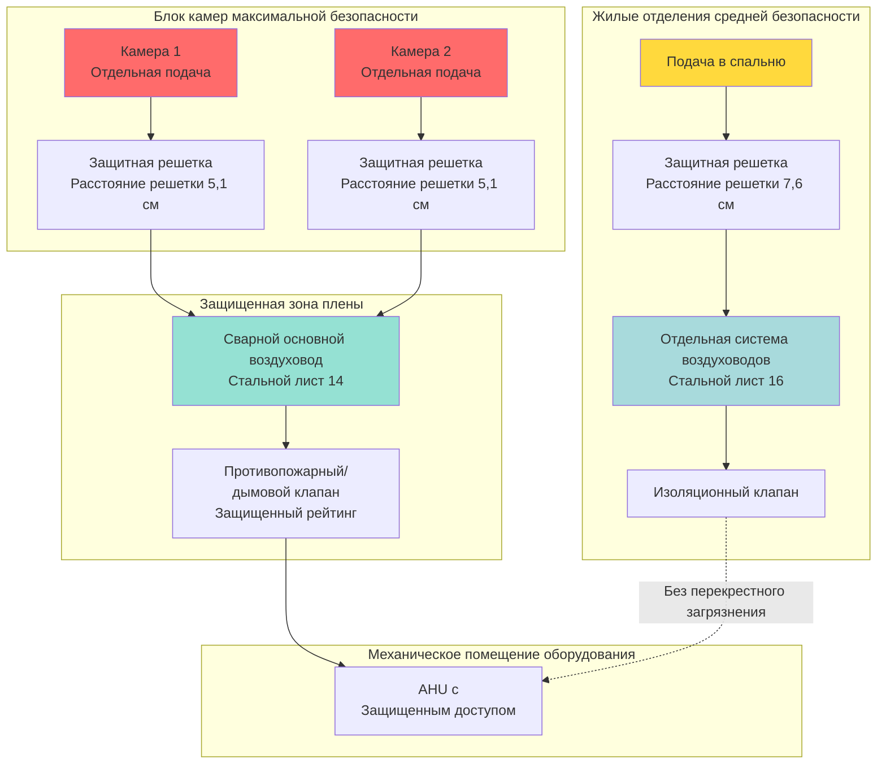

## Обзор

Воздуховоды в исправительных учреждениях представляют критические уязвимости безопасности, требующие специализированного инженерного проектирования, выходящего за рамки стандартной практики HVAC. Вентиляционные каналы могут служить путями для попыток побега, передачи контрабанды между зонами, скрытия оружия и межкамерного общения. Проектирование воздуховодов с рейтингом безопасности должно сбалансировать требования вентиляции с задачами физической безопасности при соблюдении кодекса требований к воздушному потоку.

## Классификация рисков безопасности

Требования к безопасности воздуховодов варьируются в зависимости от зоны объекта и классификации заключенных. В следующей таблице установлены минимальные стандарты безопасности:

| Зона безопасности | Конструкция воздуховода | Расстояние решетки | Тип крепежа | Доступ для проверки |
|---------------|-------------------|-------------|---------------|-------------------|
| Камеры максимальной безопасности | Сварной стальной лист 14-16 | 5,1 см макс. | Защищенные от несанкционированного доступа винты | Только снаружи |
| Жилые отделения средней безопасности | Сварной/болтовой 16-18 | 7,6 см макс. | Болты безопасности с датчиками разрыва | Ограниченный внутренний доступ |
| Спальня минимальной безопасности | Болтовой 18-20 | 10,2 см макс. | Крепеж, устойчивый к вандализму | Стандартный доступ |
| Административные помещения | Стандартная конструкция | Н/П | Стандартный крепеж | Стандартный доступ |
| Прием/обработка | Сварной стальной лист 16 | 6,4 см макс. | Винты безопасности | Только снаружи |

## Предотвращение проникновения воздуховодов

### Проектирование армирования решеткой

Все воздуховоды, проникающие через барьеры безопасности, требуют внутреннего армирования решеткой. Требуемая плотность решетки следующая:

$$A_{\text{opening}} = \frac{\pi d^2}{4}$$

где максимальный допустимый диаметр отверстия $d$ зависит от классификации безопасности. Для приложений максимальной безопасности:

$$d_{\text{max}} = 50 \text{ мм}$$

Армирование решеткой должно обеспечить:

$$S_{\text{bar}} \leq 5,1 \text{ см центр-к-центру}$$

Минимальный диаметр стержня для стального армирования:

$$d_{\text{bar}} = 9,5 \text{ мм, сталь Grade 60}$$

### Требования к сварной конструкции

Соединения высокозащищенных воздуховодов должны быть полностью сварены для предотвращения разборки. Глубина проплавления сварного шва:

$$t_{\text{weld}} \geq 0,75 \times t_{\text{duct}}$$

где $t_{\text{duct}}$ представляет толщину стенки воздуховода. Минимальный калибр воздуховода для зон безопасности:

| Классификация зоны | Минимальный калибр | Минимальная толщина |
|---------------------|---------------|-------------------|
| Максимальная безопасность | 14 | 1,9 мм |
| Средняя безопасность | 16 | 1,5 мм |
| Минимальная безопасность | 18 | 1,2 мм |

## Изоляция зон безопасности

Следующая диаграмма иллюстрирует надлежащее разделение зон безопасности воздуховодов:

## Безопасность решеток и диффузоров

### Требования к защищенному крепежу

Стандартные решетки HVAC используют съемные винты, доступные из занятых помещений. Приложения в исправительных учреждениях требуют:

1. **Защищенные от несанкционированного доступа крепежные элементы:** Односторонние винты безопасности или приводы pin-in-torx
2. **Сварное крепление:** Прямая сварка рамок решетки к воздуховодам
3. **Непрерывное крепление по периметру:** Крепежные элементы с максимальным расстоянием 10,2 см
4. **Обнаружение разрыва:** Электронный мониторинг целостности крепежа в зонах максимальной безопасности

### Максимальные размеры отверстия

Регистры и отверстия решеток должны предотвратить прохождение контрабанды или инструментов:

$$A_{\text{free}} = \sum_{i=1}^{n} A_{\text{opening,i}}$$

где площадь отдельного отверстия:

$$A_{\text{opening,i}} \leq \pi \left(\frac{d_{\text{max}}}{2}\right)^2 = 20,3 \text{ см}^2 \text{ (максимальная безопасность)}$$

## Безопасность вертикального канала

Вертикальные каналы воздуховодов представляют наивысший риск побега из-за потенциала вертикального перемещения. Требования безопасности включают:

1. **Компартментализация канала:** Максимум 3 м вертикальных участков со стальными пластинами
2. **Сварные барьеры:** Минимум стальной лист 14 калибра, сваренный со структурой канала
3. **Армирование решеткой на каждом уровне:** Горизонтальные стержни с расстоянием 5,1 см
4. **Безопасность двери доступа:** Только внешний доступ с защитными дверями
5. **Положения для проверки:** Возможность видеопроверки без входа

### Соображения относительно перепада давления

Армирование решеткой безопасности увеличивает потерю давления системы. Дополнительная потеря давления:

$$\Delta P_{\text{bars}} = K_{\text{bars}} \times \frac{\rho V^2}{2}$$

где коэффициент потерь для решетчатых решеток:

$$K_{\text{bars}} = 2,5 \text{ до } 4,0 \text{ (в зависимости от плотности решетки)}$$

Это требует увеличения мощности вентилятора на 15-30% по сравнению со стандартными системами воздуховодов.

## Интеграция безопасности противопожарного клапана

Противопожарные и дымовые клапаны в защищенных воздуховодах требуют специализированного проектирования:

1. **Работа с отказом на защиту:** Клапаны должны закрываться и оставаться закрытыми без питания
2. **Защищенные от несанкционированного доступа приводы:** Доступ к приводу только со защищенной стороны
3. **Армирование решеткой:** Внутренние стержни независимо от механизма клапана
4. **Сварные рамы:** Рукав клапана сварен к воздуховоду и конструкции
5. **Дистанционный сброс:** Ручной сброс из защищенного механического помещения только

## Протоколы доступа и обслуживания

Защищенные воздуховоды создают проблемы с обслуживанием:

**Требования панели доступа:**
- Расположена только в защищенных коридорах или механических помещениях
- Защищенные двери с электронным мониторингом
- Конструкция из стального листа минимум 16 калибра
- Непрерывный шарнир с защищенным крепежом

**График проверки:**
- Визуальная проверка: ежемесячно для зон максимальной безопасности
- Испытание целостности конструкции: ежеквартально
- Проверка армирования решеткой: два раза в год
- Проверка сварного шва: ежегодно с сертифицированным инспектором

## Предотвращение передачи контрабанды

Воздуховоды могут облегчить перемещение контрабанды между камерами или зонами. Стратегии предотвращения:

1. **Индивидуальные подачи в камеры:** Отдельные воздуховоды предотвращают передачу между камерами
2. **Проектирование только подачи:** Возвратный воздух через защищенные коридоры, а не через воздуховоды камер
3. **Контроль направления воздушного потока:** Положительное давление в камерах предотвращает обратный поток
4. **Акустическое разделение:** Теплоизоляция и перегородки предотвращают голосовое общение
5. **Распределение небольшого диаметра:** Максимум 15 см диаметра воздуховода в зонах камер

Требуемая звукоизоляция:

$$TL \geq 50 \text{ дБ на речевых частотах (500-2000 Hz)}$$

## Стандарты и ссылки на нормативы

Проектирование систем защищенных воздуховодов должно соответствовать:

- **Стандарты ACA:** Стандарты проектирования Американской ассоциации исправительных учреждений
- **ASHRAE 15:** Стандарт безопасности механического охлаждения
- **NFPA 90A:** Стандарт установки систем кондиционирования воздуха и вентиляции
- **Защищенные воздуховоды SMACNA:** Специализированные стандарты конструкции
- **Стандарты государственных органов DOC:** Требования конкретной юрисдикции для исправительных учреждений

## Заключение

Безопасность воздуховодов в исправительных учреждениях требует инженерных знаний, выходящих за рамки стандартного проектирования HVAC. Интеграция физических барьеров безопасности, сварной конструкции, армирования решеткой и изоляции зон должна происходить без компромисса в отношении эффективности вентиляции или соответствия кодексу. Успешные системы сбалансируют требования безопасности с требованиями здоровья заключенных при сохранении долгосрочной целостности конструкции и доступности для проверки.
