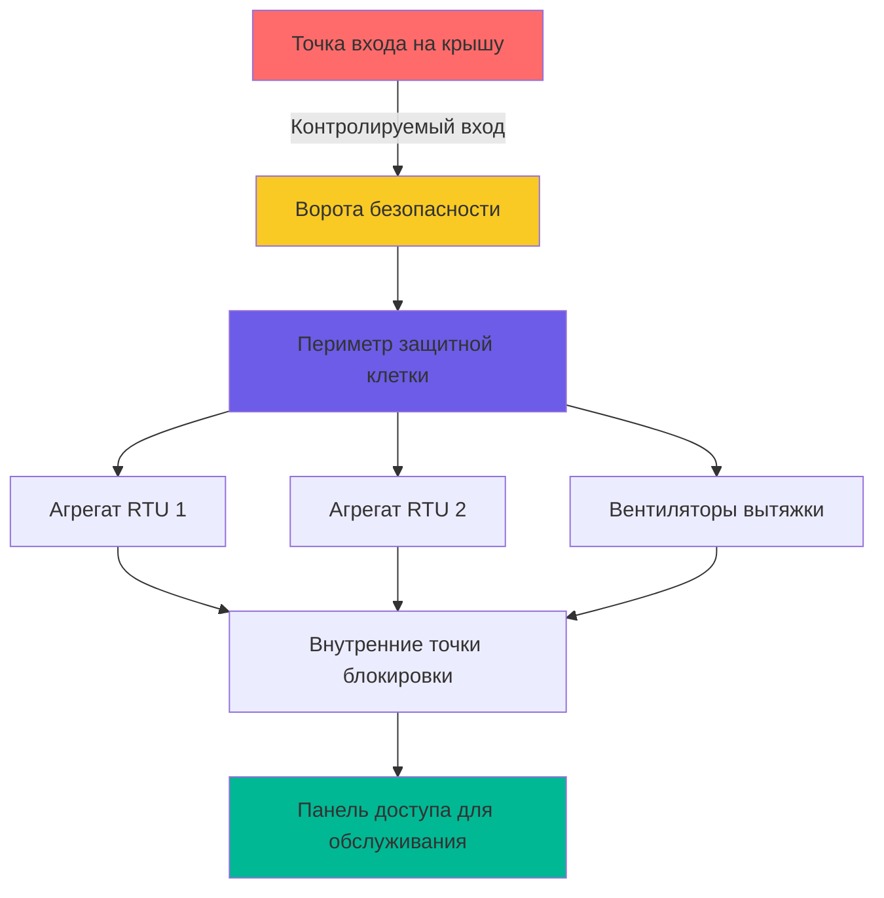
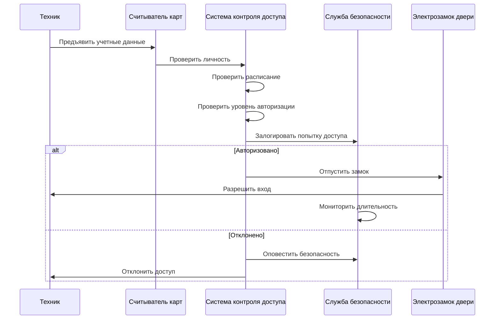

## Обзор

Оборудование HVAC в учреждениях уголовной юстиции требует строгих мер контроля доступа для предотвращения несанкционированного вмешательства, попыток побега и саботажа системы. Защита оборудования охватывает физические барьеры, протоколы управления доступом и интегрированные системы видеонаблюдения, которые балансируют требования эксплуатации с требованиями безопасности.

Двойной мандат на обеспечение надежного климат-контроля при одновременном предотвращении несанкционированного доступа создает уникальные проблемы. Сбой в системе безопасности может привести к захвату заложников, сокрытию контрабанды, манипулированию системой для побега или компрометации критической инфраструктуры.

## Физические барьеры безопасности

### Конструкция механических помещений

Механические помещения, содержащие основное оборудование HVAC, требуют усиленной конструкции, превышающей стандартные коммерческие спецификации:

| Элемент безопасности | Спецификация | Назначение |
|---|---|---|
| Конструкция стены | Минимум 20 см бетонные блоки с армированием | Предотвращение попыток прорыва |
| Класс двери | Дверь охранного класса, стальная рама | Сопротивление силовому входу |
| Классификация замка | Высокая безопасность, ограниченный профиль ключа | Контроль дублирования ключей |
| Потолок | Непрерывный до перекрытия | Исключение обходных маршрутов |
| Окна | Запрещены | Исключение визуального/физического доступа |
| Герметизация отверстий | Все отверстия <0,062 м² | Предотвращение прохода |

Критическое сопротивление потоку воздуха через барьеры безопасности подчиняется:

$$\Delta P = \frac{1}{2}\rho v^2 \left(\frac{L}{D}\right)f$$

где ограниченные отверстия должны поддерживать перепады давления при соответствии требованиям безопасности менее 0,062 м² в соответствии со стандартами ACA.

### Безопасность оборудования на крыше

Оборудование HVAC на крыше представляет повышенный риск побега и требует комплексной защиты периметра:

**Спецификации ограждения безопасности:**
- Высота: минимум 3,7 м выше кровельной поверхности
- Сетка: минимум калибр 9, максимальные отверстия 5 см
- Верхняя защита: 3-жильный колючий провод, угол 45° наружу
- Основание: закреплено через кровельную мембрану к конструктивной палубе
- Ворота: самозакрывающиеся, высокобезопасные замки, ограниченное количество

**Дизайн защитной клетки:**

### Периметр площадки оборудования

Площадки оборудования на уровне земли требуют многоуровневой безопасности:

1. **Внешний периметр**: Сетчатое ограждение из стального провода, высота 3,7 м, верхняя защита с колючей проволокой
2. **Расстояние отступа**: Минимум 6 м от конверта здания
3. **Зона сплошного обзора**: Никаких предметов в пределах 4,6 м от линии забора
4. **Освещение**: Минимум 215 люкс по всей площадке
5. **Внутренний барьер**: Вторичное ограждение для высокозащищенного оборудования

## Системы контроля доступа

### Протоколы контроля ключей

Высокобезопасные механические системы требуют систем с ограниченным профилем ключа, предотвращающих несанкционированное дублирование:

| Уровень контроля | Тип ключа | Распределение | Документация |
|---|---|---|---|
| Уровень 1 – Основной | Главный мастер-ключ | Только директор учреждения | Ежедневный журнал аудита |
| Уровень 2 – Вторичный | Мастер-ключ | Руководитель обслуживания | Еженедельная инвентаризация |
| Уровень 3 – Оперативный | Вспомогательный мастер-ключ | Сертифицированные техники | Ежемесячное согласование |
| Уровень 4 – Ограниченный | Основной ключ | Доступ только с сопровождением | Регистрация при выдаче |

Вероятность несанкционированного доступа при надлежащем контроле ключей следует:

$$P_{access} = P_{key} \times P_{schedule} \times P_{detection}^{-1}$$

Снижение $P_{key}$ путем использования ограниченных профилей ключа является основным защитным слоем.

### Электронное управление доступом

Современные учреждения уголовной юстиции интегрируют электронное управление доступом:

**Компоненты системы:**
- Считыватели карт у всех входов в механические помещения
- Биометрическая верификация для высокозащищенных зон
- Планирование доступа на основе времени
- Принудительное предотвращение несанкционированного следования
- Интеграция кнопки тревоги
- Генерация журнала аудита (минимальное хранение 7 лет)

**Диаграмма потока доступа:**

## Процедуры доступа для обслуживания

### Предварительно одобренная авторизация работ

Весь доступ к механическим системам требует координации с безопасностью:

1. **Подача наряда на работу**: Минимум 24-часовое предварительное уведомление
2. **Проверка безопасностью**: Проверка судимости подрядчиков
3. **Инвентаризация инструментов**: Полный список представлен, проверен при входе/выходе
4. **Назначение сопровождающего**: Персонал безопасности назначен в зависимости от местоположения
5. **Протокол обыска**: Обыск человека и инструментов при входе/выходе
6. **Коммуникация**: Двусторонняя радиостанция выдана технику

### Вход в замкнутое пространство в защищенных зонах

Механические пространства, соответствующие критериям замкнутого пространства, требуют усиленных протоколов безопасности:

$$V_{space} < 2,83 \text{ м}^3 \quad \text{или} \quad \frac{A_{opening}}{A_{person}} < 1,5$$

Дополнительные меры безопасности:
- Постоянное присутствие персонала безопасности во время входа
- Видеомониторинг с записью
- Контрольный список ответственности за инструменты
- Логирование времени входа/выхода
- Процедуры экстренной эвакуации, скоординированные с безопасностью

## Интеграция видеонаблюдения

### Требования к покрытию камерами

Визуальное наблюдение за зонами оборудования HVAC следует многоуровневому охвату:

| Тип площади | Плотность камер | Длительность записи | Минимальное разрешение |
|---|---|---|---|
| Механические помещения | 100% покрытие | 90 дней | 1080p |
| Оборудование на крыше | Все оборудование видимо | 90 дней | 1080p |
| Площадки оборудования | Перекрывающиеся поля зрения | 180 дней | 4K |
| Точки входа | Качество захвата лица | 365 дней | 4K |

### Системы обнаружения движения

Пассивные инфракрасные и микроволновые системы обнаружения предупреждают безопасность о несанкционированном доступе в зоны оборудования:

**Зоны обнаружения:**
- Внутренние механические помещения (круглосуточный мониторинг)
- Двери входа на крышу (защищенное от подделки крепление)
- Ворота защитной клетки (датчики двойной технологии)
- Критические панели оборудования (виброчувствительные датчики)

**Протокол ответа:**
- Немедленное развертывание безопасности
- Видеопроверка
- Оценка блокировки учреждения
- Документирование инцидента

## Защита панелей оборудования

### Взломостойкие крепежные элементы

Все доступные панели оборудования HVAC используют защищенные крепежи:

- Односторонние винты для постоянных панелей
- Штифты Torx для полупостоянного доступа
- Разрушаемые крепежи, указывающие на вмешательство
- Сварные закрытия для высокозащищенных зон

### Ограничения доступа к управлению

Системы цифрового управления требуют интеграции кибербезопасности:

1. **Сегментация сети**: Управление HVAC на изолированной VLAN
2. **Аутентификация**: Многофакторная аутентификация для доступа к системе
3. **Логирование аудита**: Все изменения параметров записаны
4. **Физическая безопасность**: Панели управления в защищенных помещениях
5. **Резервные системы**: Защищены от вмешательства

## Соответствие стандартам исправительных учреждений

Безопасность HVAC учреждений уголовной юстиции должна соответствовать:

- **Стандарты ACA**: Performance-Based Standards for Adult Correctional Institutions (4-ALDF-2A-05)
- **Рекомендации NIC**: Требования National Institute of Corrections к планированию учреждений
- **Нормативные акты штатов DOC**: Юрисдикционные требования по безопасности
- **ASHRAE 170**: Вентиляция здравоохранения, где имеется медицинское размещение
- **NFPA 101**: Код безопасности жизнедеятельности в редакции для мест заключения/исправительных учреждений

Влияние требований безопасности на тепловую нагрузку должно быть рассчитано:

$$Q_{security} = Q_{lighting} + Q_{electronics} + Q_{barrier}$$

где охранное освещение и оборудование видеонаблюдения добавляют 3-8% к холодопроизводительности в зонах оборудования.

## Заключение

Безопасность оборудования HVAC в учреждениях уголовной юстиции требует комплексной интеграции физических барьеров, протоколов контроля доступа и систем видеонаблюдения. Надлежащая реализация балансирует потребности в обслуживании с требованиями безопасности, предотвращая компрометацию системы при обеспечении надежного климат-контроля, критически важного для операций учреждения и безопасности его обитателей.

Успех зависит от многодисциплинарной координации между управлением объектами, операциями безопасности и персоналом обслуживания, при этом все стороны понимают как требования эксплуатации HVAC, так и протоколы безопасности, регулирующие доступ к оборудованию.
