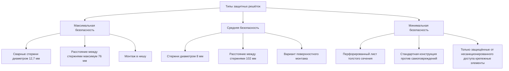
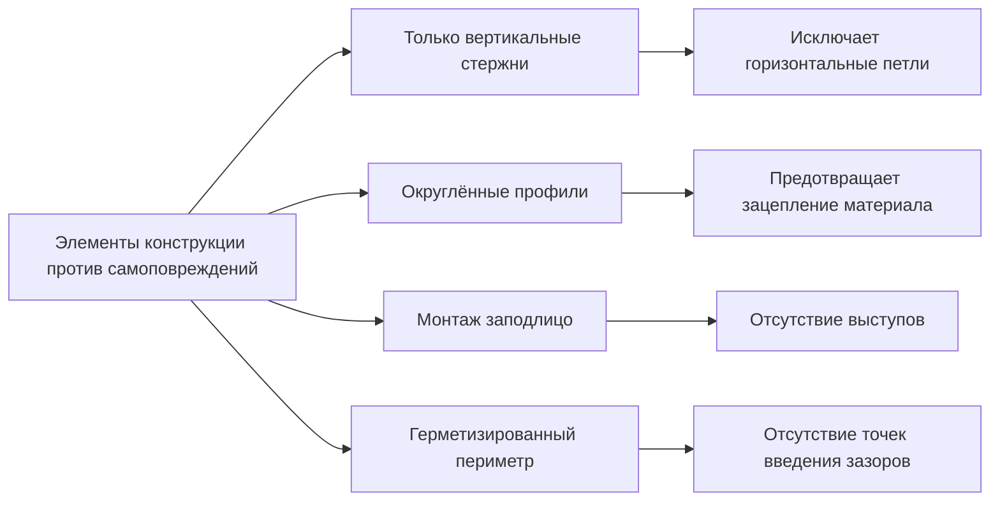

Защитные решётки в исправительных учреждениях должны предотвращать несанкционированный доступ, создание импровизированного оружия и самоповреждение при сохранении требуемой производительности по воздухообмену. Решётки уровня содержания под стражей включают усиленную конструкцию, геометрию против самоповреждений и монтажные системы, устойчивые к несанкционированному доступу, которые превосходят стандарты коммерческих зданий.

## Классификация защитных решёток

Решётки исправительных учреждений классифицируются по уровню безопасности, который определяет требования к конструкции и протоколы испытаний.

### Требования максимальной безопасности

Решётки максимальной безопасности предотвращают проникновение инструментов, раздвижение стержней и снятие компонентов благодаря многочисленным конструктивным особенностям:

- **Конструкция стержней**: стальные стержни диаметром минимум 12,7 мм, ASTM A36 или более высокий предел прочности
- **Сварные каркасы**: все соединения непрерывно сварены, без механических крепежных элементов на внутренних компонентах
- **Расстояние между стержнями**: максимум 76 мм между осями для предотвращения введения конечностей
- **Монтаж каркаса**: вутрь кирпичной кладки или бетона, периметр сварен к опорным пластинам
- **Отделка**: электростатическое нанесение эпоксидной смолы, минимум толщина сухого слоя 75 мкм

## Скорость потока воздуха и потеря давления

Геометрия защитной решётки влияет на характеристики потока воздуха. Скорость потока воздуха через решётки со стержнями рассчитывается на основе свободной площади:

$$V_f = \frac{Q}{A_{free}}$$

Где:
- $V_f$ = скорость потока воздуха (м/с)
- $Q$ = производительность по воздухообмену (м³/ч)
- $A_{free}$ = свободная открытая площадь (м²)

Свободная площадь для решёток с параллельными стержнями:

$$A_{free} = \frac{(s - d)}{s} \times A_{nominal}$$

Где:
- $s$ = расстояние между стержнями между осями (см)
- $d$ = диаметр стержня (см)
- $A_{nominal}$ = номинальная площадь решётки (м²)

Потеря давления через решётки для содержания под стражей составляет от 2 до 6 Па при скорости потока воздуха 2,5 м/с, в зависимости от конфигурации стержней и глубины.

## Принципы конструкции против самоповреждений

Решётки против самоповреждений исключают точки крепления для шнуров, простыней или одежды посредством конкретных геометрических требований:

**Критические параметры конструкции:**
- Отсутствие горизонтальных стержней или кромок, на которые можно намотать материал
- Только вертикальная ориентация стержней в зонах повышенного риска
- Максимальный зазор 6,4 мм между периметром решётки и поверхностью стены
- Округлённые профили стержней предпочтительнее прямоугольных сечений
- Монтаж заподлицо или в нишу, без выступающих компонентов

## Спецификации уровня содержания под стражей

| Компонент | Максимальная безопасность | Средняя безопасность | Минимальная безопасность |
|-----------|---------------------------|----------------------|--------------------------|
| Материал стержня | Сталь ASTM A36 | Сталь ASTM A36 | Сталь, калибр 14 |
| Диаметр стержня | минимум 12,7 мм | минимум 8 мм | Перфорированный лист |
| Расстояние между стержнями | максимум 76 мм между осями | максимум 102 мм между осями | Н/П (рисунок перфорации) |
| Толщина каркаса | калибр 10 минимум | калибр 12 | калибр 14 |
| Глубина монтажа | минимум 152 мм в нишу | минимум 102 мм в нишу | Поверхностный монтаж допустим |
| Крепежные элементы | Сварной/встроенный | Защищённый Torx | Защищённый Torx |
| Испытательная нагрузка | удар 2224 Н | удар 1334 Н | удар 667 Н |

## Системы крепежных элементов, защищённых от несанкционированного доступа

Поверхностно устанавливаемые решётки для содержания под стражей требуют специализированных крепежных элементов, устойчивых к снятию импровизированными инструментами. Стандартные варианты включают:

**Винты Pin-in-Torx:**
- Шлиц Torx с препятствием в центральной части
- Требует специализированный инструмент для снятия, недоступный заключённым
- Минимальный размер резьбы 6,4 мм для монтажа решётки
- Конструкция из нержавеющей стали для устойчивости к коррозии

**Односторонние винты:**
- Головка с пазом, позволяющим установку, но предотвращающим снятие
- Используются для постоянной установки в зонах максимальной безопасности
- При техническом обслуживании необходимо высверливание

**Гайки с разрушением при срезе:**
- Шестигранная головка, разрушающаяся при установленном крутящем моменте
- Оставляет гладкую округлённую поверхность
- Необратимый метод установки

Расстояние между крепежными элементами: максимум 152 мм между осями по периметру решётки, максимум 305 мм на промежуточных опорах.

## Требования к испытаниям на прочность

Решётки уровня содержания под стражей проходят физические испытания согласно стандартам исправительных учреждений для проверки устойчивости к взлому и снятию компонентов.

**Стандартные протоколы испытаний:**

1. **Испытание статической нагрузкой**: нагрузка 2224 Н, приложенная перпендикулярно к поверхности решётки в течение 60 секунд, без постоянных деформаций, превышающих 3,2 мм

2. **Испытание ударом**: цилиндрическая масса 45 кг, упавшая с высоты 1,2 м на центр решётки, без отделения компонентов или изгиба стержней, превышающих 6,4 мм

3. **Испытание раздвижения стержней**: нагрузка 2224 Н, приложенная боковым образом между соседними стержнями, максимальное перемещение стержня 12,7 мм

4. **Испытание крутящего момента крепежных элементов**: все крепежные элементы затянуты на 150% номинального крутящего момента, без срыва резьбы или отказа компонентов

5. **Испытание извлечения каркаса**: нагрузка 4448 Н, приложенная к периметру каркаса, без ослабления встроенной части или монтажной системы

## Детали монтажа и встраивания

Надлежащий монтаж критически важен для производительности по безопасности. Решётки в нишах требуют структурного встраивания до начала отделочных работ.

**Последовательность встраивания:**
1. Сверление отверстий или формирование отверстий в кирпичной кладке/бетонном основании
2. Установка стальных опорных пластин или каналов вокруг периметра отверстия
3. Сварка каркаса решётки к встроенным частям непрерывными угловыми швами минимум 6,4 мм
4. Шлифовка швов гладко и заподлицо с поверхностью каркаса
5. Нанесение системы отделочного покрытия на швы и каркас
6. Герметизация периметрального стыка между каркасом и стеной несъёмным герметиком

**Требования по зазорам:**
- Минимум 152 мм глубины встраивания для максимальной безопасности
- Минимум 51 мм зазора позади решётки для распределения воздушного потока
- Доступ в полость отдельно от жилой части
- Подключения воздуховодов позади решётки недоступны со стороны помещения

## Производительность по воздухообмену

Конструктивные элементы безопасности снижают свободную площадь в сравнении с коммерческими решётками, что требует больших номинальных размеров для достижения эквивалентного воздухообмена.

**Пример расчёта размерности:**

Для подачи 680 м³/ч при скорости потока воздуха 2,5 м/с через стержни диаметром 12,7 мм с расстоянием 76 мм:

$$A_{free} = \frac{680}{2,5 \times 60} = 0,453 \text{ м}^2$$

Коэффициент свободной площади:

$$\frac{A_{free}}{A_{nominal}} = \frac{(76 - 12,7)}{76} = 0,833$$

Требуемая номинальная площадь:

$$A_{nominal} = \frac{0,453}{0,833} = 0,544 \text{ м}^2 \approx 0,3 \text{ м} \times 0,3 \text{ м решётка}$$

Стандартная коммерческая решётка 0,254 м × 0,254 м была бы недостаточна на 30% для той же производительности по воздухообмену.

## Техническое обслуживание и проверка

Защитные решётки требуют периодической проверки для подтверждения целостности и обнаружения попыток несанкционированного доступа.

**Контрольный список проверки:**
- Визуальный осмотр швов на предмет трещин или отделения
- Проверка целостности крепежных элементов, проверка отсутствия попыток снятия
- Проверка прямолинейности стержней, измерение любых деформаций
- Состояние герметизации стыка каркаса и стены
- Состояние краски или покрытия, немедленное устранение повреждений
- Измерение производительности по воздухообмену в сравнении с расчётными значениями

Частота проверок: ежемесячно для зон максимальной безопасности, ежеквартально для зон средней безопасности, ежегодно для зон минимальной безопасности.

## Применимые стандарты

- **Стандарты ACA для взрослых исправительных учреждений**: 4-е издание, стандарт 4-ALDF-4A-16 (вентиляция в жилых блоках)
- **ASTM F1577**: Стандартные методы испытания замков содержания под стражей для распашных дверей (адаптированные протоколы испытания крепежных элементов)
- **ICC A117.1**: Доступные и пригодные для использования здания и сооружения (требования против самоповреждений)
- **ASHRAE Standard 62.1**: Вентиляция для приемлемого качества внутреннего воздуха (минимальные значения производительности по воздухообмену)

Согласование со специалистами по проектированию исправительных учреждений и интеграторами систем безопасности гарантирует, что спецификации решёток соответствуют требованиям по операционной безопасности при обеспечении соответствия нормам вентиляции.
