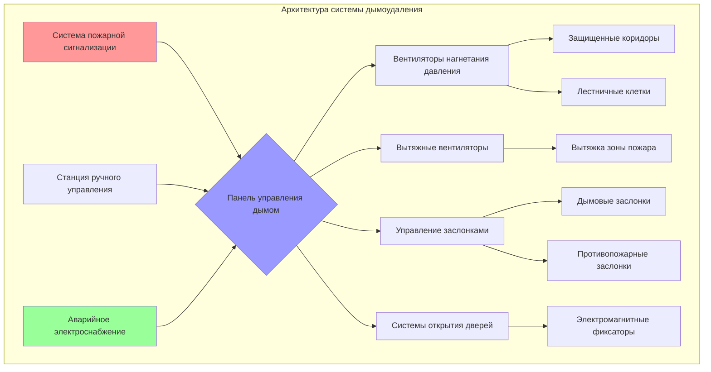
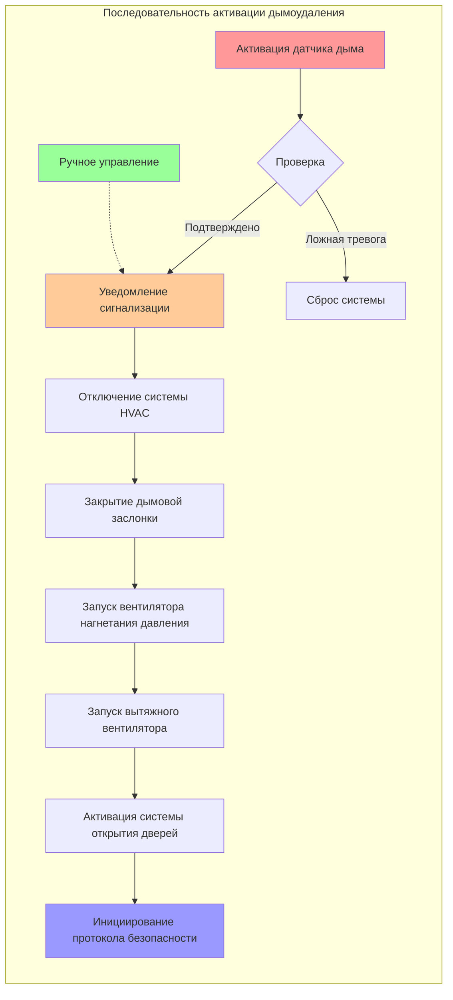

## Обзор дымоудаления в учреждениях уголовной юстиции

Системы дымоудаления в исправительных учреждениях представляют уникальные инженерные задачи, отличные от обычных зданий. Фундаментальный принцип защиты на месте, а не эвакуации, определяет требования проектирования, так как быстрый выход несовместим с мерами безопасности. Заключенные не могут свободно эвакуироваться во время пожара, что требует стратегий локализации дыма, позволяющих поддерживать безопасные условия в занятых зонах, пока персонал безопасности выполняет протоколы контролируемого перемещения.

Основная цель — предотвращение распространения дыма из зон пожара в неповрежденные помещения, в частности жилые блоки, комнаты управления и пути эвакуации, используемые при поэтапной эвакуации. NFPA 92 (Стандарт для систем дымоудаления) и раздел 909 IBC устанавливают техническую базу, но применение в исправительных учреждениях требует дополнительных соображений по интеграции оборудования безопасности, возможностям ручного управления и требованиям к резервному энергоснабжению.

## Стратегия проектирования защиты на месте

Учреждения уголовной юстиции используют стратегии защиты на месте, при которых люди остаются в защищенных отделениях вдали от источника пожара до тех пор, пока не станет возможно контролируемое перемещение. Этот подход требует:

**Требования к разделению:**
- Огнестойкие барьеры рассчитанные на 2 часа, разделяющие жилые блоки
- Огнестойкие барьеры рассчитанные на 1,5 часа для критических зон безопасности
- Дымовые барьеры с перепадом давления, обеспечивающие минимум 12,5 Па
- Противопожарные двери самозакрывающиеся с электромагнитными устройствами удержания, подключенными к системам пожарной сигнализации

**Поддержание безопасных условий:**
Системы дымоудаления должны поддерживать видимость и уровни токсичности в пределах безопасных показателей в течение времени, необходимого для завершения последовательностей контролируемой эвакуации, обычно 30-60 минут в зависимости от численности населения и укомплектованности персоналом учреждения.

Критерий видимости требует поддержания оптической плотности ниже критических пороговых значений:

$$
D = \frac{C \cdot L}{K}
$$

Где:
- **D** = Оптическая плотность (безразмерная)
- **C** = Концентрация дыма (мг/м³)
- **L** = Длина пути (м)
- **K** = Постоянная порога видимости (обычно 8-10 для светоотражающих знаков)

Для безопасных условий: **D < 0,5** (эквивалентно видимости > 10 м в большинстве сценариев)

## Основы системы создания давления

Создание давления в лестничных клетках и коридорах предотвращает проникновение дыма в защищенные маршруты эвакуации. Требуемый перепад давления на дымовом барьере зависит от площади утечки и желаемого направления потока воздуха.

$$
\Delta P = \frac{\rho \cdot v^2}{2} + P_f
$$

Где:
- **ΔP** = Перепад давления (Па)
- **ρ** = Плотность воздуха (кг/м³, обычно 1,2 при стандартных условиях)
- **v** = Скорость через отверстие (м/с)
- **P_f** = Потери на трение (Па)

Для дверных проемов минимальный перепад давления для предотвращения обратного потока дыма:

$$
\Delta P_{min} = K \cdot A_{door} \cdot \sqrt{\rho}
$$

Где:
- **K** = Коэффициент потока (обычно 0,65-0,85 для дверей)
- **A_door** = Эффективная площадь утечки (м²)

**Типичные значения проектирования для исправительных учреждений:**
- Коридоры с избыточным давлением: 25-37 Па
- Лестничные клетки: 37-50 Па
- Шахты лифтов: 37-62 Па

## Сравнение систем дымоудаления

| Тип системы | Применение | Преимущества | Ограничения | Ссылка IBC |
|-------------|------------|------------|------------|-----------|
| **Создание давления** | Лестничные клетки, коридоры, тамбуры | Простая логика управления, эффективна для вертикальных шахт | Требует плотной конструкции, увеличение усилия на открытие дверей | IBC 909.6 |
| **Зонное управление дымом** | Большие общие помещения, многоуровневые жилые блоки | Ограничение распространения дыма, поддержание убежищ | Сложные последовательности управления, высокие затраты | IBC 909.8 |
| **Механическая вытяжка** | Кухня, прачечная, цехи | Прямое удаление дыма из источника | Требует приточного воздуха, потенциал обратного потока | IBC 909.10 |
| **Естественная вентиляция** | Односекционные жилые блоки | Отсутствие потребления энергии, простота | Зависимость от погоды, ограниченное управление | IBC 909.11 |
| **Вытяжка дыма из атриума** | Многоуровневые общественные зоны | Разбавление больших объемов, поддержание видимости | Требуются высокие скорости вытяжки | IBC 909.12 |

## Определение размеров системы вытяжки

Скорости вытяжки дыма зависят от скорости выделения тепла пожаром (HRR) и требуемой высоты интерфейса дымовой прослойки. Массовый расход, необходимый для поддержания дымовой прослойки на высоте **z** над источником пожара:

$$
\dot{m} = 0,071 \cdot Q_c^{1/3} \cdot z^{5/3}
$$

Где:
- **ṁ** = Массовый расход (кг/с)
- **Q_c** = Конвективная скорость выделения тепла (кВт)
- **z** = Высота от пожара до интерфейса дымовой прослойки (м)

Для преобразования объемного расхода:

$$
\dot{V} = \frac{\dot{m}}{\rho_{smoke}}
$$

**Скорости выделения тепла при проектировании для исправительных помещений:**

| Тип помещения | Проектная HRR (кВт) | Основание |
|---------------|-------------------|-----------|
| Камера/жилой блок | 500-1 000 | Ограниченная горючая нагрузка, бетонная конструкция |
| Общее помещение | 1 500-2 500 | Мебель, ограниченные горючие материалы |
| Хранилище/склад | 2 500-5 000 | Более высокая плотность горючего |
| Промышленный/цех | 5 000-10 000 | Оборудование, хранение материалов |

## Уникальные требования исправительных учреждений

**Интеграция безопасности:**
Системы дымоудаления должны взаимодействовать с системами безопасности без ущерба для возможностей блокировки. Электромагнитные системы открытия дверей требуют логики отказобезопасности, которая поддерживает защищенные барьеры при разрешении аварийного выхода.

**Возможность ручного управления:**
Операторы комнаты управления должны иметь возможность ручной активации дымоудаления независимо от автоматической пожарной сигнализации для сценариев, когда ранее вмешательство оправдано или автоматические системы дают сбой.

**Продолжительность резервного электроснабжения:**
NFPA 92 требует аварийного питания для систем дымоудаления. Исправительные учреждения обычно расширяют это требование до **минимум 4 часов** из-за продолжительных сроков эвакуации и потенциальной задержки доступа пожарных служб.

**Стойкость к несанкционированному вмешательству:**
Все доступные компоненты (решетки, датчики, станции ручного управления) требуют конструкции, устойчивой к вандализму, и оборудования безопасности.

## Соображения по приточному воздуху

Вытяжные системы требуют приточного воздуха для предотвращения разрежения в здании. Объем приточного воздуха должен равняться или незначительно превышать объем вытяжки для поддержания контролируемых соотношений давления.

$$
\dot{V}_{MA} = \dot{V}_{exhaust} \times 1,1
$$

Точки ввода приточного воздуха не должны компрометировать цели дымоудаления. Подавайте приточный воздух:
- Ниже нейтральной плоскости давления в зонах с избыточным давлением
- Удаленно от точек вытяжки для предотвращения короткого замыкания потока
- Через специальные жалюзи с моторизованными заслонками, а не через существующие системы HVAC

## Требования к испытаниям и пуско-наладке

NFPA 92 раздел 8.6 требует всестороннего приемочного испытания. Исправительные учреждения добавляют требования координации безопасности:

**Предварительное функциональное испытание:**
1. Проверьте все положения заслонок при нормальных условиях и при срабатывании сигнализации
2. Подтвердите калибровку датчиков давления (требуется точность ±10%)
3. Испытайте усилия открытия дверей (максимум IBC 133 Н при создании давления)
4. Проверьте переход на аварийное питание и продолжительность работы

**Испытание функциональной производительности:**
1. Измерьте перепады давления на всех дымовых барьерах при расчетных условиях
2. Проверьте поддержание высот дымовой прослойки с использованием театрального дыма или газа-трассера
3. Испытайте отклик системы на активацию одной и нескольких зон
4. Подтвердите интеграцию с протоколами блокировки безопасности

**Ежегодное испытание:**
- Проверка перепада давления
- Отслеживание тенденций производительности вентилятора
- Проверка последовательности управления
- Измерение усилий открытия дверей

## Резюме соответствия нормам

**Ключевые требования NFPA 92:**
- Системы дымоудаления как часть стратегии противопожарной защиты (раздел 4.2)
- Методы проектирования создания давления (раздел 5.3)
- Критерии проектирования вытяжных систем (раздел 5.4)
- Процедуры испытания и приемки (глава 8)

**Требования раздела 909 IBC:**
- Где требуется: Здания высотой >16,7 м, атриумы, подземные здания (909.1)
- Критерии проектирования: Анализ в соответствии с одобренным методом, обычно вычислительным или зональным моделям (909.4)
- Конструкция дымовых барьеров: Минимальный рейтинг 1 час (909.5)
- Аварийное питание: Возможность полной эксплуатации системы (909.11)

Проектирование систем дымоудаления для учреждений уголовной юстиции требует интеграции принципов защиты жизни с требованиями оперативной безопасности, создавая инженерные решения, которые защищают людей и поддерживают контроль учреждения во время пожарных чрезвычайных ситуаций.
