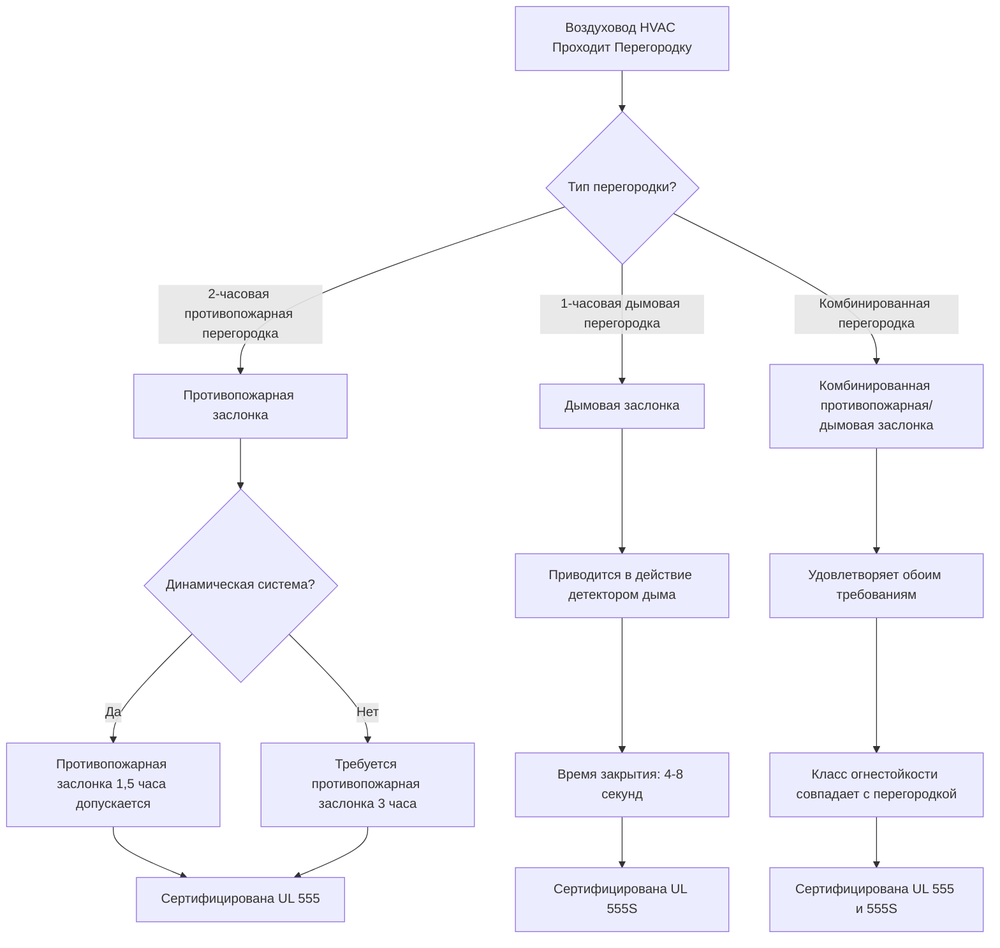
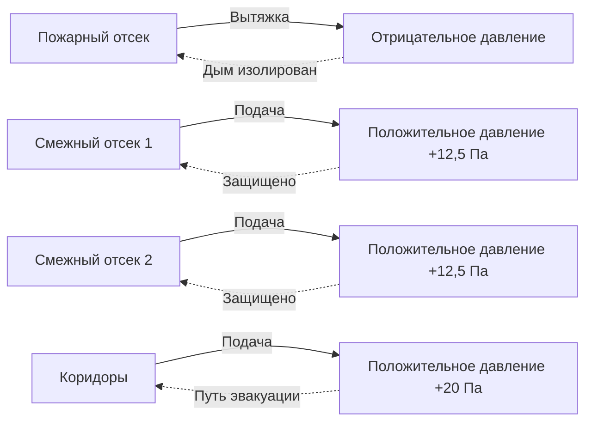

## Обзор

Дымовая противопожарная изоляция в учреждениях юстиции реализует стратегию защиты на месте, которая предотвращает эвакуацию охраняемого населения во время пожарных чрезвычайных ситуаций. В отличие от обычных зданий, где люди эвакуируются наружу, исправительные учреждения полагаются на надежные огнестойкие перегородки и системы контроля дыма, чтобы защитить заключенных в их отсеках во время проведения противопожарных и спасательных операций.

Основной принцип: содержать дым и продукты горения в пределах отсека их происхождения, сохраняя пригодные для дыхания условия в смежных помещениях минимум в течение 2 часов.

## Требования к проектированию

### Конструкция противопожарной перегородки

Раздел 408.7 IBC и глава 22 NFPA 101 устанавливают минимальные требования к изоляции в учреждениях юстиции:

**Огнестойкость отсека:**
- Дымовые перегородки: минимальный класс огнестойкости 1 час
- Противопожарные перегородки, разделяющие отсеки: минимум 2 часа
- Потолочно-этажные конструкции: минимум 2 часа
- Все перегородки проходят полностью от плиты к плите (никаких подвесных потолков внутри отсеков)

**Максимальный размер отсека:**

| Класс использования | Макс. площадь отсека | Макс. расстояние эвакуации |
|-------------------------|--------------------------|---------------------|
| Содержание/Исправительные | 929 м² | 61 м до дымовой перегородки |
| Жилые блоки | 697 м² | 46 м внутри блока |
| Медицинское/Изолятор | 2090 м² | 61 м (со спринклерами) |
| Административные зоны | По таблице 508.4 IBC | 76 м (со спринклерами) |

### Требования герметичности

Утечка через дымовую перегородку напрямую влияет на эффективность изоляции. Перепад давления, необходимый для дымовой перегородки, зависит от допустимой утечки:

$$Q_L = C_d \cdot A \cdot \sqrt{2\Delta P / \rho}$$

Где:
- $Q_L$ = расход утечки (м³/ч)
- $C_d$ = коэффициент расхода (0,65 для конструктивных зазоров)
- $A$ = общая площадь утечки (м²)
- $\Delta P$ = перепад давления (Па)
- $\rho$ = плотность воздуха (1,2 кг/м³ при нормальных условиях)

**Целевые показатели утечки NFPA 92:**
- Дымовые перегородки: максимум 0,015 м²/м² площади стены
- Двери в дымовых перегородках: максимум 0,79 м³/(ч·м²) площади двери при 12,5 Па

Для плотной изоляции в зонах высокой безопасности:

$$A_{max} = \frac{Q_{supply} \cdot \rho}{C_d \cdot \sqrt{2\Delta P}}$$

Это определяет максимально допустимую утечку конструкции при имеющемся расходе подпиточного воздуха.

## Защита проходок HVAC

Каждая проходка воздуховода HVAC через противопожарную или дымовую перегородку нарушает целостность отсека. Стратегии защиты включают:

### Требования к заслонкам

**Критические детали монтажа:**
- Противопожарные заслонки установлены в месте расположения перегородки (не смещены в воздуховод)
- Минимальный зазор 15 см вокруг заслонки для доступа к осмотру
- Рукава через огнестойкие конструкции сохраняют класс огнестойкости перегородки
- Размер заслонки соответствует размеру воздуховода (без переходов непосредственно рядом)
- Привод и органы управления доступны со стороны, противоположной огню

### Герметизация проходок

Неканальные проходки требуют такого же внимания:

| Тип проходки | Способ герметизации | Класс огнестойкости |
|------------------|----------------|-------------|
| Кабельные лотки | Огнестойкая плита + интумесцирующий материал | Соответствует перегородке |
| Отдельные кабели | Интумесцирующий герметик/шпатлевка | Соответствует перегородке |
| Кабелепровод | Интумесцирующий воротник или обертка | Соответствует перегородке |
| Трубопровод (горючий) | Интумесцирующий воротник | Соответствует перегородке |
| Трубопровод (негорючий) | Противопожарный герметик | Соответствует перегородке |

Все герметизирующие швы испытаны в соответствии с ASTM E814 или UL 1479 (сквозные системы противопожарной герметизации).

## Стратегия создания давления в отсеке

Создание избыточного давления сохраняет целостность дымовой перегородки, противодействуя эффекту стека и предотвращая инфильтрацию дыма:

$$\Delta P = K \cdot \rho \cdot g \cdot h \cdot \Delta T / T_{abs}$$

Где:
- $\Delta P$ = перепад давления от эффекта стека (Па)
- $K$ = коэффициент (0,52 для дверей)
- $g$ = ускорение силы тяжести (9,81 м/с²)
- $h$ = высота проема (м)
- $\Delta T$ = разница температур через перегородку (°C)
- $T_{abs}$ = абсолютная температура (К)

**Целевые показатели проектирования:**
- Минимальный перепад давления: 12,5 Па
- Максимальный перепад давления: 87,5 Па для обеспечения работы двери
- Расход подпиточного воздуха преодолевает эффект стека плюс утечка конструкции

### Зонированное создание давления

**Последовательность работы:**
1. Датчик дыма активируется в пожарном отсеке
2. Подача воздуха в пожарный отсек отключается (заслонки закрываются)
3. Активируется вытяжка дыма в пожарном отсеке (если предусмотрена)
4. Подача воздуха в смежные отсеки увеличивается на 10-15%
5. Подача в коридоры увеличивается для поддержания положительного давления
6. Система автоматизации здания контролирует перепад давления
7. Системы подпиточного воздуха модулируют для поддержания целевых показателей

## Интеграция системы

Дымовая изоляция опирается на скоординированные системы:

- **Пожарная сигнализация:** Инициирует закрытие заслонок и последовательность создания давления
- **Органы управления HVAC:** Модулируют расходы воздуха для поддержания перепадов давления
- **Оборудование дверей:** Электромагнитные замки срабатывают, доводчики работают под давлением
- **Сигнализация:** Панель пожарной сигнализации отображает состояние отсека и положение заслонок
- **Вытяжка дыма:** Извлекает дым из пожарного отсека (если предусмотрено)

**Требования к испытаниям (NFPA 92):**
- Измерение перепада давления у каждой дымовой перегородки
- Проверка закрытия заслонок в каждой проходке
- Усилие открытия двери при создании давления (максимум 133 Н)
- Испытание герметичности критических перегородок
- Ежегодное функциональное испытание автоматических органов управления

## Особые соображения для учреждений юстиции

### Переопределение безопасности

Контроль дыма не должен нарушать безопасность:
- Заслонки отказывают в закрытом положении (безопасное положение) при отключении питания
- Ручное переопределение требует авторизации двух человек
- Системы безопасности жизни работают от резервного питания (минимум 2 часа)
- Дистанционный контроль в диспетчерской показывает положение всех заслонок

### Продолжительность защиты на месте

IBC требует минимум 2-часовой изоляции. Рассчитайте время заполнения дымом для проверки:

$$t_{fill} = \frac{V \cdot (H_{clear} / H_{total})}{Q_{smoke} - Q_{exhaust}}$$

Где:
- $t_{fill}$ = время снижения интерфейса дыма до критической высоты (минуты)
- $V$ = объем отсека (м³)
- $H_{clear}$ = требуемая ясная высота (типично 1,8 м минимум)
- $H_{total}$ = общая высота потолка (м)
- $Q_{smoke}$ = скорость образования дыма (м³/ч)
- $Q_{exhaust}$ = скорость механической вытяжки (м³/ч)

Целевой показатель проектирования: поддерживать $t_{fill}$ больше 120 минут при предположении пожара 3000 кВт.

## Резюме соответствия

**Основные стандарты:**
- IBC раздел 408.7: Требования к изоляции
- NFPA 101 глава 22: Содержание и исправительные учреждения
- NFPA 92: Системы контроля дыма
- NFPA 204: Дымоудаление и вентиляция тепла
- IMC раздел 607: Воздуховоды и переводные отверстия

**Требования к одобрению:**
- Последовательность работы системы контроля дыма представлена на рассмотрение пожарному инспектору
- Чертежи заслонок рассмотрены инженером противопожарной защиты
- Результаты испытаний давления перед вводом в эксплуатацию
- Документация ежегодного испытания и обслуживания

---

**Файл:** `/Users/evgenygantman/Documents/github/gantmane/hvac/content/specialty-applications-testing/specialty-hvac-applications/justice-facilities/smoke-control-justice/compartmentation/_index.md`

**Количество слов:** 891
