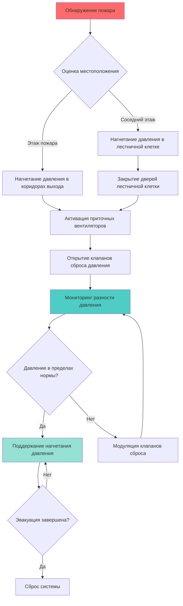
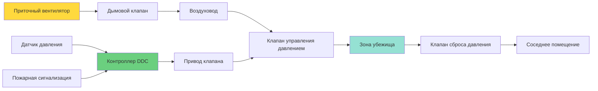

## Обзор

Защита путей эвакуации в учреждениях правосудия представляет уникальные вызовы из-за контролируемого доступа, требований безопасности и стратегии защиты на месте, часто применяемой в местах содержания под стражей. В отличие от обычных зданий, где стандартом является полная эвакуация, учреждения правосудия часто полагаются на поэтапную эвакуацию или перемещение в обозначенные зоны убежища. Система дымоудаления должна поддерживать приемлемые условия в коридорах эвакуации и выходных лестничных клетках, при этом соблюдая протоколы безопасности.

## Стратегии защиты на месте в сравнении со стратегиями эвакуации

Учреждения правосудия применяют две основные стратегии защиты жизни, каждая из которых требует различных подходов к дымоудалению:

**Стратегия защиты на месте:**
- Люди остаются в камерах или обозначенных отсеках на начальных стадиях пожара
- Система дымоудаления поддерживает приемлемые условия в соседних коридорах
- Перемещение происходит только при угрозе пожара отсеку
- Требует надежной отсечки помещений и нагнетания давления в коридорах
- Обычно применяется в высокозащищенных учреждениях, где быстрая эвакуация невозможна

**Стратегия поэтапной эвакуации:**
- Люди движутся через последовательные защищенные зоны
- Коридоры выхода должны поддерживать свободные от дыма условия на протяжении всей эвакуации
- Нагнетание давления в лестничной клетке предотвращает проникновение дыма
- Требует согласованной работы пожарной сигнализации и отключения системы контроля доступа
- Типично для учреждений средней и низкой безопасности

Конструкция системы дымоудаления должна соответствовать плану действий при чрезвычайных ситуациях учреждения и его классификации по безопасности.

## Основные принципы нагнетания давления в коридорах

Нагнетание давления в коридорах создает разность положительного давления, которая предотвращает миграцию дыма из соседних помещений. Разность давлений направляет поток воздуха из защищенного коридора в зоны, пораженные пожаром, поддерживая приемлемый путь эвакуации.

### Требования к разности давления

Минимальная разность давления, необходимая для предотвращения проникновения дыма, составляет:

$$\Delta P = \rho g h \Delta T / T_{avg}$$

где:
- $\Delta P$ = разность давления (Па)
- $\rho$ = плотность воздуха (кг/м³)
- $g$ = ускорение свободного падения (9,81 м/с²)
- $h$ = вертикальная высота (м)
- $\Delta T$ = разность температур (K)
- $T_{avg}$ = средняя абсолютная температура (K)

Для условий окружающей температуры NFPA 92 требует минимальных разностей давления:

| Применение | Минимальное давление | Максимальное давление | Примечания |
|-------------|------|------|-------|
| Коридоры эвакуации | 25 Па (0,10 дюйм вд. ст.) | 75 Па (0,30 дюйм вд. ст.) | Через закрытые двери |
| Выходные лестничные клетки | 50 Па (0,20 дюйм вд. ст.) | 100 Па (0,40 дюйм вд. ст.) | Одна дверь открыта |
| Зоны убежища | 12,5 Па (0,05 дюйм вд. ст.) | 75 Па (0,30 дюйм вд. ст.) | Минимальные приемлемые условия |
| Вестибюли лифтов | 25 Па (0,10 дюйм вд. ст.) | 75 Па (0,30 дюйм вд. ст.) | Защищенные от дыма вестибюли |

Максимальные значения давления предотвращают чрезмерные силы открывания дверей, которые могут препятствовать эвакуации.

### Расчет расхода приточного воздуха

Требуемый расход приточного воздуха для поддержания разности давления учитывает утечку через двери, стены и проемы:

$$Q_{supply} = Q_{leakage} + Q_{doors}$$

Расход утечки через дверь:

$$Q_{door} = C A \sqrt{2 \Delta P / \rho}$$

где:
- $Q_{door}$ = объемный расход через щели в двери (м³/с)
- $C$ = коэффициент расхода (0,65-0,70 для щелей в дверях)
- $A$ = эффективная площадь утечки (м²)
- $\Delta P$ = разность давления (Па)
- $\rho$ = плотность воздуха (кг/м³)

Для стандартной двери размером 914 мм × 2134 мм (36 дюйм × 84 дюйма) с типовыми размерами щелей эффективная площадь утечки составляет примерно 0,0232 м² (36 дюйм²).

При разности давления 25 Па:

$$Q_{door} = 0,65 \times 0,0232 \times \sqrt{2 \times 25 / 1,2} = 0,098 \text{ м}^3\text{/с (208 CFM)}$$

Общий расход приточного воздуха должен учитывать все пути утечки плюс коэффициент безопасности 1,2-1,5.

## Последовательность защиты пути эвакуации

## Требования кодов и соответствие нормам

### NFPA 92 - Системы дымоудаления

Ключевые требования к защите путей эвакуации:

- Испытание разности давления со всеми закрытыми дверями
- Испытание сценария с открытой одной дверью
- Проверка максимального усилия открывания дверей (≤133 Н или 30 lbf)
- Согласование последовательности дымоудаления с пожарной сигнализацией
- Аварийное питание оборудования дымоудаления
- Ежеквартальное функциональное тестирование систем нагнетания давления

### IBC Section 909 - Системы дымоудаления

- Требуется документация по проектированию системы дымоудаления
- Рациональный анализ или испытания для демонстрации эффективности
- Специальные проверки во время строительства
- Испытания приемки перед вводом в эксплуатацию
- План технического обслуживания и испытания системы

### NFPA 101 - Кодекс безопасности жизни

Специальные положения для учреждений содержания и исправления:

| Раздел кода | Требование | Применение |
|------------|-----------|-----------|
| 22.4.4.12 | Дымовые отсеки ≤2 787 м² (30 000 фт²) | Максимальный размер отсека |
| 22.4.4.13 | Автоматическое обнаружение дыма в коридорах | Система раннего оповещения |
| 22.7.1 | Аварийное освещение на путях эвакуации | Минимум 10,8 люкс (1 fc) |
| 22.4.4.5 | Класс огнестойкости 1 час для коридоров | Целостность дымовой преграды |

## Нагнетание давления в зонах убежища

Учреждения правосудия часто обозначают зоны убежища, где люди ожидают спасения с помощью или перемещения. Эти помещения требуют нагнетания давления для поддержания приемлемых условий во время длительного ожидания.

### Критерии проектирования для зон убежища

- Минимальная разность давления 12,5 Па (0,05 дюйм вд. ст.)
- Двусторонняя система связи с центром управления пожарными службами
- Визуальная идентификационная табличка, соответствующая требованиям ADA
- Минимальная площадь 0,28 м² (3 фт²) на человека на полу
- Аварийное освещение с резервным питанием от батареи 90 минут

### Компоненты системы нагнетания давления

## Требования к аварийному питанию

Все оборудование дымоудаления, обслуживающее пути эвакуации, должно подключаться к системам аварийного питания в соответствии с NFPA 70 (NEC) Article 700. Система аварийного питания должна обеспечивать:

- Приточные и вытяжные вентиляторы для нагнетания давления
- Приводы дымовых клапанов
- Панели управления и оборудование мониторинга
- Датчики давления и дифференциальный мониторинг
- Компоненты интерфейса пожарной сигнализации

Аварийное питание должно активироваться в течение 10 секунд после сбоя нормального питания и поддерживать работу в течение минимум 120 минут в учреждениях правосудия.

## Интеграция системы и испытания

Системы защиты путей эвакуации интегрируются с несколькими системами здания:

- Пожарная сигнализация инициирует последовательности дымоудаления
- Контроль доступа отключает блокировку безопасности на дверях эвакуации
- Система оповещения в массах предупреждает людей и персонал
- Автоматизация здания контролирует статус системы
- Видеонаблюдение подтверждает ход эвакуации

Ежеквартальное тестирование проверяет разности давления, силы открывания дверей и правильность последовательности. Ежегодная пусконаладка включает полное испытание системы дымоудаления, согласованное с операциями учреждения.

## Заключение

Эффективная защита путей эвакуации в учреждениях правосудия уравновешивает требования защиты жизни с ограничениями безопасности. Системы нагнетания давления в коридорах должны поддерживать адекватные разности давления, при этом ограничивая силы открывания дверей для облегчения эвакуации. Стратегия защиты на месте требует надежной отсечки помещений и надежного нагнетания давления для защиты людей, неспособных к самостоятельной эвакуации. Соответствие NFPA 92, IBC Section 909 и положениям NFPA 101 для учреждений содержания обеспечивает, что система дымоудаления обеспечивает приемлемые условия эвакуации на протяжении всего процесса эвакуации или перемещения.
