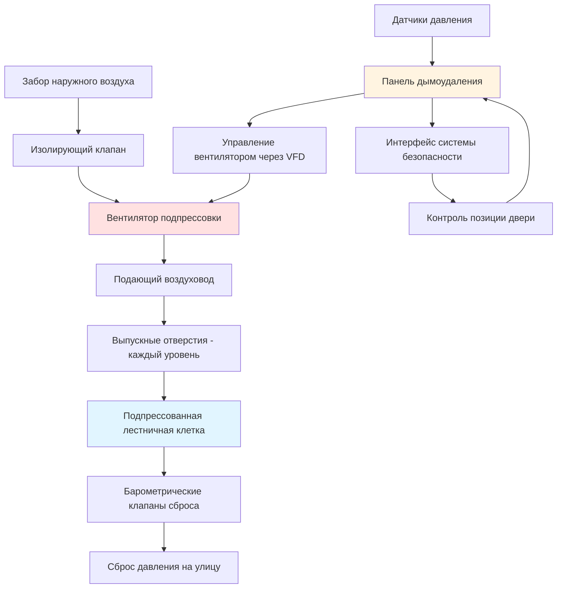
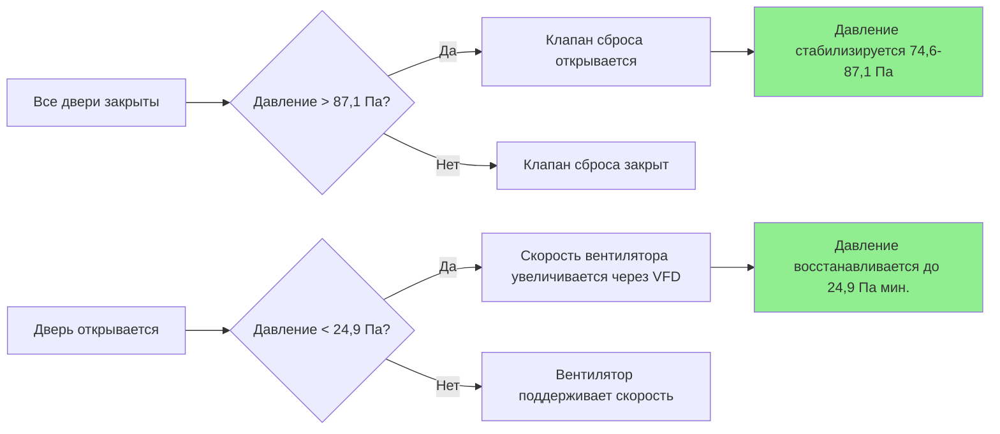

## Обзор

Подпрессовка лестничных клеток в учреждениях уголовной юстиции представляет уникальные вызовы, сочетающие требования безопасности жизни с жесткими протоколами безопасности. В отличие от обычных зданий, лестничные клетки исправительных учреждений должны поддерживать пути эвакуации, свободные от дыма, при этом вмещая двери безопасности, системы управления и эксплуатационные ограничения, которые могут существенно повлиять на стратегии управления давлением.

Основная цель состоит в создании положительного перепада давления, который предотвращает инфильтрацию дыма во время пожарных событий, при этом обеспечивая, чтобы усилие открытия дверей оставалось в пределах, соответствующих нормам. Этот баланс становится критическим, когда оборудование безопасности добавляет значительное сопротивление при открытии двери.

## Расчетные перепады давления

NFPA 92 и раздел IBC 909 устанавливают минимальные перепады давления для подпрессовки лестничных клеток. Учреждения уголовной юстиции обычно требуют повышенной производительности из-за высоты здания и конфигураций дверей безопасности.

### Минимальные требования к давлению

| Условие | Минимальное давление | Максимальное давление | Ссылка на норму |
|---------|----------------------|----------------------|-----------------|
| Все двери закрыты | 24,9 Па | 87,1 Па | NFPA 92 (5.2.2.3) |
| Одна дверь открыта | 24,9 Па | N/A | NFPA 92 (5.2.2.4) |
| Максимально допустимо | N/A | 149,1 Па | IBC 909.20.5 |
| Предел усилия открытия двери | Давление, создающее ≤133,4 Н | N/A | IBC 1010.1.3 |

### Расчет перепада давления

Требуемый перепад давления через границу лестничной клетки рассчитывается с учетом площади утечки и желаемой скорости воздуха:

$$\Delta P = \left(\frac{Q}{C \cdot A}\right)^2 \cdot \rho$$

Где:
- $\Delta P$ = перепад давления (Па)
- $Q$ = расход воздуха (м³/ч)
- $C$ = коэффициент потока (обычно 0,65)
- $A$ = общая площадь утечки (м²)
- $\rho$ = коэффициент плотности воздуха

Для учреждений уголовной юстиции рассчитайте общую площадь утечки, включая:

$$A_{total} = A_{doors} + A_{walls} + A_{penetrations}$$

Утечка через двери обычно доминирует:

$$A_{doors} = n \cdot P \cdot w \cdot C_L$$

Где:
- $n$ = количество дверей
- $P$ = периметр двери (м)
- $w$ = средняя ширина щели (м, обычно 0,00064-0,00127)
- $C_L$ = коэффициент утечки (0,6-0,8 для дверей безопасности)

## Анализ усилия открытия двери

Двери безопасности в исправительных учреждениях представляют значительные вызовы для систем подпрессовки. Максимальное усилие открытия двери регулируется IBC 1010.1.3, ограничивая усилие открытия внутренней двери до 133,4 Н для доступных маршрутов (22,2 Н установленного усилия плюс 133,4 Н усилия открытия).

### Расчет усилия

Усилие, требуемое для открытия двери против перепада давления:

$$F_{pressure} = \Delta P \cdot A_{door} \cdot K$$

Где:
- $F_{pressure}$ = усилие от давления (Н)
- $\Delta P$ = перепад давления (Па)
- $A_{door}$ = площадь двери (м²)
- $K$ = коэффициент применения (1,0 для шарнирных дверей)

Для стандартной двери размером 0,914 м × 2,134 м при давлении 74,6 Па:

$$F_{pressure} = 74,6 \cdot (0,914 \cdot 2,134) \cdot 1,0 = 146,3 \text{ Н}$$

Это превышает пределы норм при сочетании с трением оборудования безопасности, требуя механизмов сброса давления.

## Подбор вентилятора подпрессовки

Выбор вентилятора должен учитывать переменное сопротивление системы при открытии и закрытии дверей, конфигурации защищенных тамбуров и сценарии максимальной утечки.

### Расчет расхода воздуха

Базовое требование расхода воздуха для подпрессовки:

$$Q = 849 \cdot A_{floor} \cdot N$$

Где:
- $Q$ = расход подачи (м³/ч)
- $A_{floor}$ = площадь лестничной клетки на уровень (м²)
- $N$ = количество этажей

Альтернативно, рассчитайте на основе желаемого давления и утечки:

$$Q = C_d \cdot A_{leak} \cdot \sqrt{2 \cdot \Delta P \cdot \frac{1}{1,201}}$$

Где:
- $C_d$ = коэффициент расхода (0,6-0,65)
- $A_{leak}$ = общая площадь утечки (м²)
- $\Delta P$ = перепад давления (Па)

### Требования к давлению вентилятора

Общее статическое давление вентилятора должно преодолевать:

$$P_{fan} = P_{duct} + P_{inlet} + P_{discharge} + \Delta P_{design}$$

Типичные значения для лестничных клеток исправительных учреждений:
- Потери в воздуховодах: 124,1-373,0 Па
- Потери на входе: 49,6-124,1 Па
- Потери на выходе: 24,8-74,6 Па
- Расчетный перепад давления: 24,9-87,1 Па

Выбирайте вентиляторы на 150% от рассчитанного расхода для адаптации к сценарию открытия одной двери.

## Конфигурация системы

## Рассмотрения интеграции безопасности

Учреждения уголовной юстиции требуют координации между системами дымоудаления и безопасности:

1. **Контроль позиции двери**: интегрируйте магнитные датчики двери с панелью дымоудаления для модуляции скорости вентилятора на основе статуса двери
2. **Последовательное открытие дверей**: запрограммируйте дымоудаление для учета протоколов безопасности, требующих управляемых последовательностей открытия дверей
3. **Иерархия переопределения**: установите четкий приоритет между системами безопасности жизни и безопасности во время аварийных событий
4. **Подпрессовка тамбура**: разработайте каскады давления для проходных и защищенных тамбуров для предотвращения распространения дыма при сохранении зон безопасности

## Стратегии клапанов сброса

Барометрические клапаны сброса предотвращают избыточное давление при закрытии всех дверей:

### Расчет размера клапана сброса

$$A_{relief} = \frac{Q_{excess}}{V_{relief} \cdot 60}$$

Где:
- $A_{relief}$ = свободная площадь клапана сброса (м²)
- $Q_{excess}$ = избыточный расход воздуха при максимальном давлении (м³/ч)
- $V_{relief}$ = скорость воздуха сброса (обычно 305-610 м/мин)

Установите клапаны сброса на открытие при 74,6-87,1 Па для поддержания давления в допустимом диапазоне.

## Испытание и ввод в эксплуатацию

Проверочное испытание должно продемонстрировать:

1. Минимум 24,9 Па перепада давления при закрытых всех дверях
2. Минимум 24,9 Па при наихудшем случае открытия одной двери
3. Максимальное усилие открытия двери ≤133,4 Н при любом условии
4. Работу клапана сброса на установленное значение
5. Время отклика системы ≤30 секунд для достижения расчетного давления

Задокументируйте все позиции дверей безопасности, последовательности блокировки и условия переопределения во время приемочного испытания в соответствии с NFPA 92 Глава 8.

## Ссылки на нормы

- **NFPA 92**: Стандарт для систем дымоудаления (издание 2021 года, разделы 5.2.2, 5.2.3)
- **IBC раздел 909**: Системы дымоудаления
- **IBC раздел 1010.1.3**: Ограничения на усилие открытия двери
- **NFPA 101**: Кодекс безопасности жизни, требования к путям эвакуации

---

*Технический контент, сосредоточенный на инженерных расчетах и проектировании с интегрированной безопасностью для систем подпрессовки лестничных клеток исправительных учреждений.*
