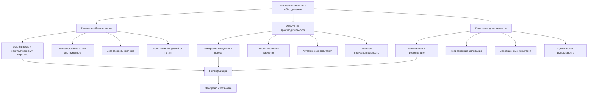
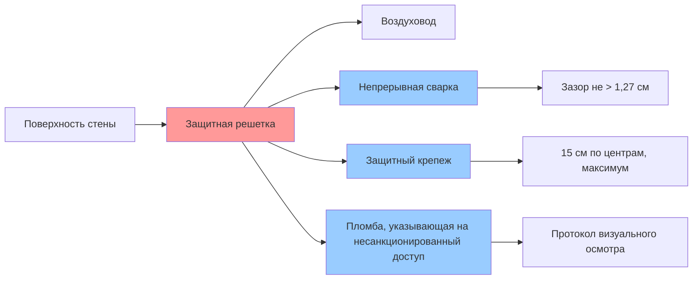

Защитное оборудование HVAC представляет критическую категорию систем климатического контроля, разработанных специально для исправительных учреждений, центров содержания и защищенных психиатрических заведений. Эти специализированные компоненты должны поддерживать тепловой комфорт при одновременном сопротивлении преднамеренным попыткам повреждения, скрытия или использования в качестве оружия со стороны заключенных. Философия проектирования сосредоточена на исключении открытых крепежных элементов, уязвимых компонентов и потенциальных точек крепления для петель, обеспечивая при этом надежную работу и обслуживаемость.

## Классификация безопасности и типы оборудования

Оборудование HVAC специального назначения проходит жесткие модификации конструкции для соответствия требованиям безопасности учреждений. Стандартные коммерческие компоненты принципиально непригодны для зон, доступных заключенным, из-за открытых органов управления, съемных панелей и компонентов, которые могут быть использованы как оружие или для скрытия предметов.

### Категории защитного оборудования

| Тип оборудования | Функции безопасности | Типичное применение | Стандартная ссылка |
|----------------|-------------------|----------------------|-------------------|
| Защитные решетки | Сварная конструкция, скрытый крепеж | Обратный воздух, подача воздуха в камеры | ASTM F1577 |
| Защитные диффузоры | Цельная стальная конструкция, защитные винты | Общие помещения, жилые отделения | ACA Standards |
| Защитные термостаты | Встроенная конструкция, пластиковое покрытие, ограниченный диапазон | Жилые отделения, программные области | NFPA 90A |
| Защитные блоки HVAC | Тяжелогабаритный корпус, сварные швы | Прямая вентиляция камер | DOJ Design Guide |
| Решетки, устойчивые к петлям | Скругленные края, без выступов | Блоки психического здоровья | VA Design Manual |

## Принципы проектирования защиты от несанкционированного доступа

Инженерия защитного оборудования HVAC уравновешивает требования безопасности с тепловой производительностью. Стандартные принципы проектирования включают:

**Выбор материалов:** Минимум 14 калибр холоднокатаной стали для решеток и корпусов, с 16 калибром приемлемым только для зон низкой безопасности. Нержавеющая сталь (304 или 316) обеспечивает повышенную коррозионную стойкость в зонах с высокой влажностью и устойчива к химическому воздействию.

**Защита крепежа:** Все открытые крепежные элементы должны использовать защитные головки, требующие специализированных инструментов (torx, hex-pin, односторонние винты). Сварная конструкция полностью исключает крепежные элементы в зонах высокой безопасности. Пломбы, указывающие на несанкционированный доступ, обеспечивают визуальное указание попыток несанкционированного доступа.

**Предотвращение петель:** Все поверхности, доступные для содержащихся лиц, должны исключать выступы, зазоры или точки крепления, способные выдержать крепление петли. Это требует встроенного монтажа с непрерывными периметральными сварками и закругленными углами.

## Производительность воздушного потока и компромиссы безопасности

Защитный дизайн по своей природе ограничивает картины воздушного потока и увеличивает сопротивление системы. Отношение между функциями безопасности и тепловой производительностью требует тщательного анализа.

### Соображения перепада давления

Защитные решетки демонстрируют более высокие перепады давления, чем стандартные архитектурные решетки, из-за сниженной свободной площади. Отношение перепада давления следует:

$$\Delta P = \frac{\rho V^2}{2} \cdot K$$

где $K$ представляет коэффициент потерь, специфичный для геометрии защитной решетки. Типичные решетки специального назначения демонстрируют значения $K$ 2,5-4,0 по сравнению с 0,8-1,5 для стандартных решеток.

Расчет эффективной свободной площади становится критичным:

$$\text{Свободная площадь} = \frac{Q}{V \cdot A_{\text{total}}}$$

Защитные решетки обычно достигают 40-50% свободной площади против 60-70% для стандартных решеток. Это требует увеличения площади лицевой части решетки на 30-40% для сохранения приемлемых скоростей воздуха на лице ниже 2,5 м/с.

### Влияние на теплопередачу

Ограниченные картины воздушного потока влияют на локальные коэффициенты теплопередачи. Отношение конвективной теплопередачи:

$$q = h \cdot A \cdot \Delta T$$

указывает, что пониженный воздушный поток (более низкие значения $h$) требует увеличенной площади поверхности или температурного перепада для сохранения холодопроизводительности. Это проявляется как:

- Увеличенные количества подаваемого воздуха (на 10-20% выше стандартных расчетов)
- Более низкие температуры подаваемого воздуха для компенсации
- Улучшенные требования смешивания для предотвращения стратификации

## Протоколы испытаний и сертификации

Оборудование HVAC специального назначения проходит специализированные испытания, выходящие за рамки стандартных сертификатов HVAC. Протоколы испытаний проверяют как целостность безопасности, так и тепловую производительность.

### Стандарты испытания безопасности

**Устойчивость к физической атаке:** Оборудование должно выдерживать 15-минутные попытки атаки с использованием инструментов, доступных в учреждении. Испытания включают попытки удара, открывания и резания, задокументированные в соответствии с ASTM F1577.

**Безопасность крепежа:** Все защитные крепежные элементы проходят испытания на крутящий момент и документирование попыток извлечения. Односторонние винты должны демонстрировать необратимые характеристики установки.

**Испытание на петли:** Компоненты в блоках психического здоровья проходят испытание на статическую нагрузку 1111 Н на всех потенциальных точках крепления без прогиба, превышающего 0,64 см.

## Требования к установке и обслуживанию

Надлежащая установка обеспечивает функционирование функций безопасности в соответствии с проектом. Критические параметры установки включают:

### Спецификации монтажа

Защитные решетки требуют непрерывного периметрального крепления с крепежными элементами с максимальным шагом 15 см. Проникновения в стены должны достигать герметичных уплотнений с использованием герметиков, рассчитанных на безопасность, которые отвердевают, чтобы предотвратить удаление.

Зазоры между компонентами HVAC и конструктивными элементами не должны превышать 1,27 см для предотвращения скрытия контрабанды. Это требует проверки на месте и подкладки во время установки.

### Протоколы доступа для обслуживания

Конфликт между безопасностью и доступом для обслуживания требует организационных протоколов:

- Все обслуживание, требующее удаления компонента, требует охраны безопасности
- Сервисные панели расположены в защищенных коридорах или пространствах потолка
- Графики превентивного обслуживания минимизируют потребности в аварийном доступе
- Инвентарь запасных компонентов поддерживается для сокращения продолжительности обслуживания

### Диаграмма безопасности для установки

## Рассмотрения спецификации и закупки

Спецификация оборудования HVAC специального назначения требует детального языка безопасности, выходящего за рамки стандартных спецификаций HVAC. Ключевые элементы спецификации включают:

**Требования к материалам:** Укажите минимальную толщину калибра, марку стали (ASTM A1008 или A653) и защиту от коррозии (порошковое покрытие толщиной минимум 76 микрон).

**Функции безопасности:** Перечислите требуемые характеристики безопасности, включая типы крепежа, спецификации сварки и требования устойчивости к петлям, специфичные для уровня безопасности учреждения.

**Документация испытаний:** Требуйте от производителя подачи отчетов об испытаниях третьей стороной, подтверждающих соответствие ASTM F1577, стандартам ACA и требованиям юрисдикции.

**Положения гарантии:** Расширенные гарантии (минимум 5 лет) учитывают специализированный характер и ограниченную базу поставщиков для оборудования специального назначения.

Тепловая производительность систем HVAC исправительных учреждений зависит принципиально от надлежащего выбора и установки защитного оборудования. Требования безопасности определяют решения проектирования, которые влияют на воздушный поток, теплопередачу и производительность системы. Успешная реализация требует координации между инженерами-механиками, персоналом безопасности и персоналом операций учреждения для уравновешивания конкурирующих требований при сохранении соответствия кодексам и операционной надежности.
