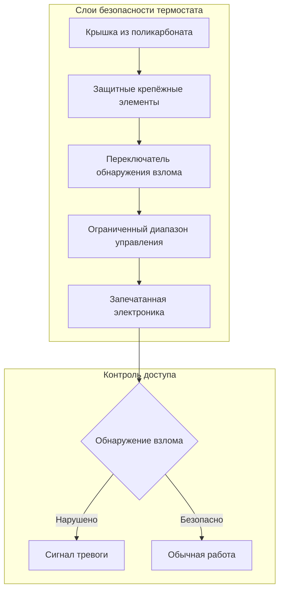
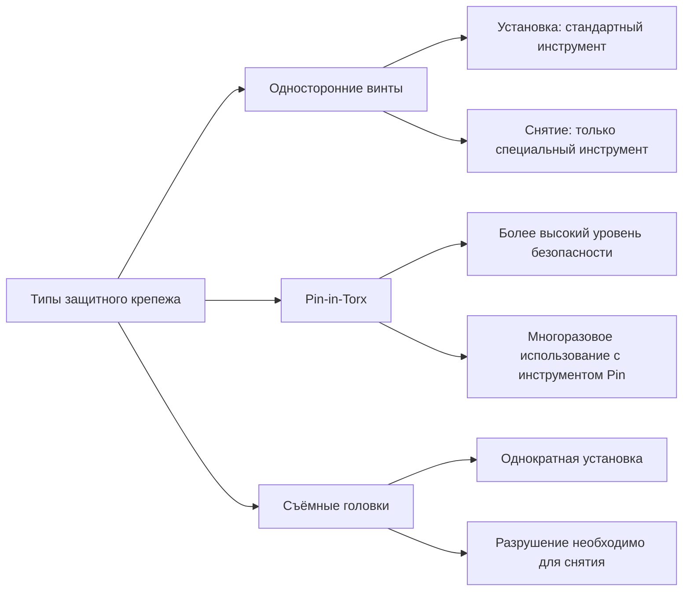
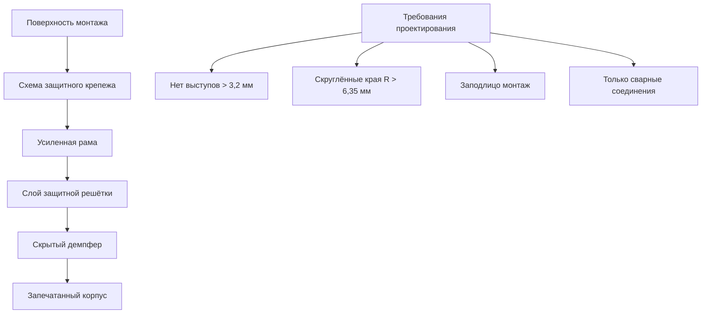

## Обзор

Усиленные компоненты HVAC для учреждений системы правосудия должны выдерживать целенаправленное повреждение, предотвращать изготовление оружия и сохранять функциональность в условиях экстремального использования. Выбор компонентов следует стандартам тюремного уровня, которые превосходят требования коммерческих зданий в 10–100 раз по устойчивости к ударам и защите от несанкционированного доступа.

## Критерии выбора материалов

### Требования к материалам тюремного уровня

| Свойство материала | Коммерческий стандарт | Тюремный уровень | Метод испытания |
|-------------------|---------------------|-----------------|-------------|
| Устойчивость к ударам | 67 Дж | 676+ Дж | ASTM E1966 |
| Прочность на разрыв | 207 МПа | 414+ МПа | ASTM E8 |
| Крутящий момент крепежа | 2,8 Н·м | 17+ Н·м | Односторонний защитный |
| Твёрдость поверхности | Rockwell B70 | Rockwell C40+ | ASTM E18 |
| Устойчивость к удушению | Н/А | Без выступов >3,2 мм | ACA 4-ALDF |

### Физика материалов

Требование коэффициента вязкости разрушения для компонентов тюремного уровня следует:

$$K_{IC} = \sigma \sqrt{\pi a}$$

Где:
- $K_{IC}$ = Критический коэффициент интенсивности напряжений (минимум 50 МПа√м для тюремного уровня)
- $\sigma$ = Приложенное напряжение
- $a$ = Длина трещины

Для компонентов из нержавеющей стали 304/316 предел текучести должен превышать:

$$\sigma_y \geq 207 \text{ МПа}$$

## Спецификации компонентов

### Защищённые от несанкционированного доступа термостаты

**Спецификации:**
- Материал крышки: поликарбонат 6,35 мм (Lexan 9034)
- Рейтинг ударопрочности: минимум 676 Дж
- Крепёжные элементы: Односторонние защитные винты (резьба #8-32)
- Диапазон температур: 18,3–25,6 °C (предотвращает экстремальные установки)
- Переключатель обнаружения взлома: Нормально замкнутый контакт, открывается при снятии крышки

### Системы защитного крепежа

**Требования к крутящему моменту:**

Крутящий момент установки защитного крепежа:

$$T = K \cdot d \cdot F$$

Где:
- $T$ = Крутящий момент (Н·м)
- $K$ = Коэффициент гайки (0,20 для смазанной нержавеющей стали)
- $d$ = Номинальный диаметр (мм)
- $F$ = Сила предварительного натяга (кгс)

Для защитных винтов #10-32 из нержавеющей стали:

$$T = 0,20 \times 4,8 \times 363 = 3,4 \text{ Н·м минимум}$$

### Защищённые от вандализма воздушные диффузоры

| Компонент | Материал | Монтаж | Устойчивость к повреждениям |
|-----------|----------|----------|-------------------|
| Передняя панель | Нержавеющая сталь 304 толщина 2 мм | Болтовое крепление | 676 Дж удара |
| Сердечник сборки | Сварная конструкция | Утопленные крепёжные элементы | Нет съёмных деталей |
| Решётка | Стержни диаметром 9,5 мм | Шаг 51 мм о.ц. | Невозможно согнуть/снять |
| Лопатка демпфера | Оцинкованная сталь 1,6 мм | Скрытая связь | Нет доступного механизма |

**Влияние на производительность потока:**

Потеря давления из-за защитных стержней:

$$\Delta P_{bars} = \frac{\rho V^2}{2} \cdot K_{bars}$$

Где $K_{bars} = 0,8$ для стержней диаметром 9,5 мм с шагом 51 мм.

Для 8,47 м³/ч через диффузор 304×304 мм:
- Скорость: $V = \frac{8,47}{0,1} = 84,7$ м³/ч (0,427 м/с)
- Дополнительное давление: $\Delta P = 0,006 \times 1,2 \times 0,8 = 0,006$ кПа

### Конструкция диффузора тюремного уровня

## Протоколы испытаний

### Испытание на устойчивость к ударам

Согласно ASTM E1966 и стандартам исправительных учреждений:

1. **Испытание падения шара**: Стальной шар массой 4,54 кг падает с высоты 15,24 м на поверхность компонента
2. **Повторяющиеся удары**: 100 циклов на уровне энергии 676 Дж
3. **Критерии прохождения**: Без трещин, без ослабленных деталей, сохраняет функциональность

Расчёт энергии удара:

$$E = mgh = 4,54 \text{ кг} \times 9,81 \text{ м/с}^2 \times 15,24 \text{ м} = 677 \text{ Дж}$$

### Проверка защиты от несанкционированного доступа

| Метод испытания | Процедура | Критерии прохождения |
|-------------|-----------|---------------|
| Доступ инструментами | 30-минутная атака обычными инструментами | Никакой компонент не снят |
| Обезвреживание крепежа | Попытка снятия импровизированными инструментами | Крепёж остаётся защищённым |
| Пробой материала | 60-минутное приложение устойчивой силы | Никакого проникновения или разрушения |
| Тест удушения | Сила 1112 Н на все выступы | Нет точек присоединения |

### Долговечность в окружающей среде

Компоненты должны сохранять защитные свойства после воздействия:

$$\Delta T_{cycle} = T_{max} - T_{min} = 65,6°C - (-6,7°C) = 72,3°C$$

Протокол испытания: 100 тепловых циклов, воздействие 95% влажности, солевой туман согласно ASTM B117.

## Требования к установке

### Спецификации монтажа

1. **Опорная пластина**: Минимум сталь толщиной 2,8 мм, сварная к конструктивным элементам
2. **Шаг крепежа**: Максимум 152 мм между центрами
3. **Расстояние от края**: Минимум 1,5× диаметра крепежа от края компонента
4. **Герметик**: Неусадочный эпоксидный или полиуретановый герметик с рейтингом защиты от удушения

### Сопротивление выдёргиванию

Требуемое сопротивление выдёргиванию:

$$F_{pullout} = n \cdot A_s \cdot \tau_{allow}$$

Где:
- $n$ = Количество крепёжных элементов
- $A_s$ = Площадь среза крепежа
- $\tau_{allow}$ = Допустимое напряжение сдвига (0,4 × предел текучести для нержавеющей стали)

Для четырёх винтов #10-32 из нержавеющей стали 304:

$$F_{pullout} = 4 \times 0,022 \text{ см}^2 \times 827 \text{ МПа} = 7 260 \text{ кН}$$

## Техническое обслуживание и проверка

### Периодическая проверка

- **Ежемесячно**: Визуальный осмотр на предмет повреждений, признаков взлома
- **Ежеквартально**: Проверка крутящего момента крепежа с помощью калиброванных инструментов
- **Ежегодно**: Полное функциональное тестирование, оценка состояния материала

### Требования к документации

Ведение записей согласно стандартам ACA:
- Дата установки и сертификация установщика
- Журналы обнаружения взлома
- История замены компонентов
- Результаты испытаний и проверка соответствия

## Справочные стандарты

- **ACA 4-ALDF**: Стандарты для взрослых местных учреждений содержания под стражей
- **ASTM E1966**: Стандартный метод испытания огнестойких систем соединений
- **ASTM E8**: Стандартные методы испытания на растяжение металлических материалов
- **ASTM B117**: Испытание солевым туманом (распылением)
- **NIJ 0306.01**: Стандарт испытания бронежилетов (критерии воздействия материала)

## Заключение

Усиленные компоненты HVAC представляют критическую инфраструктуру в исправительных учреждениях, где стандартные коммерческие продукты выходят из строя в течение дней. Правильное проектирование требует понимания физики материалов, протоколов испытания безопасности и требований долговечности, уникальных для тюремных приложений. Все компоненты должны соответствовать или превосходить стандарты тюремного уровня, сохраняя при этом функциональность теплового комфорта.
