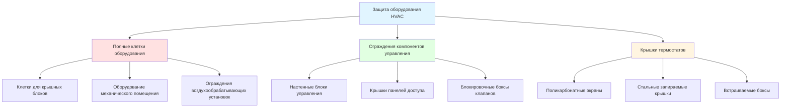
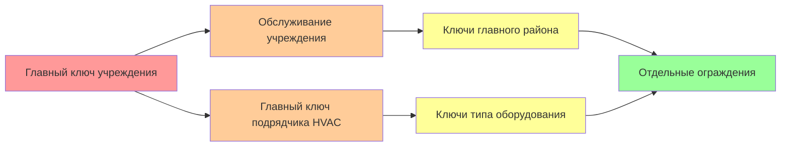

## Обзор

Запираемые ограждения обеспечивают существенную физическую защиту оборудования HVAC в учреждениях юстиции, предотвращая несанкционированный доступ, манипуляции и превращение компонентов в оружие. Эти системы должны сбалансировать требования безопасности с доступностью для обслуживания, соответствием нормам и операционной безопасностью, при этом соответствуя стандартам American Correctional Association (ACA) и National Institute of Corrections (NIC).

## Требования к проектированию ограждения

### Конструкция с рейтингом безопасности

**Спецификации материалов для мест содержания:**

| Компонент | Материал | Спецификация | Устойчивость к атакам |
|-----------|----------|---------------|-------------------|
| Сетка | Сталь 9 калибра | 50 × 50 мм или 25 × 25 мм сварная | Резание: 5+ минут |
| Расширенный металл | Сталь 13 калибра | 19 мм #13 расплющенная | Устойчива к проникновению |
| Каркас | 38 × 38 мм уголок | ASTM A36 сварные углы | Устойчив к ударам |
| Петли двери | Непрерывная скрипичная | Нержавеющая сталь | Защита от взлома |
| Замки | Высокой безопасности | BHMA Grade 1 | Устойчивость к подбору/сверлению |

### Рассмотрение воздушного потока

Ограждения не должны ограничивать вентиляцию оборудования. Коэффициент открытой площади определяет тепловые характеристики:

$$\text{Коэффициент открытой площади} = \frac{A_{\text{mesh}}}{A_{\text{total}}} \geq 0.70$$

Для сварной сетки с диаметром провода $d$ и размером отверстия $s$:

$$\text{Открытая площадь} = \left(\frac{s}{s + d}\right)^2 \times 100\%$$

**Пример:** Сетка 50 × 50 мм с проводом диаметром 3,76 мм (9 калибр):
$$\text{Открытая площадь} = \left(\frac{50}{50 + 3.76}\right)^2 = 0.867 = 86.7\%$$

### Оценка теплового воздействия

Повышение температуры, вызванное ограждением для закрытого оборудования:

$$\Delta T = \frac{Q_{\text{equip}}}{5.68 \times Q_{\text{vent}}} \times \left(\frac{1}{OAR}\right)$$

Где:
- $Q_{\text{equip}}$ = Тепловыделение оборудования (кДж/ч)
- $Q_{\text{vent}}$ = Воздушный поток вентиляции (CFM (м³/ч))
- $OAR$ = Коэффициент открытой площади (десятичный)

Поддерживайте $\Delta T < 5.6°C$ для предотвращения перегрева оборудования.

## Типы ограждений и область применения

### Полные клетки оборудования

**Параметры проектирования:**

- Минимальный зазор: 910 мм с сторон обслуживания, 610 мм с других сторон
- Высота потолка: Высота оборудования + 300 мм минимум
- Ширина двери: 910 мм минимум для извлечения оборудования
- Закрепление пола: Анкеры расширения 12,7 мм через 610 мм O.C.

**Последовательность строительства:**

1. Проверьте местоположение оборудования и необходимые зазоры обслуживания
2. Установите направляющие крепления на полу с химическими анкерами
3. Установите вертикальные стойки и приварите угловые соединения
4. Установите сетчатые панели с непрерывными сварками (максимальный интервал 150 мм)
5. Установите защищенную дверь с непрерывными петлями
6. Установите высокозащищенный цилиндр замка и ударную пластину
7. Проверьте зазор свинга двери и совмещение замка

### Ограждения компонентов управления

**Системы защиты термостата:**

| Тип | Материал | Размеры | Уровень безопасности | Применение |
|------|----------|------------|----------------|-------------|
| Прозрачный поликарбонат | 6,4 мм Lexan | 150 × 100 × 50 мм | Средний | Общее защитное корпусное покрытие |
| Стальной лок-бокс | 16 калибра | 200 × 150 × 75 мм | Высокий | Максимальная безопасность |
| Встраиваемый монтаж | 18 калибра сталь | Заподлицо со стеной | Высокий | Новое строительство |
| Защищенная от взлома крышка | Поликарбонат | На защелку | Низко-средний | Минимальная безопасность |

**Требования к монтажу:**

- Настенные анкеры: Дюбельные болты или анкеры для бетона с номиналом минимум 23 кг
- Головки винтов: Защита от взлома (pin-in-torx, односторонние)
- Герметизация: Прокладка или силикон для предотвращения попадания мусора
- Вентиляция: Минимум 6,4 мм перфорации для считывания температуры

## Протоколы контроля ключей

### Системы главного ключа

**Иерархическая структура доступа для обслуживания:**

**Требования к управлению ключами:**

- Журнал контроля ключей, ведомый охраной учреждения
- Оформление ключа подрядчика с фото ID и подписью
- Проверка возврата ключа в конце визита обслуживания
- Замена сердечника замка после прекращения договора с подрядчиком
- Ежеквартальный аудит инвентаризации ключей

### Спецификации цилиндра замка

**Требования к высокозащищенному замку согласно стандартам ACA:**

- Сертификация ANSI/BHMA A156.5 Grade 1
- Устойчивость к сверлению: Закаленные стальные штифты и противосверлильные пластины
- Устойчивость к подбору: Минимум 6 штифтов с защитными штифтами
- Контроль ключей: Ограниченный профиль отверстия ключа, защита патента
- Кодирование: Строительный сердечник для фазы установки

## Стандарты установки

### Требования к зазорам

**Размеры доступа, соответствующие нормам:**

$$C_{\text{min}} = \max(W_{\text{equip}} + 910\text{ мм}, 760\text{ мм})$$

Где $C_{\text{min}}$ — минимальный рабочий зазор, $W_{\text{equip}}$ — ширина оборудования.

Для электрических компонентов номиналом >150 В к земле:

- Глубина: 910 мм минимум (согласно NEC 110.26)
- Ширина: 760 мм минимум или ширина оборудования + 150 мм
- Высота: 2000 мм минимум от пола

### Расчет структурной нагрузки

Расчет веса клетки для проверки несущей способности конструкции:

$$W_{\text{cage}} = \rho_{\text{steel}} \times (A_{\text{frame}} + A_{\text{mesh}}) \times t$$

Где:
- $\rho_{\text{steel}}$ = 7850 кг/м³
- $A_{\text{frame}}$ = Общая площадь каркаса (м²)
- $A_{\text{mesh}}$ = Площадь сетчатой панели (м²)
- $t$ = Толщина материала (м)

Проверьте структурную грузоподъемность крыши:

$$L_{\text{total}} = W_{\text{cage}} + W_{\text{equip}} + W_{\text{snow}} + W_{\text{maint}}$$

### Заземление и соединение

Все металлические ограждения требуют электрического заземления:

- Соединение ограждения с проводником заземления оборудования
- Минимальный размер проводника: провод #10 AWG медь
- Соединение: Перечисленный зажим заземления или экзотермическая сварка
- Момент затяжки: Согласно спецификации производителя (обычно 4-5 Н·м)

## Доступность для обслуживания

### Проектирование панели доступа

**Требования шарнирной панели:**

- Размер панели: Минимум 510 × 510 мм для доступа к фильтру
- Тип петли: Непрерывная скрипичная петля, нержавеющая сталь
- Тип замка: Дужка для навесного замка или интегральный цилиндр замка
- Угол открывания: 120° минимум для извлечения фильтра
- Поддержка: Рычаг удержания в открытом положении для панелей >610 мм

### Документация обслуживания

**Требуемая маркировка на каждом ограждении:**

- Номер идентификации оборудования
- Код цилиндра замка (только для учреждения)
- Контактная информация для экстренных случаев
- Предупреждение "ТОЛЬКО УПОЛНОМОЧЕННЫЙ ПЕРСОНАЛ"
- Напольная разметка зоны обслуживания

## Проверка и испытания

### Испытания при приемке

**Контрольный список проверки ввода в эксплуатацию:**

1. Проверьте, что все сварные швы непрерывны и не имеют щелей
2. Подтвердите выравнивание двери с единообразным зазором <3 мм
3. Протестируйте работу замка при 50 циклах открытия/закрытия
4. Измерьте повышение температуры оборудования после 24-часовой работы
5. Проверьте необходимые зазоры обслуживания рулеткой
6. Проверьте непрерывность электрического заземления (<0,1 Ом)
7. Подтвердите, что документация по контролю ключей завершена

### Текущее обслуживание

**Пункты ежеквартальной проверки:**

- Смазка цилиндра замка графитовым порошком
- Проверка работы петель и выравнивания
- Проверка целостности сетчатой панели (порезы, деформации)
- Проверка затяжки болтов анкеров
- Оценка состояния краски и коррозии
- Аудит журнала контроля ключей

## Руководство спецификации

**Ссылка на раздел CSI MasterFormat:**

- **23 00 00** - HVAC (Division 23)
- **23 05 13** - Общие требования к двигателям для оборудования HVAC
- **05 50 00** - Металлические изделия (для клеток)
- **08 71 00** - Фурнитура для дверей (для замков)

**Рекомендуемый язык спецификации:**

"Предоставьте сварные сетчатые защитные ограждения для всего доступного оборудования HVAC. Изготовьте из сварной проволоки стали 9 калибра с отверстиями 50 × 50 мм, горячеоцинкованной после изготовления согласно ASTM A123. Каркас из уголка стали 38 × 38 мм со сварными углами. Оснастите шарнирной дверью шириной 910 мм, непрерывной скрипичной петлей и высокозащищенным цилиндром замка, зашифрованным в главную систему ключей учреждения. Закрепите на конструкции согласно конструктивным чертежам. Минимальные рабочие зазоры согласно NEC 110.26."

---

**Связанные темы:**
- Защищенная от взлома фурнитура
- Защищенные от вандализма компоненты HVAC
- Стандарты проектирования исправительных учреждений
- Оценка рисков безопасности HVAC
