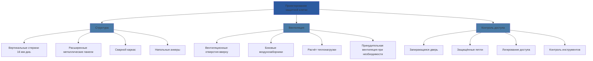
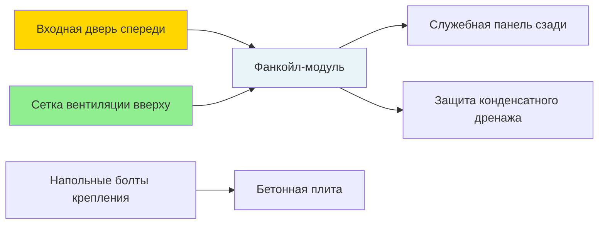

## Обзор

Защитные клетки оберегают оборудование HVAC в исправительных учреждениях от вмешательства, вандализма и использования в качестве оружия, при этом обеспечивая необходимый доступ для обслуживания и гарантируя адекватную вентиляцию для работы оборудования. Правильное проектирование клетки уравновешивает требования безопасности с тепловым управлением и возможностью обслуживания.

## Стандарты конструкции

### Требования к материалам

Защитные клетки должны сопротивляться силовому воздействию и предотвращать удаление компонентов, которые могут быть использованы как оружие или инструменты.

| Компонент | Спецификация материала | Минимальный размер/толщина | Обоснование |
|-----------|----------------------|------------------------|---------------|
| Вертикальные стержни | Круглый стальной стержень | 16 мм диаметр | Препятствует резанию импровизированными инструментами |
| Горизонтальные опоры | Стальной уголок или швеллер | 3 мм × 38 мм | Структурная жёсткость |
| Сетчатые панели | Расширенный металл или перфорированный | 9 калибр, макс. отверстие 19 мм | Визуальный контроль, воздушный поток |
| Каркас | Стальная труба/уголок | Стенка 6 мм, мин. 51 × 51 мм | Точки крепления грузоносящей конструкции |
| Крепежные элементы | Специальные шестигранные болты или односторонние винты | Класс 8 минимум | Устойчивость к вмешательству |
| Сварные швы | Полное проплавление | По AWS D1.1 | Структурная целостность |

### Размерное проектирование

Размеры клетки должны обеспечивать доступ к оборудованию, требования по воздушному потоку и зазоры для обслуживания в соответствии с ASHRAE 62.1 и спецификациями производителя.

**Минимальные зазоры:**

$$C_{total} = C_{mfr} + C_{access} + C_{air}$$

Где:
- $C_{total}$ = Требуемый общий зазор (см)
- $C_{mfr}$ = Зазор, указанный производителем (см)
- $C_{access}$ = Зазор для доступа при обслуживании (обычно 61–91 см)
- $C_{air}$ = Дополнительное пространство для воздушного потока (функция отвода тепла оборудованием)

Для оборудования, генерирующего тепло, рассчитайте требуемую площадь вентиляционного отверстия:

$$A_{vent} = \frac{Q_{reject}}{1.76 \times \rho \times c_p \times \Delta T_{allow}}$$

Где:
- $A_{vent}$ = Чистая свободная площадь вентиляции (м²)
- $Q_{reject}$ = Отвод тепла оборудованием (кДж/ч)
- $\rho$ = Плотность воздуха (1,20 кг/м³ при стандартных условиях)
- $c_p$ = Удельная теплоёмкость воздуха (1,005 кДж/кг·°C)
- $\Delta T_{allow}$ = Допустимый прирост температуры (обычно 8–11 °C)

## Конфигурация проектирования клетки

## Требования вентиляции

### Проектирование естественной вентиляции

Расположите воздухозаборные отверстия низко, а вытяжные отверстия высоко для поощрения термальной стратификации и естественной конвекции. Эффективный коэффициент вентиляции определяется по формуле:

$$Q_{vent} = C_d \times A \times \sqrt{2g \times H \times \frac{\Delta T}{T_{avg}}}$$

Где:
- $Q_{vent}$ = Объёмный расход воздуха (м³/ч)
- $C_d$ = Коэффициент выпуска (0,6–0,65 для острокромочных отверстий)
- $A$ = Чистая свободная площадь отверстий (м²)
- $g$ = Гравитационная постоянная (9,81 м/с²)
- $H$ = Вертикальное расстояние между входом и выходом (м)
- $\Delta T$ = Разница температур между внутренней и внешней частью клетки (°C)
- $T_{avg}$ = Средняя абсолютная температура (K = °C + 273,15)

### Принудительная вентиляция

Когда естественная вентиляция оказывается недостаточной, установите специальные вытяжные вентиляторы, рассчитанные по формуле:

$$CFM_{required} = \frac{Q_{reject}}{1,76 \times \Delta T_{allow}}$$

Спецификации вентилятора:
- Моторы с наружным ротором (без доступных лопастей вентилятора)
- Установка заподлицо за защитными решётками
- Жёсткий монтаж питания (без доступных разъёмов)
- Минимальная способность статического давления 6,25 Па

## Типы клеток и их применение

### Клетки для фанкойл-модулей

Заключите весь фанкойл-модуль с:
- Входной шарнирной дверью (поворот на 180° для снятия змеевика)
- Верхней вентиляцией минимум 40% от площади плана
- Защитой дренажной линии (сварной рукав трубы через основание клетки)
- Электрическим отключением, доступным снаружи клетки

### Защита термостата

Утопленные защитные коробки с:
- Стальной конструкцией 16 калибр
- Защищёнными от вмешательства крепежами крышки
- Поликарбонатным окном (ударопрочным)
- Заподлицо установленным (без выступающих краёв)

Соображения по размещению датчика температуры:

$$T_{measured} = T_{actual} + \varepsilon (T_{surface} - T_{actual})$$

Где $\varepsilon$ представляет коэффициент лучистого влияния. Установите датчики вдали от стенок клетки, чтобы минимизировать кондуктивные и лучистые ошибки.

## Протоколы контроля доступа

### Фурнитура двери

| Компонент | Спецификация | Назначение |
|-----------|--------------|---------|
| Замок | Высокозащищённый цилиндр, ограниченная система ключей | Предотвратить подбор, минимизировать размножение ключей |
| Петли | Непрерывные или без штифтов | Предотвратить удаление штифта петли |
| Защёлка | Заподлицо монтируемый болт | Без выступающих компонентов |
| Ударная пластина | Усиленная коробчатая ударная пластина | Сопротивление силовому входу |

### Доступ для обслуживания

Документируйте все входы в клетку:
- Правило двух человек для занятых зон
- Контроль инвентаризации инструментов (регистрация входа/выхода)
- Проверка повреждений или вмешательства после каждого доступа
- Уведомление системы безопасности до и после входа

## Крепление и анкеровка

Закрепите клетки к строительной конструкции, используя:
- Анкеры расширения минимум 13 мм диаметр
- Глубина залегания минимум 102 мм в бетон
- Расстояние не более 610 мм по центру
- Испытание прочности вырывания по ASTM E488 (минимум 6,67 кН на анкер)

Расчёт нагрузки анкера для сопротивления опрокидыванию:

$$M_{applied} = F_{lateral} \times h_{cg}$$

$$T_{anchor} = \frac{M_{applied}}{n \times d}$$

Где:
- $M_{applied}$ = Приложенный момент (кН·м)
- $F_{lateral}$ = Боковая сила при попытке проникновения (кН)
- $h_{cg}$ = Высота до центра масс (м)
- $T_{anchor}$ = Натяжение на анкер (кН)
- $n$ = Количество натянутых анкеров
- $d$ = Расстояние от рёбра сжатия до натянутого анкера (м)

## Проверка и тестирование

### Проверка при установке

- Проверка сварки по AWS D1.1 (визуальная и дефектоскопия красителем)
- Испытание вырывания анкеров (случайная выборка, минимум 10%)
- Измерение воздушного потока вентиляции (сравнение с рассчитанными значениями)
- Проверка острых краёв и выступающих частей (отшлифовать до гладкости все потенциальные опасности)

### Рабочий мониторинг

- Визуальная проверка повреждений ежеквартально
- Годовая оценка структурной целостности
- Мониторинг температуры внутри клеток с критическим оборудованием
- Испытание работы замка и двери

## Соответствие кодексам и стандартам

Ссылочные стандарты:
- **ACA Standard 4-ALDF-2A-31**: Безопасность системы HVAC в исправительных учреждениях для взрослых
- **NIC Technical Assistance**: Руководящие принципы защиты механических систем
- **ASHRAE 62.1**: Требования вентиляции для приемлемого качества воздуха в помещениях
- **AWS D1.1**: Код конструкционной сварки стали
- **ASTM F2947**: Стандартная спецификация оборудования для исправительных учреждений

## Контрольный список проектирования

- [ ] Отвод тепла оборудованием рассчитан и проверен
- [ ] Вентиляционные отверстия определены по тепловому анализу
- [ ] Все крепежные элементы специального типа
- [ ] Входная дверь распахивается свободно от оборудования
- [ ] Поддерживаются минимальные зазоры для обслуживания
- [ ] Напольные анкеры указаны с прочностью вырывания
- [ ] Острые края устранены или защищены
- [ ] Управляющие провода и трубопроводы защищены при проходе через клетку
- [ ] Фурнитура замка соответствует стандартам безопасности учреждения
- [ ] Установлены протоколы проверки и тестирования

## Заключение

Проектирование защитной клетки для оборудования HVAC исправительных учреждений требует интегрированного анализа структурной безопасности, теплового управления и доступности обслуживания. Надлежащий выбор материалов, размерное проектирование и предусмотрение вентиляции гарантируют защиту оборудования без ущерба производительности системы или создания опасных условий. Соответствие стандартам исправительных учреждений и строгая проверка при установке обеспечивают как безопасность учреждения, так и надёжность системы HVAC.
