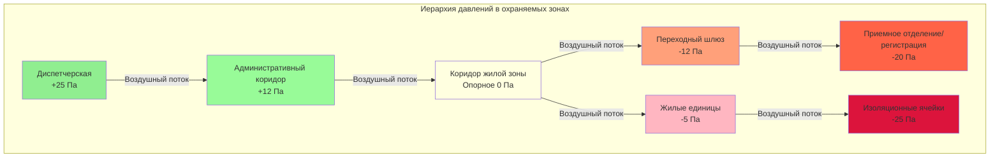
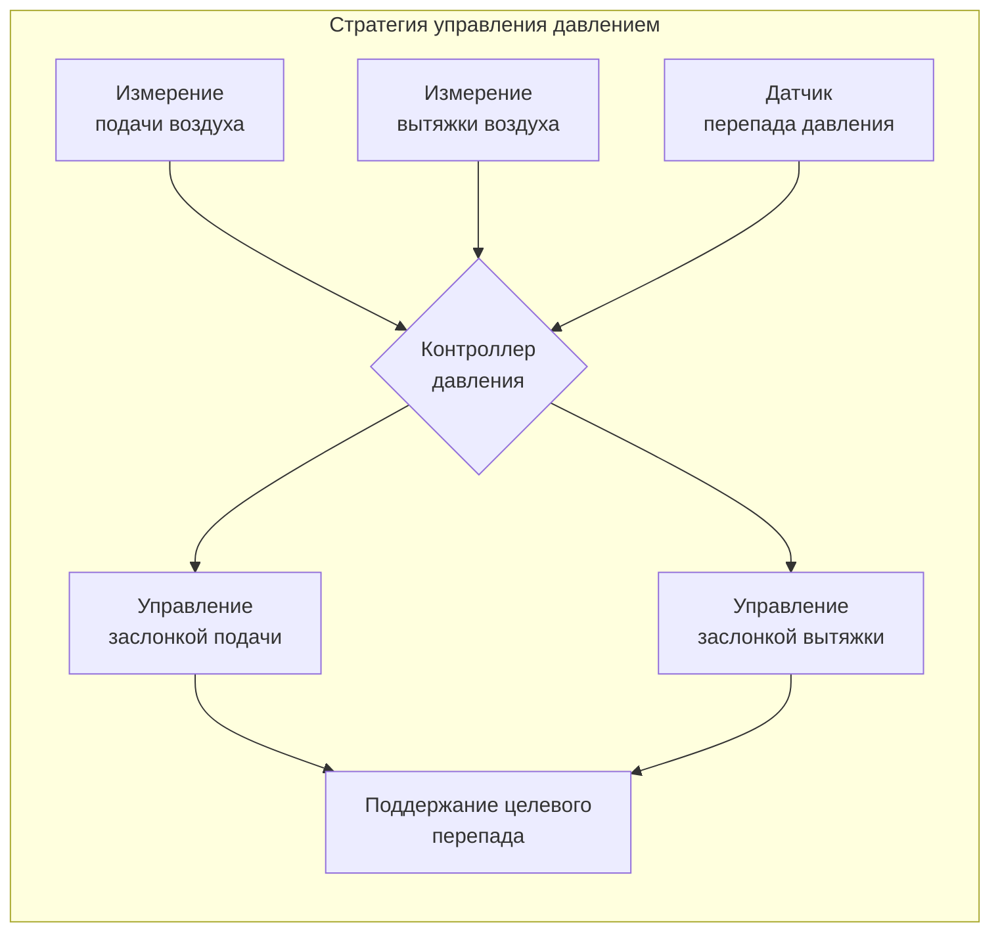
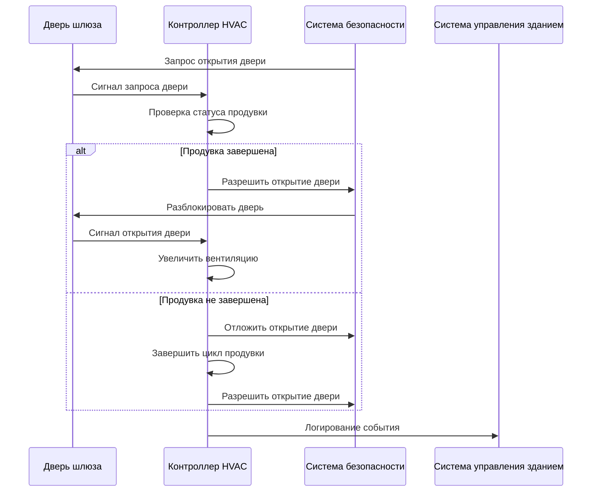

# Вентиляция в охраняемых зонах

Вентиляция охраняемых зон в учреждениях правосудия требует точного управления моделями воздушного потока, соотношениями давлений и качеством воздуха при сохранении эксплуатационной безопасности. Система HVAC должна предотвращать миграцию загрязнений, контролировать передачу запахов, поддерживать функции безопасности и работать надежно в условиях учреждения.

## Классификация охраняемых зон

Учреждения правосудия разделены на отдельные охраняемые зоны, каждая из которых требует специфических подходов к вентиляции в зависимости от типа занятости, уровня безопасности и эксплуатационных требований.

### Основные типы охраняемых зон

| Тип зоны | Уровень безопасности | Соотношение давлений | Воздухообмены/час | Рециркуляция |
|-----------|----------------------|----------------------|------------------|---------------|
| Ячейки максимальной безопасности | Высокий | Отрицательное к коридору | 12-15 ACH | Ограниченная |
| Жилые зоны общего пользования | Средний | Отрицательное к коридору | 10-12 ACH | Разрешена |
| Приемное отделение/регистрация | Высокий | Отрицательное к смежным | 15-20 ACH | Не разрешена |
| Зоны посещений | Средний | Нейтральное к коридору | 10-12 ACH | Разрешена |
| Диспетчерские | Критический | Положительное ко всем зонам | 6-8 ACH | Разрешена |
| Переходные шлюзы | Высокий | Отрицательное по обе стороны | 20-30 ACH | Не разрешена |
| Медицинская/изоляция | Высокий | Отрицательная изоляция | 12-15 ACH | Не разрешена |
| Административная | Низкий | Положительное к защищенным зонам | 4-6 ACH | Разрешена |

## Расчеты скоростей вентиляции

Скорости вентиляции охраняемых зон зависят от плотности занятости, нагрузки загрязнений и эксплуатационных требований. Требуемый наружный воздух соответствует стандарту ASHRAE 62.1 с модификациями для исправительных учреждений.

### Требование к наружному воздуху

$$V_{oa} = R_p \times P + R_a \times A_z$$

Где:
- $V_{oa}$ = расход наружного воздуха (м³/ч)
- $R_p$ = норма наружного воздуха на человека (м³/ч·чел)
- $P$ = численность зоны (человек)
- $R_a$ = норма наружного воздуха по площади (м³/ч·м²)
- $A_z$ = площадь пола зоны (м²)

Для жилых помещений исправительных учреждений:
- $R_p$ = 2,4-4,7 м³/ч·чел (минимум)
- $R_a$ = 0,19 м³/ч·м²

### Метод воздухообмена

$$ACH = \frac{Q \times 60}{V}$$

Где:
- $ACH$ = воздухообмены в час
- $Q$ = расход воздуха (м³/ч)
- $V$ = объем помещения (м³)

Минимальные требования ACH:

$$Q_{min} = \frac{ACH_{required} \times V}{60}$$

### Управление перепадом давления

Соотношения давления между зонами поддерживают контроль загрязнений и целостность безопасности.

$$\Delta P = \frac{Q_{net}^2 \times \rho}{2 \times C_d^2 \times A^2}$$

Где:
- $\Delta P$ = перепад давления (Па)
- $Q_{net}$ = чистый воздушный поток через отверстие (м³/ч)
- $\rho$ = плотность воздуха (кг/м³)
- $C_d$ = коэффициент расхода (обычно 0,6-0,7)
- $A$ = площадь отверстия (м²)

Целевые перепады давления:
- Критические границы: 12-25 Па
- Стандартные границы: 5-12 Па

## Вентиляция переходных шлюзов

Переходные шлюзы служат в качестве защищенных переходных зон между уровнями безопасности, требующих специализированной вентиляции для предотвращения передачи воздуха между зонами во время работы дверей.

### Требования проектирования

1. **Минимум 20-30 ACH** при отсутствии занятости
2. **100% вытяжка** без рециркуляции
3. **Отрицательное давление** относительно обеих смежных зон
4. **Блокировка операций** с управлением дверей
5. **Цикл продувки** между операциями дверей

### Расчет цикла продувки

$$t_{purge} = \frac{3 \times V}{Q}$$

Где:
- $t_{purge}$ = время продувки (минуты)
- $V$ = объем переходного шлюза (м³)
- $Q$ = расход вытяжки (м³/ч)
- Коэффициент 3 представляет три полных воздухообмена

Типичное время продувки: минимум 1-2 минуты

## Интеграция с системами безопасности

Системы HVAC в охраняемых зонах интегрируются с инфраструктурой безопасности учреждения для поддержки эксплуатационных требований и реагирования на чрезвычайные ситуации.

### Ключевые точки интеграции

**Системы блокировки дверей**
- Изменение режима вентиляции в зависимости от статуса двери
- Циклы продувки перед операцией двери
- Сигналы тревоги при отказе вентиляции

**Системы пожарной сигнализации**
- Активация режима дымоудаления
- Автоматическое позиционирование заслонок
- Управление последовательностью pressurization

**Системы управления безопасностью**
- Мониторинг статуса зоны
- Отчетность об аварийных сигналах давления
- Возможность переопределения для чрезвычайных ситуаций

**Системы контроля доступа**
- Координированная работа двери/вентиляции
- Координация отложенного выхода
- Интеграция аварийного выпуска

## Pressurization диспетчерских

Диспетчерские требуют положительного давления для защиты персонала от потенциальных переносимых по воздуху угроз и поддержания надежности оборудования.

### Критерии проектирования

- **Положительное давление**: +12 до +25 Па относительно всех смежных зон
- **Фильтрация**: MERV 13 минимум, MERV 14 предпочтительно
- **Избыточность**: двойные вентиляторы подачи с автоматическим переключением
- **Герметизация**: конструкция помещения для поддержания давления при обычной инфильтрации

Расчет подачи воздуха с инфильтрацией:

$$Q_{supply} = Q_{ventilation} + Q_{pressurization} + Q_{infiltration}$$

Где расход pressurization:

$$Q_{pressurization} = \frac{A \times C_d \times \sqrt{2 \times \Delta P \times \rho}}{0.075}$$

## Управление запахом и загрязнениями

Охраняемые зоны генерируют уникальные нагрузки загрязнений, требующие специальных стратегий вытяжки и фильтрации.

### Приоритеты вытяжки

1. **Выделенная вытяжка** из туалетов и душевых
2. **Без рециркуляции** из зон с высоким загрязнением
3. **Отдельные системы вытяжки** для различных охраняемых зон
4. **Химическая/биологическая фильтрация** где требуется

### Минимальные скорости вытяжки

- Туалетные комнаты: 23,6 м³/ч на приспособление
- Душевые зоны: 6,1 м³/ч·м² или 23,6 м³/ч минимум
- Общие ячейки: 50% подачи воздуха минимум
- Приемные зоны: 100% наружный воздух, 100% вытяжка

## Стандарты и ссылки

**Стандарты ASHRAE:**
- ASHRAE 62.1: Вентиляция для приемлемого качества внутреннего воздуха (раздел для исправительных учреждений)
- ASHRAE 170: Вентиляция медицинских учреждений (для медицинских зон)

**Стандарты исправительных учреждений:**
- Стандарты ACA для учреждений исправительной работы с взрослыми (условия окружающей среды)
- Рекомендации по проектированию Национального института исправлений
- Стандарты правовых актов штата для исправительных учреждений

**Сопутствующие коды:**
- Международный механический код (IMC) Глава 4
- NFPA 90A: Установка систем кондиционирования и вентиляции воздуха
- Местные поправки для учреждений правосудия

## Рассмотрения при вводе в эксплуатацию

Вентиляция охраняемых зон требует тщательного ввода в эксплуатацию для проверки надлежащей работы при всех режимах эксплуатации.

### Критические точки проверки

- Проверка перепада давления при всех позициях дверей
- Проверка времени цикла продувки
- Тестирование функциональности блокировки
- Проверка точек тревоги
- Работа режима чрезвычайной ситуации
- Переключение резервной системы
- Балансировка в присутствии персонала безопасности

Все испытания должны проводиться с координацией персонала безопасности для предотвращения операционных сбоев и сохранения безопасности учреждения во время работ по вводу в эксплуатацию.
