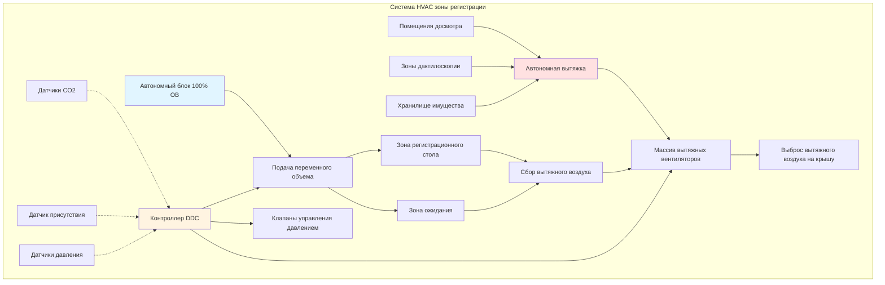
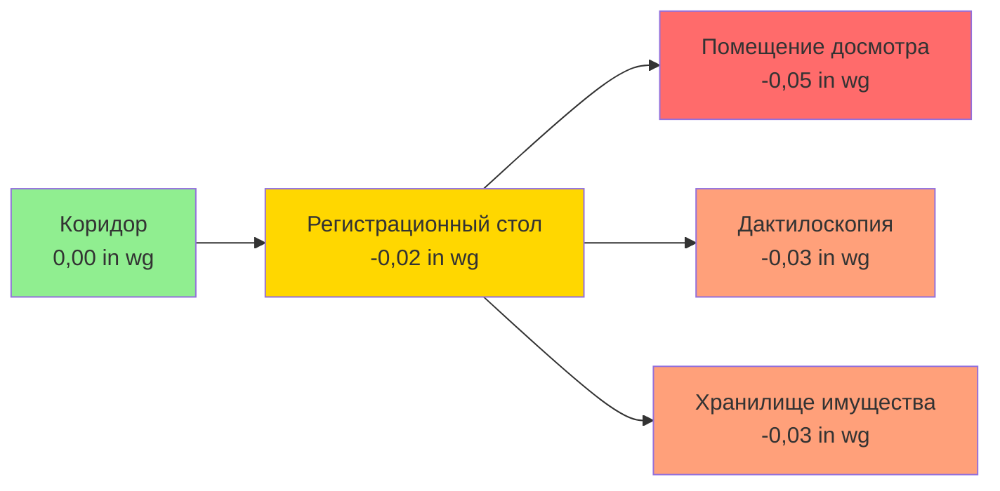

## Обзор

Зоны регистрации в учреждениях системы правосудия представляют уникальные проблемы HVAC из-за экстремальной изменчивости количества людей, требований по контролю запахов и ограничений безопасности. Эти помещения испытывают быстрые переходы от минимального количества людей к полной вместимости во время массовых арестов, требуя быстро реагирующих систем вентиляции, которые поддерживают качество воздуха при предотвращении перекрестного загрязнения соседних защищенных зон.

## Расчеты требуемого воздухообмена

### Базовые требования к вентиляции

Зоны регистрации требуют значительно более высоких скоростей воздухообмена, чем стандартные офисные помещения, из-за высокой плотности людей и выделения запахов. Общий требуемый воздухообмен объединяет компоненты на основе количества людей и площади:

$$Q_{total} = Q_{occupancy} + Q_{area}$$

где:

$$Q_{occupancy} = N \times V_{person} \times \frac{1}{E_v}$$

$$Q_{area} = A \times v_{area}$$

**Параметры:**
- $Q_{total}$ = Общее требуемое количество наружного воздуха (CFM)
- $N$ = Количество людей (человек)
- $V_{person}$ = Наружный воздух на одного человека (CFM/человек)
- $E_v$ = Эффективность вентиляции (обычно 0,8 для систем смешивания)
- $A$ = Площадь помещения (м²)
- $v_{area}$ = Скорость воздухообмена на основе площади (CFM/м²)

### Расчетные значения ASHRAE 62.1

| Тип помещения | Человек/1000 м² | CFM/человек | CFM/м² | Общий расчетный CFM/человек |
|------------|-----------------|------------|---------|------------------------|
| Зона регистрации | 54 | 7,5 | 0,65 | 10 |
| Помещения досмотра | 27 | 10 | 1,29 | 15 |
| Зоны дактилоскопии | 16 | 7,5 | 0,65 | 12 |
| Хранилище имущества | 5 | 5 | 1,29 | 8 |

### Вентиляция при пиковых нагрузках

При массовых событиях регистрации требуемый воздухообмен существенно возрастает:

$$Q_{peak} = Q_{design} \times F_{surge} \times F_{safety}$$

где:
- $F_{surge}$ = Коэффициент скачка (1,5–2,0 для зон регистрации)
- $F_{safety}$ = Коэффициент безопасности (1,1–1,2)

Для зоны регистрации площадью 186 м² с расчетной вместимостью 100 человек:

$$Q_{peak} = (100 \times 10 + 186 \times 0,65) \times 1,75 \times 1,15$$

$$Q_{peak} = (1000 + 121) \times 2,01 = 2,252 \text{ CFM}$$

## Требования по кратности воздухообмена

Зоны регистрации требуют повышенной кратности воздухообмена для быстрого удаления загрязнений:

$$ACH = \frac{Q_{total} \times 60}{V_{room}}$$

где:
- $ACH$ = Кратность воздухообмена в час
- $V_{room}$ = Объем помещения (м³)

**Рекомендуемая кратность воздухообмена:**

| Зона | Минимум ACH | Расчет ACH | Примечания |
|------|-------------|------------|-------|
| Общая зона регистрации | 8 | 12 | Рекомендуется управление переменной скоростью |
| Помещения досмотра | 10 | 15 | 100% вытяжка, без рециркуляции |
| Зоны дактилоскопии | 8 | 10 | Отрицательное давление относительно коридора |
| Зоны фотографирования | 6 | 8 | Стандартные нормы приемлемы |
| Хранилище имущества | 6 | 8 | Приоритет контроля запахов |

## Архитектура системы

## Стратегия управления на основе количества людей

### Сценарии переменного количества людей

| Сценарий | Типичное количество людей | Продолжительность | Режим вентиляции |
|----------|-------------------|----------|------------------|
| Ночь (00:00–06:00) | 2–5 человек | 6 часов | Минимум (30% расчета) |
| Нормальная работа | 15–30 человек | 14 часов | Стандарт (60% расчета) |
| Пиковая регистрация | 60–100 человек | 2–4 часа | Максимум (100% расчета) |
| Событие массовых арестов | 100–150 человек | 1–3 часа | Аварийный режим (120% расчета) |

### Вентиляция с управлением по требованию

Реализуйте управление по требованию на основе CO₂ с быстрой реакцией:

$$V_{DCV} = V_{min} + (V_{max} - V_{min}) \times \frac{CO_2_{measured} - CO_2_{outdoor}}{CO_2_{setpoint} - CO_2_{outdoor}}$$

**Параметры управления:**
- $CO_2_{outdoor}$ = 400–450 ppm
- $CO_2_{setpoint}$ = 800 ppm (зоны регистрации)
- $CO_2_{max}$ = 1000 ppm (порог тревоги)
- Время отклика: < 5 минут до 90% целевого расхода

## Отношение давлений

Зоны регистрации должны поддерживать определенные дифференциалы давления для предотвращения миграции запахов:

**Требования управления давлением:**
- Коридор к регистрации: –0,02–0,03 in wg
- Регистрация к помещениям досмотра: –0,03–0,05 in wg
- Минимум 0,05 in wg между регистрацией и соседними офисными зонами
- Мониторинг давления минимум в 4 точках на зону

## Стратегии контроля запахов

### Вентиляция источника загрязнения

Помещения досмотра и зоны дактилоскопии генерируют концентрированные запахи, требующие специальной вытяжки:

$$Q_{exhaust} = \frac{G \times K}{C_{acceptable} - C_{outdoor}}$$

где:
- $G$ = Скорость выделения запаха (olf)
- $K$ = Коэффициент безопасности (2,0–3,0 для охраняемых зон)
- $C_{acceptable}$ = Приемлемая концентрация (обычно 0,5 децибела)

### Требования к фильтрации

| Место установки фильтра | Класс MERV | Тип фильтра | Периодичность замены |
|-----------------|-------------|-------------|------------------|
| Приточный воздух | MERV 13–14 | Гофрированный материал | Ежеквартально |
| Рециркуляция (если используется) | MERV 15 + Уголь | Комбинированный | Ежемесячно |
| Вытяжной воздух | MERV 8 | Грубая очистка | Два раза в год |

**Примечание:** Системы со 100% наружным воздухом настоятельно рекомендуются; рециркуляцию следует избегать в помещениях досмотра и в зонах дактилоскопии.

## Интеграция безопасности

### Конструкция, устойчивая к несанкционированному доступу

Все компоненты HVAC в зонах регистрации требуют конструкции с оценкой безопасности:
- Решетки: нержавеющая сталь 16 калибра, застежки, устойчивые к несанкционированному доступу
- Воздуховоды: минимум 20 калибра в доступных зонах
- Люки доступа: с рейтингом безопасности, закрытие на ключ
- Датчики: защищенные корпуса, бронированные кабели

### Режим аварийной очистки

Разработайте системы с возможностью аварийной очистки при развертывании химических раздражителей:

$$Q_{purge} = V_{room} \times \frac{ACH_{purge}}{60}$$

Рекомендуемый $ACH_{purge}$ = 20–30 для быстрой очистки (время очистки 5–10 минут).

## Энергетические соображения

Несмотря на требования безопасности, достижима энергетическая эффективность:

1. **Вентиляция с управлением по требованию:** 20–40% экономии энергии при низком количестве людей
2. **Рекуперация энергии:** Адиабатные колеса приемлемы при надлежащем обслуживании (избегайте в вытяжке из помещений досмотра)
3. **Приводы переменной скорости:** 30–50% снижение энергопотребления вентилятора
4. **Работа с экономайзером:** Когда качество наружного воздуха позволяет и безопасность позволяет

## Контрольный список проектирования

- Автономный блок с 100% наружным воздухом для зон регистрации
- Возможность переменного объема: 30–120% расчетного воздухообмена
- Мониторинг CO₂ с временем отклика < 5 минут
- Отрицательное давление относительно всех соседних не-регистрационных помещений
- Минимум 12 ACH в общих зонах регистрации
- Минимум 15 ACH в помещениях досмотра (100% вытяжка)
- Решетки и воздуховоды, устойчивые к несанкционированному доступу в занятых зонах
- Возможность режима аварийной очистки
- Мониторинг и сигнализация давления
- Отсутствие рециркуляции из помещений досмотра и дактилоскопии
- Фильтрация минимум MERV 13 приточного воздуха
- Автономные системы вытяжки для зон высокого загрязнения

## Соображения по обслуживанию

Системы зон регистрации требуют улучшенных протоколов обслуживания:

- **Проверка фильтра:** Ежемесячно (высокая нагрузка по взвешенным частицам)
- **Проверка работы клапанов:** Ежеквартально
- **Тестирование дифференциала давления:** Ежеквартально
- **Калибровка датчика CO₂:** Два раза в год
- **Проверка привода переменной скорости:** Ежегодно
- **Тестирование режима аварийной очистки:** Ежегодно
- **Проверка безопасности решеток:** Ежемесячно

## Заключение

Проектирование HVAC зон регистрации требует баланса между безопасностью, качеством воздуха и энергоэффективностью при сильно варьирующемся количестве людей. Надлежащее применение вентиляции с управлением по требованию, надежное управление давлением и автономные системы вытяжки обеспечивают безопасные и комфортные условия при сохранении безопасности учреждения. Системы должны быстро реагировать на изменения количества людей при одновременном предотвращении миграции запахов в соседние помещения.
