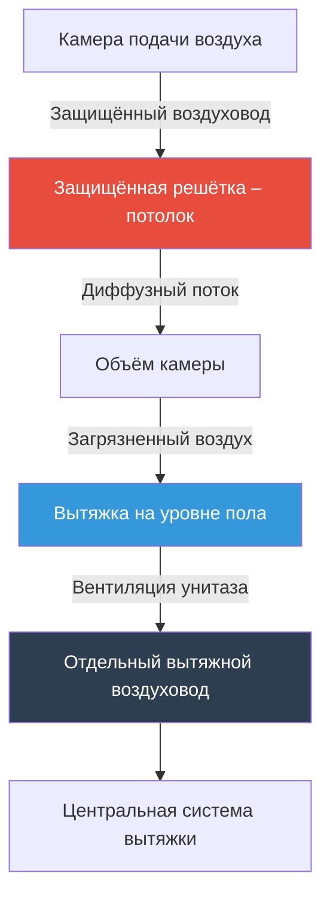
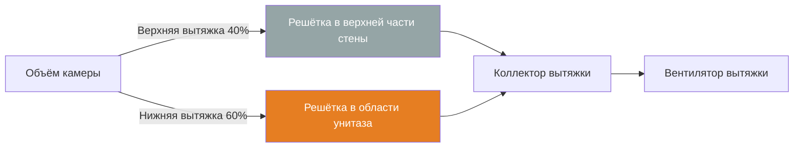
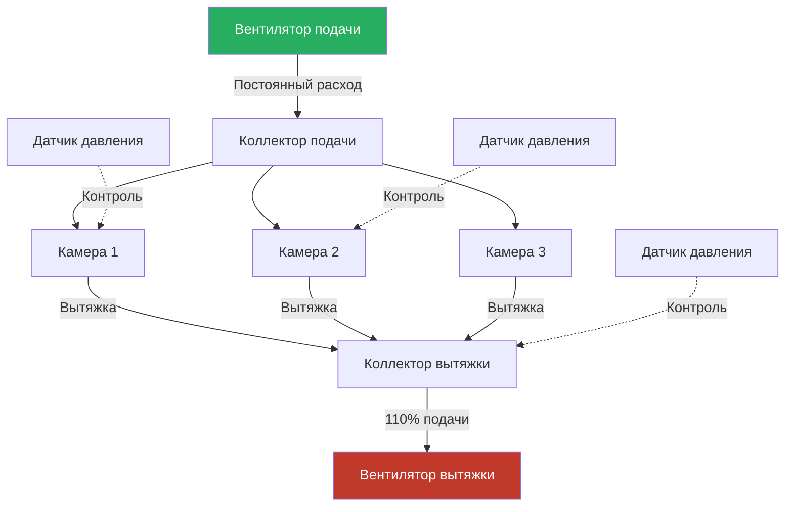

## Общие сведения

Камеры содержания в учреждениях юстиции требуют специализированного проектирования HVAC для решения задач краткосрочного проживания, контроля запахов, обеспечения безопасности и физиологического комфорта. В отличие от помещений длительного содержания, камеры содержания характеризуются высокой сменяемостью, переменными нагрузками по занятости и должны поддерживать кратность воздухообмена, обеспечивающую быстрое разбавление загрязняющих веществ при одновременном предотвращении несанкционированного доступа или скрывания контрабанды.

Система вентиляции должна сбалансировать адекватную подачу свежего воздуха с требованиями безопасности, используя защищённые от манипуляций решётки и непрерывную работу для поддержания приемлемого качества воздуха в помещении при непредсказуемых условиях занятости.

## Требования к кратности воздухообмена

### Проектные кратности воздухообмена

Камеры содержания требуют более высокой кратности воздухообмена, чем типичные занятые помещения, в связи с наличием унитазов без перегородок приватности, возможностью нахождения нескольких человек в ограниченном пространстве и образованием запахов.

| Тип помещения | Минимум воз/ч | Рекомендуемо воз/ч | Основание |
|-----------|-------------|-----------------|-------|
| Одиночная камера содержания | 10 | 12–15 | Стандарты ACA |
| Камера многопиковой занятости | 12 | 15–18 | ASHRAE 62.1 |
| Камера с унитазом | 15 | 18–20 | Контроль запахов |
| Камера для интоксицированных | 15 | 20–25 | Риск загрязнения |

### Расчёт вентиляции

Требуемый расход воздуха для камеры содержания сочетает вентиляцию на основе занятости с требованиями по кратности воздухообмена:

$$Q_{total} = \max(Q_{occupancy}, Q_{ACH})$$

Где вентиляция на основе занятости:

$$Q_{occupancy} = N \cdot (R_p + A_{cell} / N \cdot R_a)$$

- $Q_{total}$ = Требуемый общий расход воздуха (CFM)
- $N$ = Проектная занятость (человек)
- $R_p$ = Наружный воздух на человека в зоне дыхания (15–20 CFM)
- $A_{cell}$ = Площадь пола камеры (м²)
- $R_a$ = Наружный воздух на единицу площади (0.12 CFM/м²)

Метод кратности воздухообмена:

$$Q_{ACH} = \frac{V_{cell} \cdot ACH}{60}$$

- $V_{cell}$ = Объём камеры (м³)
- $ACH$ = Кратность воздухообмена (10–20)

При проектировании системы используется большее из двух значений.

## Система распределения воздушного потока

### Конфигурация подачи воздуха

Воздух должен поступать в камеру через защищённые решётки, предотвращающие изготовление оружия, скрывание контрабанды или причинение вреда. Место подачи влияет на тепловой комфорт и эффективность контроля запахов.

### Стратегия вытяжки воздуха

Вытяжные решётки должны располагаться вблизи унитаза для захвата запахов у источника. Двухточечная система вытяжки обеспечивает превосходные результаты:

Эта конфигурация создаёт вертикальный воздушный поток, очищающий зону дыхания, при одновременной концентрированной вытяжке в источнике загрязнения.

## Требования к защищённым решёткам

### Технические характеристики решёток

| Характеристика | Требование | Назначение |
|---------|-------------|---------|
| Материал | Сталь толщиной 2,0–2,5 мм | Стойкость к манипуляциям |
| Расстояние между прутками | Максимум 3,8 см | Предотвращение скрывания |
| Крепление | Приварной каркас, защищённые болты | Защита от снятия |
| Свободная площадь | 60–75% | Минимизация перепада давления |
| Покрытие | Порошковое или нержавеющая сталь | Стойкость к коррозии |
| Обработка кромок | Закруглённые, обезбарвленные | Безопасность |

### Рассмотрение перепада давления

Защищённые решётки вызывают более высокий перепад давления, чем стандартные диффузоры. Необходимо учитывать это при выборе вентилятора:

$$\Delta P_{grille} = \frac{\rho \cdot V^2}{2} \cdot K_{loss}$$

- $\Delta P_{grille}$ = Перепад давления (Па)
- $\rho$ = Плотность воздуха (1.2 кг/м³)
- $V$ = Скорость потока на выходе (м/с)
- $K_{loss}$ = Коэффициент потерь (1,2–2,5 для защищённых решёток)

Типичные скорости потока 2,0–3,0 м/с через защищённые решётки приводят к перепаду давления 20–60 Па.

## Интеграция вентиляции унитаза

### Требуемые расходы вентиляции

Каждый унитаз в камере содержания требует непрерывной вытяжки для контроля запахов и поддержания разреженного давления относительно соседних помещений.

$$Q_{toilet} = 24–35 \text{ м³/ч минимум}$$

Эта вытяжка должна составлять 50–70% от общей вытяжки из камеры для создания направленного воздушного потока к устройству. Оставшаяся вытяжка поступает из верхних решёток для обеспечения полного смешивания воздуха.

### Эффективность контроля запахов

Эффективное разбавление запахов требует достаточной скорости захвата вытяжки:

$$V_{capture} = \frac{Q_{toilet}}{A_{fixture}}$$

- $V_{capture}$ = Скорость захвата (м/с)
- $A_{fixture}$ = Площадь устройства (м²)

Целевые скорости захвата 0,5–0,75 м/с в плоскости устройства обеспечивают содержание запахов до их распространения в объём камеры.

## Балансировка воздуха и контроль давления

### Балансировка отдельной камеры

Каждая камера работает под разреженным давлением для предотвращения миграции запахов в коридоры и помещения управления:

$$\Delta P_{cell} = -5 \text{ до } -12 \text{ Па}$$

Расход подаваемого воздуха должен быть на 5–10% меньше, чем расход вытяжки для поддержания этого дифференциала:

$$Q_{supply} = 0.90 \text{ до } 0.95 \cdot Q_{exhaust}$$

### Конфигурация системы

## Требования непрерывной работы

Системы вентиляции камер содержания должны работать непрерывно, 24/7/365, в связи с непредсказуемой занятостью. Это отличается от типичной коммерческой вентиляции с расписанием занятости/незанятости.

**Последствия для проектирования:**
- Отсутствие циклов экономайзера в период незанятости
- Постоянный поток вытяжки поддерживает баланс давления в здании
- Выбор вентиляторов и фильтров для расширенной работы
- Системы рекуперации энергии для компенсации постоянных нагрузок наружного воздуха
- Резервные системы вентиляторов для обслуживания без остановки

## Стандарты и соответствие нормам

**Требования ASHRAE 62.1:**
- Минимум 15 CFM/человека наружного воздуха в зоне дыхания
- Рассмотрение коэффициента эффективности вентиляции
- Вытяжной воздух из туалетных помещений не рециркулируется

**Стандарты ACA для учреждений содержания взрослых:**
- 10–15 воз/ч минимум для камер содержания
- Индивидуальное управление температурой где возможно
- Адекватная вентиляция для контроля запахов
- Введение свежего воздуха

**IMC раздел 403:**
- Механическая вентиляция требуется для камер без окон
- Вытяжка прямо на улицу
- Отсутствие рециркуляции из туалетных помещений

## Пусконаладка и проверка

**Критические точки тестирования:**
- Проверка кратности воздухообмена в каждой камере с использованием газа-трассера или измерения воздушного потока
- Подтверждение разреженного давления относительно коридоров
- Измерение расходов подачи/вытяжки на каждой решётке
- Документирование перепада давления через защищённые решётки
- Тестирование воздушного потока с использованием визуализации дыма
- Проверка непрерывной работы при всех условиях

Системы вентиляции камер содержания защищают как здоровье занимающихся, так и функционирование объекта благодаря надёжному проектированию, выбору компонентов с учётом требований безопасности и непрерывной проверке производительности.

---

**Файл:** `/Users/evgenygantman/Documents/github/gantmane/hvac/content/specialty-applications-testing/specialty-hvac-applications/justice-facilities/ventilation-security-areas/holding-cells/_index.md`
