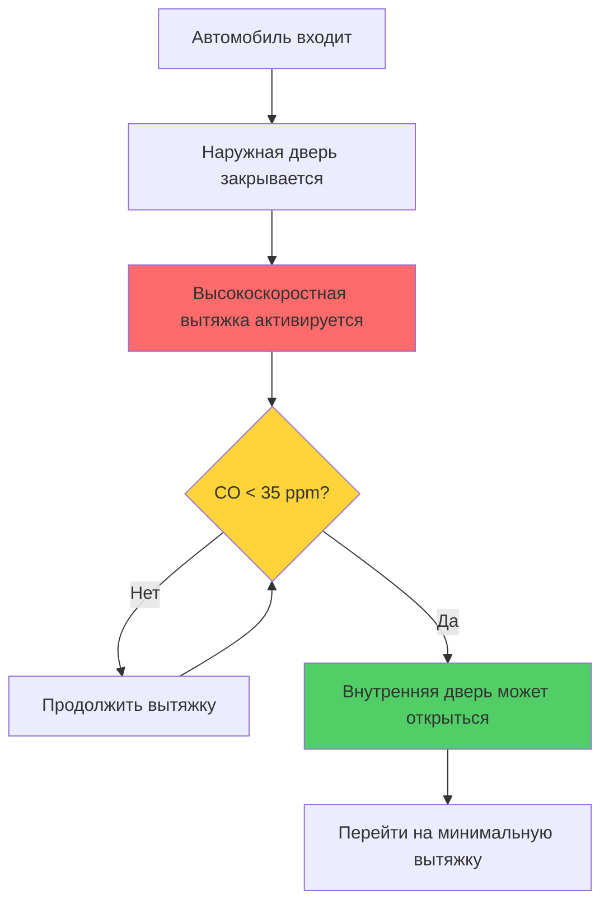
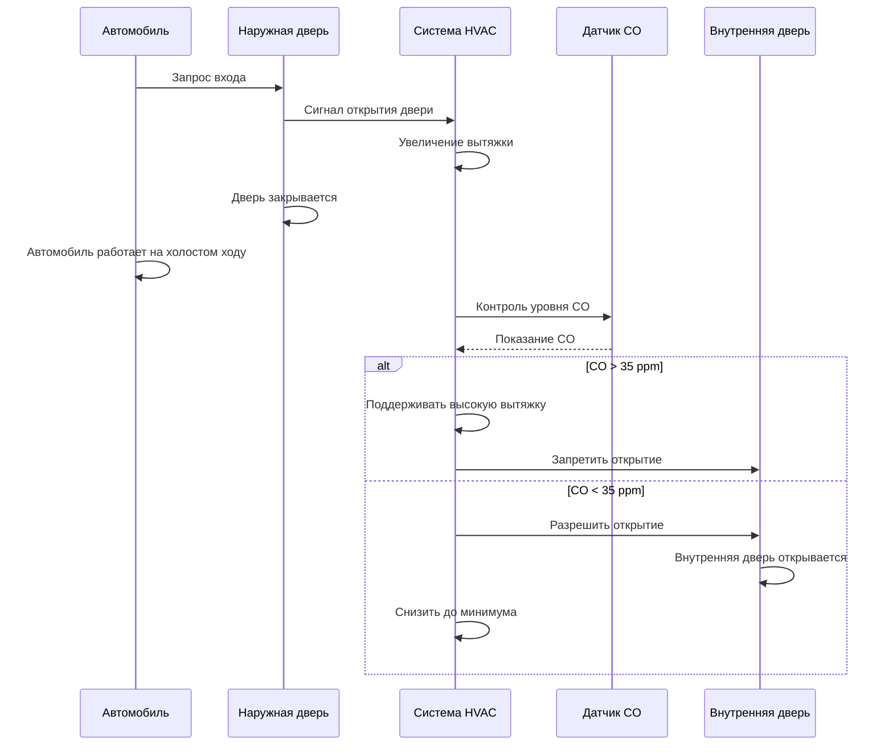

## Системы HVAC переходных шлюзов

Переходные шлюзы служат защищенными переходными зонами в исправительных учреждениях, через которые проходят автомобили и люди через блокирующиеся двери. Проектирование HVAC для этих пространств решает задачи удаления выхлопных газов транспортных средств, контроля давления для локализации загрязнения и интеграции с протоколами безопасности.

## Требования по контролю давления

Переходные шлюзы должны поддерживать отрицательное давление относительно прилегающих защищенных зон для предотвращения миграции загрязнений при работе двери. Разность давлений зависит от статуса блокировки двери и режима работы.

### Уравнения соотношения давлений

Требуемая разность давления на границе переходного шлюза следует:

$$\Delta P = \frac{\rho v^2}{2} + \rho g h + \Delta P_{friction}$$

Где:
- $\Delta P$ = общая разность давления (Па)
- $\rho$ = плотность воздуха (кг/м³)
- $v$ = скорость воздуха через отверстия (м/с)
- $g$ = ускорение свободного падения (9,81 м/с²)
- $h$ = разность высот (м)
- $\Delta P_{friction}$ = потери трения (Па)

Для локализации при одностороннем нарушении герметичности минимальная разность давления составляет:

$$\Delta P_{min} = -12,5 \text{ Па}$$

### Расход воздуха для контроля давления

Расход вытяжного воздуха, необходимый для поддержания разности давлений:

$$Q_{exhaust} = \frac{A \cdot v}{\eta} + Q_{infiltration}$$

Где:
- $Q_{exhaust}$ = общий расход вытяжного воздуха (м³/с)
- $A$ = площадь отверстия двери (м²)
- $v$ = целевая скорость на границе (0,5–1,0 м/с)
- $\eta$ = коэффициент эффективности системы (0,7–0,85)
- $Q_{infiltration}$ = инфильтрация через щели в конструкции (м³/с)

## Соотношения давлений по режимам работы

| Статус переходного шлюза | Давление относительно защищенной зоны | Давление относительно наружного воздуха | Диапазон воздухообменов | Расход вытяжки |
|---------------------------|--------------------------------------|----------------------------------------|------------------------|----------------|
| Обе двери закрыты | -12,5–15 Па | -5–10 Па | 6–8 | Минимальный |
| Внутренняя дверь открыта | -15–25 Па | -20–30 Па | 15–20 | Максимальный |
| Наружная дверь открыта | -25–35 Па | 0–5 Па | 20–30 | Максимальный |
| Автомобиль работает на холостом ходу | -30–50 Па | -10–15 Па | 30–40 | Высокоскоростная вытяжка |

## Удаление выхлопных газов автомобилей

Переходные шлюзы для автомобилей требуют выделенных систем вытяжки для захвата продуктов сгорания до их попадания в занятые помещения.

### Проектирование системы вытяжки

### Эффективность захвата выхлопных газов

Требуемый расход вытяжки для контроля выбросов автомобилей:

$$Q_{vehicle} = \frac{E_{CO} \cdot f_{duty}}{\left(C_{limit} - C_{ambient}\right) \cdot \rho_{air}}$$

Где:
- $Q_{vehicle}$ = расход вентиляции выхлопных газов автомобиля (м³/с)
- $E_{CO}$ = скорость выброса CO от работающего на холостом ходу автомобиля (г/с)
- $f_{duty}$ = коэффициент коэффициента загрузки (1,0–1,5)
- $C_{limit}$ = максимально допустимая концентрация CO (35 ppm)
- $C_{ambient}$ = фоновая концентрация CO (< 5 ppm)
- $\rho_{air}$ = плотность воздуха (1,2 кг/м³)

Типичные расходы вытяжки для стандартных переходных шлюзов:

- Легкие автомобили: 15–25 воздухообменов в час минимум, 30–40 воздухообменов в час при работе на холостом ходу
- Тяжелые автомобили/автобусы: 25–35 воздухообменов в час минимум, 40–60 воздухообменов в час при работе на холостом ходу

## Требования по количеству воздухообменов

Руководящие принципы проектирования исправительных учреждений определяют минимальные скорости вентиляции:

| Тип переходного шлюза | Минимальные воздухообмены | Воздухообмены при занятости | Воздухообмены при очистке автомобиля |
|----------------------|--------------------------|----------------------------|--------------------------------------|
| Только пешеходы | 6 | 12–15 | Н/П |
| Легкие автомобили | 8 | 20–30 | 30–40 |
| Тяжелые автомобили | 10 | 25–35 | 40–60 |
| Служебные автомобили | 12 | 30–40 | 50–75 |

## Управление интегрированной вентиляцией

Системы HVAC интегрируются с органами управления безопасностью двери через системы управления зданием (BMS) для модуляции вытяжки в зависимости от положения двери.

## Компоненты системы

### Размеры вытяжного вентилятора

Вытяжные вентиляторы для переходных шлюзов требуют:

1. **Модуляция производительности**: Переменные частотные приводы (ПЧП) для регулировки расхода воздуха в зависимости от режима работы
2. **Резервирование**: Конфигурация N+1 для критических приложений безопасности
3. **Контроль давления**: Датчики дифференциального давления на границах
4. **Обнаружение CO**: Электрохимические датчики с диапазоном 0–200 ppm

### Обеспечение приточного воздуха

Приточный воздух поступает через:
- Выделенные приточные установки с фильтрацией
- Переходные решетки из прилегающих кондиционируемых пространств (только для пешеходных переходов)
- Пассивные решетки с моторизованными заслонками (для переходов с автомобилями)

Количество приточного воздуха должно соответствовать вытяжке для поддержания целевого давления:

$$Q_{makeup} = Q_{exhaust} - Q_{target\_leakage}$$

Где $Q_{target\_leakage}$ создает требуемую разность отрицательного давления.

## Соответствие нормам исправительных учреждений

Проектирование HVAC для переходных шлюзов должно соответствовать:

- **Стандарты ACA для учреждений исправления взрослых**: Минимум 6 воздухообменов в переходных шлюзах, требуется контроль CO для зон с автомобилями
- **Стандарт ASHRAE 62.1**: Скорости вентиляции для зон с автомобилями (1,80 м³/(с·м²) по умолчанию или на основе загрязнения)
- **Международный кодекс по механическим системам (IMC)**: Раздел 403 касается вентиляции крытых парковок, применимой к переходным шлюзам с автомобилями
- **NFPA 88A**: Стандарт для паркингов (скорости вытяжки, обнаружение CO)

## Рекомендации по проектированию

Критические факторы для HVAC переходного шлюза:

1. **Интегрированная работа**: Система HVAC должна реагировать на датчики положения двери в течение 5 секунд
2. **Режим отказ-безопасно**: При потере управляющего сигнала переход на максимальную вытяжку
3. **Звукоизоляция**: Системы вытяжки производят шум, который может нарушить безопасную коммуникацию (целевой показатель NC-40)
4. **Температурный контроль**: Отопление требуется в холодном климате для предотвращения замерзания конденсата вытяжки
5. **Фильтрация**: MERV 8 минимум на приточном воздухе для предотвращения попадания пыли

## Проверка контроля давления

Комиссионирование систем переходных шлюзов путем измерения:

- Разность давления при закрытых дверях: минимум -12,5 Па
- Время восстановления давления после открытия двери: < 60 секунд
- Время очистки CO после работы автомобиля на холостом ходу: < 5 минут для достижения < 35 ppm
- Проверка расхода воздуха во всех режимах работы

Непрерывный контроль через BMS обеспечивает поддержание соотношений давлений в допустимых пределах при всех режимах работы объекта.
