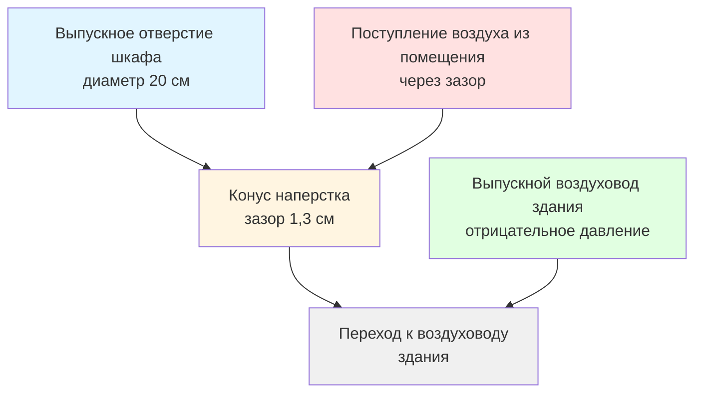
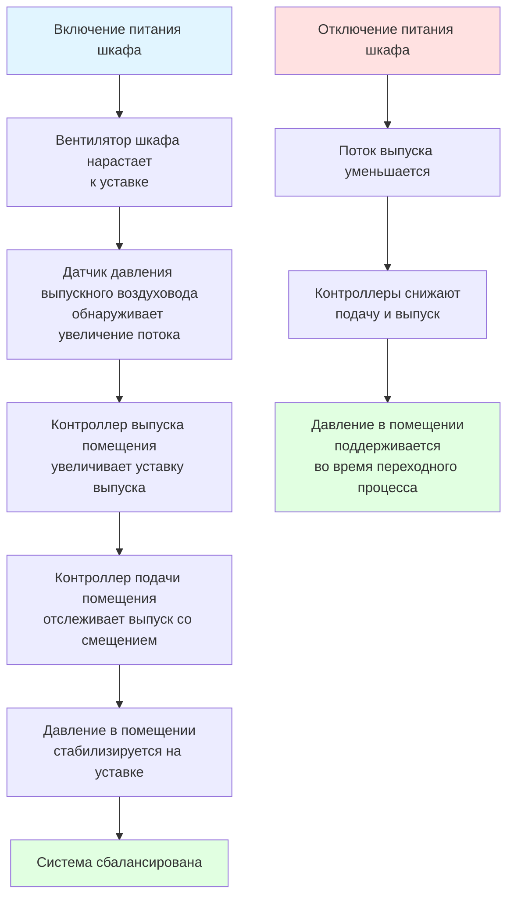

# Подключение выпуска воздуха из шкафов биобезопасности

Подключения выпуска воздуха из шкафов биобезопасности (BSC) представляют собой критический интерфейс между оборудованием для обеспечения безопасности и системами вентиляции здания. Метод подключения непосредственно влияет на производительность кабины, взаимосвязь давления в помещении и потребление энергии объектом. Шкафы типа A рециркулируют воздух через встроенные HEPA-фильтры с опциональным подключением к дефлектору, тогда как шкафы типа B требуют жесткодуктированных систем выпуска с выделенными вентиляторами. NSF/ANSI 49 устанавливает строгие протоколы испытаний для проверки производительности изоляции при различных конфигурациях подключения выпуска, обеспечивая защиту персонала, защиту продукта и защиту окружающей среды во время микробиологических работ.

## Требования к выпуску воздуха из шкафов типов A и B

Классификация шкафа биобезопасности определяет методологию подключения выпуска на основе режимов воздушного потока, подхода к фильтрации и целей обеспечения безопасности.

### Характеристики шкафа типа A

Шкафы типа A (класс II, типы A1 и A2) работают как системы частичной рециркуляции, при которых 70% воздушного потока рециркулирует внутри шкафа после HEPA-фильтрации, тогда как 30% выпускается через встроенный вентилятор и HEPA-фильтр.

**Спецификации типа A1:**
- Положительное давление в загрязненном плене
- Однопроходная HEPA-фильтрация выпускаемого воздуха
- Минимальная скорость входа: 23 м/с на открытии лицевой части
- Рециркуляция: 70% через фильтр подачи HEPA
- Выпуск: 30% через выходной фильтр HEPA
- Подключение: Выпуск в помещение или подключение к дефлектору

**Спецификации типа A2:**
- Отрицательное давление в загрязненном плене
- Двухпроходная HEPA-фильтрация (подача и выпуск)
- Минимальная скорость входа: 30 м/с на открытии лицевой части
- Рециркуляция: 70% объема нисходящего потока
- Выпуск: 30% объема нисходящего потока
- Подключение: Выпуск в помещение или подключение типа «наперсток»

**Физика рециркуляции:**
Скорость нисходящего потока $V_d$ в рабочей зоне является результатом комбинированного рециркулированного и свежего подаваемого воздуха:

$$V_d = \frac{Q_{recir} + Q_{inflow}}{A_{work}}$$

Где:
- $V_d$ = Скорость нисходящего потока (номинально 21 м/мин)
- $Q_{recir}$ = Рециркулируемый воздушный поток после HEPA-фильтрации (м³/ч)
- $Q_{inflow}$ = Входящий поток на открытии лицевой части (м³/ч)
- $A_{work}$ = Площадь поперечного сечения рабочей зоны (м²)

**Энергетические последствия:**
Шкафы типа A минимизируют нагрузки на отопление и охлаждение объекта путем рециркуляции кондиционированного воздуха. Шкаф типа A2 размером 1,8 м выпускает приблизительно 108 м³/ч в помещение или систему выпуска здания, снижая требования к приточному воздуху на 70% по сравнению с конфигурациями со 100% выпуском.

### Характеристики шкафа типа B

Шкафы типа B (класс II, типы B1 и B2) обеспечивают повышенную защиту благодаря большей скорости входа и подключению к выделенным жесткодуктированным системам выпуска.

**Спецификации типа B1:**
- Отрицательное давление в загрязненном плене
- Минимальная скорость входа: 30 м/с
- Рециркуляция: 30% через фильтр подачи HEPA (только незагрязненные области)
- Жесткодуктированный выпуск: 70% от общего воздушного потока
- Биологически загрязненный воздух: 100% выпускается через выделенный воздуховод
- Фильтрация выпуска: Фильтр HEPA перед выпуском

**Спецификации типа B2 (полный выпуск):**
- Отрицательное давление в загрязненном плене
- Минимальная скорость входа: 30 м/с
- Без рециркуляции: 100% выпуск воздуха нисходящего потока
- Требуется жесткодуктированное подключение для всего воздушного потока
- Двойная HEPA-фильтрация: фильтры подачи и выпуска
- Типичный объем выпуска: 360-575 м³/ч (кабина размером 1,8 м)

**Соотношения давлений:**
Шкафы типа B создают значительное отрицательное давление в загрязненных пленах, обычно -25 до -50 Па относительно помещения. Это отрицательное давление обеспечивает входящий воздушный поток на всех отверстиях, предотвращая выход загрязнений во время загрузки фильтра HEPA или при небольших нарушениях целостности.

**Таблица сравнения:**

| Параметр | Тип A1 | Тип A2 | Тип B1 | Тип B2 |
|----------|--------|--------|--------|--------|
| Минимальная скорость входа | 23 м/с | 30 м/с | 30 м/с | 30 м/с |
| Процент рециркуляции | 70% | 70% | 30% | 0% |
| Подключение выпуска | Опционально | Опционально | Требуется | Требуется |
| Давление в загрязненном плене | Положительное | Отрицательное | Отрицательное | Отрицательное |
| Работа с летучими химикатами | Нет | Ограниченно | Да | Да |
| Нагрузка на выпуск объекта (кабина 1,8 м) | 108 м³/ч | 108 м³/ч | 252 м³/ч | 360 м³/ч |
| Энергетическое воздействие | Минимальное | Минимальное | Умеренное | Высокое |

## Конструкция соединения типа «наперсток»

Соединения типа «наперсток» обеспечивают подключение выпуска для шкафов типов A2 и B без создания противодавления, которое нарушает производительность шкафа.

### Принципы соединения типа «наперсток»

Соединение типа «наперсток» использует плотно прилегающий воротник или конус, который захватывает выпуск шкафа без создания герметичного соединения. Зазор между выпускным отверстием шкафа и входом «наперстка» (обычно 0,6–2,5 см) позволяет выравнивать давление при сохранении захвата воздушного потока.

**Уравнение баланса давления:**
Площадь зазора «наперстка» $A_g$ должна быть достаточной для предотвращения противодавления на вентилятор шкафа:

$$A_g = \frac{Q_{cabinet}}{\rho \sqrt{\frac{2 \Delta P_{max}}{\rho}}}$$

Где:
- $A_g$ = Площадь зазора вокруг «наперстка» (см²)
- $Q_{cabinet}$ = Объем выпуска шкафа (м³/ч)
- $\Delta P_{max}$ = Максимально допустимое противодавление (обычно 12 Па)
- $\rho$ = Плотность воздуха (1,2 кг/м³)

Для типичного шкафа типа A2, выпускающего 108 м³/ч с пределом противодавления 12 Па:

$$A_g = \frac{108 / 3.6}{\sqrt{\frac{2 \times 12}{1.2}}} \approx 103 \text{ см}^2$$

Это соответствует зазору в 1,3 см по кольцу вокруг выпускного отверстия диаметром 20 см.

**Геометрия «наперстка»:**

**Критические параметры конструкции:**
- Ширина зазора: 0,6–2,5 см (большие зазоры снижают противодавление, но увеличивают поступление воздуха из помещения)
- Материал «наперстка»: Нержавеющая сталь или жесткий ПВХ
- Угол переходного конуса: Максимум 30° расширение к воздуховоду здания
- Уплотнение: Отсутствует—зазор преднамеренно оставляется открытым
- Вертикальная ориентация: Предпочтительна для минимизации накопления конденсата

### Эффекты поступления воздуха из помещения

Открытый зазор в соединениях типа «наперсток» вызывает поступление воздуха из помещения, увеличивая общий объем выпуска сверх выпуска шкафа:

$$Q_{total} = Q_{cabinet} + Q_{entrain}$$

Где объем поступления зависит от отрицательного давления в выпускной системе здания и геометрии зазора:

$$Q_{entrain} = C_d A_g \sqrt{\frac{2 \Delta P_{duct}}{\rho}}$$

Где:
- $C_d$ = Коэффициент расхода (обычно 0,60–0,65)
- $\Delta P_{duct}$ = Отрицательное давление в выпускном воздуховоде здания (Па)

**Пример расчета:**
Для шкафа 108 м³/ч с площадью зазора 103 см² и давлением воздуховода -25 Па:

$$Q_{entrain} = 0,62 \times 103 \times \sqrt{\frac{2 \times 25}{1,2}} = 0,62 \times 103 \times 6,45 \approx 410 \text{ м}^3\text{/ч}$$

Общий выпуск: 108 + 41 = 149 м³/ч

**Последствия для проектирования:**
- Расчеты давления в помещении должны учитывать поступление воздуха
- Чрезмерное поступление воздуха снижает энергетические преимущества шкафов типа A
- Переменное давление в выпускной системе здания создает колебания поступления воздуха
- Выделенные ветви выпуска с постоянным объемом минимизируют колебания поступления воздуха

## Жесткодуктированные системы выпуска

Шкафы типа B требуют герметичных жесткодуктированных подключений с выделенными системами выпуска, работающими при отрицательном давлении относительно плена выпуска шкафа.

### Методы подключения

**Прямое фланцевое соединение:**
Выпускное отверстие шкафа подключается к воздуховоду здания через герметичное фланцевое соединение:
- Материал: Нержавеющая сталь или совместимый с дезинсекционными агентами
- Прокладка: Неопрен или силикон, толщина 0,3 см
- Скорость утечки: < 1% при испытании под давлением -50 Па
- Переходный элемент: Концентрический редуктор от выпускного отверстия шкафа к воздуховоду

**Гибкое соединение:**
Короткий гибкий участок между шкафом и жестким воздуховодом обеспечивает движение во время дезинсекции и замены фильтров:
- Длина: Максимум 60–90 см
- Материал: Гофрированная нержавеющая сталь или ткань с ПВХ покрытием
- Опора: Подвешена независимо—не поддерживается шкафом
- Уклон: Минимум 0,25 см/30 см в сторону шкафа (отвод конденсата)

### Требования вентилятора выпуска

Системы выпуска шкафа типа B требуют выделенных вентиляторов, обеспечивающих надежное отрицательное давление при всех условиях эксплуатации.

**Выбор вентилятора:**
Общий объем выпуска включает выпуск шкафа плюс утечка воздуховода:

$$Q_{fan} = Q_{cabinet} \times (1 + L_{duct})$$

Где:
- $L_{duct}$ = Коэффициент утечки воздуховода (обычно 0,05–0,10 для сварной конструкции)

**Расчет статического давления:**
Вентилятор должен преодолеть сопротивление шкафа плюс потери в системе воздуховода:

$$SP_{fan} = \Delta P_{cabinet} + \Delta P_{duct} + \Delta P_{discharge}$$

Типичные значения:
- $\Delta P_{cabinet}$ = 25–50 Па (внутреннее сопротивление шкафа)
- $\Delta P_{duct}$ = 50–100 Па (трение воздуховода и фитинги)
- $\Delta P_{discharge}$ = 25–50 Па (напорная скорость выпуска)

Итого: 100–200 Па для типичных установок

**Выбор типа вентилятора:**

| Тип вентилятора | Преимущества | Недостатки | Применение |
|-----------------|-------------|-----------|-----------|
| Центробежный с обратно загнутыми лопатками | Эффективность, нет перегрузки | Больший физический размер | Центральные системы коллекторов |
| Встроенный центробежный | Компактность, монтаж в воздуховод | Более низкая эффективность | Выпуск отдельного шкафа |
| Прямой привод плены | Максимальная эффективность, низкое обслуживание | Более высокие начальные затраты | Новое строительство |
| Переменная скорость | Энергосбережение, управление давлением | Сложное управление | VAV лабораторные системы |

**Расположение вентилятора:**
- На крыше: Минимизирует загрязненный воздуховод в здании
- Удаленное машинное помещение: Более легкий доступ для обслуживания
- Вентилятор выше фильтра HEPA: Защищает вентилятор от биологического загрязнения (требует герметичного воздуховода)
- Вентилятор ниже фильтра HEPA: Загрязненное колесо вентилятора требует процедур дезинсекции

## Требования баланса воздушного потока

Надлежащий баланс воздушного потока обеспечивает производительность защиты шкафа, соотношение давления в здании и стабильность системы.

### Внутренний баланс шкафа

Производители шкафов разрабатывают соотношения внутреннего воздушного потока для сертификации NSF/ANSI 49. Полевые модификации подключений выпуска должны сохранять эти соотношения.

**Критические точки баланса:**
1. Скорость входа на открытии лицевой части: 30 м/с ±10%
2. Скорость нисходящего потока в рабочей зоне: 20–23 м/мин
3. Скорость потока на фильтре подачи HEPA: 30–45 м/мин
4. Скорость потока на выходном фильтре HEPA: 30–45 м/мин (тип B2)
5. Дифференциал давления: Отрицательный в загрязненном плене

**Проверка баланса:**
После установки или модификации системы выпуска полевая сертификация должна проверить:
- Равномерность скорости входа (< 20% вариации по сетке)
- Равномерность скорости нисходящего потока (< 20% вариации)
- Соотношения объемов входа/нисходящего потока/выпуска согласно данным производителя

**Математическое соотношение (тип B2):**

$$Q_{downflow} = Q_{inflow} + Q_{supply}$$

$$Q_{exhaust} = Q_{downflow}$$

Для шкафа типа B2 размером 1,8 м:
- Площадь рабочей зоны: $A = 1,8 \text{ м} \times 0,6 \text{ м} = 1,08 \text{ м}^2$
- Скорость нисходящего потока: 21 м/мин
- Объем нисходящего потока: $Q_d = 21 \times 1.08 / 60 = 0.378$ м³/с ≈ 360 м³/ч
- Открытие лицевой части: $0,25 \text{ м} \times 1,8 \text{ м} = 0,45 \text{ м}^2$
- Скорость входа: 30 м/с
- Объем входа: $Q_i = 30 \times 0,45 = 13,5$ м³/с ≈ 240 м³/ч
- Объем подачи: $Q_s = 360 - 240 = 120$ м³/ч (через фильтр подачи HEPA)
- Объем выпуска: 360 м³/ч

### Согласование давления в помещении

Выпуск из шкафа влияет на баланс давления в лабораторном помещении. Стратегия отслеживания подаваемого воздуха зависит от типа шкафа и способа подключения выпуска.

**Шкафы типа A (выпуск в помещение):**
Без влияния на выпуск из помещения—шкаф рециркулирует воздух в помещении. Баланс подачи и выпуска помещения не изменяется.

**Шкафы типа A (соединение типа «наперсток»):**
Общий выпуск из помещения увеличивается на выпуск шкафа плюс поступление воздуха:

$$Q_{room,exhaust} = Q_{base} + Q_{cabinet} + Q_{entrain}$$

Подача в помещение должна увеличиться пропорционально при сохранении смещения для отрицательного давления:

$$Q_{room,supply} = Q_{room,exhaust} - Q_{offset}$$

Где $Q_{offset}$ = 70–140 м³/ч для типичного лабораторного отрицательного давления.

**Шкафы типа B:**
Жесткодуктированный выпуск удаляет воздух из помещения, требуя эквивалентного приточного воздуха:

$$Q_{room,supply} = Q_{base} + Q_{cabinet} - Q_{offset}$$

**Последовательность управления для переменного объема:**

## Испытания сертификации NSF/ANSI 49

Стандарт NSF/ANSI 49 устанавливает комплексные протоколы испытаний для сертификации шкафов биобезопасности, включая проверку производительности подключения выпуска.

### Испытания первичной защиты

**Испытание защиты персонала (входящий воздушный поток):**
Проверяет скорость входа на открытии лицевой части предотвращает выход загрязнений. Биологическое испытание использует споры *Bacillus atrophaeus* или вызов йодида калия (KI):
- Внутренний вызов: Распыление 10⁸ спор внутри шкафа
- Внешний отбор: Сбор образцов воздуха на открытии лицевой части
- Критерии прохождения: < 5 КОЕ на любой чашке, нет положительных результатов на 8 из 10 чашек

**Испытание защиты продукта (нисходящий поток):**
Проверяет, что нисходящий поток защищает рабочие материалы от загрязнения воздухом из помещения:
- Внешний вызов: Воздух в помещении содержит споры *Bacillus atrophaeus*
- Внутренний отбор: Седиментационные чашки в рабочей зоне
- Критерии прохождения: < 5 КОЕ на любой чашке

**Испытание перекрестного загрязнения:**
Проверяет, что режимы внутреннего воздушного потока предотвращают загрязнение между рабочими площадями:
- Вызов: Одновременное формирование спор в двух местах
- Отбор: Седиментационные чашки в нескольких позициях рабочей зоны
- Критерии прохождения: < 5 КОЕ на любой чашке в незагрязненных областях

### Испытания подключения выпуска

**Испытание на толерантность к противодавлению:**
Проверяет, что шкаф поддерживает защиту при переменных условиях выпускной системы здания.
- Условия испытания: Изменение статического давления в выпускной системе здания ±50 Па
- Критерии производительности: Скорость входа остается в пределах ±10% уставки
- Направление входа: Проверяется входящее направление при всех давлениях выпуска

**Испытание на утечку соединения типа «наперсток» (тип A):**
Количественная оценка поступления воздуха из помещения при рабочих условиях:
- Метод: Инъекция газа-индикатора в поток выпуска шкафа
- Измерение: Концентрация индикатора выше и ниже по потоку от «наперстка»
- Расчет: Скорость поступления из соотношения разбавления

**Испытание на утечку жесткодуктированного соединения (тип B):**
Проверяет целостность герметичного соединения:
- Метод: Давление воздуховода до -50 Па
- Измерение: Поток, требуемый для поддержания давления
- Критерии прохождения: Скорость утечки < 1% объема выпуска шкафа

### Испытания сигнализации воздушного потока

Шкафы должны обеспечивать автоматические сигналы тревоги при нарушении воздушного потока:

| Состояние тревоги | Порог срабатывания | Время отклика | Тип |
|-------------------|-------------------|---------------|-----|
| Низкий входящий поток | < 24 м/с среднее | < 5 секунд | Звуковой + визуальный |
| Высокая скорость входа | > 36 м/с среднее | < 5 секунд | Звуковой + визуальный |
| Отказ нисходящего потока | < 18 м/мин среднее | < 5 секунд | Звуковой + визуальный |
| Нарушение высоты окна | Открытие выше 25 см | Немедленно | Звуковой + визуальный |

**Ежегодная полевая сертификация:**
NSF/ANSI 49 требует полевых испытаний производительности ежегодно, после замены фильтра HEPA, после переезда или следующего модификации выпускной системы:
- Съемка скорости входа (минимум 30-точечная сетка)
- Испытание режима дыма воздушного потока (качественная проверка защиты)
- Испытание на утечку фильтра HEPA (вызов DOP или PAO)
- Проверка функции сигнализации
- Измерение равномерности скорости нисходящего потока

Подключения выпуска из шкафов биобезопасности требуют инженерной точности для сохранения сертифицированной производительности защиты при интеграции с системами HVAC здания. Понимание фундаментальных различий между конфигурациями типов A и B, надлежащее применение соединений типа «наперсток» в сравнении с жесткодуктированными соединениями и строгое соблюдение протоколов испытаний NSF/ANSI 49 обеспечивает безопасность персонала, защиту продукта и соответствие нормативным требованиям в объектах биологических исследований.
