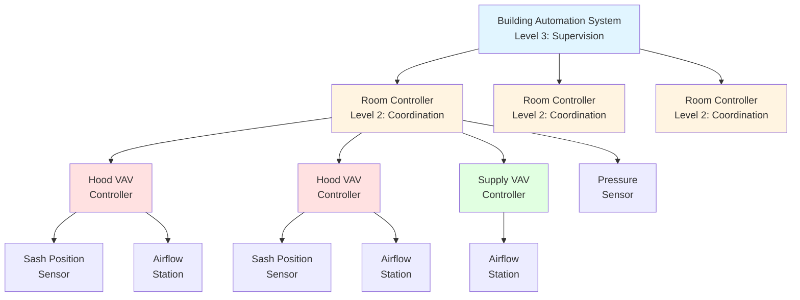
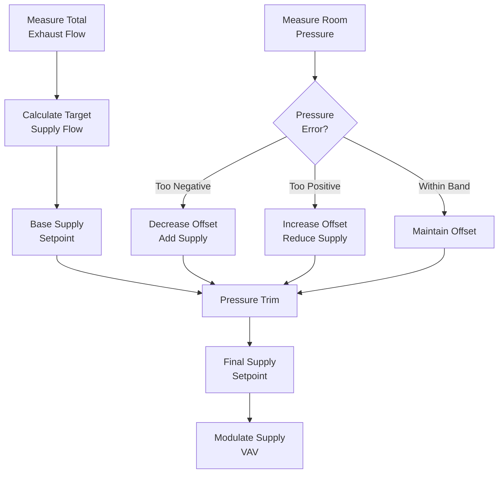

# Системы управления HVAC лабораторий

Системы управления HVAC лабораторий поддерживают критические параметры безопасности посредством согласованного регулирования скорости потока воздуха в вытяжном шкафу, статического давления в помещении и баланса приточно-вытяжного воздуха. Эти системы должны быстро реагировать на возмущения — изменения положения дверцы, открытие дверей, цикличность оборудования — при этом поддерживая стабильные соотношения давлений и предотвращая колебания между взаимодействующими контурами управления. Сложность архитектуры управления повышается при использовании переменного объема воздуха, требуя сложных алгоритмов отслеживания, которые координируют десятки устройств вытяжки с централизованными системами подачи свежего воздуха, обеспечивая при этом изоляцию на каждом шкафу. ASHRAE Applications Handbook Глава 16 и ANSI/AIHA Z9.5 устанавливают требования к производительности управления для безопасности вентиляции лабораторий.

## Архитектура управления

### Иерархическая структура управления

Системы HVAC лабораторий используют трёхуровневую иерархию управления для управления сложностью системы при обеспечении критических для безопасности реакций на надлежащей скорости.

**Уровень 1: Управление на уровне устройства (локальные контроллеры)**
- Контроллеры VAV вентилей вытяжного шкафа
- Контроллеры VAV терминалов приточного воздуха помещения
- Контроллеры отдельных устройств вытяжки
- Время отклика: 0,5–2 секунды
- Прямые аппаратные блокировки для безопасности

**Уровень 2: Координация на уровне помещения (контроллеры помещений)**
- Координация отслеживания приточно-вытяжного воздуха
- Поддержание давления в помещении
- Управление коэффициентом разнообразия
- Время отклика: 2–5 секунд
- Промежуточная логика безопасности

**Уровень 3: Контроль на уровне системы (система автоматизации здания)**
- Глобальное управление коэффициентом разнообразия
- Оптимизация энергопотребления
- Отслеживание тенденций и диагностика
- Время отклика: 10–60 секунд
- Только некритические функции

### Взаимодействие контуров управления

Лабораторные системы содержат несколько взаимодействующих контуров управления, требующих тщательной координации для предотвращения нестабильности.

**Основные контуры управления:**

1. **Контур скорости потока в шкафу:** Модулирует вытяжку шкафа для поддержания 0,508 м/с ± 10%
2. **Контур отслеживания приточного воздуха:** Регулирует приточный воздух в соответствии с изменениями вытяжки
3. **Контур давления в помещении:** Регулирует смещение приточно-вытяжного баланса для поддержания отрицательного давления
4. **Контур температуры приточного воздуха:** Поддерживает тепловой комфорт (независимый)

**Анализ взаимодействия:**

Изменение вытяжки → Возмущение давления в помещении → Реакция отслеживания приточного воздуха → Коррекция давления → Новое равновесие

**Требования стабильности:**

Каждый контур должен работать на разных временных шкалах для предотвращения взаимодействия:
- Отклик VAV вытяжки: 1–2 секунды
- Отклик отслеживания приточного воздуха: 2–5 секунд
- Отклик регулировки давления: 10–30 секунд
- Регулирование температуры: 60–300 секунд

**Соотношение передаточных функций:**

Реакция давления в помещении на изменение воздуха в шкафу следует динамике второго порядка:

$$\frac{\Delta P(s)}{Q_{heating}(s)} = \frac{K}{1 + \tau_1 s} \cdot \frac{1}{1 + \tau_2 s}$$

Где:
- $K$ = Коэффициент усиления давления (Па/(м³/ч)), обычно 0,4–0,8
- $\tau_1$ = Время отклика VAV вытяжки (1–2 секунды)
- $\tau_2$ = Время отклика отслеживания приточного воздуха (2–5 секунд)
- $s$ = Переменная Лапласа

## Управление VAV вытяжного шкафа

### Датчики положения дверцы

Точное измерение положения дверцы позволяет рассчитать требуемый объём вытяжного воздуха для поддержания постоянной скорости потока в шкафу.

**Технологии датчиков:**

| Технология | Принцип | Точность | Преимущества | Ограничения |
|------------|---------|----------|------------|------------|
| Инфракрасное отражение | Время полёта сигнала | ±0,64 см | Бесконтактный, надёжный | Требует чистого оптического пути |
| Ультразвуковой дальномер | Время прохождения звука | ±1,27 см | Невосприимчив к загрязнению | Чувствителен к температуре |
| Кабельное положение | Вращение потенциометра | ±0,32 см | Наивысшая точность | Механический износ, обрыв кабеля |
| Эффект Холла магнитный | Положение магнитного поля | ±0,64 см | Надёжность твёрдотельных приборов | Требует крепления магнита |

**Расчёт воздуховода из положения дверцы:**

$$Q_{required} = V_{face} \times W_{hood} \times H_{sash}$$

Где:
- $Q_{required}$ = Требуемый объём вытяжного воздуха (м³/ч)
- $V_{face}$ = Установка скорости потока в шкафу (0,508 м/с типовая)
- $W_{hood}$ = Ширина шкафа (м)
- $H_{sash}$ = Высота открытия дверцы (м)

**Пример для шкафа шириной 1,83 м:**

При полном открытии (71 см = 0,71 м):
$$Q = 0,508 \times 1,83 \times 0,71 = 0,661 \text{ м}^3\text{/с} = 2378 \text{ м}^3\text{/ч}$$

При половинном открытии (36 см = 0,36 м):
$$Q = 0,508 \times 1,83 \times 0,36 = 0,335 \text{ м}^3\text{/с} = 1206 \text{ м}^3\text{/ч}$$

При минимальном открытии (15 см = 0,15 м):
$$Q = 0,508 \times 1,83 \times 0,15 = 0,139 \text{ м}^3\text{/с} = 501 \text{ м}^3\text{/ч}$$

### Последовательность управления VAV вентилем

Контроллеры VAV вытяжного шкафа реализуют каскадное управление с обратной связью по измерению воздуховода для обеспечения точности скорости потока в шкафу несмотря на изменения статического давления в воздуховоде.

**Последовательность управления:**

1. Измерение положения дверцы: $H_{measured}$
2. Расчёт установки воздуховода: $Q_{setpoint} = 0,508 \times W \times H_{measured}$
3. Обеспечение минимального воздуховода: $Q_{setpoint} = \max(Q_{setpoint}, Q_{min})$
4. Измерение фактического воздуховода: $Q_{actual}$
5. Расчёт ошибки: $e = Q_{setpoint} - Q_{actual}$
6. Выход контроллера ПИ: $u = K_p e + K_i \int e \, dt$
7. Позиционирование привода VAV вентиля

**Настройка контроллера ПИ:**

Коэффициент пропорциональности:
$$K_p = \frac{\Delta u}{\Delta Q} = \frac{100\%}{Q_{max}} = \frac{1}{Q_{max}}$$

Постоянная времени интегрирования:
$$\tau_i = 3 \times \tau_{valve} = 3 \times 5 = 15 \text{ секунд типовые}$$

**Улучшение с опережением по сигналу:**

Передовые контроллеры добавляют управление с опережением из положения дверцы для улучшения времени отклика:

$$u = K_p e + K_i \int e \, dt + K_{ff} \times Q_{setpoint}$$

Где $K_{ff} = 0,7 - 0,9$ обеспечивает 70–90% требуемого положения вентиля сразу же, а обратная связь корректирует остаток.

### Измерение воздуховода

Точное измерение воздуховода в воздуховодах вытяжки шкафа позволяет замкнутому контуру управления работать несмотря на изменения статического давления в воздуховодах.

**Технологии измерения:**

| Метод | Принцип | Точность | Типовое применение |
|-------|---------|----------|---------------------|
| Массив пилотных трубок | Усреднение давления скорости | ±5–10% | Воздуховоды большого диаметра > 30 см |
| Тепловая дисперсия | Теплопередача в поток | ±5–8% | Малые воздуховоды 15–30 см |
| Труба Вентури/сопло | Падение давления в зависимости от потока | ±3–5% | Приложения высокой точности |
| Ультразвуковой транзитный метод | Распространение звуковой волны | ±2–3% | Измерение исследовательского класса |

**Преобразование давления скорости в воздуховод:**

Для измерения массива пилотных трубок:

$$Q = A_{duct} \times 118 \sqrt{\frac{\Delta P_v}{\rho}}$$

Где:
- $Q$ = Воздуховод (м³/с)
- $A_{duct}$ = Площадь воздуховода (м²)
- $\Delta P_v$ = Давление скорости (Па)
- $\rho$ = Плотность воздуха (кг/м³), 1,2 при стандартных условиях

**Упрощённая форма при стандартных условиях:**

$$Q = 98,3 \times A_{duct} \times \sqrt{\Delta P_v}$$

Для воздуховода диаметром 30 см ($A = 0,0707$ м²):
$$Q = 6,94 \sqrt{\Delta P_v}$$

При 0,661 м³/с: $\Delta P_v = 91$ Па

## Управление давлением в помещении

### Управление смещением приточно-вытяжного воздуха

Давление в помещении зависит от объёмного дисбаланса между приточным и вытяжным воздухом, требуя точного поддержания смещения.

**Фундаментальное соотношение давления:**

Воздуховод через открытия в ограде помещения:

$$Q_{leak} = C \times A \times \sqrt{\frac{2 \Delta P}{\rho}}$$

Где:
- $Q_{leak}$ = Воздуховод утечки (м³/с)
- $C$ = Коэффициент потока (0,6–0,65 для подрезов дверей)
- $A$ = Площадь открытия (м²)
- $\Delta P$ = Перепад давления (Па)
- $\rho$ = Плотность воздуха (кг/м³)

**Преобразование в единицы HVAC:**

$$Q_{leak} = C \times A \times \sqrt{2 \times \Delta P / \rho} \times 3600$$

Где $\Delta P$ в Па

**Типовой подрез двери (2,54 см × 91 см = 0,0232 м²):**

При -5 Па:
$$Q_{leak} = 0,65 \times 0,0232 \times \sqrt{2 \times 5 / 1,2} \times 3600 = 130 \text{ м}^3\text{/ч}$$

При -10 Па:
$$Q_{leak} = 0,65 \times 0,0232 \times \sqrt{2 \times 10 / 1,2} \times 3600 = 184 \text{ м}^3\text{/ч}$$

**Расчёт требуемого смещения:**

$$Q_{offset} = Q_{exhaust} - Q_{supply}$$

Для одиночной лабораторной двери при -5 Па с дополнительной утечкой ограды:
$$Q_{offset} = 250 - 350 \text{ м}^3\text{/ч типовые}$$

### Алгоритм отслеживания давления

Контроллеры помещений реализуют отслеживание давления, которое регулирует смещение приточного воздуха для поддержания установки во время изменений вытяжки.

**Базовый алгоритм отслеживания:**

**Математическая реализация:**

$$Q_{supply,setpoint} = Q_{exhaust,total} - Q_{offset,base} + Q_{trim}$$

Где регулировка давления:

$$Q_{trim} = K_p (\Delta P_{setpoint} - \Delta P_{measured}) + K_i \int (\Delta P_{setpoint} - \Delta P_{measured}) dt$$

**Типовые параметры настройки:**

- Коэффициент пропорциональности: $K_p = 850 - 1700$ (м³/ч)/Па
- Время интегрирования: $\tau_i = 20 - 40$ секунд
- Полоса мёртвой зоны: ±1,25 Па
- Максимальная регулировка: ±170 м³/ч

**Спецификация времени отклика:**

ANSI Z9.5 предполагает, что давление должно восстановиться в приемлемом диапазоне в течение 30 секунд после возмущения. Это требует:
- Обновление измерения вытяжки: < 1 секунды
- Расчёт установки приточного воздуха: < 1 секунды
- Отклик приточного VAV: 3–5 секунд
- Стабилизация давления: 10–20 секунд всего

## Управление коэффициентом разнообразия

### Коэффициент статистического разнообразия

Лабораторные объекты редко работают со всеми вытяжными шкафами при полностью открытой дверце одновременно, позволяя кредит разнообразия при определении размеров центральных систем подачи/вытяжки.

**Определение коэффициента разнообразия:**

$$D = \frac{Q_{actual,peak}}{Q_{design,sum}} = \frac{\sum_{i=1}^{n} Q_{i,operating}}{\sum_{i=1}^{n} Q_{i,full}}$$

**Типовые коэффициенты разнообразия по размеру объекта:**

| Количество шкафов | Коэффициент разнообразия | Основание проектирования |
|-------------------|--------------------------|----------------------|
| 1–5 шкафов | 1,0 | Кредит разнообразия отсутствует |
| 6–20 шкафов | 0,85–0,95 | Ограниченный кредит разнообразия |
| 21–50 шкафов | 0,75–0,85 | Умеренный кредит разнообразия |
| 51–100 шкафов | 0,65–0,75 | Значительный кредит разнообразия |
| > 100 шкафов | 0,55–0,65 | Максимальный кредит разнообразия |

**Физическое обоснование:**

Разнообразие возникает потому что:
1. Не все шкафы заняты одновременно
2. Исследователи работают при частично открытых дверцах (30–46 см типовые в сравнении с 71 см полностью открытыми)
3. Некоторые шкафы используются для хранения с закрытой дверцей
4. Временное изменение активности исследований

### Динамическое управление коэффициентом разнообразия

Передовые системы реализуют мониторинг коэффициента разнообразия в реальном времени для оптимизации энергопотребления при поддержании запасов безопасности.

**Компоненты алгоритма:**

1. **Расчёт текущей нагрузки:**
$$Q_{current} = \sum_{i=1}^{n} Q_{hood,i,actual}$$

2. **Расчёт потенциального максимума:**
$$Q_{potential,max} = \sum_{i=1}^{n} Q_{hood,i,full}$$

3. **Доступный запас:**
$$Q_{margin} = Q_{fan,capacity} - Q_{current}$$

4. **Проверка предела разнообразия:**
$$\frac{Q_{potential,max}}{Q_{fan,capacity}} < 1,15$$

Если потенциальный максимум превышает производительность вентилятора более чем на 15%, система ограничивает дополнительную активацию шкафа или предупреждает пользователей.

**Соображения безопасности:**

- Никогда не отказывать в вентиляции работающему шкафу
- Поддерживать минимально 10–15% запасной производительности
- Сигнализировать при падении запаса разнообразия ниже 20%
- Обеспечить ручное переопределение для экстренных ситуаций

## Блокировки безопасности и сигналы тревоги

### Критические последовательности блокировки

Управление HVAC лабораторий включает аппаратные и программные блокировки для обеспечения безопасной работы при всех условиях.

**Последовательность блокировки запуска:**

1. Проверить статус вентилятора приточного воздуха = ВЫКЛ
2. Проверить статус вентилятора вытяжки = ВЫКЛ
3. Запустить вентилятор приточного воздуха
4. Подтвердить работу вентилятора приточного воздуха (доказано воздуховодом)
5. Ждать 15–30 секунд установления потока приточного воздуха
6. Запустить вентилятор вытяжки
7. Подтвердить работу вентилятора вытяжки
8. Включить последовательности управления VAV
9. Мониторить достижение давления в течение 60 секунд

**Последовательность блокировки остановки:**

1. Отключить управление VAV (зафиксировать положения)
2. Остановить вентилятор вытяжки
3. Подтвердить остановку вентилятора вытяжки
4. Ждать 15–30 секунд затухания вытяжки
5. Остановить вентилятор приточного воздуха
6. Подтвердить остановку вентилятора приточного воздуха

**Блокировки режима отказа:**

| Состояние отказа | Действие управления | Задержка времени | Обоснование безопасности |
|-------------------|-------------------|-----------------|----------------------|
| Отказ вентилятора приточного воздуха | Остановить вентилятор вытяжки | 0 секунд | Предотвратить положительное давление |
| Отказ вентилятора вытяжки | Продолжить вентилятор приточного воздуха | 30–60 секунд | Поддерживать разбавляющую вентиляцию |
| Давление в помещении > -0,625 Па | Сигнал тревоги + увеличить смещение | 10 секунд | Предупреждение о потере изоляции |
| Скорость потока в шкафу < 0,406 м/с | Локальный и удалённый сигнал тревоги | 5 секунд | Предупреждение об отказе изоляции |
| Дверца > максимальной высоты | Визуальный и звуковой сигнал тревоги | Немедленно | Предупреждение о неправильном использовании |
| Активация пожарной сигнализации | Переопределение в режим очистки | Немедленно | Удаление дыма |

### Управление сигналами тревоги

Системы управления лабораториями генерируют сигналы тревоги для условий, требующих вмешательства оператора или указывающих на компрометацию безопасности.

**Классификация приоритета сигнала тревоги:**

**Приоритет 1 (Критический):** Непосредственная угроза безопасности
- Потеря вентиляции вытяжки
- Положительное давление в помещении
- Множественные отказы скорости потока в шкафу
- Интеграция пожарной сигнализации
- Требуемый отклик: < 5 минут

**Приоритет 2 (Предупреждение):** Деградированный запас безопасности
- Единичный отказ скорости потока в шкафу вне диапазона
- Давление в помещении приближается к положительному
- Несоответствие статуса вентилятора приточно-вытяжного
- Требуемый отклик: < 30 минут

**Приоритет 3 (Рекомендация):** Некритичное отклонение
- Положение дверцы превышает рекомендуемую высоту
- Дифференциальное давление фильтра высокое
- Напоминание об обслуживании оборудования
- Требуемый отклик: < 24 часов

**Пути оповещения о сигналах тревоги:**

1. Локальное оповещение на затронутом шкафу (визуальный индикатор)
2. Дисплей панели статуса помещения
3. Графический интерфейс системы автоматизации здания
4. Электронная почта/SMS персоналу объекта (приоритет 1 и 2)
5. Интеграция с системами аварийного оповещения здания (приоритет 1)

## Режимы аварийной работы

### Интеграция пожарной сигнализации

Системы HVAC лабораторий должны надлежащим образом реагировать на активацию пожарной сигнализации для поддержки удаления дыма при поддержании критических функций безопасности.

**Режим очистки дыма:**

При активации пожарной сигнализации в зоне лабораторий:
1. Переопределить все управления VAV в максимальное положение
2. Вентилятор приточного воздуха: 100% производительность
3. Вентилятор вытяжки: 100% производительность
4. Поддерживать небольшое отрицательное давление смещения
5. Отключить автоматическую остановку
6. Работать до ручной переустановки пожарной охраной

**Обоснование режима очистки дыма:**

Максимальная вентиляция ускоряет удаление дыма и поддерживает приемлемые условия. Отрицательное давление предотвращает распространение дыма в соседние области.

### Работа на аварийном электроснабжении

Коды безопасности жизни требуют поддержания минимальной вентиляции на аварийном электроснабжении для лабораторий с высокотоксичными материалами.

**Последовательность аварийного электроснабжения:**

1. Обнаружение отказа основного электроснабжения
2. Запуск аварийного генератора (10–30 секунд)
3. Переключение критической нагрузки
4. Перезапуск в режиме минимальной вентиляции:
   - Все шкафы при минимальном потоке (340 м³/ч типовые)
   - Приточный воздух при минимуме + смещение
   - Управление давлением активно
   - Сниженная производительность приемлема

**Приоритеты отключения нагрузки:**

Когда производительность аварийного электроснабжения ограничена:
1. Наивысший приоритет: Вытяжка высокоопасного шкафа + воздух подпитки
2. Второй приоритет: Общая вытяжка лабораторий + воздух подпитки
3. Третий приоритет: HVAC административной области
4. Отключить: Комфортное охлаждение, доогрев, некритичные нагрузки

Системы управления HVAC лабораторий достигают безопасности посредством избыточного измерения, быстрого отклика, консервативных установок и комплексной логики блокировки. Надлежащее тестирование систем под нагрузкой валидирует последовательности управления при всех режимах работы, включая запуск, нормальную работу, возмущения, отказы и аварийные условия. Продолжающийся мониторинг и отклик на сигналы тревоги обеспечивают постоянную безопасную работу этих критичных для жизнеобеспечения систем.
