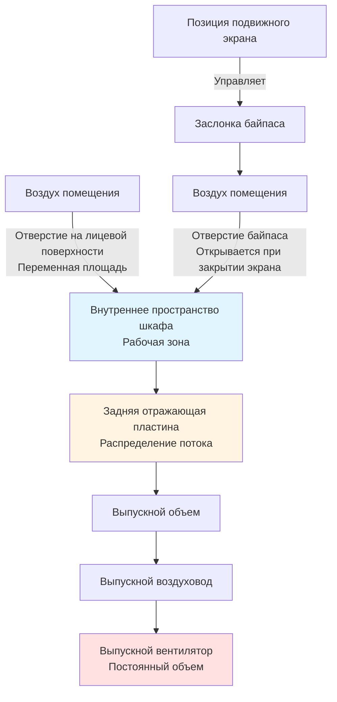

Системы химических вытяжных шкафов обеспечивают первичную локализацию опасных веществ при работе в исследовательских, клинических и промышленных лабораториях. Эти инженерные устройства захватывают загрязняющие вещества в воздухе непосредственно у источника благодаря контролируемым потокам воздуха, которые поддерживают входящую скорость на отверстии лицевой поверхности шкафа, одновременно создавая нисходящее и направленное в сторону спинки движение воздуха во внутреннем объеме шкафа. Надлежащее проектирование вытяжного шкафа достигает баланса между производительностью локализации, потреблением энергии и операционной гибкостью благодаря тщательному выбору типа шкафа, установке скоростей потока, стратегиям управления и конфигурации выпускной системы. ANSI/AIHA Z9.5 устанавливает минимальные критерии проектирования, тогда как ASHRAE 110 предоставляет количественную методологию испытания локализации для проверки полевой производительности.

## Основные принципы локализации

### Скорость потока на лицевой поверхности и физика аэродинамики

Скорость потока на лицевой поверхности представляет среднюю скорость воздуха, входящего в отверстие лицевой поверхности шкафа, измеренную перпендикулярно плоскости подвижного экрана. Этот входящий поток воздуха предотвращает выход загрязняющих веществ, создавая захватывающую оболочку, которая преодолевает диффузию, тепловую конвекцию и воздушные потоки в помещении.

**Спецификация скорости потока на лицевой поверхности:**

ANSI/AIHA Z9.5-2012 рекомендует диапазон скорости потока на лицевой поверхности 0,40–0,61 м/с (80–120 фунтов в минуту) с 0,51 м/с (100 фунтов в минуту) в качестве стандартной основы проектирования. Более низкие скорости (0,30–0,41 м/с для вытяжных шкафов низкого расхода) требуют улучшенных функций локализации, включая аэродинамический дизайн подвижного экрана, задние отражатели и минимальное воздействие сквозняков.

**Соотношение объемного расхода воздуха:**

Требуемый объем выброса вытяжки напрямую зависит от скорости потока на лицевой поверхности и площади отверстия:

$$Q = V_f \times A_{opening}$$

где:
- $Q$ = Объемный расход воздуха (м³/ч)
- $V_f$ = Скорость потока на лицевой поверхности (м/с)
- $A_{opening}$ = Площадь отверстия подвижного экрана (м²)

Для шкафа шириной 1,83 м с высотой рабочей зоны 0,46 м (подвижный экран на высоте 0,46 м над рабочей поверхностью):

$$A_{opening} = 1,83 \text{ м} \times 0,46 \text{ м} = 0,84 \text{ м}^2$$

$$Q = 0,51 \text{ м/с} \times 0,84 \text{ м}^2 = 0,43 \text{ м}^3/\text{с} = 1546 \text{ м}^3/\text{ч}$$

При полностью открытом подвижном экране (0,71 м типичная максимальная высота):

$$A_{opening} = 1,83 \text{ м} \times 0,71 \text{ м} = 1,30 \text{ м}^2$$

$$Q = 0,51 \text{ м/с} \times 1,30 \text{ м}^2 = 0,66 \text{ м}^3/\text{с} = 2376 \text{ м}^3/\text{ч}$$

### Внутренние потоки воздуха

Эффективная локализация требует надлежащего распределения внутреннего потока воздуха сверх простого поддерживания скорости потока на лицевой поверхности. Воздух, входящий через лицевую поверхность шкафа, должен обтекать рабочую поверхность и переносить загрязняющие вещества к задней отражающей пластине и выпускному объему без создания зон застоя или турбулентных завихрений, которые позволяют загрязняющим веществам выйти из шкафа.

**Проектирование задней отражающей пластины:**

Большинство современных шкафов оснащены регулируемыми задними отражающими пластинами с несколькими щелями (обычно 3–5 щелей) для оптимизации распределения потока воздуха. Отражающая пластина создает сопротивление, которое выравнивает поток по глубине шкафа, предотвращая мертвые зоны у задней стенки и чрезмерную скорость у передней.

**Распределение потока воздуха через отражающую пластину:**

Рекомендуемое распределение потока через щели отражающей пластины (процент от общего выброса через каждую щель снизу вверх):
- Нижняя щель (ниже рабочей поверхности): 50–60%
- Средние щели (рабочая зона): 20–30%
- Верхняя щель (верхний объем шкафа): 10–20%

**Применение принципа Бернулли:**

Перепад давления через каждую щель отражающей пластины определяет распределение потока. Для равномерной скорости по ширине шкафа каждая щель должна поддерживать равный дифференциал статического давления:

$$\Delta P_{slot} = \frac{\rho V_{slot}^2}{2 \times 1097}$$

где:
- $\Delta P_{slot}$ = Перепад давления через щель (см водяного столба)
- $\rho$ = Плотность воздуха (0,0012 кг/м³ стандартная)
- $V_{slot}$ = Скорость через щель (м/с)
- 1097 = Коэффициент преобразования

Типичные перепады давления на отражающей пластине находятся в диапазоне 0,0125–0,0375 см водяного столба для установления надлежащего распределения потока.

## Типы и конфигурации вытяжных шкафов

### Проектирование шкафа с байпасом

Шкафы с байпасом включают вспомогательные отверстия подачи воздуха над или вокруг подвижного экрана, которые открываются при закрытии подвижного экрана, сохраняя относительно постоянный объем выброса вытяжки, предотвращая при этом чрезмерное увеличение скорости потока на лицевой поверхности.

**Принцип работы:**

При уменьшении позиции подвижного экрана площадь отверстия байпаса пропорционально увеличивается, чтобы сохранить примерно постоянную общую площадь отверстия (отверстие на лицевой поверхности + отверстие байпаса). Эта конфигурация предотвращает превышение скорости потока на лицевой поверхности 0,76 м/с при минимальных позициях подвижного экрана, сохраняя при этом адекватную локализацию.

**Расчет расхода воздуха через байпас:**

$$Q_{total} = V_f \times A_{face} + V_{bypass} \times A_{bypass}$$

Для работы с постоянным объемом при закрытии подвижного экрана:

$$Q_{total} = \text{постоянная}$$

**Точка перехода байпаса:**

Отверстия байпаса обычно активируются, когда подвижный экран достигает 50% от полностью открытой позиции. Ниже этой точки увеличивающаяся площадь байпаса компенсирует уменьшение площади лицевой поверхности.

**Энергетические последствия:**

Шкафы с байпасом, работающие в режиме постоянного объема, непрерывно выбрасывают полный проектный расход воздуха, создавая существенное энергопотребление для подготовки и кондиционирования входящего воздуха. Эта конфигурация подходит для высокорискованных приложений, требующих максимального разбавления вытяжки, но доказывает неэффективность для лабораторий с переменным использованием.

### Шкафы с постоянным объемом воздуха

Шкафы с постоянным объемом воздуха (CAV) поддерживают фиксированный расход выброса вытяжки независимо от позиции подвижного экрана. Без отверстий байпаса скорость потока на лицевой поверхности варьируется обратно пропорционально площади отверстия, потенциально создавая чрезмерные скорости при низких позициях подвижного экрана, которые генерируют турбулентность и компрометируют локализацию.

**Варьирование скорости потока на лицевой поверхности:**

Для постоянного расхода выброса вытяжки $Q$:

$$V_f = \frac{Q}{A_{sash}}$$

При уменьшении высоты подвижного экрана с 0,46 м до 0,15 м (одна треть площади):

$$V_f = \frac{Q}{A/3} = 3 \times V_{f,design}$$

Скорость потока на лицевой поверхности увеличивается с 0,51 м/с до 1,52 м/с, создавая турбулентные условия, которые могут превысить способность локализации.

**Приложения:**

Шкафы CAV без байпаса подходят для приложений, требующих непрерывного максимального разбавления независимо от позиции подвижного экрана:
- Переваривание в хлорной кислоте (требует постоянного смыва)
- Работа с радиоизотопами (максимальная вентиляция для контроля загрязнения воздуха)
- Высокотоксичные материалы (консервативный подход безопасности)

### Шкафы с переменным объемом воздуха

Шкафы VAV модулируют объем выброса вытяжки в ответ на изменение позиции подвижного экрана, сохраняя постоянную скорость потока на лицевой поверхности при одновременном снижении энергопотребления в периоды уменьшенного открытия подвижного экрана.

**Стратегия управления:**

Датчики позиции подвижного экрана (ультразвуковые, инфракрасные или реостатные) непрерывно измеряют вертикальное или горизонтальное положение подвижного экрана. Контроллер рассчитывает требуемый расход воздуха для поддержания целевой скорости потока на лицевой поверхности и соответственно модулирует выпускную заслонку или скорость вентилятора.

**Уравнение модуляции расхода воздуха:**

$$Q_{setpoint}(t) = V_{f,target} \times W_{hood} \times H_{sash}(t)$$

где:
- $H_{sash}(t)$ = Измеренная высота подвижного экрана в момент времени $t$ (м)
- $W_{hood}$ = Ширина шкафа (м)
- $V_{f,target}$ = Скорость потока на лицевой поверхности (0,51 м/с типичная)

**Ограничение минимального расхода воздуха:**

Даже при полностью закрытом подвижном экране минимальный расход выброса вытяжки (на 0,08–0,17 м³/с для типичных шкафов шириной 1,2–1,8 м) поддерживает небольшое отрицательное давление внутри шкафа и предотвращает накопление паров химических веществ. Этот минимальный расход представляет 10–25% расхода полностью открытого проектного объема.

**Анализ экономии энергии:**

Предполагая типичные картины использования лабораторий:
- Подвижный экран полностью открыт: 10% времени работы
- Подвижный экран на рабочей высоте (0,46 м): 30% времени работы
- Подвижный экран в минимальном положении (0,15 м): 60% времени работы

Среднее снижение расхода воздуха по сравнению с CAV:

$$\bar{Q}_{VAV} = 0,10(1,0Q) + 0,30(0,65Q) + 0,60(0,21Q) = 0,42Q$$

Работа VAV снижает средний расход воздуха до 42% от базовой CAV, что приводит к снижению энергии на подготовку входящего воздуха, кондиционирование и вентиляторы на 58%.

### Шкафы со вспомогательным воздухом

Шкафы со вспомогательным воздухом вводят кондиционированный или некондиционированный дополнительный воздух непосредственно на лицевую поверхность или внутрь шкафа, снижая нагрузку на входящий воздух от системы HVAC здания.

**Вспомогательный воздух типа I (шкаф с подачей воздуха):**

Темперированный наружный воздух выпускается из объема над лицевой поверхностью шкафа, течет вниз через отверстие лицевой поверхности до втягивания в выброс шкафа. Эта конфигурация снижает потребность в входящем воздухе здания за счет подачи 60–80% выброса шкафа непосредственно.

**Вспомогательный воздух типа II (воротник входящего воздуха):**

Перфорированный воротник или объем окружают шкаф, выбрасывая низкоскоростной воздух, который течет в отверстие шкафа. Это более мягкое введение минимизирует возмущение по сравнению с выпуском на лицевую поверхность.

**Ограничения и проблемы:**

- Риск сквозняков: Выброс вспомогательного воздуха создает турбулентность на лицевой поверхности, которая может компрометировать локализацию
- Требуется испытание ASHRAE 110: Все шкафы со вспомогательным воздухом должны пройти проверку локализации
- Температурная стратификация: Некондиционированный вспомогательный воздух создает неудобные тепловые условия для пользователей шкафа
- Неопределенность энергетического кредита: Вспомогательный воздух, компенсирующий входящий воздух здания, требует проверки через измерение расхода воздуха
- Снижение использования: Современные энергетические кодексы и технология VAV обычно обеспечивают лучшую производительность, чем подходы со вспомогательным воздухом

## Измерение и управление скоростью потока на лицевой поверхности

### Требования сетки измерения

ASHRAE 110-2016 определяет подробные процедуры для измерения скорости потока на лицевой поверхности с использованием многоточечной сетки траверса.

**Спецификации сетки:**

- Точки измерения: 15 см интервалом как в горизонтальном, так и в вертикальном направлениях
- Тип анемометра: Термический или лопастной анемометр, минимум ±3% точность
- Длительность измерения: минимум 10 секунд на точку
- Приемлемый диапазон: 0,40–0,61 м/с (±20% от 0,51 м/с установки)
- Равномерность: Ни одна точка не должна отличаться более чем на 20% от среднего значения

**Статистический анализ:**

Рассчитайте среднюю скорость потока на лицевой поверхности:

$$\bar{V}_f = \frac{1}{n}\sum_{i=1}^{n} V_{f,i}$$

Рассчитайте стандартное отклонение:

$$\sigma = \sqrt{\frac{1}{n-1}\sum_{i=1}^{n}(V_{f,i} - \bar{V}_f)^2}$$

Приемлемая производительность обычно требует:
- Средняя скорость: 0,40–0,61 м/с
- Стандартное отклонение: < 0,076 м/с
- Коэффициент вариации: < 15%

### Системы непрерывного мониторинга

Современные шкафы оснащены системами непрерывного мониторинга скорости потока на лицевой поверхности для проверки производительности в реальном времени и генерирования сигналов тревоги.

**Технологии мониторинга:**

| Технология | Принцип | Точность | Применение |
|------------|---------|----------|-----------|
| Массив трубок Пито | Измерение дифференциального давления | ±5–10% | Коллекторы выпускных воздуховодов |
| Термическая дисперсия | Скорость передачи тепла в потоке | ±5–8% | Отдельный выброс шкафа |
| Расчет на основе давления | Статическое давление в воздуховоде + кривая системы | ±10–15% | Простые системы с постоянным объемом |
| Ультразвуковое время прохождения | Распространение звуковой волны | ±2–5% | Высокоточные исследовательские приложения |

**Установка сигналов тревоги:**

- Сигнал низкой скорости: < 0,40 м/с (указывает на неадекватную локализацию)
- Сигнал высокой скорости: > 0,61 м/с (указывает на чрезмерную турбулентность)
- Сигнал отказа расхода воздуха: Потеря сигнала или расход < 50% установки

**Реагирование на сигналы тревоги:**

При обнаружении низкой скорости потока на лицевой поверхности:
1. Слышимая и видимая сигнализация на шкафе (звуковой сигнал и проблесковый свет)
2. Уведомление системе автоматизации зданий
3. Удаленный сигнал в отдел управления объектами
4. Уведомление по электронной почте/SMS специалистам по безопасности (приоритетные сигналы)
5. Сигнал продолжается до подтверждения и исправления состояния

## Испытание производительности вытяжных шкафов

### Метод испытания локализации ASHRAE 110

Стандарт ASHRAE 110-2016 "Метод испытания производительности лабораторных вытяжных шкафов" предоставляет количественную оценку локализации с использованием вызова с трассирующим газом.

**Обзор процедуры испытания:**

1. **Измерение скорости потока на лицевой поверхности:** Проведите многоточечный траверс согласно требованиям сетки
2. **Визуализация потока воздуха:** Введите театральный дым для наблюдения картин потока и определения турбулентности
3. **Испытание трассирующим газом:** Выпустите гексафторид серы (SF₆) внутри шкафа при отборе проб в зоне дыхания манекена
4. **Испытание устойчивости:** Оцените локализацию при имитации нарушений (человек, проходящий мимо шкафа)

**Протокол испытания трассирующим газом:**

- Трассирующий газ: Гексафторид серы при скорости выпуска 0,13 л/мин
- Место выпуска: Центр шкафа, 15 см позади подвижного экрана, 15 см над рабочей поверхностью
- Места отбора проб: Манекен расположен на лицевой поверхности шкафа с зондами отбора проб на высоте носа и рта
- Длительность испытания: 5 минут на конфигурацию
- Позиции подвижного экрана испытаны: Полностью открыт, половина открыт и рабочая высота (0,46 м типичная)

**Критерии производительности:**

Измеренная концентрация SF₆ в зоне дыхания:
- AM 0,10 ppm (по изготовлению): Отличная локализация, соответствует самым строгим критериям
- AM 0,15 ppm: Приемлемая локализация для большинства приложений
- AM 0,20 ppm: Маргинальная производительность, может потребоваться корректирующее действие
- AM > 0,30 ppm: Неприемлемо, шкаф не проходит требования локализации

где AM = среднее арифметическое всех измерений проб

**Определение прохождения/отказа:**

$$\text{Коэффициент локализации} = \frac{C_{measured}}{C_{background}} < 0,10 \text{ для производительности AM 0,10}$$

### Альтернативные испытания с трассирующим газом

Помимо методологии ASHRAE 110, альтернативные подходы с трассировкой обеспечивают качественную и полуколичественную оценку локализации.

**Испытание с дымом тетрахлорида титана (TiCl₄):**

- Качественная визуальная оценка
- Ампула разбивается внутри шкафа, генерируя плотный белый дым
- Наблюдатель следит за выходом дыма на лицевой поверхности шкафа
- Простое полевое испытание для ввода в эксплуатацию и устранения неисправностей
- Не предоставляет количественные данные локализации

**Испытание с туманом сухого льда:**

- Качественная оценка с использованием видимого тумана
- Сухой лед в теплой воде создает туман углекислого газа
- Более тяжелый, чем воздух, туман испытывает нисходящую тягу и локализацию на уровне пола
- Полезно для прогулочных шкафов и конфигураций, устанавливаемых на полу

**Вычислительное моделирование гидродинамики (CFD):**

- Прогнозирование локализации до строительства
- Оптимизация картин потока воздуха на этапе проектирования
- Валидация конфигураций отражающих пластин
- Параметрические исследования влияния подачи воздуха в помещение
- Не заменяет физическое испытание, но направляет решения проектирования

## Рассмотрения интеграции систем

### Системы сигнализации вытяжного шкафа

Комплексные системы сигнализации обеспечивают несколько уровней уведомления об отказах локализации и операционных аномалиях.

**Иерархия сигналов:**

1. **Локальный сигнал (приоритет 1 - критический):**
   - Состояние: Скорость потока на лицевой поверхности < 0,40 м/с или отказ расхода воздуха
   - Реагирование: Звуковой сигнал (85 дБА минимум) + визуальная сигнализация (красный)
   - Место: Установлено на конструкции шкафа, видимо пользователю
   - Фиксированный: Сигнал продолжается до подтверждения на панели управления

2. **Удаленный сигнал (приоритет 1 - критический):**
   - Передача: Сеть системы автоматизации зданий
   - Уведомление: Отображение на пульте управления объектом
   - Требуемое реагирование: < 15 минут в рабочее время
   - После рабочего времени: Автоматическое уведомление по телефону/SMS дежурному персоналу

3. **Предупредительный сигнал (приоритет 2 - предупреждение):**
   - Состояние: Позиция подвижного экрана превышает рекомендуемую рабочую высоту
   - Реагирование: Визуальное обозначение (желтый свет) + опциональный звуковой сигнал
   - Назначение: Обучение пользователей надлежащей эксплуатации шкафа

**Частота испытания сигнализации:**

- Ежемесячно: Испытание активации сигнала путем имитации состояния низкого расхода воздуха
- Ежегодно: Проверка передачи сигнала на удаленные системы мониторинга
- После обслуживания: Испытание после любых работ по системе управления или модификации шкафа

### Датчики позиции подвижного экрана

Автоматическое обнаружение позиции подвижного экрана обеспечивает управление VAV, генерирование сигналов тревоги и мониторинг эксплуатации.

**Сравнение технологий датчиков:**

| Тип датчика | Принцип работы | Точность | Преимущества | Ограничения |
|-------------|-----------------|----------|------------|------------|
| Ультразвуковое дальнометрирование | Измерение времени прохождения | ±0,6 см | Бесконтактный, надежный | Зависит от температуры |
| Инфракрасный оптический | Интенсивность отраженного света | ±1,3 см | Простой, низкая стоимость | Требует чистого оптического пути |
| Реостатный с кабелем | Измерение расширения кабеля | ±0,25 см | Наивысшая точность | Механический износ, разрыв кабеля |
| Магнитные геркониевые переключатели | Обнаружение дискретной позиции | ±2,5 см | Прочный, без калибровки | Ограниченное разрешение |
| Линейный эффект Холла | Позиция магнитного поля | ±0,6 см | Надежность твердотельной электроники | Требует монтажа магнита |

**Требования к установке:**

- Монтирование: Защищенное место, не подверженное брызгам химических веществ
- Калибровка: Проверка показаний при полностью закрытом, рабочей высоте и полностью открытом положениях
- Резервирование: Рассмотрите двойные датчики для критических приложений
- Доступ для обслуживания: Позиция для легкой очистки и замены

## Специализированные конфигурации вытяжных шкафов

### Вытяжные шкафы, установленные на полу

Вытяжные шкафы, установленные на полу, обеспечивают локализацию для высокого оборудования, крупного оборудования и процессов, требующих доступа на низкой высоте.

**Рассмотрения проектирования:**

- Приподнятое сечение пола или утопленная поддон пола для создания рабочей поверхности
- Выброс вниз через решетку пола с задней отражающей пластиной
- Более высокие требования расхода воздуха из-за большого вертикального отверстия (450–680 м³/ч на метр погонной длины)
- Положения отвода для локализации разливов жидкостей
- Приподнятый порог для локализации разливов жидкостей

**Задачи скорости потока на лицевой поверхности:**

Большие вертикальные отверстия создают тепловые конвекционные потоки, которые противостоят нисходящему потоку выброса вытяжки. Скорости потока на лицевой поверхности при проектировании 0,64–0,76 м/с преодолевают плавучесть от нагреваемых процессов.

### Прогулочные вытяжные шкафы

Конфигурации с прогулками обеспечивают доступ для входа людей при установке и эксплуатации крупного оборудования.

**Расчет расхода воздуха:**

$$Q = V_f \times (W_{hood} \times H_{opening})$$

Для отверстия прогулочного шкафа шириной 2,44 м × высотой 2,13 м:

$$Q = 0,51 \text{ м/с} \times (2,44 \times 2,13) = 2,76 \text{ м}^3/\text{с} = 9941 \text{ м}^3/\text{ч}$$

**Рассмотрения безопасности:**

- Мониторинг кислорода: Требуется для шкафов, достаточно больших для входа людей
- Аварийный выход: Второй выход или откидная задняя панель
- Слышимая сигнализация внутри шкафа: Предупреждает пассажиров об отказе вентиляции
- Освещение: Взрывозащищенное, если присутствуют легковоспламеняющиеся материалы

### Вытяжные шкафы для перегонки

Специализированные шкафы для высокого оборудования для перегонки с отверстиями подвижного экрана пониженной высоты.

**Проектирование вертикального подвижного экрана:**

Двухсекционный подвижный экран с:
- Нижняя секция: Стандартный горизонтально скользящий подвижный экран для доступа
- Верхняя секция: Фиксированная или вертикально скользящая панель для просмотра высокого оборудования

**Уменьшенный объем выброса вытяжки:**

Конфигурация вертикального подвижного экрана снижает площадь отверстия по сравнению с горизонтальным подвижным экраном полной высоты, снижая требования к расходу воздуха на 30–50% при сохранении видимости оборудования.

### Компактные вытяжные шкафы

Вытяжные шкафы малой глубины (0,46–0,61 м) для приложений ограниченной локализации или установок с ограниченным пространством.

**Ограничения производительности:**

- Эффективность локализации снижена по сравнению с полнопрофильными шкафами (0,71–0,81 м)
- Более восприимчив к воздушным потокам в помещении и сквознякам
- Требуется испытание ASHRAE 110 для проверки адекватной локализации
- Обычно ограничивается низкорискованными операциями

**Приложения:**

- Учебные лаборатории с минимальным использованием химикатов
- Лаборатории контроля качества с рутинными, хорошо охарактеризованными процедурами
- Корпусы для весов с легким использованием растворителей

## Стратегии оптимизации энергии

### Применение коэффициента разнообразия

Крупные объекты с несколькими вытяжными шкафами редко работают со всеми шкафами с максимальным открытием подвижного экрана одновременно, позволяя получить кредит на разнообразие при определении размера центрального выпускного вентилятора.

**Определение коэффициента разнообразия:**

$$D = \frac{Q_{actual,peak}}{Q_{design,sum}}$$

где:
- $Q_{actual,peak}$ = Максимальный одновременный спрос на выброс вытяжки наблюдаемый или прогнозируемый
- $Q_{design,sum}$ = Сумма всех отдельных расходов проектирования шкафов при полном открытии

**Типичные коэффициенты разнообразия:**

| Количество шкафов | Исследовательские лаборатории | Учебные лаборатории | Промышленный контроль качества |
|------------------|------------------------------|-------------------|-------------------------------|
| 1–5 | 1,00 | 1,00 | 1,00 |
| 6–20 | 0,85–0,95 | 0,70–0,85 | 0,90–1,00 |
| 21–50 | 0,75–0,85 | 0,60–0,75 | 0,85–0,95 |
| > 50 | 0,65–0,75 | 0,50–0,65 | 0,80–0,90 |

**Ограничения применения:**

- Никогда не применяйте разнообразие к определению размера отдельного шкафа
- Проверьте предположения о разнообразии через мониторинг эксплуатации
- Предусмотрите запас прочности 10–15% выше расчетного пикового спроса
- Включите систему сигнализации, чтобы предупредить о превышении запаса разнообразия

### Управление на основе присутствия

Периоды отсутствия в лаборатории (ночи, выходные) представляют возможности экономии энергии через снижение вентиляции при сохранении минимальных пороговых значений безопасности.

**Стратегии отката:**

1. **Режим минимального расхода:** Снизьте все шкафы к минимальному расходу воздуха (0,08–0,17 м³/с) в период отсутствия
2. **Автоматические закрывающие устройства подвижных экранов:** Моторизованная система закрывает подвижные экраны после истечения времени ожидания датчика присутствия (15–30 минут типичная)
3. **Откат по графику:** Снижение на основе времени в течение предсказуемых периодов отсутствия

**Требования безопасности:**

- Поддерживайте минимальный коэффициент воздухообмена (2–4 ACH) в режиме отката
- Сохраняйте отношения отрицательного давления в пространстве
- Предусмотрите ручное переопределение для доступа после рабочего времени
- Сброс на нормальную работу до присутствия (последовательность разогрева утром)

**Потенциал экономии энергии:**

Объекты, работающие с шкафами VAV с откатом при отсутствии, достигают общего снижения энергии на 60–75% по сравнению с базовой CAV:
- Работа VAV: снижение на 50–60%
- Откат при отсутствии: дополнительное снижение на 10–15%

Системы вытяжных шкафов представляют критический интерфейс между безопасностью лабораторий и энергоэффективностью зданий. Правильный выбор шкафа, точное управление скоростью потока на лицевой поверхности, строгое испытание локализации и интеллектуальные стратегии VAV обеспечивают оптимальную защиту с минимизированным потреблением энергии. Понимание фундаментальной физики локализации в шкафах, применение надлежащих технологий и поддержание систем посредством комплексного тестирования обеспечивает надежную защиту для персонала лабораторий, проводящих необходимые исследовательские и аналитические работы.
