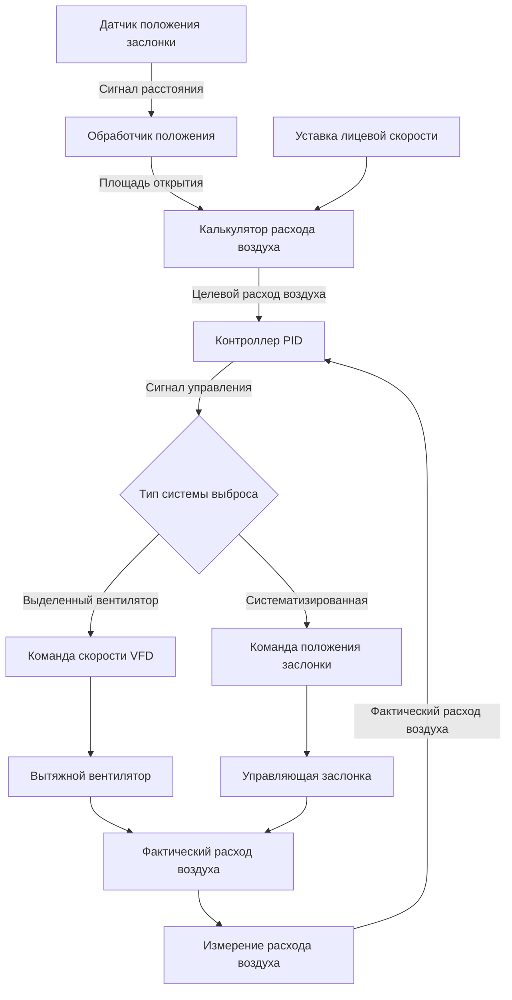
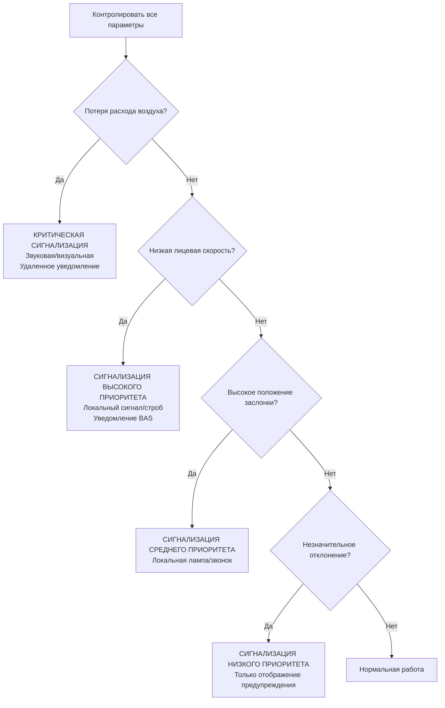

Вытяжные шкафы с переменным объемом воздуха (VAV) представляют наиболее энергоэффективный подход к управлению лабораторной вентиляцией выброса, снижая объемный расход воздуха в ответ на положение заслонки, сохраняя при этом требуемую лицевую скорость для безопасной изоляции. Эти системы достигают экономии энергии 50-70% по сравнению с шкафами с постоянным объемом воздуха (CAV) благодаря динамической модуляции выброса в сочетании с совершенными алгоритмами управления и защитными блокировками.

## Принципы работы

Шкафы VAV работают на основе принципа, согласно которому объемный расход воздуха через отверстие шкафа должен уменьшаться пропорционально уменьшению площади открытия заслонки. Фундаментальное соотношение, определяющее работу шкафа VAV, вытекает из уравнения неразрывности:

$$Q = V_f \cdot A_{sash}$$

где $Q$ — объемный расход воздуха (м³/ч), $V_f$ — лицевая скорость (м/с), а $A_{sash}$ — площадь открытия заслонки (м²). По мере закрытия заслонки $A_{sash}$ уменьшается, позволяя $Q$ уменьшаться, сохраняя при этом постоянную $V_f$ при уменьшенном открытии.

Система управления непрерывно измеряет положение заслонки и модулирует расход выброса для поддержания целевой лицевой скорости, как правило, 0,5 м/с в соответствии с ANSI/AIHA Z9.5-2012. Эта динамическая регулировка происходит через преобразователи частоты (VFD), управляющие скоростью вытяжного вентилятора, или через регуляторы с независимой от давления заслонкой в систематизированных системах.

## Технологии датчиков положения заслонки

Точное обнаружение положения заслонки формирует основу управления шкафом VAV. Несколько технологий датчиков обеспечивают обратную связь по положению:

| Технология датчика | Точность | Время отклика | Типичное применение |
|-------------------|----------|---------------|---------------------|
| Ультразвуковые датчики | ±0,64 см | <0,5 с | Одиночная вертикальная заслонка |
| ИК/оптические датчики | ±1,27 см | <1 с | Горизонтальная или комбинированная заслонка |
| Магнитные геркон выключатели | ±2,54 см | <0,1 с | Проверка дискретного положения |
| Струнные потенциометры | ±0,25 см | <0,2 с | Высокоточные применения |
| 3D системы визуализации | ±0,64 см | <1 с | Сложные многозаслонные конфигурации |

Ультразвуковые датчики представляют наиболее распространенную технологию, излучая звуковые волны, отражающиеся от заслонки, и вычисляя расстояние на основе измерений времени прохождения сигнала. Расстояние датчика до заслонки $d$ связано с временем прохождения сигнала $t$ через:

$$d = \frac{c_{sound} \cdot t}{2}$$

где $c_{sound}$ — скорость звука в воздухе (приблизительно 343 м/с при стандартных условиях), деленная на 2 для двустороннего прохождения. Контроллер преобразует это расстояние в площадь открытия заслонки на основе геометрии шкафа.

## Алгоритмы управления лицевой скоростью

Алгоритм управления должен реагировать на изменения положения заслонки при фильтрации переходных движений и предотвращении поведения ловушки. Типичный цикл управления PID обрабатывает ошибку между целевой и измеренной лицевой скоростью:

$$u(t) = K_p \cdot e(t) + K_i \int e(t)dt + K_d \frac{de(t)}{dt}$$

где $u(t)$ — выход управления (команда скорости VFD или положение заслонки), $e(t)$ — ошибка скорости, а $K_p$, $K_i$, $K_d$ — коэффициенты пропорционального, интегрального и дифференциального управления соответственно.

Для лабораторных применений параметры управления обычно устанавливают:
- $K_p$ = 0,4-0,8 (пропорциональный ответ на мгновенную ошибку)
- $K_i$ = 0,1-0,3 (устраняет смещение установившегося состояния)
- $K_d$ = 0,05-0,15 (демпфирует перерегулирование и колебания)

Алгоритм включает ограничение скорости изменения для предотвращения чрезмерных вариаций скорости вентилятора при быстрых движениях заслонки. Максимальные скорости изменения расхода воздуха обычно ограничивают до 283-566 м³/ч/мин для поддержания стабильности системы.

## Анализ экономии энергии

Шкафы VAV обеспечивают значительную экономию энергии благодаря сокращению объемов выброса и подпиточного воздуха. Сравнение потребления энергии между работой CAV и VAV количественно оценивает эту экономию.

Для стандартного шкафа шириной 1,83 м, работающего при лицевой скорости 0,5 м/с:
- Полностью открыт (1,83 м × 0,76 м заслонка): $Q_{max}$ = 0,5 м/с × 1,39 м² = 2,51 м³/с = 9,036 м³/ч
- Полуоткрыт (1,83 м × 0,38 м заслонка): $Q_{half}$ = 0,5 м/с × 0,695 м² = 1,25 м³/с = 4,518 м³/ч
- Открыт на 15 см (1,83 м × 0,15 м рабочая высота): $Q_{min}$ = 0,5 м/с × 0,275 м² = 0,51 м³/с = 1,807 м³/ч

Годовое потребление энергии для вентиляции выброса и подпиточного воздуха с нагревом/охлаждением следует:

$$E_{annual} = \sum_{i=1}^{n} Q_i \cdot \rho \cdot c_p \cdot \Delta T_i \cdot t_i \cdot \eta^{-1}$$

где $\rho$ — плотность воздуха (1,2 кг/м³), $c_p$ — удельная теплоемкость (1,005 кДж/кг·К), $\Delta T_i$ — разность температур между наружным и подпиточным воздухом для условия $i$, $t_i$ — часы работы при условии $i$, а $\eta$ — эффективность системы нагрева/охлаждения.

При типичных паттернах использования лаборатории (заслонка полностью открыта 10% времени, полуоткрыта 30%, на рабочей высоте 60%):

**Средний расход воздуха CAV**: 9,036 м³/ч (постоянно)

**Средний расход воздуха VAV**: (0,10 × 9,036) + (0,30 × 4,518) + (0,60 × 1,807) = 3,516 м³/ч

**Снижение расхода воздуха**: (9,036 - 3,516)/9,036 = 61%

Для климата с нагревом и 2,778 градусо-днями отопления при природном газовом отоплении стоимостью 1,70 руб./кДж:

**Годовая энергия отопления CAV**: 9,036 м³/ч × 60 мин/ч × 1,2 кг/м³ × 1,005 кДж/кг·К × 66,667 К·ч / 0,80 эффективность = 6,797 ГДж = 11,556 руб./год

**Годовая энергия отопления VAV**: 3,516 м³/ч (тот же расчет) = 2,640 ГДж = 4,488 руб./год

**Годовая экономия на отоплении**: 7,068 руб. на один шкаф

Экономия энергии вентилятора добавляется к экономии тепловой энергии. Соотношение мощности вентилятора к расходу воздуха следует кубическому закону:

$$\frac{P_2}{P_1} = \left(\frac{Q_2}{Q_1}\right)^3$$

Для снижения расхода воздуха на 61%:

**Коэффициент мощности вентилятора**: (3,516/9,036)³ = 0,051 или 5,1% полной мощности

Вытяжной вентилятор мощностью 1,1 кВт, работающий 8,760 ч/год при стоимости 0,25 руб./кВч:
- Потребление CAV: 1,1 кВт × 8,760 ч × 0,25 руб./кВч = 2,409 руб./год
- Потребление VAV: 2,409 × 0,051 = 123 руб./год
- Экономия энергии вентилятора: 2,286 руб./год

**Общая годовая экономия на один шкаф**: 7,068 + 2,286 = 9,354 руб.

## Защитные блокировки и сигнализация

Шкафы VAV требуют множественных защитных блокировок для обеспечения защиты персонала при всех режимах работы. ANSI/AIHA Z9.5 предусматривает, что отказы управления должны переходить в безопасное состояние (проектирование с отказом в безопасность).

**Критические защитные блокировки включают:**

1. **Сигнализация низкой лицевой скорости**: Активируется, когда измеренная скорость падает ниже 0,4 м/с (на 20% ниже уставки), запуская звуковую и визуальную сигнализацию у шкафа и в месте удаленного контроля.

2. **Сигнализация положения заслонки**: Предупреждает, когда заслонка превышает максимальную безопасную рабочую высоту (обычно 46-51 см), указывая на потенциальный компромисс изоляции.

3. **Блокировка отказа расхода воздуха**: При потере расхода выброса (отказ датчика, останов вентилятора, засорение воздуховода) система запускает аварийную сигнализацию и может активировать аварийные байпасные заслонки для поддержания минимальной вентиляции.

4. **Отказ системы управления по умолчанию**: Потеря сигнала управления командует максимальным положением расхода (VFD на 100% скорости или заслонка полностью открыта) для обеспечения продолжения вытяжки.

5. **Обнаружение движения заслонки**: Некоторые передовые системы включают датчики движения для различия между регулировкой заслонки (временное отклонение скорости приемлемо) и статической работой (скорость должна стабилизироваться на уставке в течение 15-30 секунд).

Иерархия приоритизации сигнализации следует:

## Соображения минимального расхода воздуха

Шкафы VAV должны поддерживать минимальный расход воздуха даже при полностью закрытой заслонке для предотвращения застойных условий воздуха и накопления химических паров внутри шкафа. ANSI/AIHA Z9.5 рекомендует минимальные скорости выброса 14-28 м³/ч для неиспользуемых шкафов.

Минимальный расход воздуха обеспечивает:
- Непрерывное разбавление остаточных химических паров
- Небольшое отрицательное давление для предотвращения миграции паров в лабораторию
- Циркуляцию воздуха для предотвращения стратификации и мертвых зон

Контроллеры обычно реализуют уставку минимального расхода воздуха, которая переопределяет расчет на основе положения заслонки, когда вычисленный расход падает ниже этого порога. Минимальный расход представляет 10-20% максимального проектного расхода для большинства стандартных шкафов.

Для систематизированных систем выброса, обслуживающих несколько шкафов, фактор разнообразия становится критичным при определении размера главного вытяжного вентилятора. Вероятность того, что все шкафы одновременно работают с максимальным расходом воздуха, приближается к нулю при типичных лабораторных операциях, позволяя главному вытяжному вентилятору определять размер по ожидаемому пиковому разнообразию, а не по абсолютному пиковому спросу.

## Наладка и проверка системы

Надлежащая наладка систем VAV шкафа проверяет, что элементы управления поддерживают лицевую скорость во всем диапазоне положений заслонки. Процесс наладки включает:

1. **Калибровка датчика положения заслонки**: Проверить показания датчика при минимальном, максимальном и промежуточных положениях заслонки против физических измерений (допуск ±1,27 см).

2. **Проверка лицевой скорости**: Измерить лицевую скорость, используя метод сетки ASHRAE 110, при положениях заслонки, представляющих 25%, 50%, 75% и 100% открытия. Все измерения должны быть в диапазоне 0,4-0,6 м/с (±20% от уставки 0,5 м/с).

3. **Тестирование отклика управления**: Открывать и закрывать заслонку с различными скоростями при контроле времени стабилизации лицевой скорости. Системы должны стабилизироваться в течение 15-30 секунд после прекращения движения заслонки.

4. **Проверка функции сигнализации**: Запустить каждое условие сигнализации (низкая скорость, высокое положение, отказ расхода) и проверить надлежащую активацию сигнализации, отображение и удаленное уведомление.

5. **Испытание изоляции**: Провести испытание с газом-индикатором ASHRAE 110 с шкафом в режиме VAV при различных положениях заслонки для проверки эффективности изоляции, соответствующей характеристикам CAV.

Документация наладки записывает исходные параметры производительности, которые устанавливают справку для текущей проверки производительности и устранения неисправностей.

Вытяжные шкафы VAV представляют оптимальный баланс между безопасностью лаборатории и энергоэффективностью при надлежащем проектировании, установке и обслуживании. Совершенные системы управления требуют скрупулезной наладки и периодической переградуировки для обеспечения надежной работы на протяжении всего жизненного цикла системы.
