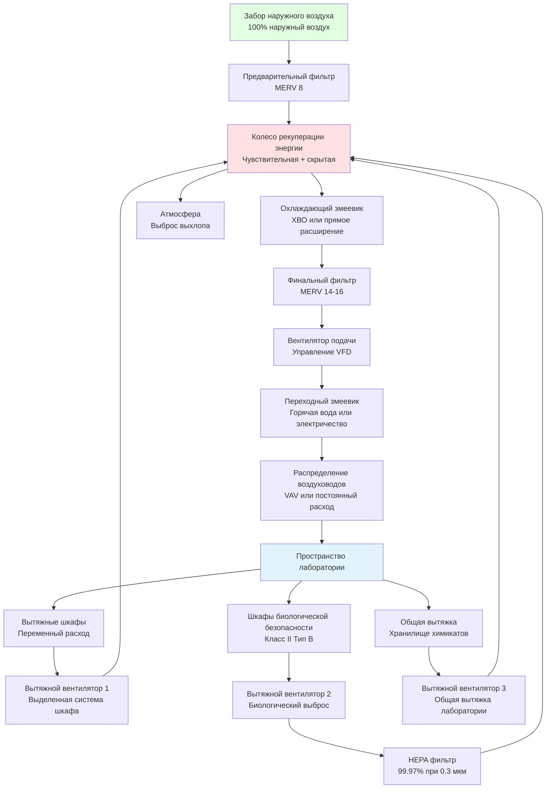

Объекты лабораторий представляют уникальные проблемы подпиточного воздуха из-за требования 100% наружного воздуха, высоких расходов выброса из вытяжных шкафов и биологических шкафов безопасности, а также строгих требований контроля давления. В отличие от типичных коммерческих зданий, которые рециркулируют 70–90% подаваемого воздуха, лаборатории выпускают весь выхлопной воздух для предотвращения перекрестного загрязнения, что создает значительные требования подпиточного воздуха, которые напрямую влияют на потребление энергии и проектирование системы.

## Физические принципы систем подпиточного воздуха лабораторий

Системы подпиточного воздуха лабораторий работают на фундаментальном принципе сохранения массы. Каждый килограмм выпускаемого воздуха должен быть заменен равной массой наружного воздуха для поддержания контроля давления в помещении. Соотношение выражается следующим образом:

$$\dot{m}_{supply} = \dot{m}_{exhaust} + \dot{m}_{exfiltration}$$

Для лабораторий с положительным давлением (положительное давление относительно соседних помещений):

$$Q_{supply} = Q_{exhaust} + Q_{pressurization}$$

где $Q_{supply}$ — полный расход подаваемого воздуха (CFM), $Q_{exhaust}$ — полный выброс, включая вытяжные шкафы, шкафы биологической безопасности и общую вытяжку (CFM), и $Q_{pressurization}$ обычно составляет 170–510 CFM (50–150 м³/ч) в зависимости от размера лаборатории и площади зазора под дверью.

Для лабораторий с отрицательным давлением (пространства изоляции):

$$Q_{supply} = Q_{exhaust} - Q_{pressurization}$$

Система подпиточного воздуха должна кондиционировать наружный воздух от условий окружающей среды до заданной точки в помещении, требуя мощность чувствительного и скрытого охлаждения, рассчитанную как:

$$\dot{Q}_{sensible} = 1.204 \times Q \times \Delta T$$

$$\dot{Q}_{latent} = 3010 \times Q \times \Delta W$$

где $Q$ — расход воздуха (CFM, м³/ч), $\Delta T$ — разность температур (°C), и $\Delta W$ — разность коэффициента влажности (кг воды/кг сухого воздуха). Коэффициент 1.204 incorporates плотность воздуха (1.2 кг/м³) и удельную теплоемкость (1005 Дж/кг·°C), а 3010 учитывает скрытую теплоту испарения.

## Архитектура системы подпиточного воздуха лабораторий

## Стратегии кондиционирования подпиточного воздуха

Системы подпиточного воздуха лабораторий используют различные стратегии кондиционирования в зависимости от климата, нагрузки выброса тепла и требований энергоэффективности:

| Стратегия | Приложения | Преимущества | Ограничения | Типичная рекуперация энергии |
|----------|-------------|------------|-------------|------------------------|
| **Прямой наружный воздух** | Мягкий климат, низкие расходы выброса | Простые управление, низкая начальная стоимость | Высокое потребление энергии, плохой контроль влажности | Нет (0% рекуперация) |
| **Чувствительное колесо** | Все климаты, химические лаборатории | 70–80% чувствительная рекуперация, доказанная надежность | Нет скрытой рекуперации во влажном климате | 70–80% только чувствительная |
| **Колесо энтальпии** | Влажный климат, общие лаборатории | 70–80% полная рекуперация, контроль влажности | Риск перекрестного загрязнения, требует очистки | 70–80% полная энергия |
| **Замкнутый контур** | Лаборатории биобезопасности, разделенный вход/выход | Без перекрестного загрязнения, гибкое размещение | 50–65% чувствительная рекуперация, энергия насоса | 50–65% только чувствительная |
| **Тепловая труба** | Химические лаборатории, пассивная рекуперация | Без движущихся частей, без перекрестного загрязнения | 45–60% чувствительная рекуперация, фиксированная эффективность | 45–60% только чувствительная |
| **Выделенный наружный воздух с охлаждаемыми балками** | Лаборатории с низким выбросом, высокие нагрузки охлаждения | Развязывает вентиляцию от охлаждения | Требует подачу воздуха с низкой точкой росы | 70–80% с колесом |

## Расчеты подпиточного воздуха для проектирования лаборатории

Процесс проектирования начинается с определения расхода выброса. Для типичной химической лаборатории с четырьмя вытяжными шкафами размером 1,8 м, работающими при скорости лица 0,508 м/с:

$$Q_{hood} = \text{Площадь лица} \times \text{Скорость лица}$$

$$Q_{hood} = (1.8 \text{ м} \times 1.5 \text{ м}) \times 0.508 \text{ м/с} = 1.37 \text{ м}^3/\text{с за шкаф}$$

Полный выброс вытяжки для четырех шкафов:

$$Q_{hood,total} = 4 \times 1.37 = 5.49 \text{ м}^3/\text{с}$$

Добавление общей вытяжки лаборатории при 2.54 м³/(ч·м²) для лаборатории площадью 223 м²:

$$Q_{general} = 223 \text{ м}^2 \times 2.54 \text{ м}^3/(\text{ч·м}^2) = 566 \text{ м}^3/\text{ч} = 0.157 \text{ м}^3/\text{с}$$

Полное требование к выбросу:

$$Q_{exhaust,total} = 5.49 + 0.157 = 5.65 \text{ м}^3/\text{с}$$

Для положительного давления при 12.4 Па добавить 0.094 м³/с:

$$Q_{supply} = 5.65 + 0.094 = 5.74 \text{ м}^3/\text{с}$$

Нагрузка охлаждения подпиточного воздуха для летних условий проектирования (35°C Т.б., 25.6°C Т.м. наружного воздуха на 23.9°C Т.б., 50% ОВ условие помещения):

$$\dot{Q}_{sensible} = 1.204 \times 5.74 \times (35 - 23.9) = 76.8 \text{ кВт}$$

Для скрытого охлаждения, коэффициент влажности наружного воздуха при 35°C/25.6°C Т.м. составляет примерно 0.0158 кг/кг, в то время как условие помещения при 23.9°C/50% ОВ составляет 0.0093 кг/кг:

$$\dot{Q}_{latent} = 3010 \times 5.74 \times (0.0158 - 0.0093) = 112.1 \text{ кВт}$$

Полная нагрузка охлаждения без рекуперации энергии:

$$\dot{Q}_{total} = 76.8 + 112.1 = 188.9 \text{ кВт}$$

С эффективным колесом энтальпии 75%, нагрузка охлаждения снижается до:

$$\dot{Q}_{total,ERV} = 188.9 \times (1 - 0.75) = 47.2 \text{ кВт}$$

## Соображения по проектированию согласно стандартам ASHRAE

ASHRAE 62.1 требует скорость вентиляции лаборатории в зависимости от количества людей и выбросов процесса, обычно приводящих к системам со 100% наружным воздухом. Ключевые параметры проектирования включают:

- **Минимальная скорость вентиляции:** 0.615 м³/(ч·м²) плюс 8.5 м³/ч на человека (ASHRAE 62.1)
- **Скорость лица вытяжного шкафа:** 0.4–0.61 м/с согласно ANSI/AIHA Z9.5
- **Воздухообмен:** минимум 6–12 об/ч для общих химических лабораторий
- **Дифференциал давления:** ±2.5–12.4 Па относительно коридоров
- **Температура подаваемого воздуха:** 13–14.4°C для контроля влажности во влажном климате
- **Коэффициент разнообразия:** 0.6–0.8 для выброса вытяжки (не все шкафы на полном потоке одновременно)

Система подпиточного воздуха должна динамически реагировать на переменные требования к выбросу. Современные лаборатории используют VAV вытяжные шкафы, которые модулируют поток выброса в зависимости от положения экрана, снижая скорость лица с 0.508 м/с до 0.305–0.406 м/с при закрытии экранов. Система подпиточного воздуха отслеживает поток выброса, используя прямое измерение расхода воздуха или управление по дифференциальному давлению, поддерживая давление в помещении в пределах ±2.5 Па при всех рабочих условиях.

Эффективность рекуперации энергии зависит от температуры выброса. Лаборатории с высокими внутренними тепловыделениями оборудования поддерживают повышенные температуры выброса в течение года, улучшая зимнюю рекуперацию тепла. Эффективность летней рекуперации снижается, когда температура наружного воздуха приближается к температурам выброса, особенно в периоды, когда здание не занято, и внутренние тепловыделения снижаются.

## Компоненты системы и выбор

**Установки обработки подпиточного воздуха** для лабораторий требуют конструкции, устойчивой к коррозии (нержавеющая сталь или эпоксидное покрытие) из-за воздействия химикатов. Выбор вентилятора должен учитывать высокое внешнее статическое давление от воздуховодов, фильтров и устройств рекуперации энергии, обычно 1.0–1.5 кПа в сумме.

**Колеса рекуперации энергии** должны включать секции очистки (10–15% площади колеса) для минимизации перекрестного загрязнения. Молекулярное сито или силикагель с десиккантным покрытием обеспечивает скрытую рекуперацию во влажном климате. Скорость колеса 10–20 об/мин сбалансирует падение давления с эффективностью.

**Фильтрация** следует двухэтапному подходу: предварительные фильтры MERV 8 защищают змеевики и рекуперацию энергии, в то время как финальные фильтры MERV 14–16 обеспечивают чистоту воздуха, требуемую для чувствительных научных операций.

**Увлажнение** может потребоваться в холодном климате, где содержание влаги в наружном воздухе падает ниже заданных точек лаборатории. Паровые увлажнители избегают риска загрязнения, связанного с испарительными системами в исследовательской среде.

Интеграция подпиточного воздуха с отслеживанием выброса, контролем давления и рекуперацией энергии формирует основу безопасной и энергоэффективной работы лаборатории.
