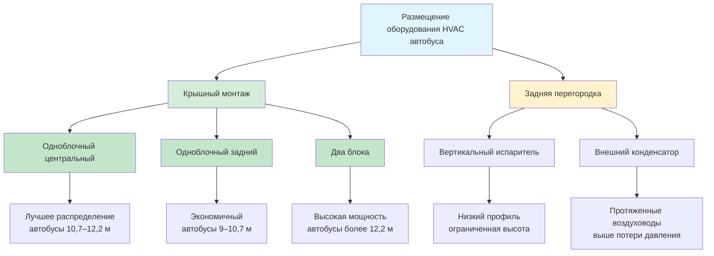
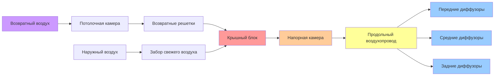

Размещение оборудования в принципе определяет производительность системы HVAC автобуса, доступность обслуживания, аэродинамику транспортного средства и операционную эффективность. Конфигурация должна сбалансировать требования к тепловому распределению, ограничения конструктивной нагрузки, интеграцию источника питания и параметры конструкции транспортного средства при соблюдении требований спецификаций общественного транспорта.

## Варианты конфигурации оборудования

Системы HVAC автобусов используют три основные стратегии размещения оборудования, каждая с отличительными тепловыми, механическими и эксплуатационными характеристиками.

### Крышные установки

Размещение на крыше доминирует в современных установках HVAC для автобусов благодаря оптимальному использованию пространства и преимуществам тепловой производительности.

**Конфигурация с одной задней установкой:**
- Типично для автобусов длиной 9–10,7 м
- Мощность блока: 11,7–14,7 кВ
- Задний монтаж создает неравномерное распределение воздуха с градиентом температуры 5,6–8,3 °C от передней части к задней
- Преимущество: упрощенная установка, одна холодильная цепь
- Недостаток: плохая тепловая однородность, протяженные воздуховоды

**Конфигурация с одной центральной установкой:**
- Стандарт для транзитных автобусов длиной 10,7–12,2 м
- Мощность блока: 14,7–19,1 кВ
- Центральное размещение обеспечивает сбалансированное распределение воздуха
- Тепловая однородность: ±1,7 °C во всем пассажирском отделении
- Оптимально для одноблочных систем с симметричной нагрузкой

**Конфигурация с двумя крышными блоками:**
- Требуется для автобусов длиной более 12,2 м и автобусов дальнего следования
- Передний блок: 10,3–13,2 кВ
- Задний блок: 10,3–13,2 кВ
- Возможность независимого управления по зонам
- Избыточность позволяет частичное охлаждение при отказе одного блока
- Полная мощность: 20,6–26,4 кВ

**Физические параметры крышного блока:**

| Параметр | Транзитный автобус | Автобус дальнего следования | Школьный автобус |
|-----------|-------------|-------------|------------|
| Вес блока | 227–318 кг | 272–363 кг | 181–272 кг |
| Высота над крышей | 30–46 см | 36–51 см | 25–41 см |
| Площадь основания | 152×91 см | 183×102 см | 122×81 см |
| Поток воздуха конденсатора | 1416–2126 м³/ч | 1886–2596 м³/ч | 1180–1650 м³/ч |
| Поток воздуха испарителя | 849–1133 м³/ч | 1038–1416 м³/ч | 661–944 м³/ч |

### Системы с установкой на задней перегородке

Установка на задней перегородке интегрирует компоненты HVAC в конструкцию задней стены, снижая профиль крыши и аэродинамическое сопротивление.

**Характеристики конфигурации:**
- Испаритель и вентилятор установлены вертикально в задней перегородке
- Конденсатор и компрессор позиционированы снаружи в задней части
- Распределение воздуха через верхние продольные воздуховоды
- Распространено в старых конструкциях транзитных автобусов и некоторых школьных автобусах
- Снижение высоты транспортного средства: преимущество 20–30 см по сравнению с крышными блоками

**Соображения производительности:**
- Градиент температуры от передней части к задней: 4,4–6,7 °C типично
- Протяженные воздуховоды требуют более мощные вентиляторы: 1,5–2,2 кВ против 1,1–1,5 кВ для крышного варианта
- Требования к статическому давлению: 30–45 Па против 20–30 Па для крышного варианта
- Доступность обслуживания более ограничена, чем для крышной конфигурации

### Системы с размещением под сиденьями и распределенные системы

Отдельные применения используют распределенное размещение оборудования для специализированного управления тепловым режимом.

**Блоки под сиденьями:**
- Отдельные блоки 1,5–2,3 кВ на ряд сидений
- Электрический привод для автобусов с нулевыми выбросами
- Прямое охлаждение на уровне пассажира: улучшенное восприятие комфорта
- Полная мощность системы: 8,8–17,6 кВ для 12,2-метрового автобуса
- Высокая начальная стоимость: 2–3× цена крышной системы
- Сложная разводка хладагента с несколькими контурами

**Испарители, установленные на боковой панели:**
- Модули испарителя интегрированы в панели боковой стены
- Центральный крышный блок компрессора/конденсатора
- Распределение хладагента к нескольким испарителям
- Улучшенная однородность распределения воздуха
- Повышенная сложность и потенциальные точки утечек

## Сравнение системы крышного и заднего монтажа

### Подробное сравнение производительности

| Фактор | Крышный одноблочный центральный | Крышный двухблочный | Задняя перегородка |
|--------|-------------------|--------------|---------------|
| **Тепловая однородность** | ±1,7 °C | ±1,1 °C | ±3,3 °C |
| **Сложность установки** | Низкая | Средняя | Средняя-высокая |
| **Доступность обслуживания** | Отличная | Отличная | Удовлетворительная |
| **Влияние на высоту транспортного средства** | +36–46 см | +36–46 см | +10–20 см |
| **Аэродинамическое сопротивление** | увеличение на 3–5% | увеличение на 4–6% | увеличение на 1–2% |
| **Распределение веса** | Хорошее (центральное) | Отличное (сбалансированное) | Смещение в заднюю часть |
| **Избыточность системы** | Нет | 50% резервирование | Нет |
| **Начальная стоимость** | Базовая | +25–35% | +15–25% |
| **Сложность воздуховодов** | Низкая | Низко-средняя | Высокая |
| **Потеря статического давления** | 20–30 Па | 22–32 Па | 34–48 Па |

## Системы привода компрессора

Источник питания компрессора значительно влияет на размещение оборудования, эффективность системы и эксплуатационные характеристики.

### Компрессоры с приводом от двигателя

Компрессоры с приводом от двигателя непосредственно соединяются с двигателем внутреннего сгорания через поликлиновой ремень или выделенный отбор мощности (PTO).

**Конфигурация с ременным приводом:**
- Рабочий объем компрессора: 15,6–27,6 л/мин
- Передаточное число: 0,8–1,2 (обороты компрессора к оборотам двигателя)
- Диапазон скорости компрессора: 800–2800 об/мин
- Включение электромагнитной муфты: 24 В пост. тока, 3–5 А
- Типичная установка: передняя часть вспомогательного привода двигателя
- Паразитная нагрузка на двигатель: 3–6 кВ при полной мощности

**Расчет мощности:**

Требование мощности компрессора следует:

$$P_{\text{comp}} = \frac{\dot{m} \cdot (h_2 - h_1)}{\eta_{\text{comp}}}$$

Где:
- $\dot{m}$ = массовый расход хладагента (кг/ч)
- $h_2$ = энтальпия нагнетания (кДж/кг)
- $h_1$ = энтальпия всасывания (кДж/кг)
- $\eta_{\text{comp}}$ = эффективность компрессора (0,65–0,75 типично)

Для охладительной нагрузки 17,6 кВ с R-134a при типичных рабочих условиях:

$$\dot{m} = \frac{Q_{\text{cooling}}}{h_1 - h_4} = \frac{17,6 \text{ кВ}}{0,0194 \text{ кДж/кг}} \approx 388 \text{ кг/ч}$$

При давлении нагнетания 1379 кПа (54 °C конденсации) и давлении всасывания 207 кПа (4 °C испарения):

$$P_{\text{comp}} = \frac{388 \times (125 - 108)}{0,70 \times 2,545} = \frac{6,596}{1,782} \approx 6,1 \text{ кВ}$$

**Преимущества:**
- Нет электрической нагрузки на генератор переменного тока транспортного средства
- Охлаждение доступно при работающем двигателе
- Доказанная надежность в приложениях общественного транспорта
- Более низкая начальная стоимость, чем электрические системы

**Недостатки:**
- Нет охлаждения при выключенном двигателе (режимы с остановленным двигателем)
- Скорость варьируется с оборотами двигателя: снижение мощности на холостом ходу
- Влияние расхода топлива двигателя: снижение на 0,30–0,50 км/л
- Вибрация передается через ременную систему

### Электродвигательные компрессоры

Электрические компрессоры обеспечивают независимую работу HVAC и интегрируются с гибридными/электрическими системами тяги.

**Спиральный компрессор с регулируемым частотным приводом:**
- Мощность двигателя: 6–11 кВ (8–15 л.с.)
- Напряжение: 300–600 В пост. тока (электробусы) или 12/24 В пост. тока с инвертором (традиционные автобусы)
- Диапазон скорости: 1000–6000 об/мин
- Модуляция мощности: 20–100% через управление скоростью
- Ток: 25–40 А при номинальной мощности

**Определение размеров электрической системы:**

Мощность электрического компрессора связана с охладительной способностью и эффективностью системы:

$$P_{\text{elec}} = \frac{Q_{\text{cooling}}}{\text{COP} \times \eta_{\text{motor}} \times \eta_{\text{inverter}}}$$

Для охладительной мощности 17,6 кВ:

$$P_{\text{elec}} = \frac{17,6 \text{ кВ}}{3,0 \times 0,90 \times 0,95} = \frac{17,6}{2,565} \approx 6,9 \text{ кВ}$$

С потерями в приводе и двигателе, указать электродвигатель компрессора мощностью 7–9 кВ.

**Соображения для автобусов с батарейным электрическим приводом:**
- Энергопотребление HVAC: 25–35% от общей энергии транспортного средства
- Влияние на запас хода: снижение на 15–25% при непрерывной работе кондиционера
- Определение размера батареи должно учитывать нагрузку HVAC: дополнительная емкость 15–25 кВч
- Интеграция управления тепловым режимом с системой охлаждения батареи

**Преимущества:**
- Работает при выключенном двигателе (остановка с работающим двигателем, предварительное охлаждение с разъема)
- Точная модуляция мощности через управление скоростью
- Снижение механической нагрузки на двигатель
- Необходимо для гибридных и полностью электрических автобусов

**Недостатки:**
- Высокая электрическая нагрузка: ток генератора 60–90 А
- Надбавка за начальную стоимость: 1850–3300 евро сверх традиционной системы
- Дополнительные компоненты: инвертор/ЧРП, высоковольтная проводка
- Разряд батареи в электрических транспортных средствах снижает запас хода

### Гибридные системы привода

Некоторые приложения общественного транспорта используют двухрежимные системы, сочетающие компрессоры с приводом от двигателя и электрические компрессоры.

**Конфигурация:**
- Основной компрессор с приводом от двигателя для мобильной работы
- Дополнительный электрический компрессор для стационарной работы
- Логика управления переключается в зависимости от статуса двигателя и электрической емкости
- Увеличение полной стоимости системы: 40–60% сверх однокомпрессорного базового варианта
- Применение: премиум-класс автобусы дальнего следования, мобильные медицинские автомобили

## Размещение оборудования и распределение воздуха

Надлежащее позиционирование оборудования скоординировано с конструкцией воздуховодов для достижения равномерного распределения воздуха по всему пассажирскому отделению.

### Детали установки крышного блока

**Конструктивный монтаж:**
- Крышные балки усилены в месте расположения блока: распределенная нагрузка 363–544 кг
- Рама монтажа: стальной швеллер 4,8 мм с виброизоляторами
- Крепеж: болты М10 класса 5, 8–12 на расстоянии 20–25 см
- Герметик: лента из бутилкаучука и полиуретановая замазка в точках проникновения крыши
- Зазор: минимум 30 см над линией крыши для потока воздуха конденсатора

**Интеграция воздуховодов:**

**Параметры распределения воздуха:**

Линейные щелевые диффузоры обеспечивают оптимальный комфорт пассажиров:

$$V_{\text{diffuser}} = \frac{\text{CFM}}{A_{\text{slot}}} = \frac{1180 \text{ CFM}}{(197 \text{ дм} \times 7,6 \text{ см} / 100)} = 40,5 \text{ м/ч}$$

Целевая скорость выхода: 30–46 м/мин для броска на 2,4–3,0 м на уровень пола.

Подавление температуры поступаемого воздуха:

$$\Delta T_{\text{supply}} = \frac{Q_{\text{sensible}}}{1,2 \times \text{м³/ч}} = \frac{13,2 \text{ кВ}}{1,2 \times 944} = 11,6 °C$$

Для пассажирского отделения 25,6 °C, температура поступаемого воздуха: 14–15 °C.

### Распределение веса и центр тяжести

Размещение оборудования влияет на динамику транспортного средства и характеристики управления.

**Анализ распределения массы:**

Одноблочный крышный центральный блок (295 кг) на 12,2-метровом автобусе:
- Полный вес транспортного средства: 13,6–15,9 т
- Влияние на распределение веса: <2% изменения
- Увеличение высоты центра тяжести: 0,076–0,127 м
- Минимальное влияние на управление при типичной операции общественного транспорта

Два крышных блока (590 кг итого):
- Передний блок вес: 40% длины автобуса от передней оси
- Задний блок вес: 75% длины автобуса от передней оси
- Сбалансированная загрузка снижает влияние на отдельные оси
- Увеличение нагрузки на переднюю ось: 91–136 кг
- Увеличение нагрузки на заднюю ось: 181–227 кг

**Критические соображения:**
- Конструкция крыши должна выдерживать статический вес плюс 3× динамическая нагрузка (неровности, ускорение)
- Устойчивость при опрокидывании: выше центр тяжести увеличивает момент опрокидывания на 1–2%
- Настройка подвески может потребовать регулировку для тяжелых крышных нагрузок

## Воздействие на аэродинамику и расход топлива

Крышное оборудование создает потери на сопротивление, влияющие на расход топлива и запас хода транспортного средства.

**Расчет силы сопротивления:**

Аэродинамическое сопротивление следует:

$$F_D = \frac{1}{2} \rho V^2 C_D A$$

Где:
- $\rho$ = плотность воздуха (1,225 кг/м³)
- $V$ = скорость транспортного средства (м/с)
- $C_D$ = увеличение коэффициента сопротивления (0,02–0,04 для крышного блока)
- $A$ = площадь фронтального контура (9,3–11,2 м² для транзитного автобуса)

При 88 км/ч (24,4 м/с):

$$F_D = \frac{1}{2} \times 1,225 \times (24,4)^2 \times 0,03 \times 10,2 = 219 \text{ Н}$$

Мощность, необходимая для преодоления дополнительного сопротивления:

$$P_{\text{drag}} = F_D \times V = 219 \times 24,4 = 5,343 \text{ Вт} = 5,3 \text{ кВ}$$

**Влияние на расход топлива:**
- Одноблочный крышный блок: снижение расхода на 2–4% при скоростях по дорогам
- Два крышных блока: снижение расхода на 3–5%
- Аэродинамические обтекатели снижают влияние до 1–3%
- Низкопрофильные блоки (<36 см) минимизируют штрафы на сопротивление

**Влияние на запас хода электробуса:**
- Аэродинамическое сопротивление увеличивает энергопотребление на 1,8–3,0 кВч на 100 км
- Снижение запаса хода: 6–13 км на транспортном средстве с запасом 241 км
- Рекуперативное торможение частично компенсирует влияние сопротивления на дороге

## Доступность обслуживания

Размещение оборудования определяет время, стоимость и безопасность обслуживания.

**Доступность крышного блока:**
- Требуется люк на крыше и лестница: защита от падения OSHA при высоте более 1,8 м
- Время обслуживания: 1–2 часа для обслуживания хладагента, замены фильтра
- Крупный ремонт требует лифта или мобильной платформы для обслуживания
- Преимущество: визуальный осмотр и незначительное обслуживание без специальных инструментов
- Лучшая практика: крышные направляющие для обслуживания в соответствии с OSHA 1910.29

**Доступность задней перегородки:**
- Внутренние панели снимаются из пассажирского отделения
- Обслуживание испарителя: 30–60 минут после снятия панели
- Доступность компрессора/конденсатора из задней части снаружи
- Соображения ограниченного пространства для обслуживания вентилятора
- Преимущество: работа выполняется на уровне земли

**Доступность системы под сиденьями:**
- Отдельные блоки доступны при снятии сиденья
- Время обслуживания за блок: 15–30 минут
- Несколько блоков увеличивают общее бремя обслуживания
- Распределенная система позволяет частичную работу во время обслуживания

## Стандарты размещения HVAC транзитного автобуса

Установка оборудования должна соответствовать спецификациям отрасли общественного транспорта.

**Стандарты APTA (Американская ассоциация общественного транспорта):**
- APTA BUS-PSC-RP-003: Руководство по закупкам автобусов
- Крепление оборудования требует инженерного анализа нагрузок при столкновении
- Ограничения нагрузки на крышу: максимум 181–272 кг на точку опоры
- Виброизоляция требуется: минимальное отклонение 0,025–0,076 м

**SAE J1343 (стандарт производительности HVAC для автобусов):**
- Система должна отвечать требованиям температурной производительности независимо от размещения
- Условия испытания: 35 °C окружающая среда, полная солнечная нагрузка, максимальная вместимость
- Требование по температуре: среднее 23–25,6 °C, <2,8 °C вариация зона-зона
- Время снижения температуры: 35 °C до 25,6 °C за 30 минут максимум

**Требования FTA (Администрация федерального транзита):**
- Соответствие требованиям Buy America для транзитных транспортных средств с финансированием из федерального бюджета
- Доступность оборудования для лиц с ограниченными возможностями (ADA)
- Пожарная безопасность: материалы соответствуют требованиям FMVSS 302 по огнестойкости
- Требуется обнаружение утечки хладагента для систем с зарядом >22,7 кг

**Руководящие принципы производителя:**
- New Flyer: крышные блоки стандартные, задняя перегородка по заказу
- Gillig: центральный крышный монтаж стандартный на низкопольных автобусах
- NABI: два крышных блока стандартные на 12,2-метровых и 18,3-метровых сочлененных
- Proterra (электрические): интегрированный крышный вариант с тепловым насосом стандартный

Размещение оборудования представляет критическое решение проектирования, балансирующее тепловую производительность, конструктивные требования, доступность обслуживания и операционную эффективность. Крышные конфигурации доминируют благодаря превосходной доступности и характеристикам распределения, хотя специализированные применения могут оправдать альтернативные размещения. Современные системы с электрическим приводом предлагают гибкость в эксплуатации, но требуют тщательной интеграции электрической системы и скоординированного управления тепловым режимом.
