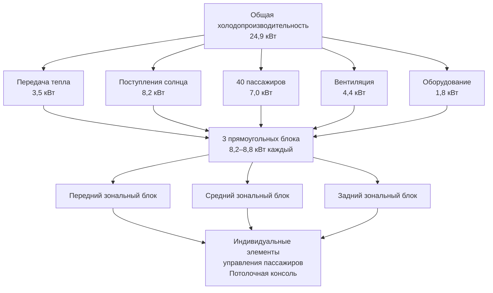
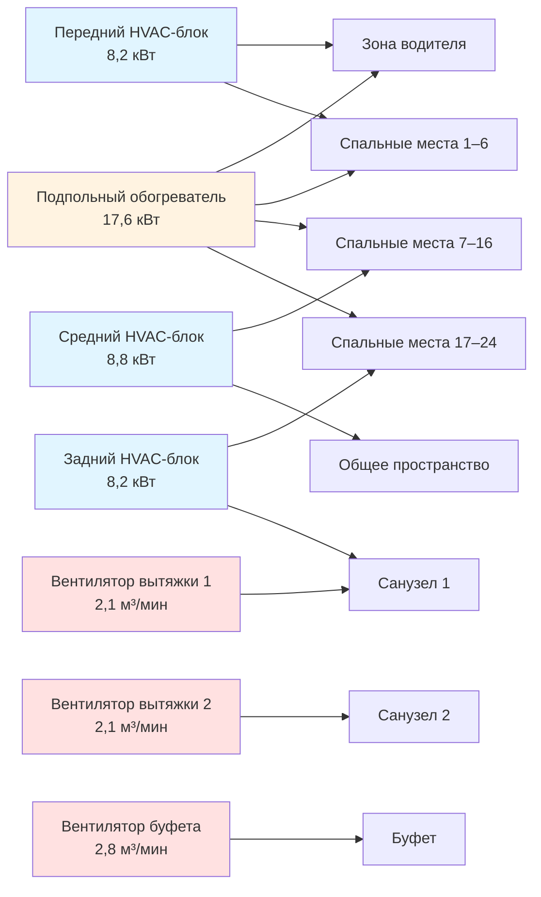

Системы HVAC автобусов дальних маршрутов обеспечивают устойчивый комфорт пассажиров в течение продолжительных путешествий длительностью от четырёх часов до многодневных поездок. Проектирование ориентировано на индивидуальный климатический контроль, бесшумную работу, эффективную рециркуляцию воздуха и специализированную вентиляцию санузлов и буфетов. Многоблочные конфигурации обеспечивают резервирование и зональное управление по всей длине автобуса 10,5–13,7 м.

## Архитектура системы и требования к мощности

Автобусы дальних маршрутов оснащены несколькими блочными установками на крыше, расположенными для создания отдельных климатических зон. Такая конфигурация гарантирует равномерное распределение температуры и обеспечивает оперативное резервирование во время дальнего путешествия.

**Типичная многоблочная конфигурация:**

| Длина автобуса | Количество блоков | Мощность блока | Общее охлаждение | Общий обогрев | Климатические зоны |
|---|---|---|---|---|---|
| 10,7 м | 2 блока | 8,8–10,3 кВт | 17,5–20,5 кВт | 13,2–17,6 кВт | 2 зоны |
| 12,2 м | 2–3 блока | 8,2–10,3 кВт | 20,5–26,3 кВт | 14,6–20,5 кВт | 2–3 зоны |
| 13,7 м | 3 блока | 8,2–9,4 кВт | 24,6–28,1 кВт | 17,6–23,4 кВт | 3 зоны |

### Расчёт холодопроизводительности для автобуса

Общая холодопроизводительность учитывает передачу тепла через ограждение, солнечную радиацию через обширное остекление, метаболические нагрузки пассажиров и теплоотвод оборудования.

$$Q_{total} = Q_{transmission} + Q_{solar} + Q_{passengers} + Q_{infiltration} + Q_{equipment}$$

**Нагрузка передачи тепла:**

$$Q_{transmission} = \sum (U_i \cdot A_i \cdot \Delta T)$$

Где:
- $U_{roof}$ = 0,68–1,02 Вт/(м²·К) (хорошо утеплённая крыша автобуса)
- $U_{sidewall}$ = 1,02–1,42 Вт/(м²·К) (композитные панели с изоляцией)
- $U_{floor}$ = 1,13–1,70 Вт/(м²·К) (подпольная изоляция)
- $U_{glass}$ = 2,55–3,12 Вт/(м²·К) (двухслойные затемнённые окна)
- $\Delta T$ = 19–22 °C (35 °C наружной температуры до 24 °C внутреннего расчётного условия)

**Поступление солнечного тепла:**

$$Q_{solar} = A_{glass} \cdot SHGC \cdot I_{solar} \cdot CLF$$

Автобусы дальних маршрутов имеют площадь остекления 25–35% с типичными значениями:
- $A_{glass}$ = 16,7–22,3 м² для 13,7-метрового автобуса
- $SHGC$ = 0,35–0,50 (затемнённое двойное остекление с плёнками)
- $I_{solar}$ = 631–788 Вт/м² (пиковое дневное западное воздействие)
- $CLF$ = 0,85–0,95 (коэффициент холодопроизводительности для тепловой инерции транспортного средства)

**Нагрузка пассажиров:**

$$Q_{passengers} = N \cdot (q_{sensible} + q_{latent}) \cdot DF$$

Стандартная вместимость автобуса дальних маршрутов:
- $N$ = 48–56 пассажиров (сидячее место)
- $q_{sensible}$ = 67 Вт на пассажира (откидываемое сиденье, минимальная активность)
- $q_{latent}$ = 56 Вт на пассажира (умеренная скрытая теплота при 24 °C, 50% ОВ)
- $DF$ = 0,75–0,85 (коэффициент неравномерности для типичной загрузки 70–85%)

**Нагрузка вентиляции:**

$$Q_{ventilation} = 1,08 \cdot CFM_{OA} \cdot \Delta T + 0,68 \cdot CFM_{OA} \cdot \Delta \omega$$

Вентиляция автобуса минимизирует внешний воздух для энергоэффективности:
- $CFM_{OA}$ = 10–15 CFM (4,8–7,1 м³/ч) на пассажира (SAE J1343 минимум с улучшенной фильтрацией)
- Общий наружный воздух = 480–750 CFM (815–1275 м³/ч) для автобуса с 48–50 пассажирами
- Скорость рециркуляции = 80–90% общего воздушного потока
- $\Delta T$ = 11–14 °C (явная нагрузка при 35 °C наружной температуре)
- $\Delta \omega$ = 0,0054–0,0081 кг воды/кг сухого воздуха (скрытая нагрузка)

**Нагрузка оборудования и освещения:**

$$Q_{equipment} = Q_{lighting} + Q_{electronics} + Q_{galley} + Q_{motors}$$

Типичные внутренние нагрузки:
- LED-освещение: 351–527 Вт (40–60 светильников для чтения плюс общее освещение)
- Электроника и развлечения: 234–439 Вт (система оповещения, видеодисплеи, маршрутизаторы WiFi)
- Буфетные приборы: 146–293 Вт (кофеварки, отвод тепла холодильника)
- Электромоторы вентиляторов и насосы: 176–351 Вт (3–4 узла вентилятора при 400–600 Вт каждый)

### Сводка по общей мощности

Для 13,7-метрового автобуса в расчётных условиях (35 °C наружной температуры, 50% ОВ, 75% загрузка пассажирами):

## Индивидуальный климатический контроль для пассажиров

Современные автобусы дальних маршрутов оснащены индивидуальными элементами управления окружающей средой на каждой позиции сиденья, повышая комфорт во время продолжительного путешествия.

**Конфигурация потолочной консоли:**

| Элемент управления | Функция | Диапазон регулирования | Пропускная способность воздуха |
|---|---|---|---|
| Регулируемое сопло | Направленный воздушный поток | Поворот 360°, наклон 0–45° | 7,1–11,9 м³/ч на выход |
| Клапан ВКЛ/ВЫКЛ | Индивидуальное отключение | Бинарное управление | Полное перекрытие |
| Светильник для чтения | Освещение для выполнения задач | Вкл/выкл или диммирование | 3–5 Вт светодиод |
| Кнопка вызова | Сигнал проводнику | Мгновенный контакт | N/A |

**Стратегия распределения воздуха:**

Отдельные выходы получают кондиционированный воздух из непрерывного продольного потолочного воздуховода, проходящего по длине автобуса. Каждая позиция пассажира оснащена:

- Температура подаваемого воздуха: 13–17 °C (регулируемая точка росы для предотвращения конденсации)
- Скорость выхода: 61–122 м/мин на сопле (регулируемо пассажиром)
- Уровень звука: <35 дБА на уровне уха пассажира при открытом сопле
- Уравновешивание потока: ±10% вариация между передними и задними позициями

**Зональное управление температурой:**

Хотя отдельные пассажиры управляют локальным воздушным потоком, зональные термостаты поддерживают заданное значение:

- Передняя зона (места 1–8): регулируемое пилотом заданное значение 22–26 °C
- Средняя зона (места 9–16): управление проводником или автоматическое 23–24 °C
- Задняя зона (места 17–24): управление проводником или автоматическое 23–24 °C
- Вариация температуры: ≤1,7 °C между зонами в установившихся условиях

## Системы вентиляции санузлов и буфетов

Специализированные системы вентиляции поддерживают отрицательное давление в санузлах и буфетных помещениях, предотвращая распространение запахов в салон пассажиров.

### Требования к вентиляции санузлов

Санузлы автобусов дальних маршрутов требуют непрерывной механической вентиляции, независимой от работы HVAC.

**Критерии проектирования:**

| Параметр | Спецификация | Основание |
|---|---|---|
| Производительность вытяжки | 1,4–2,1 м³/мин на санузел | ASHRAE 62.1 таблица 6-4, транспортные приложения |
| Воздухообмены | 15–20 воздухообменов в час минимум | Контроль запаха и удаление влаги |
| Перепад давления | −10–25 Па | Отрицательное относительно салона пассажиров |
| Подпиточный воздух | 0,3–0,4 м³/мин через приточную решётку | Из соседнего коридора или салона |
| Место выхода вытяжки | На крыше или боковая стенка | Вдали от мест забора воздуха |

**Конфигурация системы вытяжки:**

$$CFM_{lavatory} = \frac{Volume_{lavatory} \cdot ACH}{60}$$

Для типичного санузла объёмом 1,0 м³:
$$CFM_{lavatory} = \frac{1,0 \text{ м}^3 \cdot 18 \text{ вых./ч}}{60 \text{ мин/ч}} = 0,3 \text{ м}^3/\text{мин минимум}$$

В фактическом проектировании используется 1,4–2,1 м³/мин для обеспечения быстрого удаления запахов и положительной вытяжки при открытии двери.

**Выбор вентилятора:**
- Центробежные вентиляторы: производительность 1,4–2,8 м³/мин, внешнее статическое давление 25–75 Па
- Уровень звука: <45 дБА на расстоянии 0,9 м (изолировано от зон пассажиров)
- Тип электромотора: двигатель с постоянным конденсатором или бесщёточный DC (12 В или 24 В)
- Монтаж: виброизолированный для предотвращения резонанса через конструкцию автобуса

### Проектирование вентиляции буфета

Автобусы, оснащённые буфетами, требуют дополнительной вентиляции для кофеварок и прогревающих приборов.

**Вентиляция буфета:**
- Производительность вытяжки: 2,1–4,2 м³/мин (в зависимости от нагрузки приборов)
- Скорость захвата в вытяжке: 30–46 м/мин на поверхности оборудования
- Подпиточный воздух: подготовленный воздух из салона пассажиров или специализированная подача
- Фильтрация: сетчатые жироуловители для приборов, выделяющих пары

## HVAC-системы спальных коечных мест

Автобусы со спальными местами обеспечивают ночлег пассажирам с индивидуальными спальными местами, требующими улучшенного климатического контроля и снижения шума.

### Климатический контроль на уровне спального места

Конфигурации со спальными местами обеспечивают индивидуальное управление температурой и воздушным потоком в каждой спальной позиции.

**Индивидуальные элементы управления спального места:**

| Характеристика | Спецификация | Расположение |
|---|---|---|
| Регулировка температуры | ±2,2 °C от заданного значения зоны | Панель управления у кровати |
| Управление воздушным потоком | 3-позиционный переключатель: Выкл/Низ/Высокий | Панель управления у кровати |
| Объём подаваемого воздуха на спальное место | 7,1–14,2 м³/ч | Регулируемый потолочный диффузор |
| Светильник для чтения | Диммируемый светодиод 2–8 Вт | Встроенный в изголовье |
| USB-зарядка | 5 В 2,4 А на спальное место | Боковая панель |

**Проектирование подачи воздуха к спальному месту:**

$$Q_{berth} = q_{metabolic} + q_{lights} + q_{transmission}$$

Для спящего пассажира:
- $q_{metabolic}$ = 94 Вт (спящий взрослый явная плюс скрытая теплота)
- $q_{lights}$ = 1,5–4,4 Вт (светильник для чтения при использовании)
- $q_{transmission}$ = 58–117 Вт (раздел спального места и площадь внешней стены)
- Итого: 154–215 Вт на спальное место

Температура подаваемого воздуха: 14–18 °C (регулируемо пассажиром через заслонку смешивания)

### Требования к контролю шума

Автобусы со спальными местами требуют акустических характеристик, превосходящих спецификации стандартного автобуса.

**Ограничения уровня звука:**

| Место | Максимум дБА | Условия измерения |
|---|---|---|
| Спальное место – HVAC выкл | 45 дБА | Двигатель на крейсерской скорости, окна закрыты |
| Спальное место – HVAC низ | 38 дБА | HVAC минимальная скорость работы |
| Спальное место – HVAC максимум | 48 дБА | HVAC максимальная скорость работы |
| Коридор | 50 дБА | HVAC нормальная работа |

**Акустические конструктивные особенности:**
- Двухступенчатая виброизоляция прямоугольных блоков на крыше (пружины + эластомерные изоляторы)
- Акустически облицованные воздуховоды подачи: 2,5–5 см облицовка из стекловолокна, 1,8–3,7 м эффективная длина
- Низкоскоростные диффузоры: 46–76 м/мин максимальная скорость выхода
- Акустические экраны: между механическим оборудованием и спальными местами пассажиров
- Вентиляторы переменной скорости: уменьшенная скорость во время сна (22:00 – 6:00)

### Конфигурация системы спального автобуса

## Проектирование системы отопления

Обогрев автобуса дальних маршрутов объединяет принудительное распределение воздуха с дополнительными лучистыми и подпольными системами для быстрого прогрева и устойчивого комфорта.

**Требования к мощности обогрева:**

$$Q_{heating} = UA_{envelope} \cdot \Delta T + 1,08 \cdot CFM_{OA} \cdot \Delta T$$

Расчёт нагрузки обогрева (−18 °C до −7 °C наружной температуры в зависимости от климатической зоны):
- Передача тепла через ограждение: 10,2–14,6 кВт
- Нагрузка вентиляции: 3,5–5,3 кВт
- Нагрузка прогрева: дополнительные 20–30% для восстановления после охлаждения
- Общее расчётное отопление: 17,6–24,9 кВт

**Источники тепла:**

| Тип системы | Мощность | Применение | Метод управления |
|---|---|---|---|
| Дизельный обогреватель | 11,7–17,6 кВт | Первичный источник тепла | Термостат с модулирующей горелкой |
| Теплообменник охлаждающей жидкости двигателя | 8,8–14,6 кВт | Дополнительное отопление при работающем двигателе | Клапан расхода охлаждающей жидкости |
| Электрическое сопротивление | 4,4–8,8 кВт | Питание от берегового источника или холостой ход | Ступенчатое управление 2–3 элемента |
| Подпольное лучистое отопление | 2,9–5,9 кВт | Комфорт от прогрева пола | Специализированная цепь с ограничителем |

**Принудительное распределение воздуха:**
- Температура подаваемого воздуха: 35–49 °C (модулируется в зависимости от потребности в обогреве)
- Места выхода: потолочные диффузоры плюс выходы на уровне пола
- Выходы на уровне пола: 30–40% общего воздушного потока предотвращают ощущение холода в ногах
- Воздушный поток для размораживания: 2,8–4,7 м³/мин к лобовому стеклу при 43–54 °C

## Стандарты и требования к производительности

HVAC-системы автобусов дальних маршрутов соответствуют SAE и отраслевым стандартам безопасности, производительности и комфорта пассажиров.

### Критерии производительности SAE J1343

**Поддержание температуры:**
- Заданное значение в салоне: 22–24 °C поддерживается в расчётных условиях
- Производительность охлаждения: снижение с 54 °C до 26 °C внутри максимум за 30 минут
- Производительность обогрева: повышение с −7 °C до 18 °C внутри максимум за 20 минут
- Равномерность температуры: ≤2,8 °C вариация, измеренная на высоте головы пассажира

**Стандарты вентиляции:**
- Минимум наружного воздуха: 12–15 CFM (5,7–7,1 м³/мин) на пассажира (может быть снижено с улучшенной фильтрацией)
- Уровни CO₂: <1000 ppm при нормальной занятости
- Фильтрация воздуха: MERV 8 минимум для рециркулируемого воздуха
- Распределение свежего воздуха: ≥85% позиций пассажиров получают компонент наружного воздуха

### Критерии комфорта для дальних путешествий

Продолжительное пребывание требует более жёсткого управления окружающей средой, чем краткосрочный транзит.

**Параметры теплового комфорта:**

| Параметр | Целевой диапазон | Максимальное отклонение | Период измерения |
|---|---|---|---|
| Температура сухого термометра | 22–24 °C | ±1,1 °C от заданного значения | 95% времени путешествия |
| Относительная влажность | 40–55% | 30–60% допустимо | Когда окружающая среда позволяет управление |
| Скорость воздуха у пассажира | 9–18 м/мин среднее | <30 м/мин максимум | Отдельное сопло закрыто |
| Асимметрия лучистой температуры | <2,8 °C | <4,4 °C допустимо | Градиент окно–проход |
| Вертикальный температурный градиент | <1,7 °C пол–голова | <2,8 °C максимум | Положение сидячего пассажира |

**Целевые показатели качества воздуха:**
- CO₂: 800–1000 ppm (отличное), <1200 ppm (приемлемо)
- Твёрдые частицы (PM2.5): <12 мкг/м³ с фильтрацией MERV 11–13
- Летучие органические соединения: <400 мкг/м³ общего содержания ЛОС
- Контроль запаха: положительная вентиляция предотвращает запахи санузлов в салоне

### Надёжность системы и резервирование

Дальнее путешествие требует высокой надёжности и плавной деградации при отказе.

**Характеристики резервирования:**
- Несколько независимых HVAC-блоков: частичное охлаждение сохраняется при отказе одного блока
- Двойные системы отопления: дизельный обогреватель плюс теплота охлаждающей жидкости двигателя
- Резервные вентиляторы вытяжки: непрерывная вентиляция санузлов даже при обслуживании HVAC
- Доступные сервисные панели: техническое обслуживание выполняется на остановках без эвакуации пассажиров

**Интервалы профилактического обслуживания:**
- Замена воздушного фильтра: каждые 4800–8000 км или ежемесячно
- Проверка холодильной системы: каждые 24000–32000 км или ежеквартально
- Смазка электромотора вентилятора: каждые 40000 км или полугодично
- Техническое обслуживание горелки обогревателя: ежегодно или 80000 км
- Полное тестирование системы производительности: ежегодно, включая проверку охлаждения и прогрева

HVAC-системы автобусов дальних маршрутов представляют изощрённое проектирование управления климатом, балансирующее комфорт пассажиров, энергоэффективность, надёжность и оперативную гибкость. Индивидуальные элементы управления, специализированные системы вентиляции и многозональные конфигурации обеспечивают постоянное качество окружающей среды в течение путешествий длительностью от часов до дней в различных климатических условиях.
