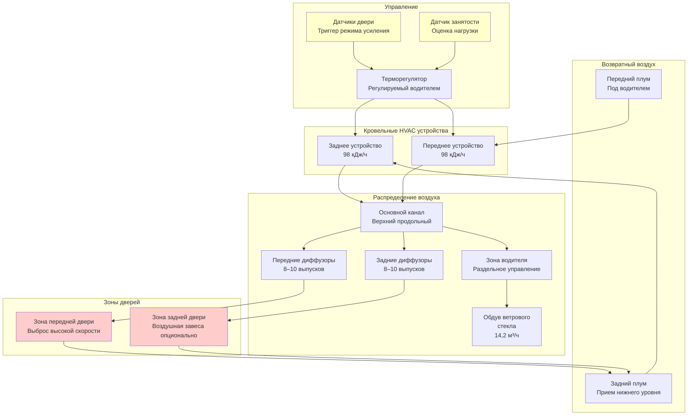

Системы HVAC городских автобусов работают в самых требовательных условиях в секторе транспорта: частое циклирование дверей (20–40 остановок на маршруте), переменная плотность пассажиров включая стоящих, опускание кузова автобуса для доступности и требование быстрого теплового восстановления между остановками. Эти факторы создают нагрузки охлаждения и отопления, превышающие общепринятые расчеты на 30–50%.

## Компоненты нагрузки, специфичные для городских перевозок

Тепловые нагрузки городского автобуса принципиально отличаются от приложений туристических автобусов или школьных автобусов из-за рабочих характеристик, уникальных для городского сообщения.

### Нагрузка инфильтрации при циклировании дверей

Частые открытия дверей представляют доминирующий компонент переменной нагрузки в городском сообщении. Каждый цикл открытия двери вводит наружный воздух при условиях окружающей среды, создавая как явную, так и скрытую нагрузку.

**Расчет инфильтрации дверей:**

Мгновенная нагрузка инфильтрации на один цикл двери:

$$Q_{door} = \dot{m} \cdot c_p \cdot \Delta T = \rho \cdot V_{door} \cdot c_p \cdot \Delta T$$

Где:
- $\dot{m}$ = массовый расход инфильтрирующегося воздуха (кг/мин)
- $\rho$ = плотность воздуха, 1,20 кг/м³ на уровне моря
- $V_{door}$ = объем воздуха на один цикл двери, 4,2–8,5 м³ в зависимости от размера двери и продолжительности открытия
- $c_p$ = удельная теплоемкость воздуха, 1,005 кДж/(кг·К)
- $\Delta T$ = разность температур между наружным и внутренним воздухом (К)

**Средняя часовая нагрузка дверей:**

$$Q_{door,avg} = \frac{n_{cycles} \cdot V_{door} \cdot 1.20 \cdot \Delta T}{60} + Q_{latent}$$

Где:
- $n_{cycles}$ = циклы дверей в час (30–50 типично для городских маршрутов)
- 1,20 = комбинированный коэффициент (1,20 кг/м³ × 1,005 кДж/(кг·К) ÷ 1000)
- $Q_{latent} = 0.68 \cdot n_{cycles} \cdot V_{door} \cdot \Delta \omega$ (скрытая нагрузка, кДж/ч)
- $\Delta \omega$ = разность коэффициента влажности (кг влаги/кг сухого воздуха)

Для 12-метрового городского автобуса с 40 циклами дверей в час при температуре наружного воздуха 35°C (ΔT = 11 К):

$$Q_{door,avg} = \frac{40 \times 5,7 \times 1.20 \times 11}{60} = 50,8 \text{ кДж/ч (явная)}$$

Скрытая нагрузка добавляет примерно 52,8–88,0 кДж/ч в зависимости от влажности наружного воздуха.

### Расчет нагрузки от стоящих пассажиров

Городские автобусы перевозят стоящих пассажиров во время пиковых перевозок, что резко увеличивает плотность пассажиров и тепловыделение.

**Уровни заполнения:**

| Длина автобуса | Пассирская емкость | Емкость стоящих | Пиковая нагрузка | Коэффициент одновременности |
|------------|----------------|------------------|----------------|------------------|
| 9 м | 25–30 | 10–15 | 35–45 | 0,70 |
| 10,5 м | 30–35 | 15–20 | 45–55 | 0,75 |
| 12 м | 35–40 | 20–30 | 55–70 | 0,75 |
| 18 м сочлененный | 55–65 | 40–60 | 95–125 | 0,80 |

**Тепловыделение пассажиров:**

Стоящие пассажиры выделяют большее метаболическое тепло, чем сидящие пассажиры, из-за непрерывной мышечной активности для сохранения равновесия при движении транспортного средства:

- Сидящий пассажир: 1,32 кДж/ч всего (0,73 кДж/ч явная + 0,59 кДж/ч скрытая)
- Стоящий пассажир: 1,61 кДж/ч всего (0,88 кДж/ч явная + 0,73 кДж/ч скрытая)

**Общая нагрузка от пассажиров:**

$$Q_{occupant} = (N_{seated} \cdot 1,32 + N_{standee} \cdot 1,61) \cdot DF$$

Где $DF$ = коэффициент одновременности с учетом средних условий загрузки (0,70–0,80).

Для 12-метрового автобуса при пиковой емкости (40 сидящих + 25 стоящих):

$$Q_{occupant} = (40 \times 1,32 + 25 \times 1,61) \times 0,75 = 69,6 \text{ кДж/ч}$$

### Влияние системы опускания кузова

Низкопольные и опускающиеся автобусы вводят тепловые мосты и утечки воздуха на опущенной входной пороге.

**Тепловые эффекты опускания кузова:**
- Повышенная утечка герметизации двери: 9,4–18,8 м³/ч на одно событие опускания
- Сжатие изоляции пола снижает значение R на 15–25%
- Продолжительность на остановку: 15–30 секунд
- Дополнительная нагрузка инфильтрации: 28,2–52,8 кДж/ч усредненная по маршруту

Механизм опускания кузова создает временный зазор в герметизации пола к двери, позволяя инфильтрацию даже когда двери закрыты во время периода опускания.

## Общая пропускная способность охлаждения городского автобуса

Требование общей пропускной способности охлаждения объединяет все компоненты нагрузки с соответствующими коэффициентами безопасности для способности быстрого восстановления.

$$Q_{total} = Q_{solar} + Q_{transmission} + Q_{occupant} + Q_{door} + Q_{equipment} + Q_{ventilation}$$

**Пропускная способность проектного охлаждения по конфигурации автобуса:**

| Тип автобуса | Длина | Базовая емкость | Добавка циклирования дверей | Пиковая емкость | Требуемые устройства |
|----------|--------|---------------|-------------------|---------------|----------------|
| Стандартный пол | 9 м | 106,5 кДж/ч | +16,8 кДж/ч | 123,3 кДж/ч | 1 × 126 кДж/ч |
| Низкий пол | 10,5 м | 126,2 кДж/ч | +22,4 кДж/ч | 148,6 кДж/ч | 1 × 168 кДж/ч |
| Стандартный пол | 12 м | 145,8 кДж/ч | +28,0 кДж/ч | 173,8 кДж/ч | 1 × 182 кДж/ч или 2 × 98 кДж/ч |
| Низкий пол | 12 м | 157,0 кДж/ч | +33,6 кДж/ч | 190,6 кДж/ч | 2 × 98 кДж/ч |
| Сочлененный | 18 м | 238,0 кДж/ч | +50,4 кДж/ч | 288,4 кДж/ч | 3 × 98 кДж/ч |

Добавка циклирования дверей учитывает увеличение нагрузки инфильтрации на 30–50% по сравнению с межгородским туристическим сообщением.

## Архитектура системы для городского сообщения

## Требования быстрого восстановления

Расписания городского транспорта требуют быстрого восстановления температуры после открытия дверей и скачков пассажиропотока.

**Стандарты производительности APTA:**
- Снижение с 35°C до 25,6°C внутри: максимум 20 минут
- Восстановление после открытия двери (повышение на 2,8 К): 3–5 минут
- Равномерность температуры: ±1,7 К во всем пассажирском отделении
- Раздельное управление зоной водителя: ±2,8 К от установки пассажирской зоны

**Расчет времени восстановления:**

Время восстановления от теплового возмущения:

$$t_{recovery} = \frac{m \cdot c_p \cdot \Delta T}{Q_{excess} \times 60}$$

Где:
- $m$ = масса внутреннего воздуха, примерно объем автобуса × 1,20 кг/м³
- $c_p$ = 1,005 кДж/(кг·К)
- $\Delta T$ = повышение температуры для преодоления (К)
- $Q_{excess}$ = пропускная способность охлаждения сверх установившегося потока нагрузки (кДж/ч)

Для 12-метрового автобуса (внутренний объем 67,8 м³) восстанавливающегося от повышения температуры на 2,8 К, вызванного дверью, с избыточной пропускной способностью 42,0 кДж/ч:

$$t_{recovery} = \frac{67,8 \times 1,20 \times 1,005 \times 2,8}{42,0 \times 60} = 0,137 \text{ часов} = 8,2 \text{ минут}$$

Этот расчет демонстрирует, почему увеличение размера на 25–30% является стандартной практикой для приложений городского транспорта.

## Распределение воздуха для управления зонами дверей

Стратегическое распределение воздуха минимизирует влияние циклирования дверей и сохраняет тепловой комфорт рядом с входными зонами.

**Стратегия выброса в зону двери:**
- Выброс высокой скорости (1,0–1,5 м/с) направленный поперек открытий двери
- Выпуски подачи воздуха позиционированы 30–45 см внутрь от рамы двери
- Угол направления вниз 15–30° для создания эффекта частичной воздушной завесы
- Повышенный объем воздуха в зоны дверей: 30–40% выше среднего

**Управление вертикальным градиентом температуры:**

Стоящие пассажиры размещают свои головы в верхней тепловой зоне, где горячий воздух естественно расслаивается. Сохранение равномерного вертикального распределения температуры требует:

- Температура подача воздуха на 6,7–8,3 К ниже уставки во время пикового охлаждения
- Скорость выброса достаточная для достижения уровня пола перед смешиванием (0,9–1,1 м/с)
- Возвратные воздухозаборники на низком уровне (45–60 см над полом) для удаления расслоенного теплого воздуха
- Потолочные вентиляторы запрещены из-за проблем безопасности и нормативных ограничений

## Рассмотрение систем отопления

Отопление городского автобуса сталкивается с уникальными проблемами из-за частых открытий дверей и низкопольных конструкций, которые уменьшают пространство для установки оборудования.

**Требования пропускной способности отопления:**

| Длина автобуса | Расчетная наружная температура | Пропускная способность отопления | Источник тепла | Время прогрева |
|------------|---------------------|------------------|-------------|--------------|
| 9 м | –17,8°C | 126,0 кДж/ч | Охлаждающая жидкость двигателя + 56 кДж/ч вспомогательная | 15 мин |
| 10,5 м | –17,8°C | 154,0 кДж/ч | Охлаждающая жидкость двигателя + 70 кДж/ч вспомогательная | 18 мин |
| 12 м | –17,8°C | 182,0 кДж/ч | Охлаждающая жидкость двигателя + 84 кДж/ч вспомогательная | 20 мин |
| 18 м сочлененный | –17,8°C | 266,0 кДж/ч | Охлаждающая жидкость двигателя + два вспомогательных по 70 кДж/ч | 25 мин |

**Рекуперация тепла охлаждающей жидкости двигателя:**

Городские автобусы используют охлаждающую жидкость двигателя в качестве основного источника тепла, обеспечивающего 98,0–168,0 кДж/ч в зависимости от размера двигателя:

$$Q_{coolant} = \dot{m}_{coolant} \cdot c_p \cdot (T_{in} - T_{out}) \cdot \varepsilon$$

Где:
- $\dot{m}_{coolant}$ = 1,9–3,2 л/мин (31,6–53,4 кг/мин)
- $c_p$ = 3,97 кДж/(кг·К) для смеси 50/50 гликоля
- $(T_{in} - T_{out})$ = понижение температуры на 8,3–13,9 К в теплообменнике
- $\varepsilon$ = эффективность теплообменника, 0,65–0,75

**Вспомогательное отопление:**
- Дизельные нагреватели: 56,0–98,0 кДж/ч для предварительного нагрева и режима холостого хода
- Электрические нагреватели (подключаемые): 11–19 кВт для ночного предондиционирования
- Тепловые насосы (электробусы): COP 2,0–3,0 выше 4,4°C, резервное сопротивление ниже

## HVAC для электрических и гибридных городских автобусов

Полностью электрические автобусы представляют уникальные задачи HVAC из-за влияния потребления энергии на запас хода.

**Требования электроэнергии HVAC электрического автобуса:**

- Охлаждение: 5,6–10,5 кВт электроэнергии (19,6–36,8 кДж/ч эквивалент)
- Отопление: 10,5–17,5 кВт электроэнергии (резистивное или тепловой насос)
- Влияние на запас хода: снижение на 20–35% при холодной погоде с работой отопления
- Интеграция терморегулирования батареи с системой HVAC салона

**Системы тепловых насосов:**

Тепловые насосы снижают потребление энергии на 40–60% по сравнению с резистивным отоплением выше 4,4°C наружного воздуха:

$$COP = \frac{Q_{heating}}{W_{input}}$$

Типичные значения COP:
- 10°C наружный воздух: COP = 3,0–3,5
- 0°C наружный воздух: COP = 2,0–2,5
- –6,7°C наружный воздух: COP = 1,2–1,5
- Ниже –9,4°C: Включается резервное резистивное сопротивление

## Стандарты и протоколы тестирования

**Стандарты закупки автобусов APTA:**
- APTA BTS-BS-RP-002: требования к системе HVAC
- Поддержание температуры: 20–22°C в режиме отопления, 23–25,6°C в режиме охлаждения
- Минимальная вентиляция: 6,6 м³/ч на пассажира (SAE J1343)
- Производительность обдува ветрового стекла: очистить полосу обзора 15 см за 15 минут при –17,8°C

**Тестирование SAE J1343:**
- Тест охлаждения: 35°C до 25,6°C за максимум 30 минут
- Тест отопления: –6,7°C до 20°C за максимум 30 минут
- Равномерность температуры: измерения в 9 местах по всему автобусу
- Тест циклирования дверей: сохранение ±2,2 К от уставки при моделировании открытия дверей

**Валидация производительности:**

Транспортные агентства обычно требуют тестирования в условиях эксплуатации в течение 30–60 дней перед приемом для всего парка:
- Термографические обследования для выявления недостатков распределения
- Регистрация данных внутренних температур во время коммерческой эксплуатации
- Опросы комфорта водителя и отслеживание жалоб
- Проверка заправки хладагентом и тестирование на утечки

Надлежащее проектирование HVAC городского автобуса учитывает компоундирующие эффекты циклирования дверей, нагрузок от стоящих пассажиров и функций доступности. Увеличение размера на 25–30% сверх базовых расчетов гарантирует адекватную пропускную способность для быстрого восстановления и комфорта пассажиров во время пиковых перевозок.
