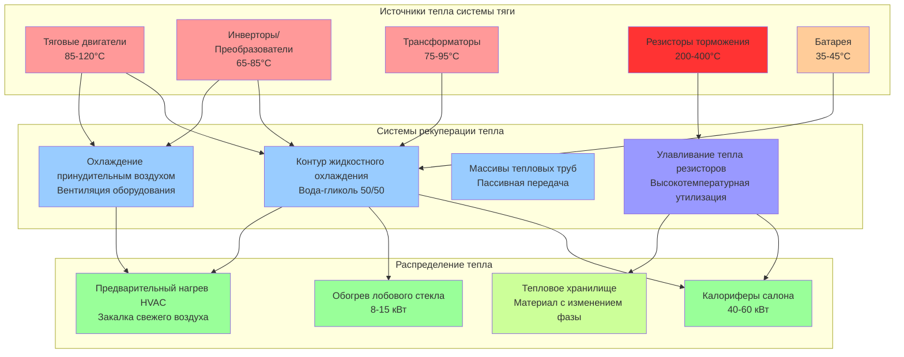

Рекуперация тепла в средствах массового транспорта захватывает отходящую тепловую энергию от систем тяги, динамического торможения и вспомогательного оборудования для снижения энергопотребления HVAC. Электрические и гибридные транзитные средства генерируют значительное количество утилизируемого тепла от тяговых двигателей, силовой электроники и систем рекуперативного торможения, которое может компенсировать тепловые нагрузки при работе в холодную погоду.

## Источники тепла в транзитных средствах

Транзитные средства генерируют отходящее тепло из множества источников с различными уровнями температуры и профилями доступности.

**Генерирование тепла тяговым двигателем:**

Электрические тяговые двигатели, работающие с КПД 85-95%, отводят 5-15% входной мощности в виде тепла. Для типичного легкорельсового средства с мощностью тяги 400 кВт при ускорении:

$$Q_{\text{motor}} = P_{\text{input}} \times (1 - \eta_{\text{motor}})$$

Где:
- $P_{\text{input}}$ = электрическая входная мощность двигателя (кВт)
- $\eta_{\text{motor}}$ = КПД двигателя (0,85-0,95)
- $Q_{\text{motor}}$ = интенсивность отвода тепла (кВт)

Для двигателя мощностью 400 кВт с КПД 90%:

$$Q_{\text{motor}} = 400 \times (1 - 0,90) = 40 \text{ кВт} = 136,500 \text{ кДж/ч}$$

**Тепло силовой электроники:**

Инверторы и преобразователи обычно работают с КПД 95-98%, потери концентрируются в устройствах переключения IGBT и драйверах затвора. Инвертор мощностью 600 кВт с КПД 97% производит:

$$Q_{\text{inverter}} = \frac{P_{\text{output}}}{\eta_{\text{inverter}}} - P_{\text{output}} = P_{\text{output}} \times \left(\frac{1}{\eta_{\text{inverter}}} - 1\right)$$

$$Q_{\text{inverter}} = 600 \times \left(\frac{1}{0,97} - 1\right) = 18,6 \text{ кВт} = 63,500 \text{ кДж/ч}$$

**Энергия рекуперативного торможения:**

При динамическом торможении кинетическая энергия преобразуется в электрическую энергию, часть которой рассеивается как тепло в сетках резисторов или поглощается встроенными накопителями энергии. Утилизируемая тепловая энергия при торможении зависит от профиля мощности торможения:

$$Q_{\text{brake}} = \frac{1}{2}m v^2 \times f_{\text{dissipated}} \times \frac{1}{t_{\text{brake}}}$$

Где:
- $m$ = масса средства (кг)
- $v$ = начальная скорость (м/с)
- $f_{\text{dissipated}}$ = доля не восстановленная электрически (0,20-0,40)
- $t_{\text{brake}}$ = длительность торможения (с)

## Эффективность рекуперации тепла

Тепловая эффективность систем рекуперации тепла количественно определяет отношение восстановленного тепла к доступному отходящему теплу.

**Эффективность теплообменника:**

Для воздухо-воздушных или воздухо-жидкостных теплообменников, восстанавливающих тепло двигателя или инвертора:

$$\varepsilon = \frac{Q_{\text{recovered}}}{Q_{\text{max}}} = \frac{C_{\text{min}}(T_{\text{h,in}} - T_{\text{h,out}})}{C_{\text{min}}(T_{\text{h,in}} - T_{\text{c,in}})}$$

Упрощенно:

$$\varepsilon = \frac{T_{\text{h,in}} - T_{\text{h,out}}}{T_{\text{h,in}} - T_{\text{c,in}}}$$

Где:
- $T_{\text{h,in}}$ = температура на входе горячей стороны (°C)
- $T_{\text{h,out}}$ = температура на выходе горячей стороны (°C)
- $T_{\text{c,in}}$ = температура на входе холодной стороны (°C)
- $\varepsilon$ = эффективность теплообменника (безразмерная)

**Общая эффективность системы:**

Эффективность на уровне системы учитывает производительность теплообменника, потери при распределении и эффективность управления:

$$\varepsilon_{\text{system}} = \varepsilon_{\text{HX}} \times \eta_{\text{distribution}} \times \eta_{\text{control}}$$

Где:
- $\varepsilon_{\text{HX}}$ = эффективность теплообменника (0,50-0,75)
- $\eta_{\text{distribution}}$ = эффективность воздуховодов/труб (0,85-0,95)
- $\eta_{\text{control}}$ = эффективность системы управления (0,90-0,98)

Типовая эффективность системы находится в диапазоне 0,40-0,65 в зависимости от конфигурации.

## Методы рекуперации тепла по источникам

## Эффективность рекуперации по методам

| Метод рекуперации | Источник тепла | Диапазон температур | Эффективность | Типовая мощность | Применение |
|----------------|-------------|-------------------|---------------|------------------|-------------|
| **Жидкостной контур - рубашка двигателя** | Тяговые двигатели | 85-120°C | 0,65-0,75 | 30-80 кВт | Отопление салона, обогрев лобового стекла |
| **Жидкостной контур - холодная плита инвертора** | Силовая электроника | 65-85°C | 0,70-0,80 | 15-40 кВт | Отопление салона, предварительный нагрев |
| **Принудительный воздух - отделение оборудования** | Двигатели, инверторы | 50-90°C | 0,45-0,60 | 20-60 кВт | Закалка свежего воздуха |
| **Теплообменник резистора торможения** | Динамическое торможение | 200-400°C | 0,40-0,55 | 50-150 кВт (прерывистая) | Тепловое хранилище, отопление |
| **Управление температурой батареи** | Литий-ионные батареи | 35-45°C | 0,50-0,65 | 5-15 кВт | Дополнительное отопление салона |
| **Рекуперация тепла воздух-воздух** | Вентиляционный выхлоп | 20-35°C | 0,55-0,70 | 10-25 кВт | Предварительный нагрев свежего воздуха |
| **Тепловой насос с утилизацией тепла** | Комбинированные источники | Переменная | 0,75-0,85 | 40-100 кВт | Отопление и охлаждение |

## Рекуперация тепла тягового двигателя

Электрические тяговые двигатели в современных рельсовых средствах используют системы жидкостного охлаждения, которые циркулируют раствор вода-гликоль через рубашки статора и проходы ротора двигателя.

**Проектирование контура хладагента:**

Первичный контур охлаждения поддерживает температуру двигателя ниже 120°C при выводе тепла для использования в HVAC. Определение расхода:

$$\dot{m} = \frac{Q_{\text{motor}}}{c_p \times \Delta T}$$

Где:
- $\dot{m}$ = массовый расход (кг/с)
- $Q_{\text{motor}}$ = отвод тепла двигателем (кВт)
- $c_p$ = удельная теплоемкость хладагента (3,5-3,8 кДж/кг·К для раствора 50/50 гликоль)
- $\Delta T$ = повышение температуры (10-20°C)

Для нагрузки тепла двигателя 40 кВт с повышением температуры 15°C:

$$\dot{m} = \frac{40}{3,7 \times 15} = 0,72 \text{ кг/с}$$

**Определение размеров теплообменника:**

Теплообменник двигатель-HVAC передает тепло из контура охлаждения двигателя в систему отопления салона. Требуемая площадь теплопередачи:

$$A = \frac{Q}{U \times \Delta T_{\text{lm}}}$$

Где:
- $A$ = площадь теплопередачи (м²)
- $Q$ = интенсивность теплопередачи (кВт)
- $U$ = общий коэффициент теплопередачи (0,5-0,8 кВт/м²·К)
- $\Delta T_{\text{lm}}$ = логарифмическая средняя разность температур (°C)

## Рекуперация от инвертора и силовой электроники

Инверторы из карбида кремния (SiC) и полевые транзисторы с изолированным затвором (IGBT) генерируют сосредоточенное тепло в малых объемах, требующих эффективного управления теплом.

**Передача тепла холодной плитой:**

Силовые модули монтируются на алюминиевых холодных плитах с внутренними каналами для циркуляции хладагента. Тепловой поток через холодную плиту:

$$q'' = \frac{Q_{\text{module}}}{A_{\text{module}}} = h \times (T_{\text{junction}} - T_{\text{coolant}})$$

Где:
- $q''$ = тепловой поток (Вт/см²)
- $Q_{\text{module}}$ = рассеивание мощности модуля (Вт)
- $A_{\text{module}}$ = площадь монтажа модуля (см²)
- $h$ = коэффициент конвективной теплопередачи (Вт/см²·К)

Современные высокомощные модули рассеивают 50-150 Вт/см², требуя скорости хладагента 1-3 м/с через микроканальные холодные плиты.

**Управление температурой:**

Температура перехода инвертора должна оставаться ниже 125-150°C в зависимости от типа полупроводника. Путь тепловой стойкости от перехода до хладагента:

$$R_{\text{total}} = R_{\text{junction-case}} + R_{\text{case-coldplate}} + R_{\text{coldplate-coolant}}$$

Системы рекуперации тепла работают с хладагентом при температуре 55-75°C, обеспечивая достаточный температурный запас при доставке полезной мощности отопления.

## Улавливание тепла рекуперативного торможения

Динамическое торможение преобразует кинетическую энергию в электрическую энергию, с избытком энергии, рассеиваемой в сетках резисторов, когда батареи транзитного средства полностью заряжены или превышена емкость рекуперации.

**Профиль энергии торможения:**

При типичной остановке на станции с снижением скорости с 80 км/ч для легкорельсового средства массой 45 000 кг:

$$E_{\text{kinetic}} = \frac{1}{2}mv^2 = \frac{1}{2} \times 45,000 \times (22,2)^2 = 11,1 \text{ МДж}$$

Если 60% регенерируется в сетевую систему и 40% рассеивается в резисторах торможения за 30 секунд:

$$Q_{\text{resistor}} = \frac{11,1 \times 0,40}{30} = 148 \text{ кВт}$$

**Рекуперация тепла сетки резистора:**

Сетки резистора торможения работают при температуре 200-400°C, требуя специализированных теплообменников с тепловой инертностью для буферизации прерывистого нагрева. Рекуперация тепла принудительным воздухом захватывает 40-55% тепла резистора при проектировании для быстрого теплового отклика.

Тепловое хранилище материала с изменением фазы поглощает интенсивное тепло торможения и постепенно отпускает его для отопления салона между событиями торможения.

## Интеграция с системами HVAC

Системы рекуперации тепла интегрируются с транзитным HVAC через каскадные стратегии отопления.

**Последовательность приоритета отопления:**

1. **Восстановленное тепло (первичное)**: контуры охлаждения двигателя, инвертора и батареи подают тепло на калориферы при наличии (0-80 кВт в зависимости от режима работы)
2. **Работа теплового насоса (вторичное)**: электрический тепловой насос обеспечивает отопление, когда отходящего тепла недостаточно (20-60 кВт)
3. **Электрическое сопротивление (резервное)**: прямые элементы электрического отопления активируются только при недостаточности рекуперации тепла и теплового насоса (30-50 кВт)

**Логика управления:**

Система контролирует температуру хладагента, расход и потребность в отоплении для оптимизации рекуперации тепла:

$$\text{Если } T_{\text{coolant}} > 60°C \text{ и } \dot{m} > \dot{m}_{\text{min}}: \text{ Включить режим рекуперации}$$

$$\text{Если } Q_{\text{recovered}} < Q_{\text{demand}}: \text{ Активировать дополнительный тепловой насос}$$

$$\text{Если } T_{\text{outdoor}} < -20°C \text{ и } Q_{\text{total}} < Q_{\text{demand}}: \text{ Включить резервное сопротивление}$$

## Анализ энергосбережения

Рекуперация тепла снижает энергопотребление HVAC путем компенсации нагрузок электрического отопления.

**Годовой энергетический эффект:**

Для легкорельсового средства, работающего 18 часов/день в течение 6 месяцев сезона отопления:

- Среднее доступное отходящее тепло: 35 кВт
- Эффективность системы рекуперации: 0,55
- Часы работы: 18 ч/день × 180 дней = 3 240 ч/год
- Восстановленная энергия: 35 кВт × 0,55 × 3 240 ч = 62 370 кВт·ч/год

Если это компенсирует электрическое сопротивление при стоимости 0,12 руб./кВт·ч:

**Годовое сбережение = 62 370 кВт·ч × 0,12 руб./кВт·ч = 7 484 руб. на средство**

Для флота из 50 средств: **374 200 руб. годового энергосбережения**

## Нормы и руководящие принципы

**Применения ASHRAE:**

- **Справочник ASHRAE - Применение HVAC, Глава 10**: Системы мобильного наземного транспорта, включая соображения по рекуперации тепла
- **Целевые показатели эффективности рекуперации**: Минимум 0,50 для воздухо-воздушных систем, 0,65 для жидкостных приложений

**Нормы транзитной промышленности:**

- **APTA RT-VIM-S-016-03**: Системы HVAC для легкорельсовых средств, включая требования энергоэффективности
- **IEEE 1476-2017**: Приложения рельсового транзита - Управление температурой и охлаждение электрических тяговых двигателей
- **EN 14813-1**: Приложения рельсового транспорта - Кондиционирование воздуха для кабин управления и пассажирских отделений

**Метрики энергетической производительности:**

- **Энергопотребление на пассажиро-км**: Рекуперация тепла снижает энергопотребление HVAC на 15-30% по сравнению с обычным электрическим отоплением
- **Коэффициент производительности (COP)**: Прямая рекуперация тепла работает с COP 3,0-5,0 при компенсации сопротивления
- **Энергетическая эффективность тепло**: Прямая рекуперация тепла преобразует тепло пропульсии в отопление салона с эффективностью 50-65%

Рекуперация тепла в системах HVAC транзитных средств представляет высокоценную меру энергоэффективности, особенно для электрических рельсовых средств со значительной генерацией тепла в системе тяги. Надлежащая интеграция охлаждения двигателя, управления температурой инвертора и рекуперации тепла рекуперативного торможения снижает потребление вспомогательной мощности при улучшении общей энергоэффективности средства. Проектирование системы должно учитывать прерывистый характер источников отходящего тепла и предусматривать дополнительную мощность отопления для условий пикового спроса.
