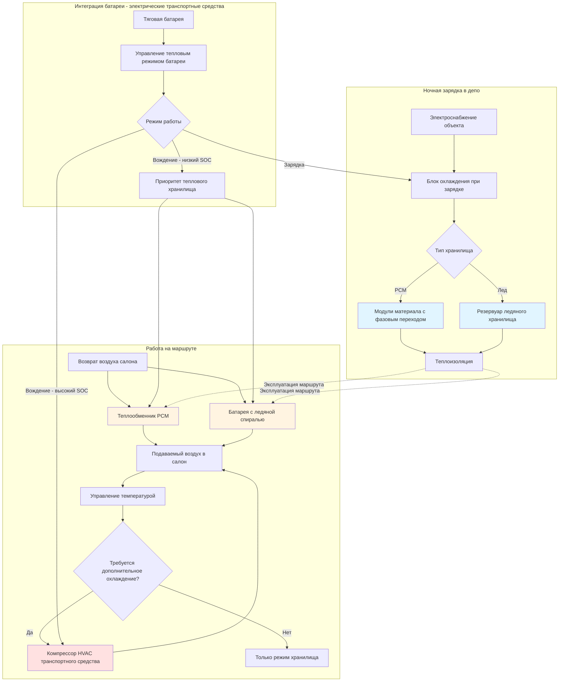

Системы теплового аккумулирования в HVAC приложениях массового транспорта разделяют производство холода и спрос на холод, позволяя снизить затраты на энергию, уменьшить пиковые нагрузки и улучшить запас хода электрических транспортных средств. Благодаря предварительной подготовке транспортных средств в периоды низкого спроса и сохранению тепловой энергии, операторы транспорта снижают плату за пиковые нагрузки и операционные расходы при сохранении комфорта пассажиров.

## Основы теплового аккумулирования

Емкость теплового хранилища зависит от массы носителя, удельной теплоемкости и температурного перепада для чувствительного тепла или скрытой теплоты плавления для материалов с фазовым переходом.

**Емкость аккумулирования чувствительного тепла:**

$$Q_{\text{sensible}} = m \cdot c_p \cdot \Delta T$$

Где:
- $Q_{\text{sensible}}$ = емкость хранилища (кДж)
- $m$ = масса носителя хранилища (кг)
- $c_p$ = удельная теплоемкость (кДж/кг-K)
- $\Delta T$ = температурный перепад (K)

**Емкость аккумулирования скрытого тепла:**

$$Q_{\text{latent}} = m \cdot h_{fg}$$

Где:
- $Q_{\text{latent}}$ = емкость хранилища (кДж)
- $m$ = масса материала с фазовым переходом (кг)
- $h_{fg}$ = скрытая теплота плавления (кДж/кг)

**Полное хранилище с PCM:**

$$Q_{\text{total}} = m \left[ c_{p,s} (T_m - T_1) + h_{fg} + c_{p,l} (T_2 - T_m) \right]$$

Где:
- $c_{p,s}$ = удельная теплоемкость твердой фазы
- $c_{p,l}$ = удельная теплоемкость жидкой фазы
- $T_m$ = температура плавления
- $T_1$ = начальная температура
- $T_2$ = конечная температура

**Эффективность хранилища:**

$$\eta_{\text{storage}} = \frac{Q_{\text{discharged}}}{Q_{\text{charged}}} = \frac{Q_{\text{useful}}}{Q_{\text{input}}}$$

Практическая эффективность хранилища находится в диапазоне 75-90%, учитывая тепловые потери при хранении, неполный фазовый переход и потери при распределении.

## Сравнение технологий хранилищ

| Технология | Энергетическая плотность | Температура фазового перехода | Теплопроводность | Количество циклов | Относительная стоимость | Пригодность для транспорта |
|------------|----------------|-------------------|---------------------|------------|---------------|---------------------|
| Вода (чувствительное тепло) | 210-280 кДж/кг (22°C ΔT) | N/A | 0.61 Вт/м-K | Неограниченное | Низкая (1,0×) | Ограниченная - объем |
| Лед (вода) | 335 кДж/кг | 0°C | 2.22 Вт/м-K (лед) | Неограниченное | Низкая (1,2×) | Хорошая - проверенная |
| Соляные гидраты | 280-410 кДж/кг | 7-29°C | 0.52-0.86 Вт/м-K | 5 000-10 000 | Средняя (2-3×) | Хорошая - настраиваемая |
| Парафиновый воск | 175-220 кДж/кг | 10-24°C | 0.21-0.26 Вт/м-K | 10 000+ | Средняя (2,5-4×) | Отличная - стабильная |
| Эвтектические растворы | 210-280 кДж/кг | -4-16°C | 0.69-1.04 Вт/м-K | 3 000-8 000 | Высокая (4-5×) | Хорошая - высокая плотность |
| PCM с графитом | 165-210 кДж/кг | 10-24°C | 3.46-8.66 Вт/м-K | 10 000+ | Высокая (5-7×) | Отличная - быстрый отклик |

## Системы хранилищ с материалами с фазовым переходом

Системы PCM сохраняют охлаждающую емкость в компактных корпусах, которые претерпевают фазовые переходы твердое-жидкое в желаемом температурном диапазоне.

**Критерии выбора PCM:**

Приложения в транспорте требуют PCM с температурами плавления между 10-18°C для поддержания температуры в салоне при одновременной максимизации плотности хранилища. Ключевые параметры выбора включают:

- **Температура плавления**: 13-16°C оптимальная для комфорта пассажиров без переохлаждения
- **Скрытое тепло**: Минимум 165 кДж/кг для приемлемой энергетической плотности
- **Теплопроводность**: Улучшенные формулировки (>0.86 Вт/м-K) снижают время зарядки
- **Переохлаждение**: Менее 2-3°C для обеспечения надежного инициирования разряда
- **Химическая стабильность**: Отсутствие деградации в течение 10+ лет и 10 000+ циклов
- **Совместимость контейнеров**: Некоррозионный к алюминию, нержавеющей стали или полимерным корпусам

**Конфигурация системы PCM:**

Модули PCM устанавливаются в верхние отсеки, под сиденья или в выделенные отсеки оборудования. Типичные конфигурации включают:

- **Плоские модули**: Панели толщиной 2,5-7,5 см с внутренними мешками PCM, теплопередача со стороны воздуха
- **Трубка в резервуаре**: PCM окружающий холодильный агент или глицольные трубки для зарядки и разряда со стороны воздуха
- **Микрокапсулированный PCM**: Суспензионные системы, прокачиваемые через теплообменники, более высокая теплопроводность

**Стратегия зарядки:**

Ночная зарядка происходит во время стоянки в депо, когда транспортные средства подключаются к электроснабжению объекта. Процесс зарядки следует:

$$Q_{\text{charge}} = \dot{m}_{\text{ref}} \cdot \Delta h_{\text{ref}} \cdot t_{\text{charge}}$$

Где:
- $\dot{m}_{\text{ref}}$ = массовый расход холодильного агента
- $\Delta h_{\text{ref}}$ = изменение энтальпии холодильного агента через испаритель
- $t_{\text{charge}}$ = время зарядки (обычно 6-8 часов)

Стандартная зарядка использует выделенные системы охлаждения, работающие при температуре испарителя 4-7°C для замораживания PCM ночью. Мощность зарядки обычно находится в диапазоне 3,7-8,8 кВт на транспортное средство.

**Производительность разряда:**

Во время движения транспортного средства, воздух салона циркулирует через модули PCM, поглощая сохраненное охлаждение. Скорость разряда зависит от теплопередачи со стороны воздуха:

$$Q_{\text{discharge}} = \dot{m}_{\text{air}} \cdot c_{p,air} \cdot (T_{\text{air,in}} - T_{\text{air,out}})$$

Длительность разряда составляет 2-4 часа на номинальной емкости перед полным плавлением PCM и истощением хранилища. Это охватывает типичные маршруты автобусов или циклы железнодорожных вагонов между возвращениями в депо.

## Системы ледяного хранилища

Тепловое хранилище на основе льда использует высокую скрытую теплоту воды (335 кДж/кг) и предсказуемый фазовый переход при 0°C для надежной, проверенной работы.

**Типы конфигурации ледяного хранилища:**

1. **Лед на трубке**: Холодильный агент или глицольные трубки погружены в водяной резервуар, лед образуется вокруг трубок во время зарядки
2. **Сбор льда**: Лед образуется на пластинах испарителя, периодический цикл сбора выпускает лед в бункер хранилища
3. **Ледяная суспензия**: Мелкие кристаллы льда взвешены в теплоносителе, перекачиваемое хранилище
4. **Инкапсулированный лед**: Заполненные водой сферы или мешки замерзают во время зарядки, погружены в теплоноситель

**Расчет размера системы:**

Масса льда, требуемая для обеспечения охлаждающей емкости Q в течение времени t:

$$m_{\text{ice}} = \frac{Q \cdot t}{h_{fg,ice} \cdot \eta_{\text{discharge}}}$$

Для охлаждающей нагрузки 17,5 кВт в течение 3 часов с эффективностью разряда 80%:

$$m_{\text{ice}} = \frac{17,5 \times 3}{335 \times 0,80} = 186 \text{ кг (186 л)}$$

Это представляет значительный вес (3-4% GVW транспортного средства для полного покрытия маршрута), ограничивая ледяное хранилище приложениями с короткими циклами или гибридной работой.

**Преимущества ледяного хранилища:**

- Проверенная технология со 100+ летней историей эксплуатации
- Высокая энергетическая плотность на единицу массы
- Предсказуемая, постоянная производительность
- Низкая стоимость материала
- Нетоксичное, экологически безопасное
- Отсутствие деградации в течение неограниченного количества циклов замораживания-оттаивания

**Проблемы ледяного хранилища:**

- Высокая температура замораживания (0°C) требует подморозного охлаждения
- Расширение объема при замораживании (9%) требует размещения
- Штраф по весу в мобильных приложениях
- Медленная зарядка из-за накопления теплового сопротивления льда
- Требует контейнеризации для жидкой воды при разряде

## Проектирование систем теплового хранилища

## Стратегии ночной предварительной подготовки

Предварительная подготовка транспортных средств во время ночной стоянки в депо снижает потребление энергии при утреннем выезде и обеспечивает комфорт пассажиров с начала обслуживания.

**Компоненты предварительной подготовки:**

1. **Зарядка теплового хранилища**: Замораживание PCM или льда с использованием электричества низкого спроса по сниженным тарифам
2. **Снижение температуры в салоне**: Поддержание 13-18°C во время хранения для сокращения времени восстановления отопления
3. **Предварительный нагрев батареи** (электрические транспортные средства): Нагрев тяговой батареи до оптимальной рабочей температуры (20-25°C)
4. **Этапность системы HVAC**: Последовательность компрессоров и вентиляторов для избежания пиков спроса при подготовке нескольких транспортных средств

**Сдвиг энергии по времени:**

Предварительная подготовка сдвигает потребление энергии HVAC с пиковых дневных периодов (14:00-20:00 типично) на периоды низкого спроса (22:00-6:00). Структуры тарифов коммунальных служб обеспечивают экономический стимул:

- **Пиковые тарифы**: 0,17-0,39/кВч с платой за спрос 18-29 $/кВт
- **Тарифы вне пиков**: 0,06-0,13/кВч со сниженной или нулевой платой за спрос
- **Потенциальная экономия**: Снижение эксплуатационных расходов HVAC на 40-60%

**Протокол готовности к отправке:**

Автоматические последовательности предварительной подготовки запускаются за 1-3 часа до запланированного отправления на основе условий окружающей среды и требований маршрута:

1. **T-180 мин**: Начало зарядки теплового хранилища, если не завершено
2. **T-120 мин**: Включение отопления салона (зима) или активация разряда хранилища (лето)
3. **T-60 мин**: Увеличение HVAC для поддержания уставки (20-22°C)
4. **T-30 мин**: Завершение предварительного кондиционирования батареи для электрических транспортных средств
5. **T-10 мин**: Проверка всех систем, запись потребления энергии
6. **T-0**: Отправка транспортного средства с салоном при температуре, хранилище заряжено

## Снижение пиковых нагрузок и управление нагрузкой

Тепловое хранилище позволяет транспортным средствам общественного транспорта работать с HVAC системами с пониженным или исключенным временем работы компрессора во время пиковых периодов электрического спроса.

**Принцип снижения пиков:**

Общая HVAC нагрузка состоит из базового требования охлаждения плюс дополнительная емкость:

$$Q_{\text{total}}(t) = Q_{\text{base}}(t) + Q_{\text{supplemental}}(t)$$

Тепловое хранилище обеспечивает $Q_{\text{base}}$, в то время как компрессор работает только когда:

$$Q_{\text{required}}(t) > Q_{\text{storage}}(t)$$

**Расчеты снижения спроса:**

Средняя мощность компрессора HVAC для 40-футового автобуса: 8,8-13,2 кВт во время пикового охлаждения

С тепловым хранилищем, покрывающим 60% охлаждающей нагрузки:

$$P_{\text{reduction}} = 0,60 \times P_{\text{compressor}} = 0,60 \times 11\text{ кВт} = 6,6\text{ кВт}$$

Для флота из 100 транспортных средств:

$$\text{Снижение пикового спроса} = 100 \times 6,6\text{ кВт} = 660\text{ кВт}$$

При плате за спрос $23/кВт в месяц:

$$\text{Ежемесячная экономия} = 660\text{ кВт} \times \$23/\text{кВт} = \$15 180$$

**Стратегия гибридной работы:**

Оптимальная работа теплового хранилища балансирует разряд хранилища с работой компрессора:

- **Ранний сегмент маршрута** (0-90 мин): Хранилище обеспечивает 80-100% охлаждения, компрессор отключен или минимальная работа
- **Средний сегмент маршрута** (90-180 мин): Вклад хранилища снижается до 40-60%, компрессор работает по мере необходимости
- **Поздний сегмент маршрута** (180+ мин): Хранилище истощено, компрессор обеспечивает полную нагрузку

Эта стратегия максимизирует снижение спроса во время пиковых периодов системы при обеспечении непрерывного комфорта пассажиров.

## Интеграция батареи для электрических транспортных средств

Тепловое хранилище электрических автобусов и железнодорожных вагонов интегрируется с системами тяговых батарей для оптимизации полного управления энергией.

**Интеграция состояния заряда батареи:**

Алгоритмы управления HVAC регулируют работу компрессора на основе SOC батареи:

$$P_{\text{HVAC,max}}(t) = f(\text{SOC}, T_{\text{ambient}}, Q_{\text{required}})$$

Типичные пороги управления:

- **SOC > 60%**: Нормальная работа HVAC, компрессор без ограничений
- **SOC 40-60%**: Приоритет теплового хранилища, компрессор ограничен на 50% емкости
- **SOC 20-40%**: Только режим хранилища, компрессор отключен кроме аварийного переопределения
- **SOC < 20%**: Сниженная вентиляция, только аварийная работа

**Расширение запаса хода:**

Тепловое хранилище снижает потребление электричества HVAC во время эксплуатации маршрута, расширяя запас хода транспортного средства. Для электрического автобуса с батареей 128 кВтч и 73 кВтч полезной емкости:

Среднее потребление HVAC без хранилища: 8,3-9,9 кВтч на 100 км

С покрытием 60% нагрузки от теплового хранилища:

$$E_{\text{HVAC,reduced}} = 9,1 \times 0,40 = 3,6\text{ кВтч на 100 км}$$

Расширение запаса хода:

$$\Delta R = \frac{(9,1 - 3,6)\text{ кВтч}}{73\text{ кВтч}} \times R_{\text{base}} = 7,6\%$$

Для базового запаса хода 250 км, тепловое хранилище добавляет примерно 19 км запаса хода.

**Интеграция рекуперативного торможения:**

Продвинутые системы захватывают энергию рекуперативного торможения для зарядки теплового хранилища во время эксплуатации маршрута:

$$E_{\text{regen,storage}} = \eta_{\text{regen}} \times \eta_{\text{conversion}} \times E_{\text{braking}}$$

При эффективности рекуперации 65% и эффективности преобразования 85%, примерно 55% энергии торможения могут зарядить тепловое хранилище во время частых циклов остановки-движения.

## Стандарты и нормативная база

Системы теплового аккумулирования в приложениях общественного транспорта должны соответствовать стандартам безопасности транспортных средств, электрическим и HVAC стандартам производительности.

**Федеральные стандарты безопасности автотранспортных средств (FMVSS):**

- FMVSS 301: Целостность топливной системы применяется к глицольным тепловым хранилищам
- FMVSS 302: Воспламеняемость внутренних материалов регулирует материалы контейнеров PCM
- Распределение веса: Масса теплового хранилища должна поддерживать пределы нагрузки на переднюю/заднюю оси

**SAE J2889: Безопасность системы накопления электрической энергии электрических транспортных средств:**

Рассматривает интеграцию управления тепловым режимом для электрических транспортных средств, включая интерфейс теплового хранилища с системами батареи.

**IEEE 1143: Электрические силовые системы для транспортных средств общественного транспорта:**

Регулирует интерфейс инфраструктуры зарядки, требования к электроснабжению в ночное время и защиту от замыканий на землю для систем зарядки теплового хранилища.

**Стандарты APTA:**

- **APTA PR-M-S-016**: Требования к емкости охлаждения HVAC, которые должна удовлетворять система теплового хранилища
- **APTA BTS-VIM**: Осмотр и техническое обслуживание транспортных средств, рассматривающие техническое обслуживание системы теплового хранилища

**Международные стандарты:**

- **ISO 21363**: Транспортные средства на топливных элементах - безопасность системы хранения (применимо к тепловому хранилищу)
- **EN 14750-1**: Железнодорожные приложения - кондиционирование воздуха для городских железнодорожных транспортных средств
- **VDI 2167**: Аккумулирование тепловой энергии (немецкий инженерный стандарт)

## Соображения по установке и обслуживанию

**Требования к монтажу:**

Модули теплового хранилища испытывают ускорение, торможение и боковые силы транспортного средства, требующие надежного крепления:

- **Продольное ускорение**: ±0,3-0,5 г при нормальной работе, до 1,0 г при экстренном торможении
- **Боковое ускорение**: 0,2-0,4 г при повороте
- **Вертикальное ускорение**: 0,5-1,5 г на неровностях дороги или стыках пути

Кронштейны крепления должны удерживать массу хранилища при предельной нагрузке 3-5 g по всем осям.

**Протоколы обслуживания:**

1. **Ежемесячный осмотр**: Визуальная проверка утечек, надежности крепления, состояния изоляции
2. **Ежеквартальное тестирование**: Проверка емкости зарядки/разряда, датчиков температуры, функций управления
3. **Годовое обслуживание**: Проверка утечек холодильного агента, очистка теплообменника, проверка целостности контейнера
4. **Трехлетнее обслуживание**: Анализ образца PCM (если применимо), замена деградированных компонентов

**Ожидаемый срок службы:**

- **Ледяное хранилище**: 15-20 лет (интервалы замены резервуара и спирали)
- **Хранилище PCM**: 10-15 лет (зависит от циклирования и стабильности формулировки)
- **Управление и датчики**: 5-8 лет
- **Изоляция**: 10-15 лет

Системы теплового аккумулирования предоставляют операторам транспорта эффективное снижение расходов на энергию, улучшенную эксплуатационную эффективность и повышенный комфорт пассажиров через стратегическое сдвижение нагрузок и управление пиковым спросом. Интеграция с системами батарей электрических транспортных средств и интеллектуальные алгоритмы управления максимизируют предложение стоимости для современных флотов транспорта.
