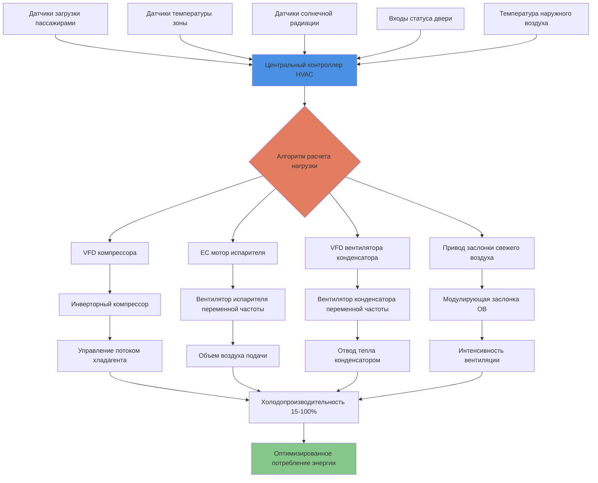

Системы HVAC с переменной частотой представляют собой наиболее значительный прогресс в повышении энергоэффективности транспортных средств, снижая потребление вспомогательной мощности на 25-45% по сравнению с системами фиксированной производительности. Эти системы используют частотные преобразователи (VFD), электромоторы с электронной коммутацией и инверторные компрессоры для модуляции выходной мощности охлаждения и отопления в ответ на фактические тепловые нагрузки, а не циклирование включения/отключения на полной мощности.

## Основы технологии частотных преобразователей

Технология VFD управляет скоростью асинхронного двигателя путем изменения как частоты, так и напряжения, подаваемого на двигатель. Взаимосвязь между скоростью двигателя и потреблением мощности соответствует законам подобия, создавая существенное энергосбережение при пониженных нагрузках.

**Взаимосвязь потребления мощности:**

$$P_2 = P_1 \left(\frac{N_2}{N_1}\right)^3$$

Где:
- $P_1$ = мощность на полной скорости (кВ)
- $P_2$ = мощность при пониженной скорости (кВ)
- $N_1$ = полная скорость двигателя (об/мин)
- $N_2$ = пониженная скорость двигателя (об/мин)

**Пример расчета:**

Вентилятор мощностью 10 кВ, работающий на скорости 60%:

$$P_2 = 10 \text{ кВ} \times (0.60)^3 = 10 \times 0.216 = 2.16 \text{ кВ}$$

Это представляет сокращение мощности на 78,4%, демонстрируя кубическое соотношение между скоростью и потреблением мощности.

**Коэффициент энергосбережения VFD:**

$$\text{ESF} = 1 - \left(\frac{N_2}{N_1}\right)^3$$

Для типичных условий эксплуатации транспорта:

| Отношение скорости | Потребление мощности | Энергосбережение |
|-------------|-------------------|----------------|
| 100% | 100% | 0% |
| 90% | 72,9% | 27,1% |
| 80% | 51,2% | 48,8% |
| 70% | 34,3% | 65,7% |
| 60% | 21,6% | 78,4% |
| 50% | 12,5% | 87,5% |

## Технология инверторного компрессора

Системы HVAC транспорта все чаще используют инверторные спиральные или роторные компрессоры, которые модулируют производительность от 15-100% через работу с переменной частотой. Это исключает неэффективное циклирование включения/отключения, характерное для систем фиксированной производительности.

**Модуляция производительности компрессора:**

$$\dot{Q}_c = \dot{Q}_{rated} \times \left(\frac{f_{inv}}{f_{rated}}\right)$$

Где:
- $\dot{Q}_c$ = холодопроизводительность компрессора (кДж/ч)
- $\dot{Q}_{rated}$ = номинальная производительность при проектной частоте (кДж/ч)
- $f_{inv}$ = частота инвертора (Гц)
- $f_{rated}$ = номинальная частота (обычно 60 Гц)

**Мощность компрессора при частичной нагрузке:**

$$P_{comp} = P_{rated} \times \left[\left(\frac{f_{inv}}{f_{rated}}\right)^{0.8} \times 0.85 + 0.15\right]$$

Постоянная 0,15 представляет фиксированные потери (насос смазки, управление), в то время как экспоненциальный коэффициент 0,8 отражает улучшенную эффективность при частичной нагрузке по сравнению с простым кубическим соотношением.

**Производительность инверторного компрессора:**

| Частота | Производительность | Входная мощность | COP | Эффективность vs фиксированная |
|-----------|----------|-------------|-----|---------------------|
| 60 Гц | 100% | 100% | 3,0 | Базовая |
| 50 Гц | 83% | 73% | 3,4 | +13% |
| 40 Гц | 67% | 51% | 3,9 | +30% |
| 30 Гц | 50% | 33% | 4,5 | +50% |
| 20 Гц | 33% | 21% | 4,7 | +57% |

## Применение двигателей с электронной коммутацией

Двигатели EC (бесщеточные двигатели постоянного тока с интегрированными инверторами) обеспечивают превосходную эффективность для вентиляторных приложений в HVAC транспорта. Эти двигатели устраняют потери скольжения, присущие асинхронным двигателям переменного тока, и сохраняют высокую эффективность во всем диапазоне скоростей.

**Сравнение эффективности двигателя EC:**

| Рабочая точка | Асинхронный двигатель AC | Двигатель EC | Прирост эффективности |
|----------------|-------------------|----------|-----------------|
| Скорость 100% | 82% | 90% | +9,8% |
| Скорость 75% | 78% | 89% | +14,1% |
| Скорость 50% | 68% | 87% | +27,9% |
| Скорость 25% | 45% | 82% | +82,2% |

**Энергосбережение двигателя EC:**

$$\Delta P = P_{AC} \left(1 - \frac{\eta_{AC}}{\eta_{EC}}\right)$$

Для вентилятора 3 кВ на скорости 50%:

$$P_{AC} = 3 \text{ кВ} \times (0.50)^3 / 0.68 = 0.551 \text{ кВ}$$
$$P_{EC} = 3 \text{ кВ} \times (0.50)^3 / 0.87 = 0.431 \text{ кВ}$$
$$\Delta P = 0.551 - 0.431 = 0.120 \text{ кВ (21,8% энергосбережения)}$$

## Стратегии управления по потребности

Передовые системы HVAC транспорта используют датчики нагрузки в реальном времени для оптимизации подачи производительности и минимизации потерь энергии.

**Интеграция подсчета пассажиров:**

Современные транспортные средства включают автоматические счетчики пассажиров (APC), использующие инфракрасные, стереовизионные датчики или датчики веса. Системы HVAC используют эти данные для модуляции вентиляции и холодопроизводительности.

$$\dot{Q}_{occ} = N_{passengers} \times (SHG + LHG)$$

Где:
- $N_{passengers}$ = количество пассажиров в реальном времени
- $SHG$ = чувствительный тепловой выход на пассажира = 238 кДж/ч
- $LHG$ = скрытый тепловой выход на пассажира = 185 кДж/ч

**Модуляция вентиляции:**

$$CFM_{OA} = \max(CFM_{min}, N_{passengers} \times 15 \text{ CFM/person}) = \max(CFM_{min}, N_{passengers} \times 0.424 \text{ м³/ч/person})$$

Это обеспечивает соответствие требованиям ASHRAE 62.1, избегая штрафов на энергию от избыточной вентиляции в периоды низкой занятости.

**Распределение нагрузки по зонам:**

Транспортные средства обычно используют 2-4 зоны HVAC с независимым управлением температурой:

$$\dot{Q}_{zone,i} = UA_i(T_{ambient} - T_{setpoint,i}) + \dot{Q}_{solar,i} + \dot{Q}_{occ,i} + \dot{Q}_{infiltration,i}$$

Системы с переменной частотой распределяют производительность компрессора пропорционально:

$$f_{comp,i} = f_{min} + (f_{max} - f_{min}) \times \frac{\dot{Q}_{zone,i}}{\dot{Q}_{total}}$$

## Энергосбережение по условиям эксплуатации

Транспортные средства испытывают сильно переменные тепловые нагрузки во время ежедневной эксплуатации. Системы с переменной частотой эффективно адаптируются к этим изменяющимся условиям.

**Сравнение энергии профиля ежедневной эксплуатации:**

| Условие эксплуатации | Коэффициент нагрузки | Продолжительность | Энергия фиксированной системы | Энергия системы с переменной частотой | Экономия |
|---------------------|----------|-----|-----|-----|---------|
| Восстановление после нагрева на солнце | 100% | 15 мин | 2,6 кВт·ч | 2,6 кВт·ч | 0% |
| Пиковое обслуживание (час пик) | 80-100% | 90 мин | 14,2 кВт·ч | 11,8 кВт·ч | 17% |
| Дневное обслуживание | 50-70% | 180 мин | 18,9 кВт·ч | 11,3 кВт·ч | 40% |
| Внепиковое обслуживание | 30-50% | 120 мин | 12,6 кВт·ч | 5,7 кВт·ч | 55% |
| Стоянка/готовность | 15-25% | 75 мин | 7,9 кВт·ч | 2,2 кВт·ч | 72% |
| **Итого в сутки** | Переменная | 8 часов | **56,2 кВт·ч** | **33,6 кВт·ч** | **40,2%** |

**Влияние сезонности на энергию:**

Системы с переменной частотой обеспечивают наибольшее энергосбережение в переходные сезоны, когда нагрузки постоянно остаются ниже условий пикового проектирования.

| Сезон | Средняя нагрузка | Ежедневная энергия фиксированной системы | Ежедневная энергия системы с переменной частотой | Экономия |
|--------|---------|---------------------------|------------------------------|---------|
| Летний пик | 85% | 53,5 кВт·ч | 38,5 кВт·ч | 28% |
| Летнее среднее | 65% | 51,4 кВт·ч | 29,8 кВт·ч | 42% |
| Весна/осень | 45% | 49,3 кВт·ч | 23,2 кВт·ч | 53% |
| Зимнее отопление | 55% | 45,1 кВт·ч | 27,1 кВт·ч | 40% |

## Стандарты и требования реализации

Транспортные агентства все чаще требуют системы HVAC с переменной частотой в спецификациях закупок для достижения целей по энергии и сокращению выбросов.

**Требования FTA по энергоэффективности:**

Климатические цели Администрации Федерального транзита поощряют технологию переменной частоты:

- Целевые показатели потребления вспомогательной мощности: <31,5 кВт·ч на транспортное средство в сутки для стандартного автобусного обслуживания
- Минимальный коэффициент производительности (COP): 2,8 при условиях номинального рейтинга AHRI
- Требуется рейтинг эффективности при частичной нагрузке при 25%, 50% и 75% производительности
- Мощность HVAC на холостом ходу ограничена <1,6 кВ для режима готовности с пассажирами

**Рекомендуемые методики APTA:**

Стандарты Американской ассоциации общественного транспорта для современного HVAC транспорта:

- Компрессор с переменной частотой с минимальным диапазоном модуляции 15-100%
- Технология двигателя EC для всех вентиляторных приложений >264 Вт
- Управление вентиляцией по потребности на основе занятости или датчика CO₂
- Возможность мониторинга и отчетности по энергии с разрешением данных 1 минута

**Европейские стандарты EN:**

EN 14750-1 (Железнодорожные приложения - Кондиционирование воздуха для подвижного состава городских и пригородных железных дорог):

- Методология расчета индекса энергоэффективности (EEI) для сравнительного рейтинга
- Требования сезонного коэффициента энергоэффективности (SEER) для систем переменной производительности
- Минимальный COP при частичной нагрузке: 3,4 при 50% производительности, 3,7 при 25% производительности
- Пределы потребления мощности в режиме готовности: <525 Вт для кондиционирования незанятого транспортного средства

## Оптимизация алгоритма управления

Передовые системы с переменной частотой используют прогнозирующие алгоритмы, которые предугадывают изменения нагрузки и оптимизируют распределение компрессора.

**Пропорционально-интегральное управление:**

$$f_{inv}(t) = f_{base} + K_p \cdot e(t) + K_i \int_0^t e(\tau) d\tau$$

Где:
- $f_{inv}(t)$ = команда частоты инвертора (Гц)
- $f_{base}$ = базовая частота из модели нагрузки (Гц)
- $K_p$ = пропорциональный коэффициент усиления (Гц/°C)
- $K_i$ = интегральный коэффициент усиления (Гц/°C-сек)
- $e(t)$ = ошибка температуры (°C)

Типичные параметры настройки для приложений транспорта:
- $K_p$ = 3,6-7,2 Гц/°C (агрессивный отклик на быстрые изменения нагрузки)
- $K_i$ = 0,18-0,54 Гц/°C-сек (ограниченное интегральное действие для предотвращения перерегулирования)

**Прогнозирующее моделирование нагрузки:**

Маршрутные системы используют данные GPS и исторические данные для прогнозирования изменений нагрузки:

$$\dot{Q}_{predicted}(t+\Delta t) = \dot{Q}_{historical}(location, time, DOW) + \Delta\dot{Q}_{weather}$$

Это позволяет предварительное распределение компрессора перед событиями высокой нагрузки (открытия дверей, остановки на станциях) и агрессивное снижение нагрузки во время предсказуемых низконагруженных периодов (работа в туннеле, движение по автостраде).

Системы HVAC с переменной частотой обеспечивают существенное энергосбережение, улучшенный комфорт пассажиров благодаря постоянному управлению температурой, сниженный шум во время низконагруженной эксплуатации и расширенный срок службы оборудования благодаря исключению жесткого пускового циклирования. Первоначальные затраты премиум-класса 15-25% достигают окупаемости в течение 2-4 лет благодаря сокращению потребления энергии и расходов на техническое обслуживание, что делает технологию переменной частоты стандартом для современного управления климатом транспортных средств.
