## Требования к размещению оборудования

Размещение оборудования HVAC в транспортных средствах массового транспорта требует тщательного рассмотрения целостности конструкции, зазорных габаритов, доступности для технического обслуживания и эксплуатационных ограничений. Выбор между креплением на крышу, под пол и в конец вагона напрямую влияет на распределение веса транспортного средства, пассажировместимость и долгосрочную пригодность к обслуживанию.

## Сравнение конфигураций размещения

```mermaid
graph TD
    A[Опции размещения HVAC в транспорте] --> B[Крепление на крышу]
    A --> C[Крепление под полом]
    A --> D[Крепление в конце вагона]

    B --> B1[Центр крыши]
    B --> B2[Разделенные блоки на крыше]
    B --> B3[Компактная конструкция]

    C --> C1[Центральное подвешивание]
    C --> C2[Крепление сбоку]
    C --> C3[Модульные пакеты]

    D --> D1[Один конец]
    D --> D2[Оба конца]
    D --> D3[Связанная конфигурация]

    B1 --> E[Анализ распределения веса]
    C1 --> E
    D1 --> E

    E --> F[Проверка конструкции]
    F --> G[Проверка зазоров]
    G --> H[Проверка доступности для обслуживания]

    style A fill:#1a472a
    style B fill:#2e7d32
    style C fill:#388e3c
    style D fill:#43a047
    style E fill:#ffa000
    style F fill:#ff6f00
    style G fill:#e65100
    style H fill:#d84315
```

## Конфигурация крепления на крышу

Размещение HVAC на крыше остается преобладающей конфигурацией для железнодорожных вагонов и многих автобусных приложений благодаря максимальному использованию площади пола и упрощенному отводу конденсата.

### Конструктивные соображения

Крышная конструкция должна выдерживать статические и динамические нагрузки:

$$W_{total} = W_{equipment} + W_{mounting} + W_{ductwork} + W_{access}$$

где каждый компонент вносит вклад в общий поддерживаемый вес, обычно 360-680 кг на одно HVAC устройство.

Возвышение центра тяжести следует:

$$CG_{vertical} = \frac{\sum_{i=1}^{n} (W_i \times h_i)}{W_{total}}$$

где $h_i$ представляет вертикальную высоту каждого компонента от опорной поверхности. Повышенный центр тяжести влияет на устойчивость транспортного средства, особенно при ускорении, торможении и повороте.

Амплификация динамической нагрузки:

$$F_{dynamic} = W_{equipment} \times (1 + a_f)$$

где $a_f$ представляет коэффициент ускорения, обычно 2,0–3,0 для железнодорожных приложений и 3,0–4,5 для автобусных приложений согласно стандартам IEEE 1476 и SAE J2452.

### Требования к зазорам

Оборудование на крыше должно обеспечивать зазор от наружных контактных систем и профилей туннелей:

| Тип транспортного средства | Минимальный зазор | Нормативная ссылка |
|---------------------------|------------------|-------------------|
| Метро (3-рельс) | 3,8 м общей высоты | NFPA 130 |
| Легкий рельсовый транспорт (контактный провод) | 45 см ниже контактного провода | IEEE 1476 |
| Пригородный поезд (контактный провод) | 60 см ниже контактного провода | FRA standards |
| Троллейбус | 50 см ниже троллейного провода | APTA RT-VIM |
| Дизельный автобус | Зависит от профиля | SAE J1263 |

Компактные крышные блоки достигают высоты 20–30 см благодаря конструкции компактного теплообменника и поперечному расположению вентиляторов.

## Конфигурация крепления под полом

Размещение под полом сохраняет низкие профили транспортного средства и защищает оборудование от вандализма, что особенно подходит для автобусов с низким полом и железнодорожных операций с ограниченным зазором.

### Распределение пространства

Ограничения объема под полом требуют компактных пакетов оборудования:

$$V_{available} = L_{bay} \times W_{bay} \times H_{clearance}$$

Типичные размеры:
- Длина ($L_{bay}$): 150–245 см
- Ширина ($W_{bay}$): 60–90 см
- Высота ($H_{clearance}$): 45–60 см

Оборудование должно обеспечивать минимальный зазор 10 см от земли при полной нагрузке, увеличиваясь до 15–20 см для операций на пересеченной местности или в условиях снежных маршрутов.

### Проблемы управления тепловым режимом

Оборудование под полом сталкивается с повышенными температурами окружающей среды из-за излучения поверхности дороги и близости к силовой установке:

$$T_{ambient,underfloor} = T_{ambient,air} + \Delta T_{road} + \Delta T_{proximity}$$

где $\Delta T_{road}$ колеблется 5–11 °C на летнем асфальте и $\Delta T_{proximity}$ добавляет 8–17 °C вблизи дизельных двигателей или тяговых двигателей. Размер конденсатора должен учитывать эти повышенные условия, обычно требуя проектирования по окружающей среде 46–52 °C по сравнению с 35 °C для крышных блоков.

## Крепление в конце вагона

Размещение в конце вагона позиционирует оборудование HVAC в зонах тамбура или в специальных отделениях оборудования, что является обычным явлением в конструкциях сочленённых автобусов и некоторых конфигураций пригородных поездов.

### Преимущества доступности

Крепление в конце обеспечивает доступ к оборудованию на уровне земли или платформы, сокращая время обслуживания и устраняя опасения безопасности на крыше. Технические специалисты могут обслуживать компоненты без специализированного оборудования доступа или занятия пути.

### Влияние на пространство пассажиров

Анализ вторжения оборудования:

$$S_{lost} = (L_{equipment} + L_{access}) \times W_{equipment}$$

Типичные потери составляют 4–6 м² на конец транспортного средства, что эквивалентно 4–6 стоящим пассажирам или 2–3 сидячим местам.

## Матрица выбора размещения

| Критерий | На крышу | Под полом | На конец вагона |
|----------|----------|----------|-----------------|
| Сложность конструкции | Средняя | Высокая | Низкая |
| Чувствительность к зазорам | Высокая | Средняя | Низкая |
| Доступность для обслуживания | Затруднена | Очень затруднена | Легкая |
| Влияние на пространство пассажиров | Минимальное | Минимальное | Среднее |
| Защита оборудования | Средняя | Высокая | Средняя |
| Первоначальная стоимость | Базовая | +15–25% | +10–15% |
| Ожидаемый срок службы | 12–15 лет | 8–12 лет | 12–15 лет |

## Расчеты распределения веса

Надлежащее распределение веса сохраняет динамические характеристики транспортного средства:

$$\Delta CG_{longitudinal} = \frac{W_{HVAC} \times L_{offset}}{W_{vehicle}}$$

Максимально допустимый сдвиг центра тяжести обычно ограничен 5–8 см для сохранения баланса торможения и предотвращения дисбалансов нагрузки на колеса, превышающих 5%.

Проверка нагрузки на оси:

$$Load_{axle} = \frac{W_{HVAC}}{2} \pm \frac{W_{HVAC} \times d_{CG}}{L_{wheelbase}}$$

где $d_{CG}$ представляет расстояние от центра тяжести оборудования до центральной линии транспортного средства.

## Требования к виброизоляции

Окружающая среда транспортного средства общественного транспорта создает суровые условия вибрации:

$$f_{natural} = \frac{1}{2\pi}\sqrt{\frac{k}{m}}$$

где $k$ представляет жесткость пружины изолятора и $m$ равна поддерживаемой массе. Собственная частота должна оставаться ниже 6–8 Гц для крепления на крышу и 8–10 Гц для крепления под полом, чтобы предотвратить резонанс с конструктивными модами транспортного средства.

Прогиб изоляции под динамической нагрузкой:

$$\delta_{max} = \frac{F_{dynamic}}{k \times n_{isolators}}$$

Типичные прогибы составляют 0,6–1,3 см при максимальных условиях нагрузки.

## Стандарты доступности для обслуживания

Руководящие принципы APTA указывают:

- Минимальный рабочий зазор 60 см как минимум с двух сторон оборудования
- Доступ инструмента ко всем компонентам, требующим обслуживания, без удаления соседнего оборудования
- Доступ к фильтру в течение 10 минут с внешней стороны транспортного средства
- Полное удаление блока в течение 2-часового окна обслуживания

Оборудование на крыше требует систем защиты от падения согласно OSHA 1910.23, когда высота крыши превышает 1,8 м или доступ на платформе недоступен.

## Управление конденсатом

Требования к дренажу зависят от местоположения монтажа:

**На крышу:** Гравитационный дренаж через проемы в крыше, минимальный наклон 1:20, завершение ниже уровня пола с сифонными петлями.

**Под полом:** Принудительный дренаж через конденсатные насосы, обычно производительность 0,2–0,4 л/ч с подъемной способностью 1,8–3 м, выпуск направляется в колесные скважины или назначенные точки дренажа.

**На конец вагона:** Гравитационный или насосный дренаж в зависимости от взаимосвязи высоты пола, соответствие требованиям закона об инвалидах (ADA) для управления водой на поверхности пола.

## Заключение

Выбор размещения оборудования принципиально формирует производительность системы HVAC в транспорте, бремя обслуживания и экономику жизненного цикла. Крепление на крышу предлагает операционную простоту, но вводит ограничения зазора. Конфигурации под полом максимизируют вертикальный зазор при повышенных требованиях к защите окружающей среды. Размещение на конце вагона отдает приоритет обслуживаемости в ущерб объему пассажирских мест. Оптимальный выбор уравновешивает конструктивную способность, рабочий диапазон, философию обслуживания и конкретные требования миссии общественного транспорта в соответствии с применимыми нормативно-правовыми базами FRA, FTA и APTA.
