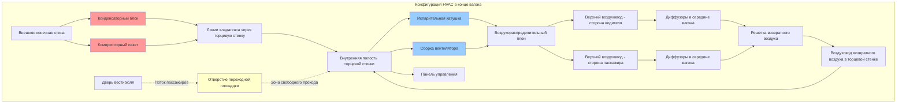

Размещение оборудования HVAC в конце вагона представляет специализированную стратегию монтажа для рельсовых пассажирских транспортных средств, при которой компоненты климатического контроля интегрируются в область торцевой стенки вагона рядом с вестибюлями и соединениями переходных площадок. Эта конфигурация предлагает отчетливые преимущества для максимизации пассажирского пространства при этом представляя уникальные проблемы в обслуживаемости, управлении энергией при столкновении и распределении воздушного потока.

## Конфигурация оборудования в конце вагона

Крепление в конце вагона размещает основные компоненты HVAC внутри или рядом со структурой торцевой стенки вагона. Этот подход распространен в пригородных железных дорогах, легком рельсовом транспорте и некоторых метро, где ограничения профиля вагона или требования эксплуатации исключают крепление на крыше.

**Типичное распределение компонентов:**

Оборудование распределяется между внутренними полостями торцевой стенки и позициями монтажа на внешней конечной стене. Компрессоры, конденсаторы и электрические компоненты обычно крепятся на внешнюю конечную стену или в защищенные отделения оборудования, доступные извне. Испарительные катушки, вентиляторы и воздухораспределительные плены интегрируются во внутреннюю структуру торцевой стенки позади съемных панелей доступа.

**Требования к распределению пространства:**

Полости оборудования в структуре торцевой стенки должны вмещать компоненты при сохранении конструктивной целостности и способностей управления энергией при столкновении. Распределение следует следующей формуле:

$$V_{equipment} = V_{compressor} + V_{condenser} + V_{evaporator} + V_{electrical} + V_{clearance}$$

Где объем зазора предусматривает доступ для обслуживания и воздушный поток. Типичные значения:

$$V_{clearance} = 1.3 \times (V_{compressor} + V_{condenser} + V_{evaporator})$$

Дополнительный объем 30% учитывает доступ для обслуживания, маршрутизацию линий хладагента и тепловой поток вокруг компонентов, генерирующих тепло.

**Расчет глубины торцевой стенки:**

Требуемая глубина торцевой стенки должна вмещать оборудование при минимизации вторжения в пассажирское пространство:

$$D_{bulkhead} = \max(D_{equipment} + C_{maintenance}, D_{structural}) + t_{insulation}$$

Где:
- $D_{equipment}$ = максимальная глубина оборудования (корпус компрессора или испарителя)
- $C_{maintenance}$ = зазор для обслуживания (обычно 15–30 см)
- $D_{structural}$ = глубина конструктивного элемента для управления энергией при столкновении
- $t_{insulation}$ = толщина тепловой и звуковой изоляции (5–10 см)

Стандартная глубина торцевой стенки варьируется от 61–91 см в зависимости от размера вагона и мощности оборудования.

## Рассмотрение интеграции переходной площадки

Соединение переходной площадки между вагонами создает специфические ограничения для размещения оборудования HVAC в конце вагона. Переходная площадка должна обеспечивать беспрепятственный проход пассажиров при этом вмещая движение сочленения между вагонами.

**Конверт зазора:**

Стандарт APTA PR-M-S-015 устанавливает минимальные размеры свободного прохода переходной площадки:

| Тип переходной площадки | Минимальная ширина | Минимальная высота | Боковое движение | Вертикальное движение |
|--------------------------|--------------------|--------------------|-------------------|-----------------------|
| Закрытая переходная площадка | 81 см | 198 см | ±20 см | ±8 см |
| Только диафрагма | 76 см | 193 см | ±15 см | ±5 см |
| Переходная площадка широкого кузова | 97 см | 203 см | ±25 см | ±10 см |

Оборудование HVAC и воздуховоды должны оставаться вне этого конверта зазора при всех условиях эксплуатации, включая максимальные углы сочленения при прохождении кривых.

**Позиционирование оборудования относительно переходной площадки:**

Компоненты организованы в одну из трех конфигураций:

1. **Верхнее размещение**: Оборудование, установленное над проходом переходной площадки в пространстве верхней балки торцевой стенки. Обеспечивает беспрепятственное пространство пола, но увеличивает высоту вагона и усложняет доступ для обслуживания.

2. **Боковое размещение**: Оборудование, установленное в боковые карманы, фланкирующие отверстие переходной площадки. Поддерживает низкий профиль вагона, но снижает пространство циркуляции пассажиров на концах вагонов.

3. **Раздельная конфигурация**: Конденсатор и компрессор установлены снаружи на конечной стене, испаритель и вентилятор в верхнем пространстве торцевой стенки. Оптимизирует использование пространства, но требует тщательной маршрутизации линий хладагента через зону сочленения.

## Оптимизация потока пассажиров

Размещение оборудования HVAC в конце вагона непосредственно влияет на посадку, высадку и схемы циркуляции пассажиров. Проектирование должно минимизировать заторы при сохранении производительности HVAC.

**Анализ потока:**

Расход пассажиров через конечные вестибюли и переходные площадки следует формуле:

$$Q_{passengers} = \frac{N_{boarding} + N_{alighting}}{t_{dwell}}$$

Пиковые расходы на крупных станциях варьируются от 30–50 пассажиров в минуту через каждый дверной проем. Размещение оборудования не должно создавать узкие места, которые удлиняют время стоянки.

**Расчет площади циркуляции:**

Эффективная область циркуляции в вестибюле учитывает вторжение оборудования:

$$A_{circulation} = A_{vestibule} - A_{equipment} - A_{door\_swing} - A_{safety}$$

Где $A_{safety}$ представляет буферное пространство (минимум 3,7 м²) вокруг оборудования для безопасности пассажиров. Поддержание $A_{circulation} \geq 23$ м² обеспечивает достаточную пропускную способность потока для станций с высокой загруженностью.

**Распределение воздушного потока от оборудования в конце вагона:**

Подаваемый воздух от оборудования в конце вагона должен распределяться равномерно по длине вагона. Требуемая скорость воздуха в воздуховоде для преодоления потерь давления:

$$V_{duct} = \sqrt{\frac{2 \Delta P}{\rho}} = \sqrt{\frac{2 \times \Delta P_{total}}{\rho_{air}}}$$

Для типичных вагонов длиной 18–24 м с оборудованием в конце, скорости воздуха в воздуховодах 9–12,7 м/с поддерживают адекватное давление для достижения диффузорами в середине вагона при ограничении образования шума до допустимых уровней ниже 68 дBA.

## Обслуживаемость и доступ для обслуживания

Размещение в конце вагона представляет уникальные проблемы обслуживаемости по сравнению с установками на крыше или под полом. Доступ для обслуживания должен вмещать снятие компонентов без нарушения деятельности смежных вагонов.

**Конструкция панели доступа:**

Внутренний доступ к оборудованию, установленному в торцевой стенке, требует съемных панелей, размер которых соответствует извлечению компонентов:

$$A_{panel} \geq 1.2 \times \max(A_{compressor}, A_{evaporator}, A_{blower})$$

Увеличение на 20% позволяет зазор для маневрирования компонентом во время снятия и установки. Панели включают быстрозажимные крепежные элементы для быстрого доступа при диагностировании неисправностей.

**Внешний доступ для обслуживания:**

Компоненты, установленные на внешней конечной стене, требуют платформ обслуживания или положения о защите от падения при доступе с уровня земли. Рекомендации APTA указывают:

| Высота компонента над рельсом | Метод доступа | Оборудование безопасности |
|--------------------------------|---------------|--------------------------|
| 0–2,1 м | Доступ с уровня земли | Не требуется |
| 2,1–3,7 м | Табурет/платформа | Поручни на вагоне |
| 3,7 м и выше | Платформа для обслуживания | Точки крепления для защиты от падения |

**Заменяемость компонентов:**

Критические компоненты должны быть съемными без нарушения соседних систем. Линии хладагента включают сервисные клапаны на проникновении торцевой стенки для изоляции оборудования без эвакуации всей системы. Электрические соединения используют быстросъемные вилки для быстрого обмена компонентов.

**Интервалы плановой профилактики:**

Доступность оборудования в конце вагона влияет на график обслуживания:

- Замена фильтра: 500–1000 часов (ежемесячно до ежеквартально в зависимости от окружающей среды)
- Чистка конденсаторного оребрения: 2000–3000 часов (ежеквартально до два раза в год)
- Проверка заряда хладагента: 4000–6000 часов (два раза в год до ежегодно)
- Капитальный ремонт компрессора: 20 000–30 000 часов (3–5 лет)
- Полная замена системы: 80 000–120 000 часов (12–18 лет)

## Варианты размещения компонентов

Несколько стратегий расположения оборудования вмещают различные конструкции вагонов и требования эксплуатации.

**Сравнение конфигураций:**

| Тип конфигурации | Размещение компрессора | Размещение конденсатора | Размещение испарителя | Преимущества | Недостатки |
|------------------|------------------------|-----------------------|-----------------------|-------------|-----------|
| Полностью снаружи | Внешняя конечная стена | Внешняя конечная стена | Внешняя конечная стена | Максимум внутреннего пространства, воздействие погоды для обслуживания | Увеличение длины вагона, сложные воздуховоды |
| Раздельно внутри/снаружи | Внешняя конечная стена | Внешняя конечная стена | Внутренняя торцевая стенка | Сбалансированное использование пространства, защищенный испаритель | Проникновения линий хладагента, маршрутизация сочленения |
| Верхнее внутреннее размещение | Внутри сверху | Внутри сверху | Внутри сверху | Защита от погоды, упрощенная прокладка хладагента | Пониженный дорожный просвет, верхнее обслуживание |
| Боковой карман | Внутренний боковой карман | Внешняя конечная стена | Внутренний боковой карман | Низкий профиль, разделенные компоненты | Снижение пространства вестибюля, асимметричное распределение веса |
| Модульный пакет | Внешний конечный модуль | Внешний конечный модуль | Внешний конечный модуль | Заменяемый модуль, стандартизированный интерфейс | Увеличение длины вагона, ограниченная настройка |

**Распределение веса:**

Оборудование в конце вагона влияет на баланс веса вагона и должно рассматриваться в конфигурациях сцепленных составов:

$$W_{equipment\_total} = W_{compressor} + W_{condenser} + W_{evaporator} + W_{refrigerant} + W_{structure}$$

Типичные пакеты HVAC в конце вагона весят 360–680 кг в зависимости от мощности охлаждения. Когда несколько вагонов сцепляются вместе, прилегающие концы вагонов могут каждый нести оборудование HVAC, создавая локальную концентрацию веса, которая влияет на нагрузку колеса и динамику подвески.

## Интеграция управления энергией при столкновении

Рельсовые пассажирские вагоны должны соответствовать стандартам стойкости к столкновениям FRA (Федеральное управление железнодорожного транспорта) или международному эквиваленту. Размещение оборудования HVAC в конце вагона должно интегрироваться с системами управления энергией при столкновении.

**Конструктивные требования:**

Конструкция торцевой стенки, поддерживающая оборудование HVAC, должна сохранять целостность при событиях столкновения. Положения монтажа оборудования не должны компрометировать основные элементы поглощения энергии при столкновении. Устройства защиты от взлома и конструкции, поглощающие энергию, имеют приоритет в распределении пространства.

**Крепление оборудования:**

Компоненты HVAC должны выдерживать нагрузки замедления при столкновении без становления снарядов. Конструкция монтажа следует формуле:

$$F_{mounting} = m_{component} \times a_{crash} \times SF$$

Где:
- $m_{component}$ = масса компонента (кг)
- $a_{crash}$ = замедление при столкновении (8–12 g для пассажирских рельсовых приложений согласно CFR 49 Part 238)
- $SF$ = коэффициент безопасности (обычно 2,0)

Монтажные кронштейны и крепежные элементы должны выдерживать эти нагрузки без отказа или деформации, которая могла бы нарушить граничное условие давления в соседних вагонах.

**Защита переходной площадки:**

Позиционирование оборудования не должно влиять на последовательности коллапса переходной площадки при событиях столкновения. Переходные площадки спроектированы так, чтобы выходили из строя контролируемым образом, позволяя сочленение сверх нормальных пределов без разрыва границ давления. Компоненты HVAC, расположенные рядом с переходными площадками, требуют защитные кожухи или системы жертвенного монтажа, которые отпускают оборудование, а не сопротивляются движению переходной площадки.

## Рассмотрения теплопроизводительности

Размещение в конце вагона влияет как на тепловую эффективность оборудования, так и на распределение температуры в пассажирском салоне.

**Проблемы распределения воздуха:**

Подаваемый воздух должен пройти полную длину вагона от оборудования в конце. Снижение температуры вдоль пути распределения следует:

$$\Delta T_{duct} = \frac{Q_{loss}}{\.m \times c_p} = \frac{U \times A_{duct} \times (T_{supply} - T_{ambient})}{\.m \times c_p}$$

При плохо изолированных верхних воздуховодах эта потеря температуры может достигать 1,7–2,8°C на длине вагона 18–21 м, создавая температурные градиенты между концами и центром вагона. Надлежащая изоляция воздуховодов (RSI 1,0–1,4) ограничивает потери до 0,6–1,1°C.

**Воздушный поток охлаждения оборудования:**

Внешние конденсаторы требуют адекватного воздушного потока охлаждения при минимизации аэродинамического сопротивления. Требуемая скорость лица конденсатора:

$$V_{condenser} = \frac{CFM_{required}}{A_{face}} = \frac{Q_{rejected}}{1.08 \times \Delta T_{air} \times A_{face}}$$

При скоростях поезда выше 64–80 км/ч, давление тарана воздуха способствует охлаждению конденсатора, но создает дополнительный шум и требует защитной сетки для предотвращения попадания мусора.

**Эксплуатация в холодную погоду:**

Оборудование в конце вагона, установленное на внешних стенах, испытывает большее воздействие температуры, чем системы, установленные внутри. Нагревательные элементы предотвращают загустевание масла компрессора и миграцию хладагента при холодном замачивании ниже –18°C. Электрические нагреватели на линиях хладагента предотвращают скопление жидкого хладагента в низких точках и голодание компрессора масла.

## Стандарты и спецификации

Размещение оборудования HVAC в конце вагона следует множеству нормативных и отраслевых стандартов:

**APTA (Американская ассоциация общественного транспорта):**
- APTA PR-M-S-015: Системы переходных площадок для оборудования пассажирских рельсов
- APTA PR-M-S-006: Системы HVAC для пассажирского рельсового подвижного состава

**FRA (Федеральное управление железнодорожного транспорта):**
- CFR 49 Part 238: Стандарты безопасности оборудования пассажиров
- Подчасть C: Требования стойкости к столкновениям, влияющие на размещение оборудования

**Международные стандарты:**
- EN 15380: Применение железных дорог – Система обозначений для железнодорожных транспортных средств
- EN 14750: Применение железных дорог – Кондиционирование воздуха для городского и пригородного рельсового подвижного состава
- EN 15227: Применение железных дорог – Требования стойкости к столкновениям для кузовов железнодорожных транспортных средств

**Электрические стандарты:**
- IEEE 1653: Стандарт для распределения тягового питания легкого рельсового транспорта
- IEC 60077: Электрическое оборудование для рельсового подвижного состава

Эти стандарты устанавливают минимальные зазоры, конструктивные требования, критерии производительности и протоколы испытаний для установок HVAC в конце вагона.

Размещение оборудования HVAC в конце вагона представляет эффективную стратегию для проектирования HVAC пассажирского рельсового транспорта при надлежащей интеграции с архитектурой вагона, схемами циркуляции пассажиров и требованиями обслуживания. Успех зависит от тщательного распределения пространства, адекватных положений обслуживаемости и внимания к уникальной эксплуатационной среде сцепленного рельсового подвижного состава с сочленяемыми соединениями переходных площадок.
