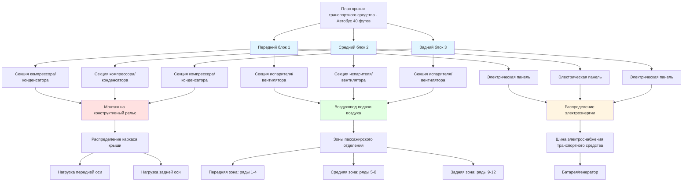

Размещение оборудования на крыше представляет доминирующую конфигурацию HVAC для автобусов общественного транспорта и отдельных лёгких рельсовых транспортных средств. Эта стратегия монтажа обеспечивает превосходный доступ для обслуживания и эффективное использование внутреннего объёма транспортного средства, при этом вводя критические ограничения конструкции, связанные с высотой транспортного средства, распределением веса и аэродинамической производительностью. Инженерный анализ должен учитывать структурные нагрузки, соответствие требованиям конвертной, и операционную эффективность для достижения надёжного климат-контроля без нарушения динамики транспортного средства.

## Преимущества конфигурации на крыше

Монтаж на крыше обеспечивает отчётливые операционные преимущества, которые делают его предпочтительной конфигурацией для большинства автобусных приложений.

**Доступность для обслуживания:**

Персонал по обслуживанию получает доступ к кровельному оборудованию с уровня земли, используя стандартные лестницы или платформы для обслуживания, устраняя необходимость в доступе через яму или поднятии транспортного средства. Замена компонентов, обслуживание хладагента и замена фильтров проходят эффективно во время регулярных интервалов обслуживания. Капитальные переборки завершаются за 4-6 часов в сравнении с 8-12 часами для подземных систем, требующих обширного разбора.

**Использование пространства:**

Размещение на крыше сохраняет объём пассажирского отделения и избегает конфликтов с сиденьями, зонами крепления инвалидных колясок и оборудованием сбора платежей. Типичный автобус общественного транспорта длиной 40 футов получает 2,8-3,7 м² полезной площади пола в сравнении с конфигурациями задней перегородки или под сиденьем.

**Управление конденсатом:**

Естественное гравитационное дренирование исключает необходимость в насосе конденсата. Дренажные поддоны имеют наклон 2,1 см на 30 см направо к дренажным трубкам, которые оканчиваются ниже линии крыши, предотвращая накопление воды и связанный с ним микробный рост. Системы, работающие в климатах с высокой влажностью, сбрасывают 7,6-19 л в час во время пикового охлаждения.

**Тепловая эффективность:**

Конденсаторы на крыше получают выгоду от неограниченного воздушного потока и избегают проблем с тепловой рециркуляцией, распространённых в подземных установках. Катушки конденсатора работают на 2,8-5,6°C прохладнее, чем эквивалентные подземные блоки, улучшая коэффициент производительности на 8-12% и продлевая срок обслуживания компрессора.

## Анализ распределения веса

Кровельное оборудование HVAC значительно влияет на центр тяжести транспортного средства и нагрузку на оси.

**Масса оборудования:**

Полный пакет кровельного HVAC для автобуса общественного транспорта длиной 40 футов весит 544-816 кг, включая:

- Компрессор и цепь хладагента: 136-204 кг
- Катушка конденсатора и узел вентилятора: 113-159 кг
- Секция испарителя и вентилятор: 91-136 кг
- Корпус и монтажная конструкция: 159-227 кг
- Электрические компоненты и элементы управления: 45-68 кг

Высота центра тяжести увеличивается на расстояние размещения оборудования выше центральной линии транспортного средства.

**Влияние на центр тяжести:**

Кровельное оборудование повышает центр тяжести транспортного средства, влияя на устойчивость к опрокидыванию во время поворотов и аварийных манёвров. Расчёт индекса устойчивости количественно определяет этот эффект:

$$SI = \frac{t}{2h_{cg}}$$

Где:
- $SI$ = индекс устойчивости (безразмерная величина)
- $t$ = ширина колеи, от оси к оси (обычно 2,29-2,44 м)
- $h_{cg}$ = высота центра тяжести над землёй

Автобусы общественного транспорта поддерживают $SI > 0,50$ для соответствия стандартам FMVSS 136 защиты от опрокидывания. Добавление 680 кг кровельного оборудования на высоте 3,05 м над землёй к автобусу массой 15 876 кг с исходным $h_{cg}$ 1,22 м создаёт новый центр тяжести:

$$h_{cg,new} = \frac{(15876 \times 1,22) + (680 \times 3,05)}{15876 + 680} = 1,32 \text{ м}$$

Это увеличение на 0,10 м снижает индекс устойчивости с 0,52 до 0,48, приближаясь к нормативным пределам.

**Стратегия распределения нагрузки:**

Несколько кровельных блоков распределяют вес вдоль длины транспортного средства для сбалансирования нагрузки на переднюю и заднюю оси. Типичная конфигурация размещает:

- Блок 1: 2,4-3,7 м от передней оси (охлаждение передней 1/3 пассажирского отделения)
- Блок 2: 6,1-7,3 м от передней оси (охлаждение средней 1/3)
- Блок 3: 9,8-11,0 м от передней оси (охлаждение задней 1/3)

Это расположение поддерживает коэффициенты нагрузки на оси в пределах распределения 45-55% передняя/задняя для надлежащего управления рулением и характеристик торможения.

## Аэродинамический дизайн корпуса

Кровельное оборудование создаёт паразитное сопротивление, которое напрямую влияет на эффективность расхода топлива и операционные затраты.

**Расчёт силы сопротивления:**

Сила аэродинамического сопротивления от кровельных блоков HVAC следует:

$$F_D = \frac{1}{2} \rho V^2 C_D A_{frontal}$$

Где:
- $\rho$ = плотность воздуха (1,20 кг/м³ на уровне моря)
- $V$ = скорость транспортного средства (м/с)
- $C_D$ = коэффициент сопротивления (0,8-1,2 для корпусов HVAC)
- $A_{frontal}$ = лобовая площадь, перпендикулярная воздушному потоку (м²)

Обычный блок кровельного типа коробка с лобовой площадью 1,11 м² на 88,5 км/ч (24,6 м/с) создаёт:

$$F_D = \frac{1}{2} \times 1,20 \times (24,6)^2 \times 1,0 \times 1,11 = 402 \text{ Н}$$

**Преимущества аэродинамического корпуса:**

Аэродинамические корпусы с округлённой передней кромкой, коническими задними кромками и плавными переходами поверхности снижают коэффициенты сопротивления до 0,5-0,7, сокращая силу сопротивления на 30-40%. Штраф на расход топлива для автобуса общественного транспорта, работающего 64 374 км в год, снижается с 3028 л до 1893 л, экономия $1,200-1,500 в год при типичных ценах на дизельное топливо.

**Конструктивные особенности:**

- **Радиус передней кромки**: радиус 7,6-15 см снижает отрыв потока
- **Наклон верхней поверхности**: угол 5-8 градусов к задней части минимизирует турбулентность в кильватере
- **Боковые обтекатели**: плавный переход от поверхности крыши к сторонам оборудования
- **Минимизация высоты**: общий профиль ограничен 30-41 см выше палубы крыши

## Требования конвертной зоны

Высота транспортного средства, включая кровельное оборудование, должна соответствовать ограничениям зазора инфраструктуры.

**Нормативные стандарты:**

| Тип зазора | Минимальная высота | Применяемый стандарт | Типичный запас |
|------------|-------------------|----------------------|-----------------|
| Зазор под мостом (магистраль) | 4,27 м | Стандарты проектирования FHWA | 15-30 см |
| Зазор под мостом (артериальная дорога) | 4,42 м | Спецификации государственного DOT | 15-30 см |
| Зазор туннеля (дорога) | 4,11 м | Варьируется по объектам | 7,6-15 см |
| Зазор гаража (депо) | 3,81 м | Специфичный для объекта | 15 см |
| Зазор деревьев (маршрут) | 3,96 м | Маршрутизация агентства транспорта | Переменный |
| Парковочная конструкция | 2,44-3,66 м | Строительные нормы | 15 см |

**Анализ бюджета высоты:**

Расчёт зазора для автобуса длиной 40 футов:

$$H_{total} = H_{chassis} + H_{body} + H_{roof} + H_{HVAC}$$

Пример расчёта:
- Высота шасси: 61 см
- Высота кузова: 244 см
- Панель крыши: 5 см
- Оборудование HVAC: 36 см
- Итого: 346 см = 3,46 м

Эта конфигурация обеспечивает 81 см запаса для моста высотой 4,27 м, достаточно для гибкости маршрута.

**Оборудование сверхнизкого профиля:**

Маршруты с ограниченным зазором требуют сверхнизкопрофильных блоков:
- Стандартный профиль: 36-46 см выше крыши
- Низкопрофильный: 25-30 см выше крыши
- Сверхнизкопрофильный: 18-23 см выше крыши

Уменьшенная высота ограничивает диаметр вентилятора конденсатора и глубину испарителя, снижая охлаждающую способность на 15-25% для эквивалентной площади занимаемого пространства.

## Требования к конструкции монтажной системы

Кровельное оборудование передаёт статические и динамические нагрузки на конструкцию крыши транспортного средства.

**Компоненты нагрузки:**

$$F_{total} = F_{static} + F_{dynamic} + F_{wind}$$

Где:
- $F_{static}$ = вес оборудования (544-816 кг)
- $F_{dynamic}$ = инерционные нагрузки во время ускорения, торможения, поворотов
- $F_{wind}$ = аэродинамическая подъёмная сила и боковое нагружение

**Коэффициенты динамической нагрузки:**

Транспортные средства общественного транспорта испытывают силы ускорения:
- Продольное (торможение): 0,8-1,0 g
- Боковое (поворот): 0,4-0,6 g
- Вертикальное (неровности дороги): 0,3-0,5 g

Комбинированное нагружение при аварийном торможении при повороте:

$$F_{combined} = W_{eq} \sqrt{a_x^2 + a_y^2 + (1+a_z)^2}$$

Для оборудования массой 680 кг:

$$F_{combined} = 680 \sqrt{(0,8)^2 + (0,5)^2 + (1,3)^2} = 1105 \text{ кг-сила}$$

**Конструкция системы монтажа:**

Кровельные блоки крепятся через:

1. **Конструктивные рельсы**: алюминиевые или стальные каналы, приварные/клёпанные к конструкции крыши
2. **Монтажные ноги**: 4-8 точек крепления с виброизоляторами
3. **Крепёжные элементы**: болты класса 5 диаметром 9,5 мм или 12,7 мм, минимум 4 на 30 см
4. **Пластины распределения нагрузки**: распределяют сосредоточенные нагрузки по площадям 39-77 см²

Монтажная конструкция должна выдерживать статическую массу оборудования в 3-4 раза для учёта динамических и ударных нагрузок.

## Рассмотрения доступа для обслуживания

Доступность услуг определяет затраты на работу обслуживания и надёжность системы.

**Методы доступа:**

| Тип доступа | Требуемое оборудование | Время установки | Соображения безопасности | Типичная стоимость |
|-------------|----------------------|-----------------|------------------------|-------------------|
| Выдвижная лестница | Лестница 3,7-4,9 м | 2-3 минуты | Требуется защита от падения | $200-400 |
| Платформа со ступеньками | Портативная платформа | 5-8 минут | Предусмотрены перила | $800-1500 |
| Постоянный помост для обслуживания | Конструкция стационарного объекта | N/A | Постоянная установка | $5000-15000 |
| Мобильная платформа подъёма | Ножничный подъёмник или стрела | 10-15 минут | Требуется сертификация оператора | $15000-35000 |
| Доступ через люк крыши | Внутренняя лестница | 3-5 минут | Доступ внутри транспортного средства | $500-1200 |

**Зазоры для обслуживания:**

Персонал по обслуживанию требует рабочего пространства вокруг оборудования:
- Передний доступ (панель управления): 76-91 см
- Боковой доступ (обслуживание фильтра): 61-76 см
- Задний доступ (электрическое): 46-61 см
- Верхний зазор (удаление компонентов): 122-152 см

Несколько кровельных блоков должны поддерживать минимальный зазор 30-46 см для движения техника между блоками.

**Доступность компонентов:**

Критические пункты обслуживания требуют доступа без инструментов или с простыми ручными инструментами:
- **Воздушные фильтры**: дверцы доступа с четвертьоборотными крепёжными элементами, замена за 2-5 минут
- **Порты обслуживания хладагента**: доступны без снятия панели, стандартные соединения SAE 1/4 дюйма и 3/8 дюйма
- **Электрические отключающие устройства**: щиты NEMA 3R, защищённые от непогоды, в пределах 0,9 м от оборудования
- **Дренажные поддоны**: съёмные для очистки без восстановления хладагента

## Расположение кровельного оборудования

Несколько блоков требуют стратегического размещения для сбалансированной производительности и удобства обслуживания.

**Стратегия зонирования:**

Каждый кровельный блок обслуживает выделенную зону пассажирского отделения для обеспечения сбалансированного климат-контроля и резервирования. Границы зон обычно совпадают со структурой транспортного средства:

- Зона 1 (передняя): Кабина водителя и ряды 1-4, обслуживаются передним блоком
- Зона 2 (средняя): Ряды 5-8, обслуживаются центральным блоком
- Зона 3 (задняя): Ряды 9-12, обслуживаются задним блоком

Независимое управление зонами позволяет незанятым областям работать в режиме экономии, снижая энергопотребление на 30-40% при лёгкой загрузке пассажиров.

## Выбор типа оборудования

| Тип оборудования | Диапазон производительности | Применение | Преимущества | Ограничения |
|------------------|----------------------------|-----------|------------|-----------|
| Автономный пакет | 5,28-10,55 кВ | Однозонные автобусы | Простая установка, низкая стоимость | Ограниченная производительность |
| Многозонный пакет | 13,17-21,95 кВ | Сочленённые автобусы | Централизованное обслуживание | Сложность воздуховодов |
| Сплит-система | 7,03-14,06 кВ | Лёгкие рельсовые транспортные средства | Гибкое размещение | Ограничения длины линии хладагента |
| Переменная производительность | 5,86-17,55 кВ | Современные автопарки транспорта | Энергоэффективность | Более высокая начальная стоимость |
| Конфигурация тепловой насос | 5,28-12,3 кВ | Умеренные климаты | Комбинированное отопление/охлаждение | Уменьшенное отопление при низкой температуре окружающей среды |

**Рассмотрения резервирования:**

Несколько независимых блоков обеспечивают операционное резервирование. Трёхблочная конфигурация поддерживает 67% охлаждающей производительности при отказе одного блока, обеспечивая приемлемый комфорт при пиковой загрузке. Один крупнокапаватный блок исключает резервирование, создав риск нарушения обслуживания при отказе компонента.

## Стандарты и спецификации установки

Стандарты отрасли общественного транспорта управляют практиками установки кровельного HVAC.

**Применяемые стандарты:**

- **APTA BUS-PSC-RP-002**: Рекомендации по закупкам систем HVAC для автобусов общественного транспорта
- **APTA RT-VIM-S-034**: Стандарт HVAC рельсовых транспортных средств
- **SAE J2765**: Системы HVAC, установленные на крыше для автобусов общественного транспорта
- **ASHRAE Standard 169**: Климатические данные для стандартов проектирования зданий (адаптировано для мобильных приложений)

**Ключевые требования:**

1. **Интеграция в конструкцию**: Система монтажа, разработанная лицензированным инженером-проектировщиком, расчёты представлены с пакетом конструкции транспортного средства
2. **Виброизоляция**: виброизоляторы с прогибом 1,3-2,5 см между оборудованием и монтажной конструкцией, собственная частота <10 Гц
3. **Электрическая установка**: Электропроводка в соответствии с SAE J1292, защита от перегрузки рассчитана на 125% от полного тока нагрузки оборудования
4. **Удержание хладагента**: Паяные медные линии хладагента, проверенные под давлением при 3103 кПа азот, скорость утечки <14 г/год
5. **Герметизация от непогоды**: Все проходы крыши герметизированы бутиловой лентой и эластомерным герметиком, минимальный рейтинг IP-65

**Испытание производительности:**

Установленные системы проходят проверочное испытание:
- **Тест быстрого охлаждения**: Достижение 23,9°C из 40,6°C окружающей среды в течение 30 минут
- **Проверка производительности**: Поддержание 22-24°C при 35°C окружающей среды и полной загрузке пассажиров
- **Измерение воздушного потока**: Проверка общего воздушного потока подачи 0,38-0,57 м³/с при статическом давлении конструкции
- **Уровень шума**: Максимум 72 дBA в положении оператора во время полного охлаждения операции

## Соображения электрифицированного рельсового транспорта

Приложения лёгкого рельса и электротроллейбуса вводят конфликты пространства на крыше.

**Помехи пантографа:**

Электрические транспортные средства, использующие надземное контактное питание, требуют зазор пантографа:
- Ширина пантографа: 91-122 см
- Конверт подъёма/опускания: 152-183 см
- Боковое движение: ±30 см от центральной линии

Оборудование HVAC должно поддерживать минимум 61 см зазора от рабочей конверты пантографа, чтобы предотвратить электрическую дугу и механический контакт.

**Варианты размещения оборудования:**

1. **Раздельная установка**: Размещение секций конденсатора/компрессора по обе стороны от центральной зоны пантографа
2. **Смещённый монтаж**: Смещение блоков HVAC к сторонам транспортного средства, принятие асимметричной маршрутизации воздуховодов
3. **Подземная альтернатива**: Перемещение HVAC в подземное положение, принятие штрафов доступа к обслуживанию

**Электромагнитная совместимость:**

Работа пантографа создаёт электромагнитные помехи, влияющие на элементы управления HVAC. Экранированная управляющая проводка и металлические корпусы оборудования обеспечивают защиту от EMI в соответствии со стандартами EMC рельсового транспорта EN 50121.

## Оптимизация тепловой производительности

Размещение кровельного оборудования влияет на эффективность системы через воздействие окружающей среды.

**Эффекты солнечного излучения:**

Конденсаторы на крыше подвергаются прямому солнечному излучению, добавляющему тепловую нагрузку:

$$Q_{solar,cond} = \alpha \times I \times A_{surface}$$

Где:
- $\alpha$ = поглощательная способность (0,3-0,5 для белых/отражающих покрытий, 0,8-0,95 для тёмных поверхностей)
- $I$ = падающее солнечное излучение (146-175 кДж/(м²·ч) пик)
- $A_{surface}$ = площадь верхней поверхности конденсатора (м²)

Верхняя поверхность конденсатора площадью 2,79 м² с тёмным покрытием поглощает:

$$Q_{solar,cond} = 0,85 \times 160 \times 2,79 = 381 \text{ кДж/ч}$$

Эта дополнительная нагрузка увеличивает работу компрессора на 4-6%, снижая эффективность системы. Отражающие белые покрытия (индекс солнечной отражательной способности 85-95) уменьшают солнечный прирост на 60-70%.

**Оптимизация воздушного потока:**

Вентиляторы конденсатора должны преодолевать помехи воздушного потока на крыше. Движение транспортного средства создаёт низконапорные зоны кильватера позади кровельного оборудования, снижая естественную конвекцию. Надлежащий выбор вентилятора учитывает:
- Штраф статического давления: 0,025-0,050 кПа дополнительного сопротивления
- Рециркуляция воздуха конденсатора: 10-15% воздуха конденсатора может рециркулировать в зону кильватера
- Эффекты поперечного ветра: Боковой воздушный поток нарушает производительность вентилятора конденсатора при скоростях транспортного средства выше 64 км/ч

Ориентация конденсатора, обращённая вперёд, минимизирует рециркуляцию, но увеличивает аэродинамическое сопротивление. Конфигурации с боковым или вертикальным выпуском уравновешивают соображения воздушного потока и сопротивления.

Размещение кровельного оборудования HVAC для транспортных средств общественного транспорта требует интегрированного анализа механики конструкций, аэродинамики, тепловой производительности и логистики обслуживания. Успешные установки балансируют эти конкурирующие требования, одновременно поддерживая соответствие требованиям конвертной и достигая надёжного комфорта пассажиров во всём диапазоне условий эксплуатации. Надлежащая инженерия во время первоначального проектирования предотвращает операционные ограничения и чрезмерные затраты на обслуживание в течение всего срока обслуживания транспортного средства.
