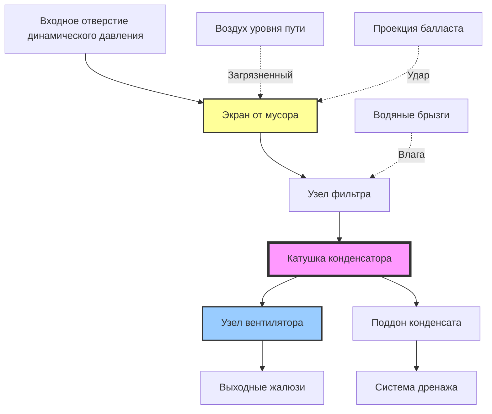

## Конфигурация оборудования под полом

Размещение оборудования HVAC под полом представляет критическую стратегию проектирования в транспортных средствах массового транспорта, особенно для вагонов метро, пригородных железных дорог и легких железных дорог, где пространство на крыше ограничено габаритами или занято пантографами и другим электрическим оборудованием. Эта конфигурация представляет уникальные инженерные задачи, связанные с засасыванием мусора, управлением акустикой, тепловой производительностью и доступностью для обслуживания.

## Анализ использования пространства

Доступный объем под полом для оборудования HVAC ограничен несколькими факторами, включая зазоры тележек, геометрию пути и конструктивные элементы. Эффективный объем оборудования можно рассчитать:

$$V_{eff} = L_{car} \times W_{frame} \times (h_{floor} - h_{truck} - C_{min})$$

где $L_{car}$ — полезная длина вагона между центрами тележек, $W_{frame}$ — ширина рамы, доступная для оборудования, $h_{floor}$ — высота пола над рельсом, $h_{truck}$ — максимальная высота габарита тележки, и $C_{min}$ — минимальный зазор до конструкции пути.

Эффективность использования объема с учетом упаковки оборудования:

$$\eta_{vol} = \frac{V_{equipment}}{V_{eff}} \times 100\%$$

Типичное использование варьируется от 35-55% из-за требований циркуляции воздуха, конструктивного армирования и потребностей в доступе для обслуживания.

## Требования к защите от мусора

Оборудование под полом работает в чрезвычайно суровых условиях окружающей среды с постоянным воздействием балласта, брызг воды, накопления льда и переносимых по воздуху загрязнений. Системы защиты должны одновременно решать несколько угроз.

### Физические барьеры

| Уровень защиты | Материал | Толщина | Применение |
|-----------------|----------|---------|-------------|
| Первичный экран | Сетка из нержавеющей стали | 14-16 калибра | Защита входа катушки |
| Ударный щиток | Алюминиевая пластина | 3-4,8 мм | Корпус компрессора |
| Отражатель мусора | Композитная панель | 6-9,5 мм | Защита переднего края |
| Поддон для слива | Нержавеющая сталь | 12-14 калибра | Сбор конденсата |

Фильтрация воздуха на входе для блоков под полом обычно использует трёхступенчатый подход:

1. **Грубый экран** (6-12 мм отверстия): Предотвращает засасывание крупного мусора
2. **Тонкая сетка** (2-4 мм): Захватывает мелкие частицы и ледяные фрагменты
3. **Одноразовый фильтр** (MERV 8-11): Окончательное удаление взвешенных частиц

Падение давления на защитных барьерах влияет на производительность системы:

$$\Delta P_{total} = \Delta P_{screen} + \Delta P_{mesh} + \Delta P_{filter}$$

Проектирование должно обеспечивать $\Delta P_{total} < 75$ Па для предотвращения чрезмерного потребления энергии вентилятором.

## Проблемы охлаждения

Оборудование под полом сталкивается со значительными ограничениями управления тепловой энергией из-за ограниченного доступного потока воздуха и повышенных температур окружающей среды от расположенного поблизости тягового оборудования.

### Анализ отклонения тепла

Эффективная способность отклонения тепла снижается при уменьшении скорости воздуха и увеличении загрязнения:

$$Q_{reject} = \dot{m}_{air} \times c_p \times (T_{out} - T_{amb}) \times \eta_{HX}$$

где $\eta_{HX}$ представляет эффективность теплообменника, снижаемую из-за загрязнения поверхности:

$$\eta_{HX,actual} = \eta_{HX,clean} \times (1 - F_{fouling})$$

Коэффициенты загрязнения для конденсаторов под полом варьируются от 0,15-0,30 в зависимости от условий эксплуатации и интервалов обслуживания.

### Подача воздуха к конденсатору

## Требования к зазорам

Оборудование под полом должно соответствовать строгим габаритным конвертам, чтобы предотвратить контакт с инфраструктурой пути, платформами и препятствиями на уровне земли.

### Стандарты размеров

| Стандарт | Минимальный зазор | Применение |
|----------|------------------|-------------|
| AAR M-1001 | 89 мм выше TOR | Грузовой обмен |
| APTA PR-M-S-006 | 70 мм выше TOR | Системы скоростного транспорта |
| FRA 213.9 | 76 мм выше TOR | Эксплуатация пригородной железной дороги |
| IEC 62278 | По обследованию маршрута | Международные системы железных дорог |

TOR = точка отсчета верхней части рельса

Конверт оборудования также должен учитывать:

- **Ход подвески**: ±51-76 мм вертикального смещения при динамической нагрузке
- **Крен кузова**: 4-6° максимум на кривых (центростремительное ускорение)
- **Тепловое расширение**: 13-25 мм изменение размеров в диапазоне эксплуатации
- **Неровности пути**: Дополнительный запас прочности 25-51 мм

## Стратегии звукоизоляции

Шум компрессора и вентилятора под полом непосредственно взаимодействует со структурой кузова, требуя комплексной акустической обработки для соответствия требованиям уровня звука в салоне (обычно максимум 68-72 дBA).

### Виброизоляция

Эффективность изоляции зависит от отношения частот:

$$TR = \frac{f_{excite}}{f_{natural}}$$

Эффективная изоляция требует $TR > 2,5$, достигаемая посредством:

- **Эластомерные опоры**: Естественная частота 8-12 Гц, прогиб 6-13 мм
- **Пружинные изоляторы**: Естественная частота 3-6 Гц, прогиб 25-51 мм
- **Комбинированные системы**: Оптимизированы для многочастотного содержания

Передача через опоры виброизоляции:

$$T = \frac{1}{\sqrt{(1-TR^2)^2 + (2\zeta TR)^2}}$$

где $\zeta$ — коэффициент затухания (обычно 0,05-0,10 для приложений HVAC в транспорте).

### Акустические кожухи

Потери звука при передаче через композитные панели кожуха:

$$TL = 20\log_{10}(f \times m) - 47 \text{ дБ}$$

где $f$ — частота (Гц) и $m$ — поверхностная плотность массы (кг/м²).

Многослойные конструкции с воздушными зазорами обеспечивают улучшенную производительность:

$$TL_{total} = TL_1 + TL_2 + 6\log_{10}(d \times f) - 5 \text{ дБ}$$

где $d$ — толщина воздушного зазора (мм).

## Варианты конфигурации оборудования

### Раздельная система

**Преимущества:**
- Размещение испарителя в оптимальном внутреннем месте
- Конденсатор позиционируется для максимального потока воздуха
- Длины линий хладагента обычно 3-7,6 м
- Снижение передачи шума в салон

**Недостатки:**
- Дополнительные требования к заполнению хладагентом
- Потенциальная вибрация от двойного размещения
- Сложный доступ для обслуживания раздельных компонентов

### Компактные блоки под полом

**Преимущества:**
- Одноточечное крепление уменьшает проникновения в кузов
- Интегрированный контур хладагента минимизирует утечки
- Упрощенные процедуры обслуживания
- Снижена сложность установки

**Недостатки:**
- Нарушенные схемы циркуляции воздуха
- Повышенная концентрация веса
- Ограниченная мощность охлаждения (обычно 7-14 кВ на блок)

## Доступность для обслуживания

Проектирование доступа для обслуживания значительно влияет на доступность транспортного средства и затраты в течение жизненного цикла. Оборудование под полом требует:

| Компонент | Метод доступа | Интервал обслуживания |
|-----------|--------------|----------------------|
| Воздушные фильтры | Снятие боковой панели | 800-1600 км |
| Конденсаторные катушки | Петлевая дверь доступа | 8000-16000 км |
| Узел компрессора | Опускание оборудования | Ежегодная проверка |
| Обслуживание хладагента | Быстроразъемные муфты | По мере необходимости |
| Дренажи конденсата | Доступ без инструмента | Ежемесячная проверка |

Конструкции с опусканием оборудования позволяют полностью удалить блок за 15-30 минут, используя подъемное оборудование, что критически важно для эффективности обслуживания в депо.

## Герметизация окружающей среды

Все кожухи под полом должны достигать минимум IP65 (NEMA 4) защиты от:

- **Проникновения воды**: От стока пути, осадков и мойки под давлением
- **Проникновения пыли**: Балластной пыли, остатков торможения и экологических взвешенных частиц
- **Образования льда**: Накопленный спрей, замерзающий при эксплуатации в холодную погоду
- **Коррозийного воздействия**: Дорожной соли, средств против обледенения и индустриального загрязнения

Материалы прокладок должны выдерживать экстремальные температуры от -40°C до +71°C, сохраняя герметичность при тепловых циклах и вибрации.

## Факторы снижения производительности

Оборудование под полом испытывает ускоренное деградацию в сравнении с установками на крыше:

$$Q_{actual} = Q_{rated} \times (1 - F_{debris}) \times (1 - F_{corrosion}) \times (1 - F_{vibration})$$

где коэффициенты деградации обычно варьируются:

- $F_{debris}$: 0,05-0,15 (влияние накопления мусора)
- $F_{corrosion}$: 0,02-0,08 (деградация поверхности теплообменника)
- $F_{vibration}$: 0,03-0,10 (ослабление креплений и крепежа)

Агрессивные графики профилактического обслуживания смягчают эти эффекты, при этом высокочастотная очистка (интервалы 800-1600 км) является необходимой для сохранения проектной производительности.

## Рекомендации по проектированию

1. **Стратегия увеличения мощности**: Укажите дополнительно 15-20% мощности для компенсации экологической деградации
2. **Резервирование**: Внедрите несколько меньших блоков вместо одного крупного блока для отказоустойчивости
3. **Фильтрация**: Максимизируйте площадь фильтра для расширения интервалов обслуживания при минимизации падения давления
4. **Дренаж**: Обеспечьте положительный уклон удаления конденсата с защитой от замерзания
5. **Мониторинг**: Интегрируйте датчики перепада давления для обнаружения загрязнения фильтра и засорения катушки
6. **Материалы**: Укажите сплавы морского качества и покрытия для сопротивления коррозийной окружающей среде

Размещение оборудования HVAC под полом требует комплексного понимания уникальной операционной среды, балансируя ограничения пространства, защиту окружающей среды, тепловую производительность и удобство обслуживания для достижения надежного климатического контроля в приложениях массового транспорта.
