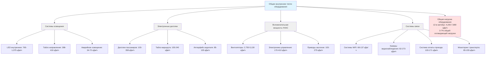

Внутренние источники тепла от систем освещения, электронных дисплеев и вспомогательного оборудования вносят значительный вклад в общую охлаждающую нагрузку на транспортные средства общественного транспорта. Несмотря на то, что каждый из этих источников в отдельности меньше, чем тепловые нагрузки от пассажиров или солнечной радиации, эти непрерывные источники тепла становятся значительными при длительном периоде эксплуатации и напрямую влияют на размеры системы HVAC и энергопотребление.

## Тепловыделение системы освещения

Система освещения транспортного средства общественного транспорта представляет собой постоянную внутреннюю тепловую нагрузку, которая варьируется в зависимости от типа используемой технологии. Переход в промышленности от люминесцентного к светодиодному освещению существенно снизил как электрическое потребление, так и тепловую нагрузку.

### Системы светодиодного освещения

Современное светодиодное освещение преобладает в спецификациях новых транспортных средств общественного транспорта благодаря превосходной энергоэффективности и сниженному тепловыделению.

**Расчет теплового выделения светодиодов:**

$$Q_{\text{LED}} = P_{\text{lighting}} \times 3.412 \times F_{\text{ballast}}$$

Где:
- $Q_{\text{LED}}$ = тепловое выделение (кДж/ч)
- $P_{\text{lighting}}$ = общее электрическое питание (ватты)
- $3.412$ = коэффициент преобразования (кДж/ч на ватт)
- $F_{\text{ballast}}$ = коэффициент эффективности драйвера (обычно 1,05-1,10 для светодиодных драйверов)

**Типичная плотность мощности светодиодного освещения:**

| Тип транспортного средства | Плотность мощности (Вт/м) | Общая мощность вся система (Вт) | Тепловая нагрузка (кДж/ч) |
|--------------|----------------------------|------------------------|-------------------|
| 12-метровый автобус | 16-23 | 200-280 | 765-1,075 |
| 18-метровый сочленённый автобус | 20-26 | 360-480 | 1,375-1,825 |
| Вагон лёгкого метро | 26-33 | 560-700 | 2,140-2,675 |
| Вагон метро | 23-30 | 490-630 | 1,875-2,405 |
| Вагон пригородного поезда | 20-26 | 420-560 | 1,605-2,140 |

Для 12-метрового автобуса с электропотреблением светодиодной системы 250 ватт:

$$Q_{\text{LED}} = 250 \times 3.412 \times 1.08 = 920 \text{ кДж/ч}$$

Это представляет снижение на 60-70% по сравнению с устаревшими люминесцентными системами, значительно уменьшая требования к охлаждению HVAC.

### Люминесцентное освещение (Устаревшие системы)

Старые транспортные средства с люминесцентным освещением испытывают значительно более высокие тепловые нагрузки.

**Тепловая нагрузка люминесцентного освещения:**

$$Q_{\text{fluor}} = P_{\text{lamps}} \times 3.412 \times F_{\text{ballast}}$$

Где $F_{\text{ballast}}$ колеблется от 1,15-1,25 для магнитных балластов, 1,10-1,15 для электронных балластов.

**Сравнение люминесцентного освещения:**

| Тип лампы | Плотность мощности (Вт/м) | Общая мощность (12-м автобус) | Тепловая нагрузка (кДж/ч) |
|-----------|----------------------------|------------------------|-------------------|
| T12 с магнитным балластом | 46-53 | 560-640 | 2,430-2,775 |
| T8 с электронным балластом | 36-43 | 440-520 | 1,805-2,130 |
| Компактная люминесцентная | 40-46 | 480-560 | 1,965-2,295 |

Температурная чувствительность люминесцентных балластов создает дополнительные трудности в приложениях общественного транспорта, с общей деградацией производительности при температурах окружающей среды выше 50°C, характерной для приспособлений на крыше, подвергаемых солнечному облучению.

### Преимущества преобразования на светодиоды

Модернизация с переоборудованием люминесцентного освещения на светодиодное обеспечивает измеримые преимущества для HVAC:

**Годовое снижение энергии охлаждения:**

$$\Delta E_{\text{cool}} = \frac{(Q_{\text{fluor}} - Q_{\text{LED}}) \times t_{\text{operate}}}{12,000 \times \text{EER}}$$

Где:
- $\Delta E_{\text{cool}}$ = годовая экономия энергии охлаждения (кВт·ч)
- $t_{\text{operate}}$ = годовые часы работы
- $\text{EER}$ = коэффициент энергоэффективности системы HVAC

Для автобуса общественного транспорта, работающего 4 000 часов в год с EER 9,0:

$$\Delta E_{\text{cool}} = \frac{(2,205 - 920) \times 4,000}{12,000 \times 9.0} = 48 \text{ кВт·ч/год}$$

Помимо прямой экономии охлаждения, светодиодные системы снижают накопление тепла в потолочных пространствах, улучшая распределение тепловой комфортности и снижая локальные горячие точки в пассажирских салонах.

## Системы информации для пассажиров и дисплеи

Электронные дисплеи и системы связи представляют растущие источники тепла по мере развертывания транспортными агентствами улучшенных технологий информирования пассажиров.

### Тепловое выделение дисплеев по типам

| Технология дисплея | Типичный размер | Потребление энергии (Вт) | Тепловое выделение (кДж/ч) |
|-------------------|--------------|----------------------|---------------------|
| LED-табло направления (фронтальное) | 244 см × 41 см | 80-120 | 288-410 |
| LED-табло маршрута (боковое) | 213 см × 30 см | 60-90 | 216-310 |
| LCD дисплей пассажира | 43-48 см | 35-50 | 120-170 |
| LED внутреннее табло | 107 см × 20 см | 45-70 | 155-240 |
| Дисплей водителя/HMI | 25-30 см | 25-40 | 85-135 |

**Общая нагрузка системы дисплеев:**

$$Q_{\text{displays}} = \sum_{i=1}^{n} (P_i \times 3.412 \times F_{\text{electronics}})$$

Где $F_{\text{electronics}} = 1.0$ (рассеяние мощности как тепло стремится к 100% для дисплеев).

Современный автобус общественного транспорта с табло направления, внутренними дисплеями и интерфейсом водителя:

$$Q_{\text{displays}} = (100 + 75 + 40 + 50 + 30) \times 3.412 = 1,055 \text{ кДж/ч}$$

Дисплеи высокой яркости, необходимые для читаемости при солнечном свете, потребляют значительно больше энергии, чем внутренние дисплеи, с тепловым выделением, сосредоточенным в местах монтажа, которые могут создать локализованный тепловой дискомфорт.

## Вспомогательное энергопотребление HVAC

Сама система HVAC генерирует внутреннее тепло через неэффективность электрического двигателя, электронику управления и вспомогательные компоненты.

### Тепловые нагрузки электрических компонентов HVAC

| Компонент | Диапазон мощности (Вт) | Тепло в пассажирский салон (кДж/ч) | Примечания |
|-----------|----------------|--------------------------------|-------|
| Вентилятор (охлаждение) | 800-1 500 | 2,750-5,130 | Только неэффективность двигателя |
| Вентилятор (отопление) | 400-800 | 1,370-2,750 | Меньший расход воздуха |
| Электроника управления | 50-120 | 170-410 | Непрерывная работа |
| Приводы (заслонки, клапаны) | 30-80 | 103-275 | Переходный режим при перемещении |
| Двигатель приточной заслонки | 15-35 | 51-120 | Прерывистая работа |
| Двигатель рециркуляционной заслонки | 15-35 | 51-120 | Прерывистая работа |

**Вклад тепла вентилятора:**

$$Q_{\text{blower}} = \frac{P_{\text{motor}} \times (1 - \eta_{\text{motor}})}{1} \times 3.412$$

Где $\eta_{\text{motor}}$ = эффективность двигателя (обычно 0,80-0,88 для вентиляторов HVAC общественного транспорта).

Для вентилятора мощностью 1 200 ватт с эффективностью 85%:

$$Q_{\text{blower}} = 1,200 \times (1 - 0.85) \times 3.412 = 614 \text{ кДж/ч}$$

Это тепло поступает в поток приточного воздуха, фактически снижая чистую охлаждающую мощность. Высокоэффективные двигатели EC (электронно-коммутируемые) снижают эту паразитную нагрузку на 30-40% по сравнению с обычными двигателями переменного тока.

### Влияние энергопотребления системы HVAC

Общее вспомогательное электропотребление HVAC создает как прямые тепловые нагрузки, так и требования к электроснабжению:

**Пиковый спрос на электроэнергию для HVAC:**

| Тип транспортного средства | Режим охлаждения (кВт) | Режим отопления (кВт) | Только вентиляция (кВт) |
|--------------|-------------------|-------------------|----------------------|
| 12-метровый автобус | 6,5-8,5 | 4,0-6,0 | 0,8-1,2 |
| 18-метровый сочленённый автобус | 10,0-13,0 | 6,5-9,0 | 1,2-1,8 |
| Вагон лёгкого метро | 12,0-18,0 | 8,0-12,0 | 1,5-2,5 |
| Вагон метро | 14,0-20,0 | 9,0-14,0 | 2,0-3,5 |

Для электрических транспортных средств потребление электроэнергии HVAC напрямую влияет на дальность. 12-метровый электрический автобус, потребляющий 7,5 кВт для HVAC, уменьшает дальность приблизительно на 10-15% по сравнению с работой в мягком климате только с вентиляцией.

## Оборудование связи и мониторинга

Современные транспортные средства общественного транспорта содержат обширные электронные системы для операций, безопасности и пассажирского обслуживания.

### Источники теплового выделения электронного оборудования

**Системы WiFi и связи:**

$$Q_{\text{comm}} = (P_{\text{router}} + P_{\text{modem}} + P_{\text{antennas}}) \times 3.412$$

Типичные значения:
- WiFi маршрутизатор/точка доступа: 20-40 ватт → 68-137 кДж/ч
- Модем мобильной связи: 15-30 ватт → 51-103 кДж/ч
- Система радиосвязи: 25-50 ватт → 85-171 кДж/ч

**Системы безопасности и мониторинга:**

| Компонент | Количество (типичный автобус) | Мощность на единицу (Вт) | Общее тепло (кДж/ч) |
|-----------|----------------------|-------------------|---------------------|
| Камеры видеонаблюдения | 6-10 | 4-8 | 82-273 |
| Цифровой видеорегистратор | 1 | 35-60 | 120-205 |
| Система оплаты проезда | 1 | 30-50 | 103-171 |
| Счётчик автоматического подсчёта пассажиров | 2-4 | 5-10 | 34-137 |
| Система мониторинга транспортного средства | 1 | 25-45 | 85-155 |

**Общая нагрузка вспомогательного оборудования:**

$$Q_{\text{aux}} = \sum (P_{\text{comm}} + P_{\text{security}} + P_{\text{fare}} + P_{\text{monitor}}) \times 3.412$$

Для полностью оснащённого современного автобуса общественного транспорта:

$$Q_{\text{aux}} = (35 + 25 + 40 + 170 + 15 + 35) \times 3.412 = 1,145 \text{ кДж/ч}$$

## Аварийное освещение и специальные системы

Аварийное освещение и специальные системы добавляют дополнительные тепловые нагрузки с конкретными режимами работы.

**Системы аварийного освещения:**

| Тип системы | Нормальная работа (Вт) | Аварийный режим (Вт) | Тепловая нагрузка норм. (кДж/ч) |
|-------------|---------------------|-------------------|--------------------------|
| LED аварийные выходные табло с батарей | 3-6 за единицу | 8-12 | 34-72 (4 единицы) |
| Аварийное освещение прохода | Коммутируется с основным | Работа от батареи | Включено в основное освещение |
| Аварийное эвакуационное освещение | 0 (режим ожидания) | 40-80 | 0 (режим ожидания) |

Тепловые нагрузки аварийного освещения остаются минимальными при нормальной работе, но обеспечивают критическое освещение при отказе системы HVAC.

## Диаграмма системы внутренних источников тепла

## Расчет комбинированной тепловой нагрузки оборудования

Общая нагрузка оборудования и освещения объединяет все внутренние источники:

$$Q_{\text{total,equip}} = Q_{\text{LED}} + Q_{\text{displays}} + Q_{\text{blower}} + Q_{\text{controls}} + Q_{\text{comm}} + Q_{\text{aux}}$$

**Пример расчёта — современный 12-метровый автобус общественного транспорта:**

| Компонент | Тепловая нагрузка (кДж/ч) |
|-----------|-------------------|
| LED внутреннее освещение | 920 |
| Табло направления/маршрута | 349 |
| Дисплеи информации для пассажиров | 275 |
| Тепло вентилятора HVAC | 614 |
| Элементы управления и приводы HVAC | 325 |
| WiFi и системы связи | 105 |
| Безопасность и мониторинг | 460 |
| Система оплаты проезда | 135 |
| **Общая нагрузка оборудования** | **3,183** |

Для сравнения, традиционный автобус с люминесцентным освещением:

$$Q_{\text{total,legacy}} = 2,205 + 349 + 275 + 845 + 325 + 105 + 460 + 135 = 4,699 \text{ кДж/ч}$$

Переход на светодиоды снижает тепловые нагрузки оборудования примерно на 1 516 кДж/ч (32% снижение), позволяя использовать более компактное оборудование HVAC или улучшить запас по тепловому комфорту.

## Рассмотрения распределения тепла

Распределение тепла оборудования влияет на локальный тепловой комфорт и производительность системы HVAC:

**Источники, установленные на потолке:**
- LED приспособления и табло направления создают стратификацию теплого воздуха
- Тепло поднимается к потолочному пространству, вытягивая воздух возврата из самой горячей зоны
- Снижает эффективное чувствительное охлаждение при размещении решёток возврата на потолке

**Источники на полу/приборной панели:**
- Дисплеи водителя и электроника управления создают локализованные горячие точки
- Требует выделенного распределения воздуха для поддержания комфорта оператора
- Может потребовать точечного охлаждения или повышенного расхода воздуха к рабочей области водителя

**Распределённые источники:**
- Оборудование связи по всему транспортному средству
- Камеры видеонаблюдения создают минимальное локализованное нагревание
- Обычно хорошо перемешивается с воздухом салона

## Стандарты ASHRAE и APTA

Расчеты тепловой нагрузки оборудования для приложений общественного транспорта должны ссылаться на:

**Справочник ASHRAE - Приложения HVAC, Глава 11:**
- Рекомендует включить все электрические нагрузки как внутренние тепловые прибыли
- Предоставляет коэффициенты преобразования: 1 ватт = 3,412 кДж/ч
- Отмечает, что 100% электрической энергии рассеивается как тепло в кондиционируемом пространстве

**Стандарты APTA:**
- **APTA PR-M-S-015-06**: системы HVAC для транспортных средств общественного массового транспорта
- Требует учёта всех тепловых нагрузок бортового электрического оборудования
- Указывает условия испытаний, включая работу при полной электрической нагрузке

**Стандарты IEEE:**
- **IEEE 1835**: Требования мощности и энергии для железнодорожных транспортных средств
- Документирует типичные диапазоны вспомогательного энергопотребления
- Предоставляет рекомендации по коэффициентам разнообразия электрической нагрузки

## Разнообразие нагрузки и эксплуатационные факторы

Не всё оборудование работает одновременно с максимальной мощностью. Применяйте коэффициенты разнообразия:

| Категория оборудования | Коэффициент разнообразия | Применение |
|-------------------|-----------------|------------|
| Внутреннее освещение | 1,0 | Непрерывная работа |
| Табло направления | 1,0 | Непрерывная работа |
| Внутренние дисплеи | 0,9 | Некоторые могут быть в режиме ожидания |
| WiFi/системы связи | 1,0 | Непрерывная работа |
| Системы безопасности | 1,0 | Непрерывное видеозаписывание |
| Элементы управления HVAC | 1,0 | Непрерывная работа |
| Система оплаты проезда | 0,7 | Прерывистые операции |

**Нагрузка оборудования с учётом разнообразия:**

$$Q_{\text{design}} = \sum (Q_i \times DF_i)$$

Где $DF_i$ = коэффициент разнообразия для каждого типа оборудования.

Для целей проектирования применяйте коэффициенты разнообразия только при наличии подтверждения эксплуатационными данными. Консервативные проекты предполагают 1,0 разнообразие (всё оборудование на полной нагрузке), чтобы обеспечить адекватную мощность при всех сценариях работы.

## Оптимизация энергоэффективности

Снижение тепловых нагрузок оборудования уменьшает как энергопотребление на охлаждение, так и пиковый спрос на электроэнергию:

**Окупаемость инвестиций в светодиодную модернизацию:**
- Экономия энергии на освещение: 250-350 ватт непрерывно
- Снижение охлаждающей нагрузки: 1,200-1,500 кДж/ч
- Годовая экономия энергии: 1,050-1,470 кВт·ч (объединённая экономия на освещении + охлаждении)
- Типичный период окупаемости: 2-4 года, включая установку

**Высокоэффективные двигатели HVAC:**
- Улучшение эффективности вентилятора: 80% → 90%
- Снижение тепловой нагрузки: 200-400 кДж/ч
- Годовая экономия энергии: 420-840 кВт·ч
- Сниженные требования охлаждения преобразователя/привода переменной частоты

**Интеллектуальное управление дисплеями:**
- Автоматическое снижение яркости в условиях низкой освещённости
- Снижение энергопотребления: 20-40%
- Снижение тепловой нагрузки: 155-315 кДж/ч при вечерней работе

Спецификации современных транспортных средств всё чаще требуют высокоэффективные электрические компоненты для минимизации как текущих затрат, так и требований к системам HVAC, создавая благоприятный цикл снижения энергопотребления и улучшенной тепловой производительности.

## Заключение

Тепловые нагрузки от оборудования и освещения, хотя каждый в отдельности меньше, чем компоненты от пассажиров или солнечной радиации, составляют 3-7% общей охлаждающей нагрузки транспортного средства. Переход на технологию светодиодного освещения снижает эту нагрузку на 30-60% по сравнению с устаревшими люминесцентными системами, с соответствующим снижением энергопотребления HVAC. Точное определение всех электрических нагрузок гарантирует надлежащий размер системы HVAC и выявляет возможности оптимизации энергии через выбор высокоэффективных компонентов.
