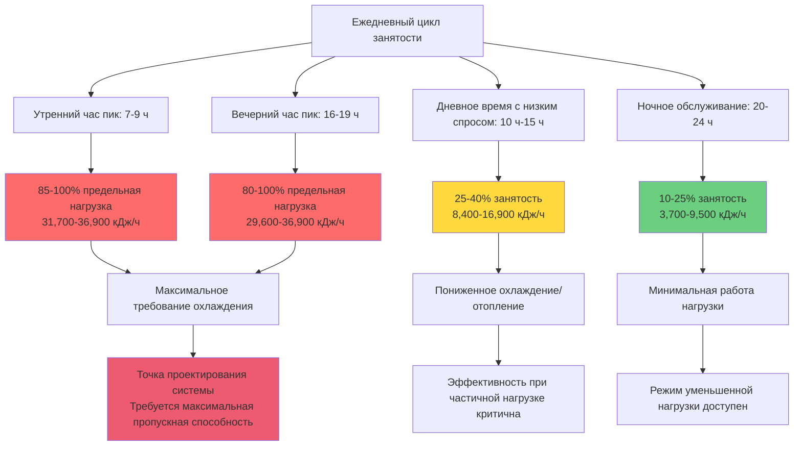

Тепловые нагрузки от пассажиров являются наиболее изменяемым и часто доминирующим компонентом требуемого охлаждения систем HVAC в общественном транспорте. В отличие от стационарных зданий, где занятость остается относительно постоянной, транспортные средства испытывают экстремальные колебания заполненности от пустого состояния в непиковые периоды до предельной загрузки в часы пик. Точный расчет нагрузок требует понимания скоростей метаболического тепловыделения, вариаций уровня активности и временных режимов занятости.

## Основы метаболического тепловыделения

Метаболические процессы в организме человека преобразуют химическую энергию в механическую работу и тепловую энергию. Тепловой компонент должен отводиться в окружающую среду для поддержания температуры тела. Теплопередача от пассажиров происходит через:

1. **Явное тепло**: Конвекция и излучение к окружающему воздуху и поверхностям
2. **Скрытое тепло**: Испарение пота и влаги из дыхания
3. **Полное тепло**: Сумма явного и скрытого компонентов

Соотношение между явным и скрытым теплом зависит от уровня активности, одежды и условий окружающей среды. Среды в общественном транспорте, как правило, работают с коэффициентами явного тепла (SHR) от 0,55 до 0,65 в сезон охлаждения.

**Расчет коэффициента явного тепла:**

$$\text{SHR} = \frac{q_{\text{sensible}}}{q_{\text{sensible}} + q_{\text{latent}}} = \frac{q_{\text{sensible}}}{q_{\text{total}}}$$

Где:
- $q_{\text{sensible}}$ = тепловыделение явного тепла (кДж/ч на человека)
- $q_{\text{latent}}$ = тепловыделение скрытого тепла (кДж/ч на человека)
- $q_{\text{total}}$ = полное метаболическое тепловыделение (кДж/ч на человека)

## Тепловыделение в зависимости от уровня активности

ASHRAE Fundamentals, глава 9, предоставляет значения метаболического тепловыделения для различных уровней активности. Значения, специфичные для общественного транспорта, учитывают уникальные позы и движения внутри транспортных средств.

**Скорости тепловыделения пассажирами:**

| Состояние активности | Явное (кДж/ч) | Скрытое (кДж/ч) | Полное (кДж/ч) | SHR | Типичная продолжительность |
|----------------------|---------------|-----------------|----------------|-----|---------------------------|
| Сидение, в покое | 238 | 132 | 370 | 0,64 | Пассажиры-постоянные клиенты |
| Сидение, легкие движения | 248 | 148 | 396 | 0,63 | Обычное сидение |
| Стояние, неподвижное | 264 | 185 | 449 | 0,59 | Пассажиры на полной вместимости |
| Стояние, раскачивание/балансирование | 280 | 201 | 481 | 0,58 | Стоящие пассажиры при движении |
| Ходьба, медленная посадка | 291 | 238 | 529 | 0,55 | Активная посадка/высадка |
| Ходьба с багажом | 333 | 275 | 608 | 0,55 | Обслуживание аэропорта/вокзала |
| Подъем по лестнице (платформы железной дороги) | 475 | 396 | 871 | 0,55 | События входа/выхода |

Для расчета проектных нагрузок используйте взвешенные средние значения на основе ожидаемого распределения активности. Типичный сценарий городского общественного транспорта предполагает:

- 60% сидящих пассажиров: 370 кДж/ч в среднем
- 35% стоящих пассажиров: 465 кДж/ч в среднем
- 5% активно садящихся/высаживающихся: 529 кДж/ч в среднем

**Взвешенное среднее тепловыделение пассажира:**

$$q_{\text{avg}} = \sum (f_i \times q_i)$$

$$q_{\text{avg}} = (0,60 \times 370) + (0,35 \times 465) + (0,05 \times 529) = 411 \text{ кДж/ч на человека}$$

## Расчет общей тепловой нагрузки от пассажиров

Полная охлаждающая нагрузка от пассажиров масштабируется линейно с количеством пассажиров:

$$Q_{\text{occupants}} = N \times (q_{\text{sensible}} + q_{\text{latent}})$$

$$Q_{\text{occupants,sensible}} = N \times q_{\text{sensible}}$$

$$Q_{\text{occupants,latent}} = N \times q_{\text{latent}}$$

Где:
- $N$ = количество пассажиров
- $Q_{\text{occupants}}$ = полная тепловая нагрузка от пассажиров (кДж/ч)

**Пример расчета – Городской автобус длиной 12 м:**

Дано:
- Вместимость по местам: 40 пассажиров
- Предельная вместимость: 75 пассажиров (условие проекта)
- Среднее тепловыделение: 423 кДж/ч на человека (смешанная активность)
- Доля явного тепла: 259 кДж/ч (SHR = 0,61)
- Доля скрытого тепла: 164 кДж/ч

Полная тепловая нагрузка от пассажиров при предельной вместимости:

$$Q_{\text{occupants,total}} = 75 \times 423 = 31,725 \text{ кДж/ч}$$

$$Q_{\text{occupants,sensible}} = 75 \times 259 = 19,425 \text{ кДж/ч}$$

$$Q_{\text{occupants,latent}} = 75 \times 164 = 12,300 \text{ кДж/ч}$$

Этот единственный компонент нагрузки равен или превышает полную пропускную способность HVAC жилого помещения площадью 185 м², что иллюстрирует серьезность тепловых нагрузок в общественном транспорте.

## Режимы изменения занятости

Занятость общественного транспорта следует предсказуемым ежедневным и еженедельным режимам, которые существенно влияют на профили тепловых нагрузок HVAC.

**Дифференциал нагрузок пик/непик:**

| Временной период | Средняя занятость | % вместимости | Тепловая нагрузка (кДж/ч) | Коэффициент нагрузки |
|------------------|-------------------|--------------|---------------------------|----------------------|
| Утренний час пик (7-9 ч) | 70 пассажиров | 93% | 29,600 | 1,00 |
| Позднее утро (9-11 ч) | 25 пассажиров | 33% | 10,600 | 0,36 |
| Полдень (11-14 ч) | 30 пассажиров | 40% | 12,700 | 0,43 |
| Послеполдень (14-16 ч) | 28 пассажиров | 37% | 11,800 | 0,40 |
| Вечерний час пик (16-19 ч) | 68 пассажиров | 91% | 28,800 | 0,97 |
| Вечер (19-22 ч) | 20 пассажиров | 27% | 8,500 | 0,29 |
| Ночное обслуживание (22-24 ч) | 12 пассажиров | 16% | 5,100 | 0,17 |

Соотношение нагрузок пик/непик 6:1 требует HVAC-систем с отличной производительностью при частичной нагрузке и быстрой модуляцией пропускной способности.

## Различие между нагрузками стоящих и сидящих пассажиров

Стоящие пассажиры генерируют на 20-30% более высокие тепловые нагрузки, чем сидящие пассажиры, из-за повышенного мышечного напряжения, необходимого для балансирования и стабильности.

**Сравнительный анализ:**

| Положение | Явное (кДж/ч) | Скрытое (кДж/ч) | Полное (кДж/ч) | Увеличение нагрузки |
|-----------|---------------|-----------------|----------------|-------------------|
| Сидение, расслабленное | 238 | 132 | 370 | Базовая величина |
| Стояние, неподвижное | 264 | 185 | 449 | +21% |
| Стояние, движение транспорта | 280 | 201 | 481 | +30% |

При предельной нагрузке доля стоящих пассажиров увеличивается с 0% при вместимости по местам до 45-50% при максимальной загрузке.

**Расчет нагрузки со смешанным использованием мест:**

Для 40-местного автобуса, вмещающего 75 пассажиров:
- 40 сидящих пассажиров: $40 \times 370 = 14,800$ кДж/ч
- 35 стоящих пассажиров: $35 \times 465 = 16,300$ кДж/ч
- Полная тепловая нагрузка: $31,100$ кДж/ч

Сравните со сценарием полной занятости (40 пассажиров):
- 40 сидящих пассажиров: $40 \times 370 = 14,800$ кДж/ч
- Увеличение нагрузки от стоящих: 110%

## Сезонные и климатические вариации

Характеристики тепловыделения пассажирами варьируются с внешними условиями и сезонной одеждой.

**Зимние условия:**
- Тяжелая одежда снижает отвод скрытого тепла через кожу
- Повышенное явное тепло от изоляционного эффекта
- SHR увеличивается до 0,68-0,72
- Тепловыделение пассажиров становится теплоаккумулятором во время пиковой занятости

**Летние условия:**
- Легкая одежда увеличивает испарительное охлаждение с кожи
- Повышенная скрытая доля из-за потоотделения
- SHR снижается до 0,55-0,60
- Максимальный сценарий охлаждающей нагрузки

**Влияние влажности на скрытые нагрузки:**

$$q_{\text{latent}} = h_{fg} \times \dot{m}_{\text{moisture}}$$

Где:
- $h_{fg}$ = скрытая теплота парообразования (2,257 кДж/кг при 21°C)
- $\dot{m}_{\text{moisture}}$ = скорость выделения влаги (кг/ч)

При 75% относительной влажности наружного воздуха снижение потенциала испарения вынуждает повышение температуры кожи и повышенный потоотделение, увеличивая скрытые нагрузки на 15-25% по сравнению с сухими условиями.

## Рекомендации по проектированию

**Руководящие принципы расчета нагрузок:**

1. **Используйте предельную вместимость** для определения размеров системы охлаждения, не только вместимость по местам
2. **Применяйте 423-449 кДж/ч на человека** для городского транспорта со смешанной активностью
3. **Рассчитывайте явное тепло при SHR = 0,60** для условий летнего проектирования
4. **Включайте коэффициент неравномерности 10-15%** для больших транспортных средств (сочлененные автобусы, многоваганные поезда), где не все зоны одновременно достигают пикового значения
5. **Проверьте пропускную способность по скрытому теплу** для управления влажностными нагрузками и поддержания влажности ниже 60% RH

**Допущения по занятости в зависимости от типа обслуживания:**

| Тип обслуживания | Проектная занятость | % сидячих мест | % стоящих | Нагрузка/человека |
|-----------------|-------------------|-----------------|------------|------------------|
| Городской местный автобус | 100% предельная | 55% | 45% | 433 кДж/ч |
| Скоростной/пригородный автобус | 100% по местам | 100% | 0% | 370 кДж/ч |
| Легкий метрополитен | 90% предельная | 50% | 40% | 423 кДж/ч |
| Метро | 100% предельная | 45% | 55% | 449 кДж/ч |
| Пригородный поезд | 110% по местам (проходы) | 90% | 10% | 386 кДж/ч |

Точный расчет тепловой нагрузки от пассажиров образует основу надлежащего выбора размеров HVAC-системы в приложениях общественного транспорта. Экстремальная изменяемость между пиковыми и непиковыми условиями требует оборудования с широким диапазоном модуляции пропускной способности и стратегий управления, которые реагируют на реальную занятость, а не на фиксированные графики.
