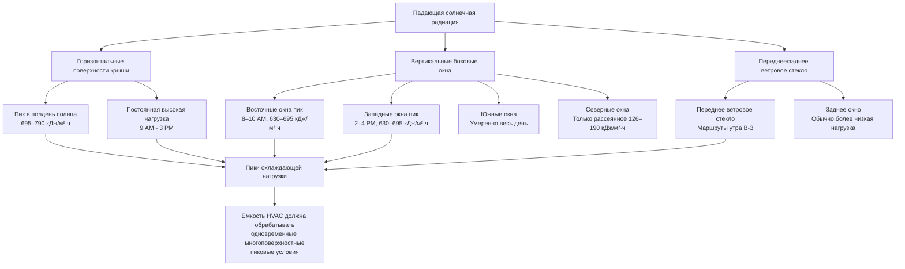

Солнечная радиация представляет собой единственный наиболее значительный и переменный компонент теплонагрузки в конструкции HVAC транспортных средств массового транзита. Транзитные транспортные средства имеют обширные застекленные поверхности с минимальным наружным затенением, создавая поглощение солнечного тепла, которое может превышать 140–210 кДж/с для одного автобуса длиной 12 м в условиях пиковой нагрузки. Комбинация больших отношений площади стекла к стене (20–35%), тонкостенной конструкции и постоянно изменяющейся ориентации относительно солнца создает сложную тепловую динамику, требующую сложных методов расчета и эффективных стратегий смягчения.

## Основы солнечной радиации для транзитных приложений

Поглощение солнечного тепла через остекление транзитного транспортного средства следует тем же физическим принципам, что и строительные приложения, но с несколькими критическими отличиями, которые увеличивают тепловую нагрузку.

**Компоненты прямого и рассеянного излучения:**

Транзитные транспортные средства получают солнечную радиацию из трех источников одновременно:

1. **Прямое лучевое излучение**: коллимированный солнечный свет, падающий на поверхности при углах солнечной высоты и азимута
2. **Рассеянная небесная радиация**: рассеянное излучение от атмосферных частиц и водяного пара, примерно 10–20% от ясного неба итого
3. **Отражение от земли**: эффект альбедо от дорожного покрытия, воды или окружающих поверхностей, вносящий 5–15% дополнительной нагрузки

Общая падающая солнечная радиация на любую поверхность транспортного средства объединяет эти компоненты на основе ориентации поверхности и атмосферных условий.

**Вариация интенсивности солнца по широте и сезону:**

| Широта | Пик летнего солнцестояния (кДж/м²·ч) | Пик зимнего солнцестояния (кДж/м²·ч) | Пик равноденствия (кДж/м²·ч) |
|----------|-----------------------------------|-----------------------------------|---------------------------|
| 25°N (Майами) | 900–930 | 760–790 | 850–885 |
| 35°N (Лос-Анджелес) | 870–900 | 695–725 | 820–855 |
| 40°N (Нью-Йорк) | 840–870 | 630–665 | 790–820 |
| 45°N (Миннеаполис) | 805–835 | 570–600 | 760–790 |
| 50°N (Ванкувер) | 775–805 | 505–535 | 725–760 |

Эти значения представляют нормальное падение на поверхность, перпендикулярную солнечным лучам, в условиях ясного неба в полдень солнца. Фактические нагрузки на поверхность транспортного средства требуют тригонометрических поправок на ориентацию поверхности.

## Методология расчета поглощения солнечного тепла

Фундаментальное уравнение для поглощения солнечного тепла через остекление транзита расширяет методологию зданий ASHRAE с мобильно-специфичными факторами.

**Полная формула солнечной нагрузки:**

$$Q_{solar} = \sum_{i=1}^{n} A_i \times SHGC_i \times SHGF_i \times CLF_i \times F_{orientation}$$

Где:
- $A_i$ = площадь застекленной поверхности для поверхности $i$ (м²)
- $SHGC_i$ = коэффициент поглощения солнечного тепла для типа остекления (безразмерный, 0–1)
- $SHGF_i$ = коэффициент поглощения солнечного тепла, интенсивность падающей радиации (кДж/м²·ч)
- $CLF_i$ = коэффициент охлаждающей нагрузки, учитывающий эффекты теплового аккумулирования (0,6–1,0)
- $F_{orientation}$ = коэффициент коррекции ориентации для курса транспортного средства

**Коррекция угла падения:**

Солнечная радиация, падающая на стекло под косыми углами, испытывает пониженную пропускаемость. Модификатор угла падения следует формуле:

$$SHGF_{effective} = SHGF_{normal} \times \cos(\theta)$$

Где $\theta$ — угол между нормалью к поверхности и солнечным лучом. Для вертикальных окон транзита это становится:

$$\cos(\theta) = \sin(\beta) \times \cos(\gamma - \psi)$$

Где:
- $\beta$ = угол солнечной высоты (градусы выше горизонта)
- $\gamma$ = угол солнечного азимута (градусы от севера)
- $\psi$ = угол азимута поверхности (ориентация транспортного средства)

**Тепловое аккумулирование и коэффициент охлаждающей нагрузки:**

В отличие от зданий с существенной тепловой массой, транзитные транспортные средства имеют минимальную емкость теплового аккумулирования в легкой алюминиевой и стальной конструкции. Коэффициент охлаждающей нагрузки для транзитных приложений обычно варьируется в диапазоне 0,85–0,95, что указывает на то, что 85–95% мгновенного поглощения солнечного тепла становится немедленной охлаждающей нагрузкой, а не поглощается и переизлучается позже.

## Коэффициенты поглощения солнечного тепла остекления транзита

Спецификации остекления транзитного транспортного средства уравновешивают видимость пассажира, конструктивные требования и производительность солнечного управления.

**Стандартные значения SHGC остекления транзита:**

| Тип остекления | SHGC | Видимая пропускаемость | U-коэффициент (кДж/ч·м²·°C) | Типичное применение |
|--------------|------|----------------------|-------------------------|---------------------|
| Однослойное прозрачное, 6 мм | 0,82–0,86 | 0,88–0,90 | 6,25–6,54 | Старые транспортные средства (до 2000) |
| Однослойное тонированное зелень, 6 мм | 0,68–0,72 | 0,75–0,78 | 6,14–6,37 | Стандартное остекление автобуса |
| Однослойное тонированное бронза, 6 мм | 0,62–0,66 | 0,60–0,65 | 6,14–6,37 | Климаты с высокой солнечной нагрузкой |
| Однослойное рефлективное покрытие | 0,45–0,55 | 0,50–0,65 | 5,97–6,25 | Модернизация солнечного управления |
| Ламинированное тонированное, 8 мм | 0,58–0,64 | 0,70–0,75 | 5,97–6,14 | Приложения безопасного стекла |
| Двуслойное low-E, 25 мм в целом | 0,38–0,42 | 0,70–0,75 | 2,56–2,95 | Премиум вагоны |
| Двуслойное тонированное low-E | 0,28–0,34 | 0,55–0,65 | 2,38–2,73 | Высокоскоростной поезд, климат-контроль |
| Электрохромное смарт-стекло | 0,08–0,48 | 0,05–0,60 | 1,42–1,82 | Появляющаяся технология |

**Влияние SHGC на охлаждающую нагрузку:**

Разница между прозрачным однослойным стеклом (SHGC = 0,84) и двуслойным низкоэмиссионным тонированным стеклом (SHGC = 0,32) для автобуса длиной 12 м с 23 м² остекления в условиях пиковой нагрузки (SHGF = 695 кДж/м²·ч):

Прозрачное стекло: $Q = 23 \times 0,84 \times 695 \times 0,90 = 12 046$ кДж/ч

Низкоэмиссионное стекло: $Q = 23 \times 0,32 \times 695 \times 0,90 = 4 600$ кДж/ч

Снижение: 7 446 кДж/ч (62% снижение солнечной нагрузки, эквивалентно 2,1 кВт охлаждающей способности)

## Эффекты ориентации и динамическая нагрузка

Транзитные транспортные средства испытывают постоянно изменяющуюся солнечную экспозицию по мере изменения маршрутов ориентации относительно положения солнца.

**Солнечная нагрузка по ориентации поверхности:**

**Пример расчета направленной нагрузки:**

Для автобуса длиной 12 м, идущего в направлении восток-запад летним полдником (14:00, 40°N широта):

**Солнечные нагрузки на поверхность:**

| Поверхность | Площадь (м²) | Ориентация | SHGF (кДж/м²·ч) | SHGC | Нагрузка (кДж/ч) |
|----------|-----------|-------------|------------------|------|---------------|
| Крыша | 30 | Горизонталь | 743 | 0,15 (непрозрачная) | 3 343 |
| Северные боковые окна | 9 | Вертикаль С | 205 | 0,68 | 1 265 |
| Южные боковые окна | 9 | Вертикаль Ю | 585 | 0,68 | 3 575 |
| Восточное ветровое стекло | 1,7 | Вертикаль В | 300 | 0,72 | 367 |
| Западное заднее окно | 1,1 | Вертикаль З | 679 | 0,72 | 538 |
| **Общая солнечная нагрузка** | **51** | - | - | - | **9 088** |

Южные окна составляют 39% общей солнечной нагрузки, несмотря на то, что они представляют только 18% поверхности транспортного средства, демонстрируя критическую важность ориентированных на конкретное направление обработок остекления.

## Пленки солнечного управления и решения для модернизации

Пленки послепродажного обслуживания солнечного управления обеспечивают экономичные улучшения тепловой производительности для существующих парков транзита без замены остекления.

**Производительность пленок солнечного управления:**

| Тип пленки | Снижение SHGC | Снижение видимого света | Период окупаемости (годы) | Долговечность |
|-----------|----------------|------------------------|----------------------|------------|
| Абсорбирующая окрашенная пленка | 15–25% | 20–40% | 3–5 | 5–7 лет |
| Металлизированная рефлективная пленка | 35–50% | 25–45% | 2–4 | 7–10 лет |
| Керамическая неметаллическая пленка | 40–55% | 10–25% | 2,5–4,5 | 10–12 лет |
| Спектрально избирательная пленка | 45–60% | 5–15% | 2–3 | 10–15 лет |
| Многослойная нано-керамика | 50–65% | 8–20% | 1,5–3 | 12–15 лет |

**Рассмотрения при установке:**

Пленки солнечного управления должны выдерживать специфичные для транзита напряжения, отсутствующие в приложениях зданий:

- **Устойчивость к вибрации**: системы клея должны поддерживать целостность связи при постоянной вибрации 5–15 Гц
- **Термическое циклирование**: ежедневные колебания температуры от -29°C до 71°C создают напряжение расширения/сжатия
- **Изогнутое остекление**: многие окна транзита имеют составные кривые, требующие квалифицированной установки
- **Устойчивость к вандализму**: защита от царапин существенна для поверхностей, доступных пассажирам
- **Соответствие нормативным требованиям**: пленки не должны снижать видимость ниже требований FMVSS 205 (70% минимальная пропускаемость переднего ветрового стекла)

**Расчет экономии энергии:**

Для парка из 50 транзитных транспортных средств в Фениксе, АЗ (6 500 дней охлаждения в год):

Базовая энергия охлаждения: 50 транспортных средств × 12 кВт среднее × 1 200 часов × 1,0 = 720 000 кВт·ч/год

С 50% снижением SHGC от керамической пленки: 720 000 × 0,28 (доля солнечной нагрузки) × 0,50 = 100 800 кВт·ч/год экономии

При 0,12 USD/кВт·ч: 12 096 USD/год экономии
Стоимость пленки: 150 USD/транспортное средство × 50 = 7 500 USD
Простой период окупаемости: 0,62 года

## Стандарты и требования испытаний

Остекление транзитного транспортного средства и продукты солнечного управления должны соответствовать множественным стандартам производительности и безопасности.

**Стандарты ASHRAE:**

- **ASHRAE 90.1**: энергетический стандарт для зданий (адаптирован для остекления транзитного транспортного средства)
- **ASHRAE Handbook - HVAC Applications, Chapter 11**: коэффициенты солнечной нагрузки и процедуры расчета для массового транзита
- **ASHRAE Standard 55**: условия теплового комфорта, применимые к пассажирским отделениям

**Федеральные стандарты безопасности автотранспортных средств (FMVSS):**

- **FMVSS 205**: материалы остекления - требования безопасного стекла для всех окон транзита
- **FMVSS 217**: механизмы удержания и отпускания окна автобуса
- **FMVSS 302**: воспламеняемость внутренних материалов, включая пленки для окон

**Стандарты ANSI/NFRC:**

- **NFRC 200**: процедура определения U-факторов изделий остекления
- **NFRC 201**: процедура промежуточного стандартного метода испытаний для измерения SHGC в центре остекления
- **NFRC 300**: метод испытания для определения видимой пропускаемости и коэффициента поглощения солнечного тепла

**Протоколы испытаний:**

Проверка коэффициента поглощения солнечного тепла следует спектрофотометрическому измерению NFRC 201:

1. Подготовка образца с репрезентативной сборкой остекления
2. Измерение спектральной пропускаемости от 300–2 500 нм длины волны
3. Измерение спектрального отражения (внутренние и внешние поверхности)
4. Интеграция по стандартному солнечному спектру (ASTM G173)
5. Расчет непосредственно передаваемых, поглощенных и переизлучаемых компонентов

Результаты должны быть проверены в пределах ±0,02 единиц SHGC на трех образцах образцов для достижения сертификации.

## Стратегии проектирования для снижения солнечной нагрузки

Эффективная конструкция HVAC транзита использует несколько дополняющих стратегий для управления солнечными тепловыми приобретениями.

**Оптимизация площади остекления:**

Хотя комфорт пассажиров требует адекватного естественного освещения и видимости снаружи, чрезмерное остекление создает неуправляемые солнечные нагрузки. Оптимальная конструкция уравновешивает:

- Минимальное остекление: 18–22% от общей поверхности для адекватного естественного освещения
- Максимальное практическое остекление: 32–35% перед доминированием солнечных нагрузок на требования охлаждения
- Размещение окна: приоритет для северных поверхностей, минимизация низкоугловых восточно-западных экспозиций
- Остекление крыши: избегайте прозрачных панелей крыши, кроме небольших фонарных окон с высокопроизводительным остеклением

**Зонированная емкость HVAC:**

Распределение охлаждающей способности для соответствия асимметричной солнечной нагрузке:

- Системы с восточным/западным разделением для транспортных средств, работающих в основном в кардинальных направлениях
- Дифференциальные объемы подачи воздуха на солнечные и затемненные зоны
- Датчики температуры на поверхностях остекления запускают локальное увеличение емкости
- Компрессоры с переменной скоростью модулируют мгновенную, а не среднюю солнечную нагрузку

**Внешние элементы затенения:**

Постоянное или развертываемое затенение снижает солнечное получение до того, как радиация попадет в кондиционируемое пространство:

- Глубокие свесы крыши на головке окна (15–30 см) блокируют высокое летнее солнце
- Горизонтальные жалюзи над окнами снижают экспозицию солнечной высоты
- Внутренние рулонные шторы или автоматизированные жалюзи обеспечивают управление пассажиром (15–30% снижение SHGC при развертывании)

Комплексный анализ солнечной нагрузки и смягчение представляют существенные элементы успешной конструкции HVAC транзитного транспортного средства, прямо влияя на размер оборудования, энергопотребление и тепловой комфорт пассажиров в условиях сурового воздействия, характерных для мобильных приложений массового транзита.
