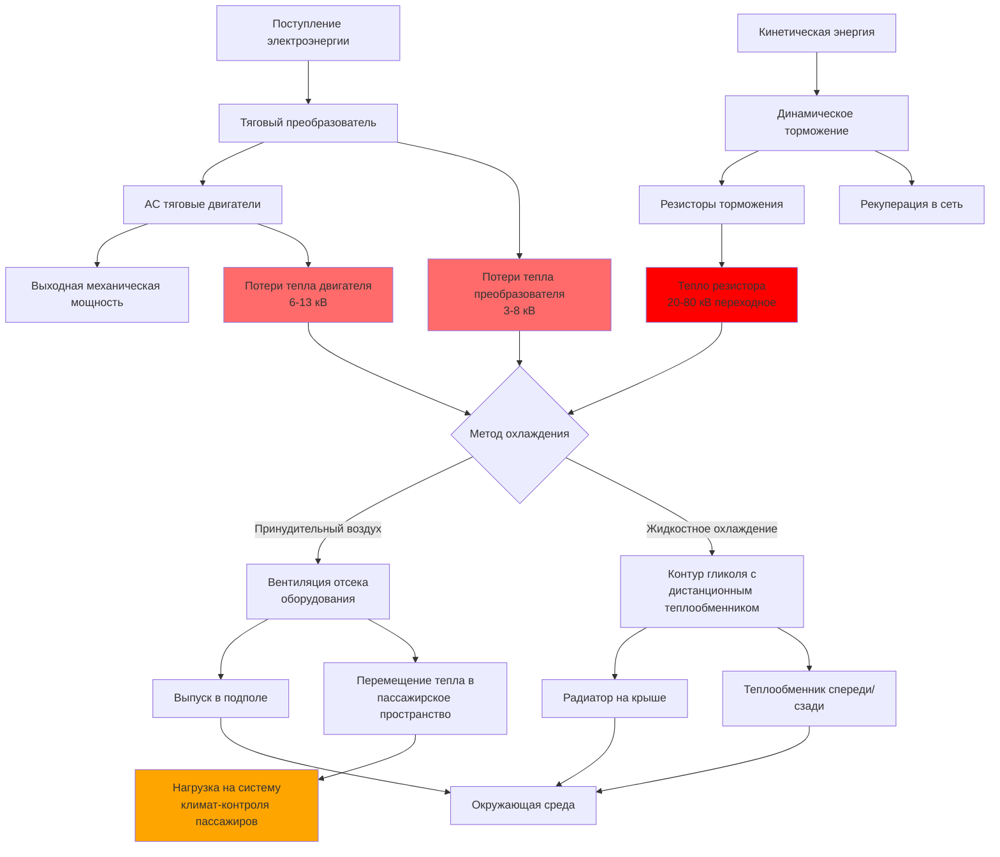

Электрические тяговые системы современных транспортных средств массового транспорта генерируют значительные тепловые нагрузки, которые непосредственно влияют на проектирование систем HVAC и кондиционирование пассажирского пространства. В отличие от относительно постоянных тепловых нагрузок от освещения или стационарной эксплуатации, тяговое оборудование производит высокопеременные тепловые выходы, коррелирующие с ускорением, замедлением и установившейся скоростью. Надлежащая характеристика этих источников тепла обеспечивает адекватную охлаждающую мощность при одновременном предотвращении тепловых отказов критических компонентов силовой установки.

## Рассеяние тепла тяговым двигателем

Электрические тяговые двигатели преобразуют электрическую энергию в механическую работу с типичным коэффициентом полезного действия 92–96 % при номинальных условиях нагрузки. Отвергнутое тепло проявляется как потери $I^2R$ в обмотках, потери в сердечнике от магнитного гистерезиса и механические потери трения в подшипниках и воздушных зазорах.

**Генерация тепла двигателем:**

$$Q_{motor} = \frac{P_{shaft}}{\eta_{motor}} - P_{shaft} = P_{shaft} \left(\frac{1}{\eta_{motor}} - 1\right)$$

Где:
- $Q_{motor}$ = тепло, отводимое двигателем (кВ)
- $P_{shaft}$ = механическая мощность на валу (кВ)
- $\eta_{motor}$ = КПД двигателя (безразмерный, обычно 0,92–0,96)

Для тягового двигателя мощностью 150 кВ, работающего с КПД 94 %:

$$Q_{motor} = 150 \left(\frac{1}{0.94} - 1\right) = 150 \times 0.0638 = 9.57 \text{ кВ} = 32,650 \text{ кДж/ч}$$

Это рассеяние тепла происходит непрерывно во время тяги с пиковыми значениями при подъеме в гору или при событиях ускорения, когда двигатели работают при максимальном токе.

**Тепловая нагрузка двигателя по типам:**

| Тип двигателя | Номинальная мощность (кВ) | КПД (%) | Отвод тепла (кВ) | кДж/ч | Типичное применение |
|------------|------------------|----------------|---------------------|---------|---------------------|
| AC асинхронный (малый) | 75 | 92 | 6.5 | 23,400 | Легкий рельсовый транспорт, трамваи |
| AC асинхронный (средний) | 150 | 94 | 9.6 | 34,560 | Автобусы, метро |
| AC асинхронный (крупный) | 250 | 95 | 13.2 | 47,520 | Пригородные поезда, метро |
| Постоянный магнит (PM) | 150 | 96 | 6.3 | 22,680 | Современные электробусы |
| Постоянный магнит (PM) | 250 | 97 | 7.7 | 27,720 | Высокоэффективный рельсовый транспорт |

Двигатели с постоянными магнитами демонстрируют превосходный коэффициент полезного действия, снижая отвод тепла на 30–40 % по сравнению с асинхронными двигателями эквивалентной мощности. Это тепловое преимущество непосредственно переводится в сниженные требования к емкости системы охлаждения.

## Тепловая нагрузка преобразователя и силовой электроники

Тяговые преобразователи преобразуют напряжение шины постоянного тока в переменный ток переменной частоты для управления двигателем. Современные преобразователи на основе IGBT (биполярный транзистор с изолированным затвором) работают с КПД 97–99 %, однако абсолютная величина отвода тепла остается значительной из-за большой пропускной мощности.

**Рассеяние тепла преобразователем:**

$$Q_{inverter} = P_{output} \left(\frac{1}{\eta_{inverter}} - 1\right) + P_{losses,switching}$$

Где:
- $Q_{inverter}$ = отвод тепла преобразователем (кВ)
- $P_{output}$ = выходная мощность преобразователя (кВ)
- $\eta_{inverter}$ = КПД преобразователя (0,97–0,99)
- $P_{losses,switching}$ = потери при коммутации (обычно 0,5–1,0 % от номинальной мощности)

**Тепловые нагрузки преобразователя:**

| Номинал преобразователя (кВ) | КПД (%) | Потери проводимости (кВ) | Потери при коммутации (кВ) | Общее тепло (кВ) | кДж/ч |
|----------------------|----------------|------------------------|-----------------------|-----------------|--------|
| 200 | 98.0 | 3.1 | 1.0 | 4.1 | 14,760 |
| 400 | 98.5 | 4.5 | 2.0 | 6.5 | 23,400 |
| 600 | 98.8 | 5.4 | 3.0 | 8.4 | 30,240 |
| 800 | 99.0 | 6.4 | 4.0 | 10.4 | 37,440 |

Силовая электроника генерирует локализованные концентрации тепла, требующие специализированных систем охлаждения. Охлаждаемые воздухом преобразователи используют принудительную вентиляцию с теплоотводящими пластинами, в то время как конструкции с жидкостным охлаждением используют контуры гликоля для управления тепловой плотностью, превышающей 50 Вт/см² на поверхностях полупроводниковых переходов.

## Динамическое торможение и рекуперативное тепло

Системы динамического торможения рассеивают кинетическую энергию в виде тепла во время замедления, создавая переходные тепловые нагрузки, которые могут превышать установившиеся тяговые нагрузки в 2–4 раза.

**КПД рекуперативного торможения:**

Современные транспортные средства массового транспорта восстанавливают 15–35 % энергии торможения посредством рекуперации обратно в электрическую систему распределения или аккумуляторы энергии на борту. Остальная энергия рассеивается в виде тепла через:

1. **Резисторы динамического торможения** (системы без рекуперации)
2. **Медные потери двигателя** во время режима рекуперации
3. **Потери преобразователя** при реверсировании питания

**Тепловая нагрузка торможения:**

$$Q_{braking} = \frac{m v^2}{2 t} (1 - \eta_{regen}) \times \frac{1}{3412}$$

Где:
- $Q_{braking}$ = средняя мощность тепла торможения (кВ)
- $m$ = масса транспортного средства (кг)
- $v$ = начальная скорость (м/с)
- $t$ = длительность торможения (с)
- $\eta_{regen}$ = эффективность рекуперации (0,15–0,35)
- 3412 = коэффициент преобразования кДж/ч в кВ

Для автобуса массового транспорта массой 40 000 кг, замедляющегося с 60 км/ч (16,7 м/с) в течение 10 секунд с 25 % эффективностью рекуперации:

$$Q_{braking} = \frac{40000 \times (16.7)^2}{2 \times 10} (1 - 0.25) \times \frac{1}{3412} = \frac{5,577,800}{68,240} = 81.7 \text{ кВ}$$

Это дает 294,120 кДж/ч мгновенного отвода тепла во время событий торможения. Хотя переходная, частые режимы остановки в городском транспорте создают почти непрерывные тепловые нагрузки при торможении в среднем 20,000–40,000 кДж/ч.

## Пути потока тепла и управление тепловыми режимами

Тепло от тягового оборудования следует по нескольким путям отвода в зависимости от расположения компонента и архитектуры системы охлаждения.

## Проектирование отсека оборудования с тепловым управлением

Отсеки тягового оборудования требуют специализированного управления тепловыми режимами для поддержания температуры компонентов в пределах рабочих норм при минимизации передачи тепла в пассажирские пространства.

**Пределы рабочей температуры оборудования:**

| Компонент | Макс. рабочая температура (°C) | Макс. температура перехода (°C) | Порог снижения мощности (°C) |
|-----------|----------------------------|---------------------------|---------------------|
| IGBT преобразователи | 85 | 125–150 | 75 |
| Тяговые двигатели | 155 (обмотка) | — | 140 |
| Резисторы торможения | 400 | — | — |
| Конденсаторы шины постоянного тока | 85 | — | 70 |
| Драйверы затвора | 85 | 110 | 75 |

**Требования вентиляции отсека:**

$$CFM = \frac{Q_{total} \times 3.412}{\rho \times c_p \times \Delta T \times 60}$$

Для воздушного охлаждения ($\rho = 1.2$ кг/м³, $c_p = 1005$ Дж/кг·°C):

$$CFM = \frac{Q_{кВ} \times 3412}{1.2 \times 1005 \times \Delta T \times 0.5884}$$

Где $\Delta T$ представляет допустимое повышение температуры (обычно 8–14°C для отсеков оборудования).

Для тепловой нагрузки оборудования 11,6 кВ с повышением температуры 11°C:

$$CFM = \frac{11.6 \times 3412}{1.2 \times 1005 \times 11 \times 0.5884} ≈ 1,850 \text{ CFM} (м³/ч)$$

Этот воздушный поток требует значительной мощности вентилятора (1–3 кВ) и осторожного проектирования воздуховодов для предотвращения циркуляции воздуха или мертвых зон вокруг критических компонентов.

## Системы жидкостного охлаждения

Высокомощные тяговые системы все чаще применяют жидкостное охлаждение для преобразователей и двигателей, обеспечивая превосходное тепловое поведение в компактных установках.

**Теплопередача жидкостного охлаждения:**

$$Q = \dot{m} \times c_p \times \Delta T = \rho \times GPM \times c_p \times \Delta T \times 60$$

Для раствора этиленгликоля 50/50 ($\rho = 1.082$ кг/л, $c_p = 3.18$ кДж/кг·°C):

$$Q_{кВ} = 0.0606 \times л/мин \times \Delta T$$

Для отвода 14,6 кВ с повышением температуры 8°C:

$$л/мин = \frac{14.6}{0.0606 \times 8} = 30 \text{ л/мин}$$

Системы жидкостного охлаждения передают тепло тягового оборудования в дистанционные теплообменники, где воздушный поток не конкурирует с вентиляцией пассажирского пространства. Радиаторы на крыше или теплообменники на переднем конце отводят эту тепловую нагрузку непосредственно в окружающий воздух.

## Передача тепла в пассажирские пространства

Несмотря на тепловые барьеры, 15–30 % тепла от тягового оборудования обычно перемещается в пассажирские отсеки через:

1. **Теплопроводность через полы и переборки**, разделяющие отсеки оборудования
2. **Конвекция от теплых поверхностей**, подвергнутых пассажирским зонам
3. **Излучение от горячих компонентов**, видимых в открытых конфигурациях
4. **Утечку воздуха** из отсеков оборудования в пассажирские зоны

**Передача тепла теплопроводностью:**

$$Q_{cond} = \frac{k \times A \times \Delta T}{L}$$

Для панели алюминиевого пола площадью 4,6 м² (k = 237 Вт/м·°C, L = 1,27 см) с разностью температур 22°C:

$$Q_{cond} = \frac{237 \times 4.6 \times 22}{0.0127} = 1,900,000 \text{ кДж/ч}$$

Это нереалистичное значение демонстрирует, почему слои изоляции (стекловолокно, пена) снижают эффективную теплопроводность до U = 1,14–1,42 Вт/м²·°C:

$$Q = U \times A \times \Delta T = 1.25 \times 4.6 \times 22 = 126 \text{ кВ}$$

## Стандарты и справочные материалы проектирования

Проектирование тягового теплового режима транспортных средств следует нескольким стандартам, охватывающим как электрические, так и тепловые характеристики:

- **IEEE 1572**: Стандарт управления системой тяги в электрических рельсовых скоростных транспортных средствах
- **IEC 60349**: Электрическая тяга - вращающиеся электрические машины для железнодорожного и дорожного транспорта
- **APTA RT-VIM**: Рекомендуемая практика для систем HVAC в пассажирских вагонах рельсового транспорта
- **EN 50155**: Электронное оборудование, используемое на подвижном составе (рейтинги температуры)
- **UL 2267**: Системы топливных элементов для установки в промышленных электрических транспортных средствах

Системы управления тепловыми режимами должны поддерживать температуру компонентов в пределах норм этих стандартов в условиях окружающей среды, колеблющихся от –40°C до 52°C, представляющих глобальные среды эксплуатации транзитного транспорта.

## Интеграция с пассажирскими системами HVAC

Эффективное проектирование тепловых режимов координирует охлаждение тягового оборудования с контролем климата пассажиров для:

1. **Предотвращения теплового взаимодействия** между вентиляцией оборудования и подачей воздуха для пассажиров
2. **Минимизации вспомогательного потребления энергии** для охлаждающих вентиляторов и насосов
3. **Обеспечения рекуперации отходящего тепла** во время холодной погоды (отопление пассажирских пространств)
4. **Оптимизации общей энергоэффективности транспортного средства** через интегрированное управление тепловыми режимами

Современные транспортные средства массового транспорта достигают 5–15 % экономии энергии за счет интегрированных тепловых систем, которые восстанавливают отходящее тепло преобразователя и двигателя для отопления пассажирского отсека, снижая спрос на специализированные электронагреватели во время зимней эксплуатации.

Тяговое оборудование представляет наибольшую переменную тепловую нагрузку в электрических транспортных средствах массового транспорта, требуя софистицированных подходов к охлаждению, которые уравновешивают защиту компонентов с общей энергоэффективностью системы и комфортом пассажиров.
