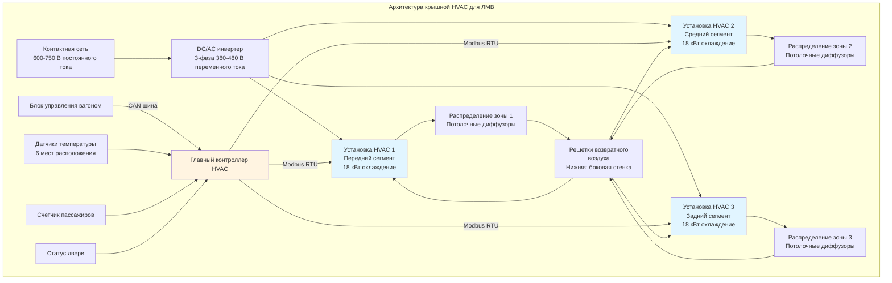

Климатические системы вагонов легкого метро используют специализированные конфигурации HVAC, разработанные для надежной работы в мобильных условиях при управлении значительными тепловыми нагрузками в условиях строгих ограничений по массе и пространству. Выбор системы зависит от архитектуры вагона, требований к низкопольной конструкции и условий эксплуатации в климатической зоне. Три основные конфигурации—блочные крышные установки, сплит-системы и архитектуры тепловых насосов—каждая предлагает отчетливые преимущества для конкретных приложений ЛМВ.

## Требования по холодопроизводительности

Расчеты холодопроизводительности ЛМВ учитывают совокупное воздействие солнечной радиации, нагрузки от пассажиров, отвода тепла оборудования и инфильтрации при частых остановках на станциях.

### Расчет проектной нагрузки

Общая холодильная нагрузка для одного сегмента ЛМВ следует:

$$Q_{total} = Q_{solar} + Q_{trans} + Q_{occupants} + Q_{infiltration} + Q_{equipment} + Q_{ventilation}$$

**Солнечная нагрузка** доминирует в современных ЛМВ с обширным остеклением:

$$Q_{solar} = A_{glass} \cdot SHGC \cdot I_{solar} \cdot CLF \cdot SF$$

где:
- $A_{glass}$ = площадь остекления (м²)
- $SHGC$ = коэффициент солнечного прироста тепла (0,25-0,55)
- $I_{solar}$ = падающая солнечная радиация (800 Вт/м²)
- $CLF$ = коэффициент холодильной нагрузки (0,75-0,90)
- $SF$ = коэффициент затенения от внешних устройств (0,85-1,0)

Для типичного 24-метрового сочлененного ЛМВ с 35 м² остекления и SHGC 0,40:

$$Q_{solar} = 35 \text{ м}^2 \cdot 0,40 \cdot 800 \text{ Вт/м}^2 \cdot 0,85 \cdot 1,0 = 9,520 \text{ Вт}$$

**Нагрузка от пассажиров** варьируется в зависимости от плотности заполнения:

$$Q_{occupants} = N \cdot (q_{sensible} + q_{latent}) = N \cdot (100 + 50) = 150N \text{ Вт}$$

При проектной наполняемости 80 пассажиров на сегмент:

$$Q_{occupants} = 80 \cdot 150 = 12,000 \text{ Вт}$$

**Передача тепла** через оболочку вагона:

$$Q_{trans} = \sum (U_i \cdot A_i \cdot \Delta T)$$

| Компонент | U-коэффициент (Вт/м²·К) | Площадь (м²) | ΔT (К) | Прирост тепла (Вт) |
|-----------|-------------------------|-------------|--------|-------------------|
| Кровельная панель | 0,35 | 45 | 15 | 236 |
| Боковые панели | 0,45 | 55 | 12 | 297 |
| Торцевые стенки | 0,50 | 12 | 12 | 72 |
| Пол | 0,60 | 40 | 8 | 192 |
| Окна | 1,20 | 35 | 12 | 504 |
| **Всего** | — | — | — | **1 301** |

**Нагрузка от инфильтрации** через дверные проемы:

$$Q_{infiltration} = 1,23 \cdot \dot{V} \cdot \Delta T + 3010 \cdot \dot{V} \cdot \Delta \omega$$

где:
- $\dot{V}$ = расход инфильтрационного воздуха (м³/с)
- $\Delta T$ = разница температур (К)
- $\Delta \omega$ = разница влагосодержания (кг воды/кг сухого воздуха)

При предположении 0,35 м³/с средней инфильтрации при проектных условиях (35°C наружная, 24°C внутренняя, 60% ОВ наружная):

$$Q_{infiltration,sensible} = 1,23 \cdot 0,35 \cdot 11 = 4,74 \text{ кВт}$$
$$Q_{infiltration,latent} = 3010 \cdot 0,35 \cdot 0,010 = 10,54 \text{ кВт}$$

**Отвод тепла оборудованием** от тяговых систем:

$$Q_{equipment} = \frac{P_{inverter} \cdot (1 - \eta)}{\eta} + Q_{lighting}$$

Для инвертора 300 кВт при КПД 97,5%:

$$Q_{equipment} = \frac{300,000 \cdot 0,025}{0,975} + 1,200 = 8,900 \text{ Вт}$$

**Вентиляционная нагрузка** для требуемого наружного воздуха:

$$Q_{ventilation} = \dot{m}_{oa} \cdot (h_{oa} - h_{ra})$$

При 15 CFM/человек (0,007 м³/с·человек), 80 пассажиров требуют 0,56 м³/с наружного воздуха. С разницей энтальпии 25 кДж/кг:

$$Q_{ventilation} = 0,68 \cdot 0,56 \cdot 25 = 9,5 \text{ кВт}$$

### Общая производительность

Суммирование всех компонентов:

| Компонент нагрузки | Холодильная нагрузка (кВт) | Процент |
|-------------------|---------------------------|---------|
| Солнечная радиация | 9,5 | 20% |
| Пассажиры | 12,0 | 25% |
| Передача тепла | 1,3 | 3% |
| Инфильтрация (явная) | 4,7 | 10% |
| Инфильтрация (скрытая) | 10,5 | 22% |
| Оборудование | 8,9 | 19% |
| Вентиляция | 0,5 | 1% |
| **Всего** | **47,4** | **100%** |

С добавлением 10% коэффициента безопасности на переходные условия:

$$Q_{design} = 47,4 \cdot 1,10 = 52,1 \text{ кВт (15 тонн)}$$

Это определяет выбор оборудования HVAC с общей холодопроизводительностью 50-55 кВт для трехсегментного сочлененного ЛМВ.

## Конфигурация блочной крышной установки

Крышные HVAC пакеты представляют наиболее распространенную архитектуру климатической системы ЛМВ, обеспечивая доступность, модульность и проверенную надежность.

### Архитектура системы

### Спецификации компонентов

Каждый крышный пакет интегрирует все холодильные компоненты в компактный, защищенный от атмосферы корпус:

| Компонент | Спецификация | Примечания |
|-----------|-------------|-----------|
| Компрессор | Спиральный, 3-5 кВт входной мощности | Переменная частота привода, 30-100% производительность |
| Конденсатор | Микроканальный, 0,45 м² площадь фасада | Алюминиевая конструкция, скорость воздуха на фасаде 300-400 м/ч |
| Испаритель | Медь-алюминий, 0,55 м² площадь фасада | Наклонный поддон конденсата, 400-500 м/ч скорость воздуха |
| Устройство расширения | Электронный расширительный клапан (ЭРК) | Шаговый двигатель, 0-100% модуляция |
| Вентилятор конденсатора | EC двигатель, 1200 м³/ч | Переменная частота, 200-1500 об/мин |
| Вентилятор испарителя | EC двигатель, 1800 м³/ч | Центробежный вентилятор, загнутые назад лопатки |
| Хладагент | R134a или R513A | Заправка 3,5-5,0 кг на установку |
| Масса установки | 280-350 кг | Включая монтажную раму |
| Размеры | 1800 × 900 × 400 мм | Высота включает 100 мм зазор |

### Тепловая производительность

Коэффициент производительности (COP) при проектных условиях определяет потребление электроэнергии:

$$COP = \frac{Q_{cooling}}{W_{comp} + W_{fans}} = \frac{h_1 - h_4}{(h_2 - h_1) + W_{fans}/\dot{m}_{ref}}$$

где энтальпии соответствуют точкам состояния холодильного цикла:
- $h_1$ = выход испарителя (всасывание компрессора)
- $h_2$ = выход компрессора
- $h_4$ = вход испарителя (после расширения)

При проектных условиях (35°C наружная, 24°C возвратный воздух, 18 кВт охлаждение):

$$COP = \frac{18,000}{6,500 + 850} = 2,45$$

Производительность при неполной нагрузке улучшается благодаря работе компрессора с переменной частотой. При 50% нагрузке охлаждения:

$$COP_{part} = \frac{9,000}{2,800 + 450} = 2,77$$

Сезонная энергоэффективность учитывает различные условия нагрузки на протяжении рабочих часов.

### Проектирование распределения воздуха

Линейные потолочные диффузоры подают кондиционированный воздух вдоль длины вагона:

$$\dot{V}_{supply} = \frac{Q_{sensible}}{1,23 \cdot \rho \cdot c_p \cdot \Delta T} = \frac{Q_{sensible}}{1,23 \cdot \Delta T}$$

Для 18 кВт явного охлаждения при разнице температур подачи-комнаты 12°C:

$$\dot{V}_{supply} = \frac{18,000}{1,23 \cdot 12} = 1,220 \text{ м}^3\text{/ч}$$

Это обеспечивает примерно 10 воздухообменов в час для объема сегмента вагона 120 м³.

Дальность выброса от потолочных диффузоров должна доходить до уровня пола, избегая дискомфорта пассажиров:

$$L_{throw} = \frac{T_0 \cdot v_0}{T_x} \cdot K$$

где:
- $T_0$ = начальная разница температур (°C)
- $v_0$ = скорость выброса (м/с)
- $T_x$ = разница температур на расстоянии $L$ (°C)
- $K$ = константа специфична для диффузора (0,9-1,2)

Для потолочной высоты 3,5 м диффузоры рассчитаны на дальность выброса 3,0-3,5 м при концевой скорости 0,25 м/с.

### Монтаж и виброизоляция

Крышные установки крепятся к конструктивным поперечинам через эластомерные изоляторы:

**Проектирование системы изоляции:**

Собственная частота должна оставаться ниже резонансной частоты кузова:

$$f_n = \frac{1}{2\pi} \sqrt{\frac{k}{m}}$$

где:
- $k$ = жесткость изолятора (Н/м)
- $m$ = масса оборудования (кг)

Для массы установки 300 кг, целевая собственная частота 8-10 Гц требует:

$$k = (2\pi f_n)^2 \cdot m = (2\pi \cdot 9)^2 \cdot 300 = 95,500 \text{ Н/м}$$

Четыре изолятора на установку: $k_{individual} = 95,500/4 = 23,900$ Н/м

Передаточная функция на частоте кузова (18 Гц):

$$TR = \frac{1}{\sqrt{(1-r^2)^2 + (2\zeta r)^2}}$$

где $r = f_{excitation}/f_n = 18/9 = 2,0$ и коэффициент затухания $\zeta = 0,10$:

$$TR = \frac{1}{\sqrt{(1-4)^2 + (0,4)^2}} = 0,33$$

Это обеспечивает 67% снижение вибрации, эквивалентное затуханию 10 дБ.

## Архитектура сплит-системы

Сплит-системы HVAC разделяют компрессорные/конденсаторные установки от секций испарителя, оптимизируя использование пространства в конструкциях ЛМВ с низким полом.

### Варианты конфигурации

**Вариант 1: Конденсатор на крыше, распределенные испарители**

Конденсирующие установки монтируются на крышу выше высокопольных сегментов, с холодильными линиями, питающими подпольные испарители в зонах низкого пола.

| Место расположения компонента | Оборудование | Производительность | Установка |
|------------------------------|------------|-------------------|-----------|
| На крыше (×2 установки) | Компрессор, конденсатор, ресивер | 25 кВт каждая | Стандартный крышный монтаж |
| Подполье (×4 установки) | Испаритель, вентилятор, ЭРК | 12 кВт каждая | Плоская высота 200 мм |
| Конструкция | Холодильные линии | Жидкость/всасывание | Изолированные, виброкомпенсирующие петли |

**Вариант 2: Конденсатор подполья, потолочные испарители**

Вся холодильная система монтируется подполью с воздуховодным распределением на потолочные выходы.

**Вариант 3: Конденсирующие установки на концах, испарители в середине**

Конденсирующие установки на концах вагона обслуживают секции испарителей по всей длине вагона.

### Определение размера холодильных линий

Надлежащий выбор размеров холодильных линий предотвращает избыточные перепады давления при обеспечении возврата масла:

**Определение размера линии жидкости:**

$$\Delta P_{liquid} = \frac{f \cdot L \cdot \rho \cdot v^2}{2 \cdot D}$$

где:
- $f$ = коэффициент трения (0,015-0,025 для потока хладагента)
- $L$ = эквивалентная длина с учетом фитингов (м)
- $\rho$ = плотность жидкого хладагента (кг/м³)
- $v$ = скорость хладагента (м/с)
- $D$ = диаметр трубы (м)

Целевой перепад давления: <0,5°C эквивалент температуры насыщения (<70 кПа для R134a)

**Определение размера линии всасывания:**

Скорость должна превышать минимум для увлечения масла:

$$v_{min} = \sqrt{\frac{4 \cdot \sigma}{\rho_{gas} \cdot D}} \cdot 2,5$$

Для R134a при 5°C температуре испарения:
- Поверхностное натяжение $\sigma = 0,010$ Н/м
- Плотность газа $\rho_{gas} = 15$ кг/м³
- Минимальная скорость для ID 22 мм: $v_{min} = 4,0$ м/с

| Производительность (кВт) | OD линии жидкости (мм) | OD линии всасывания (мм) | Макс. длина (м) |
|--------------------------|------------------------|------------------------|-----------------|
| 10-12 | 9,5 | 22 | 15 |
| 12-15 | 12,7 | 28 | 20 |
| 15-20 | 15,9 | 35 | 25 |
| 20-25 | 15,9 | 42 | 30 |

### Трудности управления

Сплит-системы требуют согласованного управления через несколько секций испарителя:

**Распределение хладагента:**

Каждый испаритель использует независимый ЭРК, управляемый для целевой величины перегрева:

$$SH_{target} = T_{suction} - T_{sat,evap}$$

Типовая уставка перегрева: 5-7°C при проектной нагрузке, 8-12°C при неполной нагрузке

**Балансировка производительности:**

Загрузка испарителя варьируется с местными условиями в зоне. Электронные расширительные клапаны модулируют для обеспечения:

$$\sum \dot{m}_{evap,i} = \dot{m}_{compressor}$$

Главный контроллер последовательно изменяет производительность компрессора, чтобы соответствовать общему спросу испарителя, предотвращая обратное заполнение жидкостью.

### Сложность установки

Установка сплит-системы требует квалифицированных холодильных техников для:

1. Маршрутизации холодильных линий через конструкцию вагона с виброкомпенсирующими петлями каждые 3-4 метра
2. Испытания давлением азотом при 2,76 МПа в течение 24 часов
3. Вакуумирования до 500 микрон абсолютного давления
4. Заправки хладагентом методом подохлаждения (целевое 10-15°C)
5. Проверки перегрева и калибровки ЭРК на каждом испарителе
6. Балансировки системы в загруженных условиях

Рабочие часы: 80-120 часов на вагон в сравнении с 40-60 часами для блочных крышных систем.

## Конфигурации тепловых насосов

Системы тепловых насосов обеспечивают как охлаждение, так и отопление из одного холодильного контура, исключая выделенные электрические нагреватели сопротивления.

### Реверсивная работа цикла

Системы тепловых насосов используют четырехходовые перенаправляющие клапаны для переключения между режимами охлаждения и отопления:

**Режим охлаждения:**

$$Q_{cooling} = \dot{m}_{ref} \cdot (h_1 - h_4)$$

Испаритель внутри вагона, конденсатор отводит тепло в наружный воздух.

**Режим отопления:**

$$Q_{heating} = \dot{m}_{ref} \cdot (h_2 - h_3)$$

Конденсатор внутри вагона, испаритель извлекает тепло из наружного воздуха.

### Анализ тепловой производительности

Тепловая производительность теплового насоса ухудшается при снижении наружной температуры:

$$Q_{heating,T} = Q_{heating,rated} \cdot \left(1 - 0,015 \cdot (T_{rated} - T_{outdoor})\right)$$

| Наружная температура (°C) | Тепловая производительность (кВт) | COP | Дополнительное отопление (кВт) |
|--------------------------|-----------------------------------|-----|------------------------------|
| 10 | 22 | 3,2 | 0 |
| 5 | 20 | 2,8 | 0 |
| 0 | 18 | 2,4 | 5 |
| -5 | 16 | 2,0 | 10 |
| -10 | 14 | 1,6 | 15 |
| -15 | 12 | 1,3 | 20 |

Ниже -10°C эффективность теплового насоса приближается к электрическому сопротивлению (COP ≈ 1,0), снижая энергетические выгоды.

### Инжекция пара с повышением (EVI)

Передовые системы тепловых насосов используют инжекцию пара для расширения низкотемпературной тепловой производительности:

Системы EVI поддерживают COP > 2,0 при температурах до -20°C, расширяя жизнеспособный диапазон работы теплового насоса.

### Управление циклом разморозки

Обледенение наружной катушки происходит при работе в режиме отопления ниже 5°C с высокой влажностью. Циклы разморозки кратко переключаются в режим охлаждения:

**Критерии инициации разморозки:**

$$\Delta P_{coil} > 150 \text{ Па} \quad \text{ИЛИ} \quad T_{coil} < -2°C \quad \text{в течение} \quad t > 30 \text{ мин}$$

**Длительность разморозки:**

$$t_{defrost} = \frac{m_{frost} \cdot (h_{fusion} + c_p \cdot \Delta T)}{Q_{defrost}}$$

Для 2 кг накопленного льда:

$$t_{defrost} = \frac{2 \cdot (334 + 4,2 \cdot 10)}{25,000} = 30 \text{ секунд}$$

Снижение температуры в пассажирском отделении во время разморозки ограничено 1-2°C благодаря тепловой инерции и сниженному воздушному потоку.

### Пригодность применения

Жизнеспособность теплового насоса зависит от климатических условий:

| Климатическая зона | Проектная зимняя температура | Рекомендуется тепловой насос | Конфигурация |
|------------------|------------------------------|---------------------------|--------------|
| Мягкий климат (побережье) | 0–10°C | Да | Стандартный реверсивный цикл |
| Умеренный | -10–0°C | Да | EVI или двухтопливный |
| Холодный | -20–-10°C | Маргинально | EVI + электрический резерв |
| Суровый холод | Ниже -20°C | Нет | Первичное электрическое сопротивление |

## Критерии выбора системы

Конфигурация климатической системы ЛМВ зависит от нескольких факторов:

| Фактор выбора | Крышный пакет | Сплит-система | Тепловой насос |
|--------------|---------------|---------------|-----------------|
| Первоначальная стоимость | $ | $$ | $$$ |
| Трудозатраты установки | 40-60 ч | 80-120 ч | 60-90 ч |
| Доступ для обслуживания | Отличный | Плохой-средний | Хороший |
| Совместимость низкого пола | Ограниченная | Отличная | Средняя |
| Распределение массы | Верхней тяжести | Сбалансированное | Верхней тяжести |
| Энергоэффективность | COP 2,3-2,6 | COP 2,4-2,8 | COP 1,5-3,2 |
| Параметры резервирования | Отличные | Хорошие | Средние |
| Климатическая гибкость | Охлаждение-ориентированное | Охлаждение-ориентированное | Отопление + охлаждение |

## Стандарты и требования тестирования

Климатические системы ЛМВ должны соответствовать нескольким стандартам:

**IEEE 1475-2014:** Стандарт функциональной безопасности систем пассажирских железнодорожных вагонов
- Требования экстренной вентиляции
- Отказоустойчивое управление температурой
- Интеграция пожарного обнаружения

**EN 14750-1:** Железнодорожные приложения - Кондиционирование воздуха для городских и пригородных вагонов
- Категории комфорта: A (±2°C), B (±3°C), C (±4°C)
- Проверочное тестирование холодопроизводительности
- Пределы потребления энергии

**EN 13129:** Железнодорожные приложения - Кондиционирование воздуха для кабин управления
- Независимое управление кабиной машиниста
- Быстрое охлаждение прогретых солнцем кабин
- Положения для свежего воздуха

**Протоколы тестирования:**

Валидация в климатической камере при:
- Экстремальная жара: 43°C наружная, 1000 Вт/м² солнечная, полная загрузка пассажиров
- Экстремальный холод: -25°C наружная, проверка тепловой производительности
- Влажность: 32°C, 90% ОВ, производительность скрытой нагрузки
- Охлаждение: 60°C замоченная температура до 24°C за <30 минут

Системы должны демонстрировать 20 000+ часов MTBF в условиях коммерческого обслуживания.

---

Выбор климатической системы для вагонов легкого метро сбалансирован между тепловой производительностью, сложностью установки, доступностью обслуживания и энергоэффективностью в условиях ограничений архитектуры вагона и рабочей среды. Блочные крышные установки предлагают простоту и доступность для конструкций со стандартным полом, сплит-системы позволяют конструкции ЛМВ с низким полом, а системы тепловых насосов обеспечивают универсальность отопления-охлаждения в умеренных климатах. Надлежащий инженерный анализ с использованием строгих расчетов нагрузок и проектирования холодильной системы обеспечивает комфорт пассажиров на протяжении всего срока службы вагона.
