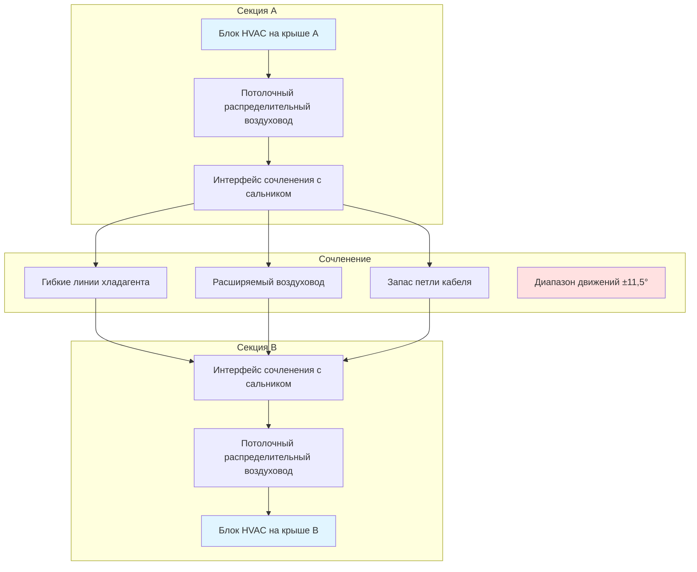
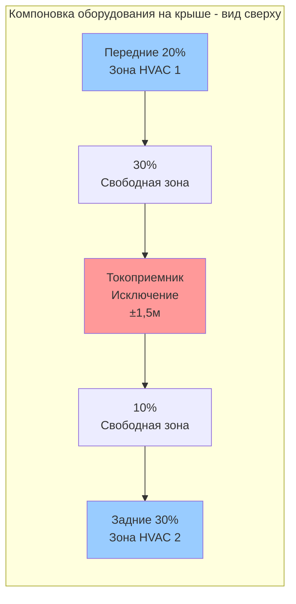

Интеграция системы HVAC в легких рельсовых вагонах (ЛРП) представляет проблемы, отличные от приложений тяжелого рельса и автобусов. Сочетание требований к доступности низкого пола, конфигураций с несколькими сочлененными секциями, систем сбора надземной мощности и строгих ограничений по весу создает сложную трехмерную задачу проектирования, в которой механические, конструктивные и электрические системы конкурируют за ограниченное пространство при сохранении надежности эксплуатации в течение 25-30 лет службы.

## Ограничения конструкции низкого пола

ЛРП низкого пола обеспечивают посадку на уровне платформы высотой 300-350 мм над рельсом, исключая ступени и улучшая доступность. Эта философия проектирования снижает доступное вертикальное пространство для оборудования HVAC на 60-75% по сравнению с вагонами рельсовых линий высокого пола.

### Ограничения вертикального пространства

Стандартные вагоны рельсовых линий предлагают 400-600 мм зазора под полом для монтажа оборудования под полом. Конструкции низкого пола сокращают это до 150-250 мм в секциях низкого пола, создавая фундаментальные ограничения для компоновки компонентов.

Доступная вертикальная оболочка в зонах низкого пола:

$$h_{available} = h_{floor} - h_{rail} - h_{clearance} - h_{truck}$$

где:
- $h_{floor}$ = высота пола над рельсом (типично 300-350 мм)
- $h_{rail}$ = голова рельса до верхней части шпалы (150-165 мм)
- $h_{clearance}$ = минимальный зазор для нарушений пути (25-40 мм)
- $h_{truck}$ = вторжение рамы тележки (0-60 мм в зависимости от места)

Это дает высоту установки оборудования 115-185 мм в наиболее стесненных зонах, недостаточную для обычных компрессоров HVAC (250-350 мм) или стандартных приточно-вытяжных установок (300-500 мм).

| Компонент | Высота обычного исполнения | Высота совместимая с низким полом | Подход проектирования |
|-----------|-------------------|---------------------------|----------------|
| Спиральный компрессор | 280-340 мм | Н/П - требуется монтаж на крыше | Удаленное размещение |
| Конденсаторный пакет | 450-550 мм | 120-180 мм | Микроканальный, многоходовой |
| Испарительная секция | 350-450 мм | 140-200 мм | Разделение на распределенные участки |
| Центробежный вентилятор | 220-280 мм | 100-140 мм | Тангенциальный/поперечный поток |
| Корпус воздушного фильтра | 150-200 мм | 80-120 мм | Гофрированный материал, малая глубина |

### Стратегии распределения оборудования

Ограничения низкого пола стимулируют распределенные архитектуры HVAC, где компоненты занимают любое доступное пространство вместо консолидированных пакетов:

**Размещение компрессора на крыше** позиционирует самые крупные компоненты (компрессор, конденсатор) на крыше вагона, где вертикальное пространство не ограничено. Линии хладагента проходят через конструкцию вагона к испарительным секциям под полом или над головой. Этот подход:

- Исключает ограничения высоты низкого пола для основных компонентов
- Обеспечивает доступное обслуживание без разборки вагона
- Увеличивает нагрузку на крышу на 350-600 кг на секцию вагона
- Требует длины линий хладагента 8-15 м, снижая эффективность системы на 8-12%

**Модульные испарительные секции** распределяют мощность охлаждения между несколькими малыми испарительными блоками вместо централизованных приточно-вытяжных установок. Типичный трехсекционный сочлененный ЛРП использует 4-6 испарительных модулей, каждый обслуживающий 8-12 м длины вагона:

$$\dot{Q}_{total} = \sum_{i=1}^{n} \dot{Q}_{evap,i}$$

где емкость отдельного испарителя $\dot{Q}_{evap,i}$ составляет 3,5-5,5 кВт.

**Концентрация на секции высокого пола** размещает максимальную массу оборудования над местоположением тележек, где высота пола увеличивается до 600-900 мм. Это создает асимметричную нагрузку, решаемую путем:

- Балластных грузов в секциях низкого пола (150-300 кг)
- Конструктивного усиления зон высокого пола
- Тщательного распределения вспомогательного оборудования (аккумуляторы, инверторы)

### Проблемы доступа для обслуживания

Компоненты под полом в секциях низкого пола требуют инвазивных процедур доступа. Стандартные операции обслуживания:

| Задача | Время доступа высокого пола | Время доступа низкого пола | Метод |
|------|----------------------|---------------------|---------|
| Замена фильтра | 15-25 мин | 45-90 мин | Снятие панели пола, 4-8 крепежных элементов |
| Обслуживание компрессора | 2-3 часа | 6-10 часов | Опускание тележки или люк на крыше |
| Очистка испарительного пакета | 1-2 часа | 3-5 часов | Несколько панелей пола, ограниченный инструмент |
| Ремонт утечки хладагента | 3-4 часа | 8-14 часов | Может потребоваться снятие тележки |

Увеличенное время обслуживания повышает время простоя вагона, прямо влияя на доступность парка. Стратегии проектирования для смягчения проблем доступа:

- Быстроразъемные фитинги хладагента, позволяющие снятие компонентов без полной эвакуации системы
- Модульные узлы, заменяющие целые участки, а не компоненты уровня узла
- Увеличенные интервалы обслуживания благодаря надежному выбору компонентов (6000-8000 часов жизни фильтра, 12000-15000 часов обслуживания компрессора)
- Стратегическое размещение изнашиваемых предметов (фильтры, поддоны) в доступных местах

## Интеграция сочлененного вагона

Сочлененные ЛРП используют 2-5 секций вагона, соединенные сочленениями, создавая непрерывное пространство для пассажиров при преодолении кривых. Системы HVAC должны пересекать эти интерфейсы сочлениния при учете относительного движения между секциями.

### Ограничения сочления

Сочленения допускают угловое вращение между секциями при преодолении кривых. Максимальные углы сочления:

$$\theta_{max} = \pm \arcsin\left(\frac{R_{min} - L_{section}/2}{R_{min}}\right)$$

Для минимального радиуса кривой $R_{min}$ = 25 м и длины секции $L_{section}$ = 15 м:

$$\theta_{max} = \pm 11,5°$$

Это создает изменения динамического расстояния в сочленении:

| Условие | Поперечное смещение | Вертикальное смещение | Изменение продольного зазора |
|-----------|---------------|---------------------|----------------------|
| Прямой путь | 0 мм | 0 мм | ±5 мм (ход подвески) |
| Кривая 25 м радиуса | ±180 мм | ±30 мм | +15 мм (внешняя) / -10 мм (внутренняя) |
| Максимальный тангаж (переход уклона 4%) | 0 мм | ±60 мм | ±8 мм |
| Комбинированная нагрузка | ±180 мм | ±75 мм | ±20 мм |

### Прокладка HVAC через сочление

Линии хладагента, воздуховоды и электротехнические кабелепроводы должны пересекать сочленения при учете этого диапазона движений:

**Гибкие соединения хладагента** используют плетеные трубки из нержавеющей стали или спиральные медные трубки с минимальным радиусом изгиба 8-12 диаметров трубки:

$$R_{bend,min} = (8-12) \times D_{tube}$$

Для жидкостной линии 15,9 мм: $R_{bend,min}$ = 127-191 мм

Усталость, вызванная вибрацией, ограничивает жизнь гибкого участка 2-3 млн циклов. При частоте сочления 0,5 Гц во время преодоления кривых и среднем 800 кривых в день:

$$N_{cycles} = 0,5 \text{ Гц} \times 10 \text{ с/кривая} \times 800 \text{ кривых/день} \times 365 \times 25 \text{ лет} = 36,5 \text{ млн циклов}$$

Это требует 12-15 замен за время жизни вагона, либо постоянной установки избыточных петель гибкого участка, рассчитанных на 8-10 млн циклов жизни.

**Непрерывность распределения воздуха** через сочление использует тканевые сальники или телескопические участки воздуховодов. Материал сальника должен сохранять:

- Прочность при разрыве >200 Н (текстильные стандарты)
- Диапазон температур -40°C до +80°C
- УФ-устойчивость для воздействия на крыше
- Пожарные характеристики по NFPA 130 (распространение пламени <25, развитие дыма <50)

Телескопические воздуховоды обеспечивают лучшую защиту от окружающей среды, но добавляют вес (15-25 кг на сочленение) и требуют тщательного выравнивания при сборке.

**Управление и силовая проводка** пересекает сочленения через:

- Петли кабеля с запасом услуги 300-500 мм, подвешенные на кабельных лотках
- Многожильные кабели зонтика, рассчитанные на 5 млн циклов изгиба
- Избыточные пути сигналов для критических датчиков температуры и управления компрессором

### Независимое управление зонами

Сочлененные секции часто работают как независимые климатические зоны из-за:

- Изменений тепловой нагрузки между секциями (угол солнца, занятость)
- Отдельного оборудования HVAC, обслуживающего каждую секцию
- Предпочтений пассажиров для локального управления

Архитектура управления реализует распределенное регулирование температуры:

$$T_{section,i} = T_{setpoint,i} + K_p(T_{ambient} - T_{setpoint,i}) + K_s \cdot SHG_i$$

где уставка температуры секции регулируется на основе условий окружающей среды и солнечного тепловыделения ($SHG_i$), специфичного для ориентации этой секции.

Типовая конфигурация зонирования:

| Секция вагона | Климатические зоны | Мощность охлаждения на зону | Независимое управление |
|----------------|--------------|------------------------|-------------------|
| 3-секционный сочлененный | 4-6 зон | 5-8 кВт | Температура, расход воздуха |
| 5-секционный сочлененный | 6-10 зон | 4-7 кВт | Температура, расход воздуха, режим |

## Зазоры токоприемников и контактной сети

Легкие рельсовые вагоны собирают электрическую мощность через токоприемники на крыше, контактирующие с надземной контактной сетью на 600-750 VDC. Оборудование HVAC должно сохранять зазор от этой находящейся под напряжением системы при оптимизации доступного пространства на крыше.

### Требования электрического зазора

Минимальные зазоры от проводников под напряжением к заземленному оборудованию согласно IEC 62128-1 и местным электрическим кодексам:

$$d_{clearance} = d_{base} + k_1 \cdot V_{nominal} + k_2 \cdot h_{altitude}$$

Для номинального напряжения 750 VDC на уровне моря:

| Уровень напряжения | Базовый зазор | Коэффициент напряжения | Минимальное безопасное расстояние |
|--------------|---------------|----------------|---------------------|
| 600 VDC | 100 мм | 0,15 мм/В | 190 мм |
| 750 VDC | 100 мм | 0,15 мм/В | 213 мм |
| 750 VDC + переходные процессы | 100 мм | 0,20 мм/В | 250 мм |

Практика проектирования устанавливает зазор 300-400 мм с учетом:

- Поперечных смещений дуги токоприемника (±50-100 мм)
- Кренения кузова вагона при преодолении кривых (±30 мм эффективное снижение зазора)
- Полосы вертикальных допусков контактной сети (±75 мм)
- Допусков установки (±25 мм)

### Компоновка оборудования на крыше

Размещение токоприемника диктует доступные зоны крыши для оборудования HVAC. Стандартная конфигурация размещает токоприемник по центру, на 60-70% длины от переднего конца:

**Зона исключения токоприемника** простирается ±1,5 м продольно и ±1,2 м поперечно от центра токоприемника, исключая 3,0 м × 2,4 м = 7,2 м² потенциальной площади монтажа оборудования на секцию вагона.

**Доступные зоны монтажа HVAC** на 24 м длинный вагон:

- Передняя зона: 4,8 м × 2,4 м = 11,5 м²
- Задняя зона: 7,2 м × 2,4 м = 17,3 м²
- Общее доступное: 28,8 м² (51% от общей площади крыши)

Это приводит к высокой плотности оборудования на оставшемся пространстве крыши:

$$\rho_{roof} = \frac{m_{HVAC}}{A_{available}} = \frac{450-650 \text{ кг}}{28,8 \text{ м}^2} = 15,6-22,6 \text{ кг/м}^2$$

### Аэродинамические соображения

Оборудование HVAC на крыше нарушает поток воздуха над вагоном, создавая аэродинамическое сопротивление, которое увеличивает энергопотребление. Сила сопротивления:

$$F_d = \frac{1}{2} \rho_{air} \cdot v^2 \cdot C_d \cdot A_{frontal}$$

Для типовой фронтальной площади блока HVAC $A_{frontal}$ = 0,8-1,2 м² и коэффициента сопротивления $C_d$ = 0,6-0,9:

| Скорость вагона | Плотность воздуха | Сила сопротивления на блок | Потери мощности |
|--------------|-------------|-------------------|-----------|
| 40 км/ч (11,1 м/с) | 1,2 кг/м³ | 33-80 Н | 0,37-0,89 кВт |
| 60 км/ч (16,7 м/с) | 1,2 кг/м³ | 75-180 Н | 1,25-3,0 кВт |
| 80 км/ч (22,2 м/с) | 1,2 кг/м³ | 133-320 Н | 2,95-7,1 кВт |

При двухблочной установке HVAC аэродинамические потери на среднейя скорости 60 км/ч непрерывно потребляют 2,5-6,0 кВт, эквивалентно 15-30% мощности компрессора HVAC. Обтекаемые кожухи оборудования снижают $C_d$ до 0,3-0,4, уменьшая сопротивление на 50-67%.

### Интерференция дуги токоприемника

Прерывания контакта токоприемника создают электрические дуги, генерирующие электромагнитные помехи (ЭМП) и озон. Электроника управления HVAC требует:

- Экранированных корпусов, обеспечивающих затухание 40-60 дБ на 100 кГц-10 МГц
- Ферритовых фильтров на силовых и управляющих линиях
- Физического разделения >2 м от токоприемника, если практически возможно
- Конформного покрытия печатных плат для озоностойкости

## Ограничения по весу и конструкции

Вес ЛРП прямо влияет на энергопотребление, нагрузку на путь и производительность торможения. Системы HVAC должны минимизировать вес при сохранении конструктивной целостности под динамическими нагрузками.

### Распределение бюджета веса

Типовой 24 м ЛРП низкого пола собственный вес: 38000-42000 кг

| Система | Распределение веса | Процент |
|--------|------------------|------------|
| Конструкция кузова вагона | 12000-14000 кг | 31-33% |
| Тележки и подвеска | 8000-9500 кг | 21-23% |
| Система тяги | 3500-4200 кг | 9-10% |
| **Система HVAC** | **800-1200 кг** | **2,1-2,9%** |
| Внутреннее оборудование | 3200-3800 кг | 8-9% |
| Электрические системы | 2800-3400 кг | 7-8% |
| Двери и доступ | 1800-2200 кг | 4-5% |
| Прочие вспомогательные | 5900-6700 кг | 15-16% |

Разбивка бюджета веса HVAC:

| Категория компонентов | Диапазон веса | Примечания |
|-------------------|-------------|--------|
| Компрессоры (2 блока) | 180-280 кг | Спиральный тип, герметичный |
| Конденсаторы (2 блока) | 120-180 кг | Микроканальные алюминиевые |
| Испарители (4-6 блоков) | 160-240 кг | Распределенное размещение |
| Вентиляторы и моторы | 80-140 кг | Моторы EC, алюминиевые рабочие колеса |
| Хладагент и масло | 35-55 кг | Зарядка системы |
| Воздуховоды и диффузоры | 140-220 кг | Стеклопластик/полимер |
| Системы управления | 25-40 кг | Контроллеры, датчики, проводка |
| Монтажный крепеж | 60-85 кг | Виброизоляторы, кронштейны |

### Влияние центра тяжести

Оборудование HVAC на крыше повышает центр тяжести вагона, влияя на устойчивость при кренении. Максимальная высота центра тяжести ограничена устойчивостью при преодолении кривых:

$$h_{CG,max} = \frac{g \cdot t}{2v^2/R + g\phi/t}$$

где:
- $g$ = 9,81 м/с² (ускорение свободного падения)
- $t$ = 2,65 м (ширина колеи стандартной)
- $v$ = расчетная скорость (м/с)
- $R$ = минимальный радиус кривой (м)
- $\phi$ = максимальное возвышение (рад)

Для расчетной скорости 70 км/ч, минимального радиуса 25 м, возвышения 100 мм:

$$h_{CG,max} = \frac{9,81 \times 2,65}{2(19,4)^2/25 + 9,81(0,038)/2,65} = 1,78 \text{ м над рельсом}$$

Оборудование HVAC добавляет момент относительно центра колеи:

$$\Delta M = m_{HVAC} \cdot (h_{roof} - h_{CG,initial})$$

Для системы HVAC 900 кг, установленной на высоте 3,2 м, с начальным центром тяжести вагона 1,45 м:

$$\Delta M = 900 \text{ кг} \times (3,2 - 1,45) \text{ м} = 1575 \text{ кг·м}$$

Новая высота центра тяжести:

$$h_{CG,new} = \frac{m_{vehicle} \cdot h_{CG,initial} + m_{HVAC} \cdot h_{roof}}{m_{vehicle} + m_{HVAC}}$$

$$h_{CG,new} = \frac{40000 \times 1,45 + 900 \times 3,2}{40900} = 1,49 \text{ м}$$

Повышение центра тяжести на 40 мм требует проверки устойчивости при кренении, особенно для скоростного преодоления кривых.

### Условия динамической нагрузки

Оборудование HVAC и монтажные конструкции должны выдерживать эксплуатационные нагрузки:

**Продольное ускорение** при торможении и тяге:
- Служебное торможение: 1,2-1,5 м/с² (0,12-0,15 g)
- Аварийное торможение: 2,5-3,0 м/с² (0,25-0,30 g)
- Максимальная тяга: 1,0-1,3 м/с² (0,10-0,13 g)

**Боковое ускорение** при преодолении кривых:
- Предел комфорта: 0,10-0,12 g
- Максимум эксплуатации: 0,15-0,18 g
- Исключительное (дефект пути): 0,30 g

**Вертикальное ускорение** от неровностей пути:
- Нормальная работа: ±0,15-0,20 g на 2-8 Гц
- Специальное путевое оборудование: ±0,30-0,40 g переходный
- Структурные моды: ±0,10 g на 12-18 Гц

Комбинированный случай нагрузки для оборудования на крыше:

$$F_{total} = m \sqrt{a_x^2 + a_y^2 + (g + a_z)^2}$$

Для аварийного торможения с боковым отклонением и вертикальным ударом:

$$F_{total} = 900 \text{ кг} \times \sqrt{3,0^2 + 1,5^2 + (9,81 + 2,0)^2} = 11100 \text{ Н}$$

Коэффициент безопасности 2,0-2,5, применяемый к монтажной конструкции, дает расчетную нагрузку 22200-27750 Н.

Напряжение сдвига болтов крепления для 8× M12:

$$\tau = \frac{F_{total}}{n \cdot A_{bolt} \cdot SF} = \frac{27750}{8 \times 84,3 \times 2,0} = 20,6 \text{ МПа}$$

Значительно ниже предела сдвига M12 Grade 8.8 в 400 МПа, подтверждая адекватный размер болтов.

## Стандарты и соответствие

Интеграция HVAC в ЛРП должна удовлетворять множественным нормативно-правовым базам:

**EN 50125-1**: Железнодорожные приложения - Условия окружающей среды
- Диапазон температур: -40°C до +50°C при наружной работе
- Влажность: 5-100% ОВ, без конденсации
- Высота: 0-2000 м стандарт (редуцирование выше)

**IEEE 1475**: Стандарт функциональной безопасности пассажирских рельсовых вагонов
- Режимы отказа HVAC не должны создавать опасности
- Аварийная вентиляция независима от основного питания
- Интеграция обнаружения пожара

**EN 45545**: Железнодорожные приложения - Защита от пожара
- Пожарные характеристики материалов: HL2 или HL3 уровень опасности
- HVAC не должна распространять пожар между секциями вагона
- Аварийный режим: вытяжка дыма, поддержание маршрутов эвакуации

**EN 50155**: Электронное оборудование для подвижного состава
- Помехоустойчивость: напряженность поля 100 В/м, 0,15-1000 МГц
- Вибрация: IEC 61373 Class 1B (монтаж на кузов)
- Вариация напряжения: ±30% номинального напряжения DC шины

Проверка соответствия требует обширного тестирования, включая валидацию климатической камерой, тестирование структурной динамики и оценку электромагнитной совместимости перед авторизацией эксплуатации в коммерческом движении.

---

Интеграция HVAC в ЛРП представляет многодисциплинарную задачу оптимизации, балансирующую тепловые характеристики, конструктивные ограничения, электрическую безопасность и надежность при эксплуатации. Успешные конструкции возникают из раннего сотрудничества между производителями вагонов, поставщиками HVAC и операторами транзита для разработки решений, адаптированных под каждую платформу вагонов и операционную среду. Тенденция к модульным, распределенным архитектурам продолжается по мере увеличения доли низких полов и становления стандартом сочленения, стимулируя инновации в компактных компонентах и гибких системах соединения.
