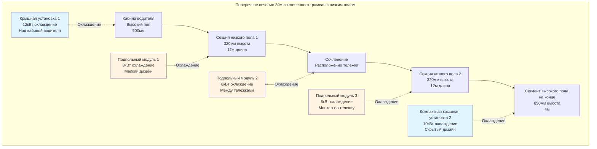

Системы HVAC трамваев и трамвайных вагонов представляют собой специализированный раздел климатического контроля лёгкого метро, решая уникальные проблемы, включая сверхнизкую высоту пола (280–350 мм), частые остановки на станциях в условиях движения по улице, требования к сохранению исторических транспортных средств и эстетические ограничения, запрещающие видимое оборудование на крыше. Эти транспортные средства работают в смешанном городском движении с расстояниями между станциями 200–500 м, создавая тепловые нагрузки, определяемые непрерывным циклом открытия дверей, солнечным излучением через обширное остекление и переменной плотностью пассажиров, варьирующейся от 4 пассажиров/м² в непиковые часы до 8 пассажиров/м² в часы пик.

## Анализ тепловой нагрузки при движении по улице

Тепловые нагрузки трамваев принципиально отличаются от сегрегированного лёгкого метро из-за движения на уровне улицы, более низких скоростей с ослабленным охлаждением воздухом набега и частых остановок, исключающих отвод тепла, зависящий от скорости. Пиковые нагрузки охлаждения достигают 73–117 кДж/ч для односекционных транспортных средств и 175–322 кДж/ч для сочленённых составов.

### Расчёт солнечной нагрузки

Трамваи, движущиеся по улице, имеют обширное остекление (45–55% площади боковой стены) для видимости пассажирами и интеграции в городской пейзаж. Теплоприток от солнца доминирует в требованиях к охлаждению:

$$Q_{solar} = \sum_{i} A_{glass,i} \cdot SHGC_i \cdot I_i(\theta, \phi) \cdot CLF_i$$

где $A_{glass,i}$ — площадь остекления для каждой ориентации поверхности (м²), $SHGC_i$ — коэффициент теплоприроста от солнца (0,25–0,55 в зависимости от технологии остекления), $I_i(\theta, \phi)$ — падающее солнечное излучение как функция углов положения солнца (Вт/м²), и $CLF_i$ — коэффициент тепловой нагрузки, учитывающий эффекты теплового накопления.

Для стандартного 30 м сочленённого трамвая с низким полом с общей площадью остекления 85 м²:

**Условия проектирования (июль, 15:00, 35°C окружающая среда):**
- Остекление восточной/западной стороны: 15 м² × 0,40 SHGC × 680 Вт/м² × 0,85 CLF = 3 468 Вт
- Остекление северной/южной стороны: 40 м² × 0,40 SHGC × 420 Вт/м² × 0,90 CLF = 6 048 Вт
- Остекление крыши: 30 м² × 0,35 SHGC × 850 Вт/м² × 0,75 CLF = 6 694 Вт

Итоговая солнечная нагрузка: **16 210 Вт (55 300 BTU/hr)**

Остекление с низким излучением (Low-E) и спектрально селективное остекление снижают SHGC до 0,25–0,32 при сохранении светопропускания более 65%, сокращая солнечные нагрузки на 30–40% с дополнительной стоимостью $80–150/м².

### Нагрузка от инфильтрации при открытии дверей

Движение по улице создаёт экстремальные условия инфильтрации. Типичный 30 м сочленённый трамвай с 6 парами дверей испытывает:

**Частота остановок:** 40–60 остановок в час при движении по городу
**Длительность открытия двери:** 15–30 секунд за остановку
**Скорость инфильтрации:** 340–509 м³/ч на пару дверей при открытии

Тепловая нагрузка от инфильтрации при открытии двери:

$$Q_{infiltration} = \dot{V} \cdot \rho \cdot c_p \cdot \Delta T + \dot{V} \cdot \rho \cdot h_{fg} \cdot \Delta \omega$$

Для 6 пар дверей, открытых одновременно на 20 секунд с 425 м³/ч на пару:

$$Q_{sens} = (6 \times 425 \text{ м³/ч}) \times 1,08 \times (35-24)°C = 30 261 \text{ кДж/ч (мгновенный)}$$

$$Q_{latent} = (6 \times 425 \text{ м³/ч}) \times 0,68 \times (0,020-0,012) = 13 872 \text{ кДж/ч (мгновенный)}$$

Усреднённый результат за цикл станции 90 секунд (20 секунд открыто, 70 секунд закрыто):

$$Q_{infiltration,avg} = (30 261 + 13 872) \times \frac{20}{90} = 9 808 \text{ кДж/ч}$$

### Вариативность пассажирской нагрузки

Плотность пассажиров в городских трамваях варьируется значительно в зависимости от времени и участка маршрута:

| Режим эксплуатации | Пассажиры/м² | Тепловыделение пассажиров (Вт) | Итоговая нагрузка (30 м трамвай) |
|---------------------|---------------|--------------------------------|----------------------------------|
| Непиковая, только сидящие | 2,0 | 100 явное + 50 скрытое | 27 000 Вт (92 100 BTU/hr) |
| Стандартная загрузка | 4,5 | 100 явное + 50 скрытое | 60 750 Вт (207 300 BTU/hr) |
| Пиковая предельная загрузка | 7,5 | 110 явное + 65 скрытое | 118 125 Вт (403 000 BTU/hr) |

Расчёт площади пола: 30 м длина × 2,3 м эффективная ширина × 70% доля низкого пола = 90 м² площадь для пассажиров

Четырёхкратная вариация пассажирских нагрузок требует модуляции мощности через компрессоры переменной скорости и ступенчатую эксплуатацию оборудования.

## Конфигурации систем для трамваев с низким полом

Современные трамваи с низким полом на 70–100% и высотой пола 280–350 мм над рельсом исключают традиционные зоны монтажа. Три основные конфигурации решают эти ограничения.

### Распределённые подпольные системы

Наиболее распространённый подход размещает несколько компактных модулей HVAC в доступных подпольных полостях между тележками и вокруг узлов тягового оборудования:

**Характеристики компонентов для подпольных модулей:**

| Компонент | Размеры (мм) | Масса (кг) | Производительность |
|-----------|--------------|-----------|-------------------|
| Модуль испарителя мелкой конструкции | 1200 × 800 × 180 | 45–65 | 8–12 кВт охлаждение |
| Конденсатор, монтируемый на тележку | 900 × 600 × 220 | 55–75 | 10–14 кВт отвод |
| Ротационный компрессор | 350 × 280 × 320 | 28–38 | 2,5–3,8 кВт на входе |
| Тангенциальный вентилятор | 600 × 150 × 150 | 8–12 | 800–1200 м³/ч |

Холодильные линии проходят через защищённые каналы, приваренные к раме транспортного средства, с паяными соединениями в точках обслуживания. Длина линий остаётся ниже 15 м для минимизации падения давления и заряда холодильного агента.

### Гибридная архитектура крышной и подпольной конструкции

Сочленённые трамваи объединяют видимые крышные установки над участками с высоким полом (кабина водителя, отсеки оборудования) со скрытым подпольным оборудованием, обслуживающим низкопольные участки:

**Преимущества:**
- Крышные установки обеспечивают 40–50% от общей производительности с удобным доступом к обслуживанию
- Подпольные установки сохраняют профиль низкого пола там, где требуется
- Раздельные холодильные цепи обеспечивают резервирование
- Доступ к обслуживанию через съёмные панели пола и люки на крыше

**Проектные соображения:**
- Распределение массы: Крышные установки добавляют 350–550 кг на высоте 3,2 м, повышая центр тяжести на 12–18 мм
- Эстетическая интеграция: Крышные корпусы оформлены в соответствии с архитектурой транспортного средства, покрыты порошковой краской, соответствующей цвету кузова
- Виброизоляция: Эластомерные опоры с собственной частотой 10–14 Гц предотвращают резонансное связывание

Расщепление общей мощности системы: 55–65% подпольное, 35–45% крышное, обеспечивающее эксплуатацию при отказе любой подсистемы.

### Ультракомпактные сплит-системы

Новейшие трамваи с низким полом используют архитектуру сплит-системы с компонентами, требующими много места и монтируемыми снаружи:

**Размещение компонентов:**
- Компрессор переменной скорости с винтовой спиралью (3,2–4,5 кВт): Крышное или торцовое монтирование
- Микроканальный конденсатор (32 мм глубина): Боковое монтирование с защитной решёткой
- Компактный испаритель (140 мм высота): Подпольные распределённые секции
- Электронный расширительный клапан: У каждого испарителя для точного управления

Заряд холодильного агента снижен на 15–25% благодаря микроканальной технологии и оптимизированному размеру линий. Холодильный агент R-513A обеспечивает GWP 631 по сравнению с 1 430 для R-134a при сохранении аналогичной термодинамической производительности.

## Модернизация исторических трамваев и винтажных трамвайных вагонов

Эксплуатация исторических трамваев (F-line в Сан-Франциско, City Circle в Мельбурне, маршрут 28 в Лиссабоне) представляет уникальные проблемы HVAC, уравновешивающие комфорт пассажиров с требованиями сохранения исторического наследия.

### Ограничения сохранения

Положения об охране исторических транспортных средств типично требуют:

- **Отсутствие видимых внешних изменений:** Оборудование на крыше запрещено, решётки конденсатора должны соответствовать исходной эстетике
- **Минимальные структурные изменения:** Системы монтирования не могут нарушать историческую раму
- **Обратимость:** Изменения должны быть съёмными для восстановления исходного состояния
- **Исторические материалы:** Видимые компоненты должны соответствовать исходной отделке и фурнитуре

Эти ограничения исключают традиционные конфигурации HVAC, требуя творческих инженерных решений.

### Скрытые системы вентиляции

Ранний подход к исторически значимым транспортным средствам использует естественную и принудительную вентиляцию без охлаждения с паровым сжатием:

**Потолочные вентиляторы (воспроизведение 1890–1920 гг.):**
- Бесщёточные двигатели постоянного тока в латунных корпусах, соответствующих историческому виду
- Диаметр 400–600 мм, конструкции с 8–12 лопастями
- Циркуляция воздуха: 800–1200 м³/ч на вентилятор, 6–10 вентиляторов на транспортное средство
- Энергопотребление: 25–45 Вт на вентилятор от батареи 24 VDC транспортного средства

**Принудительная вентиляция:**
- Подпольные вентиляторы забора, втягивающие внешний воздух через напольные решётки
- Расход воздуха: 850–1400 м³/ч общая вентиляция транспортного средства
- Выпуск через исходные потолочные вентиляционные решётки и проёмы над окнами
- Эффективность: Снижение температуры на 3–5°C только за счёт циркуляции воздуха

Эти системы обеспечивают приемлемый комфорт в умеренных климатических условиях (Сан-Франциско, зима в Мельбурне), но недостаточны для охлаждения в жаркое летнее время.

### Минимальные модернизации охлаждения

Современные исторические трамваи всё чаще интегрируют скрытое кондиционирование воздуха:

**Подпольные пакетные установки:**
- Полная система прямого охлаждения в корпусе 1200 × 900 × 380 мм
- Производительность: 10–15 кВт (34 000–51 000 BTU/hr) охлаждение
- Установка в бывшем батарейном отсеке или под продольными скамейками
- Воздухозабор конденсатора через исходные подпольные вентиляционные проёмы

**Скрытая система воздуховодов:**
- Подача воздуха через исходные напольные решётки и восстановленные потолочные решётки
- Листовая сталь в системе воздуховодов, спрятанная в конструкции скамеек
- Решётки диффузора соответствуют исторической латуни или бронзовой отделке
- Обратный воздух через боковые решётки, скрытые за архитектурными элементами периода

**Интеграция электропитания:**
- Современные тяговые инверторы обеспечивают трёхфазный ток 480 В для компрессоров HVAC
- Альтернативно, постоянный ток 600–750 В от контактной сети преобразуется через инвертор DC-AC
- Батарейное резервное питание сохраняет работу вентилятора при перебоях подачи электроэнергии

### Тематическое исследование: Модернизация исторического трамвая Сан-Франциско

Трамвайная линия F Муниципального трамвайного оператора Сан-Франциско эксплуатирует трамвайные вагоны PCC 1920–1950 гг. со скрытой модернизацией HVAC, реализованной в 2015–2018 гг.:

**Характеристики транспортного средства:**
- Длина: 14 м (46 ft)
- Ширина: 2,6 м (8,5 ft)
- Остекление: 28 м² итого, SHGC 0,75 (исходное одинарное стекло сохранено)
- Посадочные места: 52 пассажира, предельная нагрузка 100 пассажиров

**Установленная система HVAC:**
- 2 × 7,5 кВт (25 600 BTU/hr) подпольные DX установки
- Итоговое охлаждение: 15 кВт (51 200 BTU/hr)
- Компрессор: Переменная скорость с винтовой спиралью, 2,8–4,2 кВт на входе
- Холодильный агент: R-513A, 2,8 кг итого заряда
- Монтирование: Подвешивание к раме с 12 мм резиновыми изоляторами

**Результаты производительности:**
- Внутренняя температура: 24–26°C при 32°C окружающей среды
- Время охлаждения: 35 минут от 45°C теплоёмкого состояния до 26°C
- Уровень шума: 68 дBA на уровне уха пассажира (приемлемо)
- Визуальное воздействие: Отсутствие видимости оборудования HVAC снаружи
- Энергопотребление: 4,5–6,2 кВт среднее во время охлаждения

## Тепловые проблемы при движении по улице

Эксплуатация трамвая в полосах с общим движением создаёт тепловые условия, отличающиеся от сегрегированных коридоров лёгкого метро.

### Ослабленный отвод тепла на низких скоростях

Отвод тепла конденсатором критически зависит от скорости воздуха поперёк поверхностей серпантины. Трамваи, движущиеся по улице, работают с средней скоростью 15–25 км/ч по сравнению с 35–50 км/ч для сегрегированного лёгкого метро.

Коэффициент теплопередачи конденсатора:

$$h = C \cdot \left(\frac{V_{air}}{\nu}\right)^{0.6}$$

где $V_{air}$ — скорость воздуха (м/с) и $\nu$ — кинематическая вязкость. Производительность отвода тепла варьируется как:

$$Q_{rejection} \propto V_{air}^{0.6}$$

**Воздействие скорости на производительность:**

| Скорость транспортного средства | Скорость воздуха набега | Коэффициент отвода тепла |
|--------------------------------|------------------------|------------------------|
| 10 км/ч (трамвай) | 2,8 м/с | 0,72 |
| 25 км/ч (типичная) | 6,9 м/с | 1,00 (основная) |
| 50 км/ч (LRT) | 13,9 м/с | 1,35 |

На скоростях трамвая 10–15 км/ч производительность конденсатора снижается на 25–30% по сравнению с условиями проектирования при 25 км/ч. Системы компенсируют это через:

- **Электровентиляторы конденсатора:** Осевые вентиляторы, обеспечивающие 3,5–5,5 м/с принудительного потока воздуха на стоянке и при низких скоростях
- **Увеличенные конденсаторы:** На 25–35% больше поверхности по сравнению с проектами, зависящими от скорости
- **Компрессор переменной скорости:** Снижение производительности на 15–20% при ограниченном отводе тепла на низкой скорости транспортного средства

### Эффекты городского теплового острова

Движение по улице подвергает трамваи повышенным температурам окружающей среды от теплоёмкости асфальта, выхлопов транспортных средств и отвода тепла зданиями:

$$T_{ambient,street} = T_{ambient,rural} + \Delta T_{UHI}$$

Типичная интенсивность городского теплового острова: $\Delta T_{UHI}$ = 3–7°C в дневное время, 5–10°C ночью в плотных городских центрах.

Проектные следствия:
- Охлаждающая способность рассчитана для температуры входа конденсатора 38–42°C по сравнению с 35°C для пригородного лёгкого метро
- Давления нагнетания компрессора достигают 24–28 бар по сравнению с 20–24 бар при стандартных условиях
- Коэффициент производительности системы (COP) снижается с 2,5 (35°C окружающая среда) до 2,0–2,2 (40°C окружающая среда)

### Цикл работы при остановках и запусках

Частые остановки с 15–30 секундными периодами открытия двери создают пилообразные профили тепловой нагрузки:

**Фаза ускорения (30–45 секунд):**
- Двери закрыты, только тепловыделение пассажиров и солнечная нагрузка
- Нагрузка компрессора снижена на 10–20% для максимизации доступной мощности для тяги
- Внутренняя температура дрейфует вверх на 0,3–0,6°C

**Фаза постоянной скорости (45–90 секунд):**
- Полная мощность HVAC восстановлена
- Восстановление температуры в направлении установленного значения
- Отвод тепла конденсатора оптимизирован при движении транспортного средства

**Фаза замедления и остановки (60–90 секунд):**
- Двери открыты, инфильтрационная нагрузка скачкообразно возрастает на 40–60%
- Компрессор работает при максимальной производительности
- Вентиляторы конденсатора активируются для сохранения отвода тепла на стоянке
- Внутренняя температура повышается на 0,4–0,8°C

Система управления использует предсказывающие алгоритмы, применяя данные GPS и расписания, для предварительного охлаждения салона на 0,5–1,0°C перед остановками станций, сохраняя среднюю температуру в пределах ±1,5°C от установленного значения.

## Интеграция конструкции низкого пола

Сверхнизкие высоты пола 280–350 мм налагают суровые ограничения по пространству, требующие специального выбора компонентов и стратегий размещения.

### Картирование использования пространства

Подпольное пространство трамвая с низким полом содержит ограниченные зоны для оборудования:

| Расположение | Доступная высота | Длина | Ширина | Объём | Подходящие компоненты |
|--------------|-----------------|-------|--------|-------|---------------------|
| Между тележками | 220–280 мм | 2,5–3,5 м | 1,8–2,2 м | 1,1–2,2 м³ | Испаритель, вентиляторы, управление |
| Монтированный на тележку | 300–400 мм | 1,2–1,8 м | 0,8–1,2 м | 0,3–0,9 м³ | Компрессор, конденсатор |
| Сегменты на конце (высокий пол) | 600–900 мм | 2,0–4,0 м | 2,0–2,4 м | 2,4–8,6 м³ | Полные пакеты HVAC |
| Крыша (где допускается) | 400–550 мм | 3,0–5,0 м | 2,2–2,5 м | 2,6–6,9 м³ | Крышные установки |

Итоговый объём оборудования HVAC: 4–8 м³ для 30 м сочленённого транспортного средства, представляющий 0,5–0,8% от общего объёма транспортного средства.

### Технология микроканальных теплообменников

Алюминиевые микроканальные теплообменники обеспечивают конструкции с мелкой глубиной, необходимые для приложений с низким полом:

**Характеристики конденсатора:**
- Глубина: 25–35 мм в сравнении с 50–65 мм для традиционного трубчато-рёберного
- Площадь фронта: 0,8–1,4 м² на 10 кВт отвода тепла
- Холодильные каналы: Гидравлический диаметр 1,0–1,5 мм, 15–25 параллельных портов
- Падение давления на стороне воздуха: 25–40 Па при 3,5 м/с скорости на фронте
- Масса: На 35–45% меньше чем эквивалент трубчато-рёберного

**Характеристики испарителя:**
- Глубина: 30–45 мм в сравнении с 50–75 мм для трубчато-рёберного
- Площадь фронта: 1,2–2,0 м² на 10 кВт охлаждающей производительности
- Поддон конденсата: Интегрированная алюминиевая конструкция, глубина 8–12 мм
- Управление конденсатом: Положительный дренаж во время продольного/боковой крена транспортного средства до ±5°

Микроканальная технология снижает высоту модуля HVAC на 35–50%, позволяя установку в подпольных полостях 180–220 мм.

### Оптимизация распределения массы

Оборудование HVAC представляет 6–9% от массы пустого транспортного средства (900–1400 кг для 30 м сочленённого трамвая). Стратегическое размещение сохраняет баланс нагрузки на оси в пределах допуска ±4%:

**Стратегия распределения массы:**
- Компоненты, монтируемые на тележку: 45–55% от массы HVAC (компрессоры, конденсаторы)
- Зоны между тележками: 25–35% от массы HVAC (испарители, управление)
- Концы транспортного средства: 15–25% от массы HVAC (установки кабины водителя, вспомогательное оборудование)

Асимметричная нагрузка от неравномерного распределения пассажиров (типично 60% в передней 2/3 транспортного средства) требует тщательного размещения массы HVAC для сохранения расщепления веса передней/задней оси 48–52%.

## Стандарты и требования к производительности

Системы HVAC трамваев соответствуют региональным стандартам транзита и спецификациям местных органов власти.

### Европейские стандарты (EN 14750-1, EN 13129-1)

**Категории теплового комфорта:**
- Категория A: ±2°C вариация от установленного значения (22–24°C охлаждение, 20–22°C отопление)
- Категория B: ±3°C вариация от установленного значения
- Условия проектирования: 35°C окружающая среда, 800 Вт/м² солнечная, 4 пассажира/м² загрузка

**Требования к свежему воздуху:**
- Минимум: 7 л/с (14,8 CFM) на пассажира при нормальной загрузке
- Улучшенный: 10 л/с (21,2 CFM) на пассажира для высококачественных систем
- Лимит CO₂: 1000 ppm выше наружного окружающего воздуха (типично 1400 ppm абсолютно)

**Энергоэффективность:**
- Максимальная вспомогательная мощность: 350–450 Вт на метр длины транспортного средства для HVAC
- Сезонный COP: ≥2,3 в среднем над региональным климатическим профилем
- Мощность в режиме ожидания: <50 Вт на транспортное средство для управления и мониторинга

### Стандарты североамериканского транзита

**APTA RT-VIM-S-034-03 (производительность HVAC):**
- Охлаждающая способность: Сохранение 24°C ±3°F при 35°C (95°F) окружающей среде
- Нагревательная способность: Сохранение 20°C ±3°F при -18°C (0°F) окружающей среде
- Вентиляция: 15 CFM (25,5 м³/ч) на пассажира минимум
- Понижение температуры: От 29°C до 24°C максимум за 30 минут

**Руководящие принципы FTA для транзитных транспортных средств:**
- Надёжность: MTBF ≥8 000 часов для полной системы HVAC
- Ремонтопригодность: MTTR ≤4 часа для замены компонента
- Доступность: ≥98% во время часов доходной эксплуатации
- Проектный срок службы: 12–15 лет или 800 000–1 200 000 км эксплуатации

### Тестирование и проверка

**Испытание в климатической камере:**
- Испытание экспозиции: Транспортное средство при температуре окружающей среды ±2°C в течение 4+ часов
- Испытание охлаждения: Измерение времени достижения установленного значения из теплоёмкого состояния
- Тепловое картирование: 20–30 датчиков, размещённых для проверки равномерности температуры
- Проверка производительности: Измерение входной мощности и теплового выхода при условиях проектирования

**Проверка в условиях доходной эксплуатации:**
- 90-дневный период мониторинга с регистрацией данных с интервалом 1 минута
- Показатели производительности: Средняя температура, частота отклонений, энергопотребление
- Критерии приёма: ≥95% время эксплуатации в пределах указанного диапазона температуры

---

Системы HVAC трамваев и трамвайных вагонов олицетворяют оптимизацию при ограничивающих условиях инженерии, уравновешивая тепловую производительность против пространства, массы, эстетических и требований сохранения исторического наследия. Современные системы достигают охлаждающих производительностей 35–45 Вт на метр длины транспортного средства при потреблении всего 300–400 Вт/м вспомогательной мощности, сохраняя комфорт пассажиров в городских условиях движения по улице с частыми остановками и переменной загрузкой. Модернизация исторических транспортных средств демонстрирует, что современный климатический контроль может быть успешно интегрирован в исторический подвижной состав, сохраняя эстетическую целостность и оперативную подлинность.
