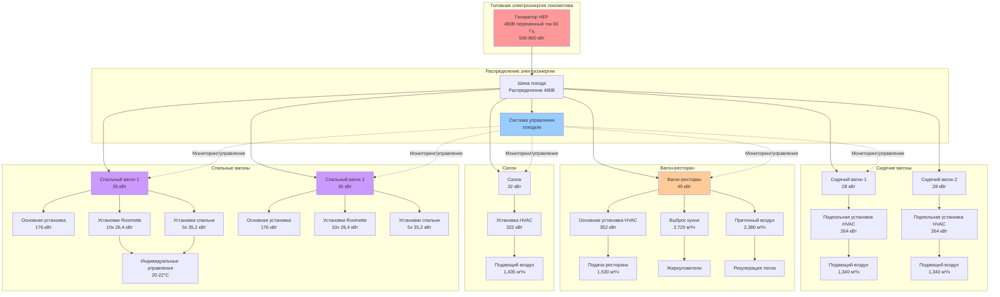

Системы кондиционирования Amtrak для поездов дальнего следования обеспечивают непрерывный климат-контроль в путешествиях продолжительностью от 15 до 65 часов по маршрутам, таким как California Zephyr, Empire Builder и Southwest Chief. Эти системы должны поддерживать точные условия комфорта в спальных отсеках, управлять высокими нагрузками вентиляции в вагонах-ресторанах и надежно работать несколько дней без технического обслуживания.

## Требования для обслуживания дальних маршрутов

### Критерии комфорта для многодневных путешествий

Пассажирские железные дороги дальнего следования требуют более точного контроля комфорта, чем пригородные перевозки, из-за длительного времени пребывания и ночной оккупации.

**Спецификации контроля температуры**

Стандарты обслуживания Amtrak требуют:

| Тип вагона | Дневной режим | Ночной режим | Допуск контроля | Предел шума |
|----------|-----------------|-------------------|------------------|-------------|
| Сидячие места | 21,1°C | 21,1°C | ±1,1°C | 45 дБА |
| Спальные отсеки | 20-22°C (регулируемо) | 20-22°C (регулируемо) | ±0,6°C | 35 дБА |
| Вагоны-рестораны | 21,1°C | N/A | ±1,1°C | 48 дБА |
| Салон/обзорный вагон | 21,1°C | 21,7°C | ±1,1°C | 46 дБА |

**Управление относительной влажностью**

Многодневные путешествия пересекают различные климатические зоны, требующие активного контроля влажности:
- Целевой диапазон: 40-50% ОВ
- Максимум: 55% ОВ (предотвращает конденсацию на окнах во время ночной работы)
- Минимум: 35% ОВ (предотвращает дискомфорт пассажиров и раздражение дыхательных путей)

Кумулятивный тепловой комфорт для продолжительных железнодорожных путешествий следует модели предполагаемого среднего голоса (PMV):

$$\text{PMV} = \left[0.303 \exp(-0.036M) + 0.028\right] \times L$$

где $M$ представляет скорость метаболизма (1,0 мет для сидящих пассажиров) и $L$ — тепловая нагрузка на организм. Для ночных спальных отсеков отношение между температурой воздуха $T_a$, средней радиационной температурой $T_r$ и скоростью воздуха $v$ определяет комфорт:

$$\text{SET} = T_a + 0.5(T_r - T_a) - 8v^{0.5}$$

где SET (стандартная эффективная температура) должна оставаться между 20-23,3°C для спящих пассажиров.

## Климат-контроль спальных вагонов

### Системы отдельных отсеков

Спальные вагоны Amtrak Superliner и Viewliner оснащены выделенными установками HVAC для каждой приватной комнаты.

**Конфигурация roomette и спальни**

Каждый отсек содержит:
- Производительность: 26,4-35,2 кВт охлаждение, 3-4 кВт отопление
- Хладагент: R-410A (переход на R-452B в новом оборудовании)
- Испаритель: Компактный теплообменник с расходом воздуха 510-765 м³/ч
- Подача: Потолочный линейный диффузор с регулируемыми жалюзи
- Управление: Цифровой термостат с шагом 0,3°C
- Уровень звука: Максимум 32-35 дБА на низкой скорости вентилятора

**Системы семейной спальни и доступной комнаты**

Более крупные отсеки используют оборудование большей производительности:
- Производительность охлаждения: 44-53 кВт
- Производительность отопления: 5-6 кВт электрическое сопротивление
- Двухвентиляторный испаритель для улучшенного распределения воздуха
- Зональные заслонки для отделения спальной и сидячей зон

### Требования тихой работы

Нормативные требования FRA и спецификации Amtrak обязывают пониженные уровни шума в спальных вагонах, работающих между 22:00 и 6:00.

**Особенности акустического проектирования**

- Компрессоры спирального типа с переменной скоростью (снижение шума: 6-8 дБА в сравнении с фиксированной скоростью)
- Акустически изолированные плены распределения воздуха
- Опоры с виброизоляцией (прогиб: 6,4-12,7 мм)
- Воздуховоды с низкой скоростью (максимум 2,03 м/с в занятых помещениях)
- Твердотельные управления вентилятором, устраняющие гудение трансформатора

**Ночной режим работы**

Микропроцессорные управления автоматически снижают скорости вентиляторов и увеличивают циклы компрессора после 22:00:
- Снижение скорости вентилятора: 70-80% от дневного режима
- Дополнительный диапазон уставки: Увеличение с ±0,6°C до ±0,8°C
- Циклирование компрессора: Минимум 8 минут выключения между пусками
- Снижение полной акустической мощности: 4-6 дБА

## Вентиляция вагонов-ресторанов

### Проектирование для высокой оккупации

Вагоны-рестораны Amtrak вмещают 72-80 пассажиров во время обслуживания, создавая значительные явные и скрытые нагрузки от оккупации и оборудования пищевого обслуживания.

**Требования по скорости вентиляции**

ASHRAE Standard 62.1 указывает минимум наружного воздуха в зависимости от оккупации и площади пола. Для вагонов-ресторанов:

$$Q_{OA} = R_p \times P_z + R_a \times A_z$$

где:
- $Q_{OA}$ = расход наружного воздуха (м³/ч)
- $R_p$ = норма наружного воздуха на человека = 12,7 м³/ч на человека (пространства для питания)
- $P_z$ = численность зоны = 72-80 человек
- $R_a$ = норма наружного воздуха на единицу площади = 0,0195 м³/(ч·м²)
- $A_z$ = площадь пола зоны = 223-260 м²

Это дает минимальные требования по наружному воздуху:

$$Q_{OA} = (12.7 \times 75) + (0.0195 \times 242) = 952.5 + 4.7 = 957 \text{ м³/ч}$$

**Выброс из кухни**

Оборудование галлея генерирует значительное тепло и запахи, требующие выделенного выброса:

| Тип оборудования | Тепловой выход (кДж/ч) | Скорость выброса (м³/ч) |
|----------------|---------------------|-------------------|
| Конвекционные печи (2) | 56,5 | 679 |
| Сковорода/плита | 75,5 | 850 |
| Кофеварки | 18,9 | 255 |
| Паровое оборудование | 37,7 | 595 |
| Посудомоечная машина | 25,1 | 340 |
| **Итого** | **213,7** | **2,720** |

Системы приточного воздуха обеспечивают 85-90% объема выброса, чтобы предотвратить чрезмерное разрежение и предотвратить миграцию дыма/запахов в пассажирские зоны.

### Контроль жиров и запахов

В отличие от стационарных ресторанов, вагоны-рестораны не могут использовать традиционные жиловыловящие зонты и системы выброса.

**Требования фильтрации**

- Предварительные фильтры: MERV 8 (защита теплообменников от частиц)
- Основные фильтры: MERV 13 (улавливание кулинарных частиц)
- Фильтры активированного угля: Гофрированный носитель 5 см (контроль запахов)
- Жироуловители: Из нержавеющей стали пластинчатого типа, сертифицированы UL 1046
- Замена фильтров: Каждые 8000-12000 км или ежемесячно

**Управление с блокировкой**

Вытяжные вентиляторы активируются автоматически при работе оборудования галлея с 15-минутными циклами продувки после работы для очистки остаточных запахов перед отключением.

## Непрерывная 24-часовая работа

### Требования надежности системы

Поезда дальнего следования работают 2-3 дня между объектами техническим обслуживания, требуя исключительной надежности HVAC.

**Критерии выбора компонентов**

- MTBF (среднее время между отказами): Минимум 15000 часов
- Рейтинг вибрации: IEC 61373 Категория 1 (магистральное обслуживание)
- Диапазон температур: -40°C до +51,7°C окружающая среда
- Тип компрессора: Спиральный (предпочтительно) или ротационный с нагревателями картера
- Резервирование: Двойные компрессоры в критических вагонах (ресторан, салон)

**Профилактический мониторинг**

Современное оборудование Amtrak использует сети связи CAN-bus, связывающие все компоненты HVAC:
- Непрерывный мониторинг давления и температуры выхода компрессора
- Отслеживание дифференциала температуры испарителя/конденсатора
- Измерение падения давления фильтра (оповещения о замене при 2,49 дПа)
- Мониторинг заряда хладагента через расчеты переохлаждения/перегрева
- Оповещения предиктивного обслуживания, передаваемые на объекты технического обслуживания

### Управление электроэнергией

Поезда дальнего следования потребляют головную электроэнергию (HEP) от дизель-электрических или электрических локомотивов, при этом общая доступная мощность ограничена 400-800 кВт для всего состава поезда.

**Стратегия распределения нагрузки**

Для типичного 10-вагонного поезда дальнего следования:

| Позиция вагона | Тип вагона | Нагрузка HVAC (кВт) | Уровень приоритета |
|--------------|----------|---------------|---------------|
| 1 | Багажный | 12 | Низкий |
| 2 | Переходной/общежитие экипажа | 22 | Средний |
| 3-4 | Сидячий | 28 каждый | Высокий |
| 5 | Вагон-ресторан | 45 | Критический |
| 6 | Салон/обзорный | 32 | Высокий |
| 7-9 | Спальный | 35 каждый | Критический |
| 10 | Спальный | 35 | Критический |
| **Итого** | | **324 кВт** | |

Общий спрос HVAC составляет 40-50% доступной HEP, требуя сложного управления нагрузкой:

$$P_{available} = P_{HEP} - P_{lighting} - P_{galley} - P_{auxiliary}$$

где типичные значения при пиковом охлаждении:
- $P_{HEP}$ = 500-800 кВт (в зависимости от локомотива)
- $P_{lighting}$ = 30-45 кВт
- $P_{galley}$ = 45-60 кВт
- $P_{auxiliary}$ = 25-35 кВт

**Протокол отключения**

Когда HEP приближается к мощности (>90%), система управления поездом реализует поэтапное снижение нагрузки:

1. Снизить HVAC багажного вагона до минимальной вентиляции
2. Увеличить уставки охлаждения в сидячих вагонах на 1,1°C
3. Циклировать компрессоры в чередующихся сидячих вагонах
4. Поддерживать полную работу в спальных и ресторанных вагонах (критичен комфорт пассажиров)

## Архитектура системы

## Требования свежего воздуха для ночной работы

### Вентиляция при продолжительной оккупации

ASHRAE Standard 62.1 предоставляет базовые требования, однако спальные отсеки требуют повышенного внимания к накоплению CO₂ и поддержанию качества воздуха.

**Вентиляция спального отсека**

Для типичного roomette (объем 1,36 м³) с одним пассажиром:

$$C_{CO_2}(t) = C_{ambient} + \frac{G \cdot t}{V \cdot E_v}$$

где:
- $C_{CO_2}(t)$ = концентрация CO₂ в момент времени $t$ (ч.м.)
- $C_{ambient}$ = концентрация CO₂ на улице = 400-450 ч.м.
- $G$ = скорость генерации CO₂ = 0,51 м³/ч на человека (сон)
- $t$ = время (часы)
- $V$ = объем отсека = 1,36 м³
- $E_v$ = эффективность вентиляции = 0,8-0,9

Для 8-часового ночного периода с поддержанием CO₂ ниже 1000 ч.м.:

$$Q_{min} = \frac{G \cdot N}{(C_{max} - C_{ambient}) \cdot E_v}$$

$$Q_{min} = \frac{0.51 \times 1}{(1000 - 450) \times 0.85} = 0.00122 \text{ м³/ч}$$

Однако этот расчет учитывает только CO₂. Контроль запахов тела требует минимум 25,5 м³/ч на человека, устанавливая критерий проектирования.

**Стратегия ночной вентиляции**

| Тип отсека | Пассажиры | Свежий воздух (м³/ч) | Воздухообмены в час |
|-----------------|-----------|----------------|------------------|
| Roomette | 1 | 25,5-34 | 12-15 |
| Спальня | 2 | 51-59 | 8-10 |
| Семейная спальня | 4 | 85-102 | 10-12 |
| Доступная комната | 2 | 59-68 | 9-11 |

### Системы рекуперации энергии

Современное оборудование Amtrak дальнего следования включает рекуперацию энергии вентиляции для снижения нагрузок кондиционирования наружного воздуха при сохранении качества воздуха.

**Производительность колеса рекуперации энтальпии**

Полная эффективность рекуперации энергии:

$$\varepsilon_{total} = \frac{h_{supply} - h_{outdoor}}{h_{exhaust} - h_{outdoor}}$$

где $h$ представляет энтальпию соответствующих потоков воздуха. Типичные железнодорожные колеса рекуперации достигают эффективности 65-75%, снижая годовое энергопотребление HVAC на 25-35% в сравнении с системами без рекуперации.

## Контроль влажности при путешествиях дальнего следования

### Проблемы переходных климатических зон

Трансконтинентальные маршруты пересекают несколько климатических зон в течение одного путешествия:
- California Zephyr: Сухая пустыня (10% ОВ) к влажному Среднему Западу (70% ОВ)
- Empire Builder: Континентальные климатические вариации (±40% ОВ суточные колебания)
- Sunset Limited: Влажность Побережья Мексиканского залива к засушливому Юго-Западу

**Адаптивный контроль влажности**

Современные системы используют GPS-связанные управления, корректирующие целевые уровни влажности на основе географического положения и внешних условий:

$$RH_{target} = RH_{base} + K_1(T_{outdoor} - T_{base}) + K_2(RH_{outdoor} - RH_{base})$$

где:
- $RH_{target}$ = целевая внутренняя относительная влажность (%)
- $RH_{base}$ = базовая целевая = 45%
- $K_1$ = температурный коэффициент = 0,3
- $K_2$ = коэффициент внешней влажности = 0,15
- Пределы температуры и влажности: диапазон 40-50% ОВ

**Методы осушения**

- Охлаждающие теплообменники: Снижение температуры воздуха ниже точки росы, затем переподогрев
- Адсорбционные системы: Вращающиеся колеса из силикагеля (появляющаяся технология в железных дорогах)
- Переподогрев горячим газом: Использование газа выхода компрессора для одновременного охлаждения и осушения

**Системы увлажнения**

Зимняя работа через северные маршруты требует увлажнения, предотвращающего дискомфорт пассажиров и статическое электричество:
- Паровые увлажнители пар-в-пар (подача пара от локомотива, где доступна)
- Электродные паровые увлажнители (питание 480В переменный ток)
- Ультразвуковые увлажнители с распылением (низкое обслуживание, компактные)

## Стандарты и соответствие нормативным требованиям

### Федеральное управление железных дорог (FRA)

**49 CFR Часть 238 - Стандарты безопасности пассажирского оборудования**

Подраздел C рассматривает климат-контроль пассажирского вагона:
- § 238.309: Целостность и производительность системы отопления
- § 238.311: Требования к системе вентиляции
- § 238.313: Положения о вентиляции в чрезвычайных ситуациях

Конкретные требования:
- Минимальная производительность отопления: Поддержание 10°C внутри при -31,7°C на улице
- Аварийная вентиляция: Работа без внешней электроэнергии в течение 30 минут
- Интеграция детектирования дыма с отключением HVAC

### Применение стандартов ASHRAE

**Standard 62.1: Вентиляция для приемлемого качества внутреннего воздуха**

Толкование для железных дорог требует адаптации для мобильных сред:
- Кредит на инфильтрацию: Неприменимо из-за непрерывного движения и контроля давления
- Вентиляция с контролем по требованию: Датчики CO₂ разрешены для сидячих зон
- Очистка воздуха: Улучшенная фильтрация может заменить часть наружного воздуха

**Standard 55: Условия теплового окружения для человеческого пребывания**

Критерии комфорта устанавливают приемлемые диапазоны температуры и влажности для 80% удовлетворения пассажиров. Железная дорога дальнего следования применяет более строгий целевой критерий 90% удовлетворения из-за заключенной оккупации и ночной работы.

## Техническое обслуживание и обслуживаемость

### Интервалы плановых работ

Техническое обслуживание оборудования Amtrak дальнего следования следует графикам, основанным на пробеге:

| Интервал | Пробег | Работы по техническому обслуживанию |
|----------|---------|------------------|
| Ежедневный осмотр | N/A | Визуальная проверка, проверка фильтра, обнаружение утечек |
| Текущее техническое обслуживание | 4,800 км | Замена фильтра, проверка ремней, проверка хладагента |
| Легкое техническое обслуживание | 9,600 км | Чистка теплообменников, электротестирование, калибровка управления |
| Тяжелое техническое обслуживание | 29,000 км | Техническое обслуживание компрессора, смазка подшипников, полное тестирование системы |
| Переборка компонентов | 400,000 км | Полная переборка системы HVAC |

### Дистанционная диагностика

Сети CAN-bus обеспечивают мониторинг в реальном времени на объектах технического обслуживания и центрах управления операциями:
- Количество часов работы компрессора и количество пусков
- Тенденции давления и температуры хладагента
- История падения давления фильтра
- Логирование кодов ошибок с отметками GPS
- Оповещения прогностического отказа (за 24-48 часов до события)

Этот ориентированный на данные подход снижает незапланированные отказы на 35-40% в сравнении с реактивными стратегиями технического обслуживания, критическими для оборудования, работающего 4,800+ км между объектами тяжелого технического обслуживания.

---

**Связанные темы:**
- Конфигурации HVAC региональных пригородных железных дорог
- Крепление оборудования и виброизоляция
- Системы распределения головной электроэнергии
- Стандарты комфорта пассажиров для путешествий дальнего следования
