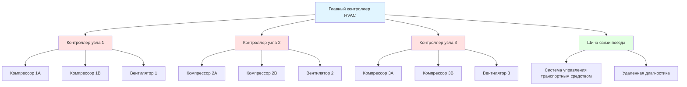
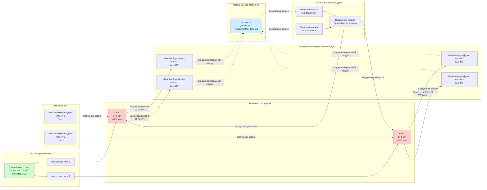

Конфигурация оборудования HVAC пассажирских вагонов определяет надежность системы, доступность для обслуживания и обеспечение комфорта пассажиров. Решения по проектированию относительно размещения узлов, организации воздуховодов и архитектуры избыточности должны учитывать ограничения по пространству, требования к распределению нагрузки на оси и рабочие требования, охватывающие несколько климатических зон во время протяженных поездок.

## Стратегии размещения оборудования

Расположение оборудования HVAC в вагоне ограничено геометрией кузова, пределами нагрузки на оси, диаграммами зазоров и требованиями доступа для обслуживания.

### Монтаж на крышу

Крышное крепление размещает блоки HVAC над пассажирским отделением с подачей воздуха через потолочные диффузоры.

**Преимущества:**

- Прямой поток воздуха через конденсатор без рециркуляции
- Гравитационный отвод конденсата
- Упрощенный доступ для обслуживания с крыши вагона
- Минимальные проемы в кузове для воздуховодов
- Защита от воды в туннелях и мусора путей

**Ограничения:**

- Увеличивает общую высоту транспортного средства на 20-36 см
- Может нарушить диаграммы зазоров на устаревшей инфраструктуре
- Увеличивает аэродинамическое сопротивление (2-4% при скоростях выше 130 км/ч)
- Крышевая нагрузка ограничивает вес узла до 820-1090 кг в одной позиции
- Накопление снега и льда в северных климатах

**Типовая конфигурация:**

Вагоны используют 2-3 блока на крыше в зависимости от длины кузова:

| Длина вагона | Количество узлов | Мощность каждого | Общая мощность | Расход воздуха на узел |
|------------|-----------------|---------------------|----------------|------------------|
| 20 м (пригородный) | 2 узла | 13,2 кВт | 26,4 кВт | 3750 м³/ч |
| 26 м (дальние расстояния) | 2 узла | 17,6 кВт | 35,2 кВт | 4750 м³/ч |
| 26 м (универсальный) | 3 узла | 14,7 кВт | 44 кВт | 4050 м³/ч |

Установки с несколькими узлами обеспечивают избыточность N+1, при которой каждый узел способен поддерживать минимальные условия комфорта при отказе одного узла.

### Подвесная установка

Оборудование HVAC, подвешиваемое под кузовом между центрами тележек, максимизирует внутреннее пространство и поддерживает низкий профиль транспортного средства.

**Преимущества:**

- Сохраняет диаграмму зазоров для туннелей и надземных конструкций
- Снижает аэродинамическое сопротивление по сравнению с крышным монтажом
- Пониженный центр масс улучшает устойчивость движения
- Защита от вандализма в пассажирском отделении
- Допускает потолки полной высоты в интерьере

**Ограничения:**

- Воздействие брызг, снега, льда и мусора путей
- Сложные воздуховоды через конструкцию пола для достижения потолочного распределения
- Затруднен доступ для обслуживания, требующий ям или домкратов
- Вибрация и ударные нагрузки от неровностей пути
- Ограничено вертикальным зазором 61-76 см в большинстве установок

**Типовая конфигурация:**

| Тип оборудования | Способ крепления | Диапазон мощности | Вес | Класс защиты |
|----------------|-----------------|----------------|--------|-------------------|
| Блочный узел | Подвешен на кронштейнах | 23,4-35,2 кВт | 540-820 кг | IP65 (пыль/водяная струя) |
| Конденсор раздельной системы | Крепление на раме | 29,3-44 кВт | 360-540 кг | IP65 |
| Банки электронагревателя | Установка в воздуховод | 15-30 кВт | 68-136 кг | IP54 |

Подвесные узлы требуют защитных кожухов с герметизированными электрическими проемами, наклонными поддонами для конденсата и покрытыми теплообменниками для устойчивости к коррозии.

### Интегрированная в кузов установка

Современные вагоны все чаще используют распределенные системы с компонентами, интегрированными в структуру кузова.

**Конфигурация раздельной системы:**

- Конденсирующие узлы: Размещение на крыше или под вагоном
- Испарительные секции: Распределены вдоль боковых панелей или потолочных камер
- Линии хладагента: Проходят через структурные каналы с изоляционными петлями
- Управление: Сетевое управление через шину связи поезда

Такое расположение оптимизирует распределение веса, обеспечивая зонированное управление температурой для разных областей пассажирского салона.

## Проектирование компоновки воздуховодов

Системы воздуховодов вагонов распределяют кондиционированный воздух по всему пассажирскому отделению с учетом конструктивных элементов кузова, механизмов дверей и ограничений внутреннего отделочного покрытия.

### Схемы распределения приточного воздуха

**Система потолочного линейного диффузора:**

Наиболее распространенная схема для установок HVAC на крышах использует непрерывные линейные щелевые диффузоры вдоль центральной линии или обеих сторон пассажирского отделения.

Параметры проектирования:
- Ширина диффузора: 4-8 см
- Скорость выхода: 180-240 м/мин при полной нагрузке
- Дальность подачи: 3,6-4,9 м (достигает уровня пола)
- Схема подачи: Вертикальный выброс с вовлечением и распределением
- Расстояние: Непрерывное или сегменты 0,9-1,2 м

Приточная камера обычно проходит продольно в структуре потолка с поперечными ответвлениями, питающими секции диффузора. Сечение камеры поддерживает скорости ниже 360 м/мин для минимизации передачи шума.

**Высокоскоростное боковое распределение:**

Высокоскоростной транспорт и премиум-сервис дальних расстояний используют боковой выброс для снижения загромождения потолка и размещения багажных полок.

Характеристики:
- Скорость выхода: 240-360 м/мин
- Расстояние между соплами: 76-102 см
- Угол выброса: 15-25° вниз
- Температура подачи: 8-11°C ниже температуры помещения (режим охлаждения)

Высокоскоростные системы требуют тщательной балансировки для предотвращения сквозняков на сидящих пассажирах рядом с выходами.

**Подвесная система подачи:**

Подвесные узлы HVAC выбрасывают воздух через решетки на уровне пола с восходящей схемой подачи.

Детали конфигурации:
- Размер решетки: 20 × 61 см - 25 × 91 см
- Расстояние: 1,2-1,8 м вдоль длины кузова
- Скорость выхода: 120-180 м/мин (низкая для предотвращения захвата мусора)
- Гибкие подключения: Гибкие для учета изгиба кузова
- Повышение температуры: 21-29°C приточного воздуха в режиме отопления

Подвесная подача создает восходящую схему подачи воздуха, естественно поднимающуюся из-за тепловой плавучести, смешиваясь с возвратным воздухом на уровне потолка.

### Системы возврата воздуха

Сбор возвратного воздуха определяет эффективность циркуляции и тепловой комфорт пассажиров.

**Конфигурация потолочного возврата:**

Наиболее распространена в установках HVAC на крышах:
- Решетки возврата: Крепление на боковой панели вблизи потолка или встроенные в потолок
- Площадь решетки: 1,5-2,0× площадь приточного диффузора (низкая скорость)
- Возвратная камера: Над потолочными панелями или в полостях стен
- Путь к узлу HVAC: Прямой или через отделение фильтра

Проектирование поддерживает скорости возврата ниже 150 м/мин в решетках для минимизации генерации шума и предотвращения захвата бумаги/мусора.

**Конфигурация бокового возврата:**

Используется в подвесных системах HVAC:
- Место возврата: Верхняя боковая панель или нижняя часть багажной полки
- Тип решетки: Перфорированные панели или линейные щели
- Возвратная камера: Проходит продольно, соединяясь с впуском подвесного узла
- Место фильтра: На входе узла или распределены на решетках возврата

Боковые возвраты требуют перегородок для предотвращения короткого замыкания приточного воздуха перед смешиванием с воздухом помещения.

### Методология определения размеров воздуховодов

Определение размеров воздуховодов вагонов уравновешивает потери давления, генерацию шума и доступное место для установки.

**Расчет потерь на трение:**

Перепад давления на 30 метров воздуховода следует уравнениям стандартного трения:

$$\Delta P = \frac{f \cdot L \cdot \rho \cdot V^2}{2 \cdot D \cdot 12}$$

Где:
- $\Delta P$ = перепад давления (см вод. ст.)
- $f$ = коэффициент трения (0,02-0,035 для оцинкованной стали)
- $L$ = длина воздуховода (м)
- $\rho$ = плотность воздуха (1,2 кг/м³ при стандартных условиях)
- $V$ = скорость воздуха (м/с)
- $D$ = диаметр воздуховода (см)

Целевые значения:
- Основные магистральные воздуховоды: 2-3 Па на 30 м
- Ветвевые воздуховоды: 2,5-4 Па на 30 м
- Максимальное статическое давление в системе: 30-45 Па

**Пределы скорости:**

| Участок воздуховода | Максимальная скорость | Критерий шума |
|--------------|------------------|-----------------|
| Основной приточный магистраль | 450 м/мин | NC-40 |
| Ветвевые воздуховоды | 360 м/мин | NC-35 |
| Возвратные воздуховоды | 300 м/мин | NC-35 |
| На диффузорах | 240 м/мин | NC-30 |

Пассажирские железнодорожные приложения ориентированы на фоновый шум HVAC NC-35 - NC-40 для избежания помех разговорам или объявлениям.

### Проектирование впуска наружного воздуха

Вентиляция свежим воздухом вводит наружный воздух для комфорта пассажиров и управления давлением.

**Расположение впуска:**

- Узлы на крыше: Специальные капюшоны впуска на внешней части узла
- Подвесные узлы: Защищенные впуски на нижней части кузова
- Позиционирование: Впереди от впуска возвратного воздуха для предотвращения рециркуляции
- Защита: Экраны (6 мм ячейка) и дренаж для предотвращения попадания воды

**Вместимость вентиляции:**

Стандарт APTA PR-M-S-015-06 требует минимальное обеспечение наружным воздухом:

$$\dot{Q}_{OA} = N_{pax} \times \text{OA}_{rate}$$

Где:
- $\dot{Q}_{OA}$ = расход наружного воздуха (м³/ч)
- $N_{pax}$ = проектируемая численность пассажиров
- $\text{OA}_{rate}$ = 25 м³/ч на человека (основание ASHRAE 62.1)

Для вагона длиной 26 м, вмещающего 72 сидящих пассажира:

$$\dot{Q}_{OA} = 72 \times 25 = 1800 \text{ м³/ч минимум}$$

Системы обычно обеспечивают 20-30% наружного воздуха при проектных условиях, увеличиваясь до 100% при благоприятных внешних условиях (режим экономайзера).

## Определение размеров мощности системы HVAC

Нагрузки охлаждения и отопления вагонов учитывают передачу через ограждение, солнечные теплопоступления, наличие людей, инфильтрацию и кондиционирование воздуха вентиляции.

### Расчет охлаждающей нагрузки

**Общая охлаждающая мощность:**

$$Q_{total} = Q_{envelope} + Q_{solar} + Q_{occupant} + Q_{infiltration} + Q_{ventilation}$$

**Передача тепла через ограждение:**

$$Q_{envelope} = \sum (U_i \cdot A_i \cdot \Delta T)$$

Где:
- $U_i$ = теплопроводность поверхности $i$ (Вт/(м²·K))
- $A_i$ = площадь поверхности (м²)
- $\Delta T$ = разница температур, внутри и снаружи (K)

Типовые U-значения для конструкции вагонов:

| Поверхность | Конструкция | U-значение | Площадь (вагон 26 м) |
|---------|-------------|---------|------------------|
| Крыша | Изолированный алюминий | 1,0 Вт/(м²·K) | 95 м² |
| Боковые стенки | Алюминиевая кожа, изоляция 5 см | 1,4 Вт/(м²·K) | 127 м² |
| Пол | Изолированный алюминиевый поддон | 1,7 Вт/(м²·K) | 95 м² |
| Окна | Тонированное двойное стекло | 3,0 Вт/(м²·K) | 30 м² |
| Торцевые стенки | Изолированные с дверью | 2,0 Вт/(м²·K) | 17 м² |

Для проектных условий 35°C снаружи, 24°C внутри:

$$Q_{envelope} = (1,0 \times 95 + 1,4 \times 127 + 1,7 \times 95 + 3,0 \times 30 + 2,0 \times 17) \times 11$$

$$Q_{envelope} = (95 + 178 + 161 + 90 + 34) \times 11 = 6,27 \text{ кВт}$$

**Солнечное теплопоступление:**

$$Q_{solar} = A_{window} \times SHGC \times I_{solar} \times CLF$$

Где:
- $A_{window}$ = площадь окна (м²)
- $SHGC$ = коэффициент солнечного теплопоступления (0,40-0,60 для тонированного стекла)
- $I_{solar}$ = поступающее солнечное излучение (570-760 Вт/м²)
- $CLF$ = коэффициент охлаждающей нагрузки (0,85-0,95 для легких конструкций)

Пиковая солнечная нагрузка (окна на западе в 16:00):

$$Q_{solar} = 30 \times 0,50 \times 700 \times 0,90 = 9,45 \text{ кВт}$$

**Нагрузка от наличия людей:**

$$Q_{occupant} = N_{pax} \times (SHG + LHG)$$

Для 72 сидящих пассажиров (585 Вт явного + 470 Вт скрытого на человека):

$$Q_{occupant} = 72 \times (585 + 470) = 76,1 \text{ кВт}$$

**Нагрузка инфильтрации:**

Открытие дверей на станциях вводит значительные нагрузки. Для 8 цклов открытия дверей в час при пригородном сервисе:

$$Q_{infiltration} = 8 \times 0,73 = 5,85 \text{ кВт}$$

**Нагрузка вентиляции:**

Нагрузка кондиционирования наружного воздуха:

$$Q_{ventilation} = 1,2 \times \dot{V} \times \Delta T + 3,0 \times \dot{V} \times \Delta \omega$$

Для 1800 м³/ч при 35°C снаружи, 24°C внутри, и разница влагосодержания 0,0080 кг/кг:

$$Q_{ventilation} = 1,2 \times 1800 \times 11 + 3,0 \times 1800 \times 0,0080$$

$$Q_{ventilation} = 23,76 + 43,2 = 66,96 \text{ кВт} \approx 67 \text{ кВт}$$

**Общая охлаждающая нагрузка:**

$$Q_{total} = 6,27 + 9,45 + 76,1 + 5,85 + 67 = 164,67 \text{ кВт}$$

С включением 15% коэффициента безопасности для переходных условий:

$$Q_{design} = 164,67 \times 1,15 = 189,4 \text{ кВт} \approx 54 \text{ кВт охлаждения}$$

Эта проектная мощность соответствует типовым установкам 2-3 узлов общей мощностью 35-44 кВт для универсальных вагонов длиной 26 м.

### Расчет отопительной нагрузки

**Общая отопительная мощность:**

$$Q_{heating} = Q_{transmission} + Q_{infiltration} + Q_{ventilation}$$

**Передача тепла через ограждение:**

$$Q_{transmission} = \sum (U_i \cdot A_i \cdot \Delta T)$$

Для проектных условий -18°C снаружи, 21°C внутри ($\Delta T = 39$K):

$$Q_{transmission} = (95 + 178 + 161 + 90 + 34) \times 39 = 22,3 \text{ кВт}$$

**Потери тепла инфильтрацией:**

Открытие дверей зимой вводит холодный воздух:

$$Q_{infiltration} = 1,2 \times CFM_{infiltration} \times \Delta T$$

Для среднего притока 85 м³/ч:

$$Q_{infiltration} = 1,2 \times 85 \times 39 = 4,0 \text{ кВт}$$

**Потери тепла вентиляцией:**

$$Q_{ventilation} = 1,2 \times 1800 \times 39 = 84,2 \text{ кВт}$$

**Общая отопительная нагрузка:**

$$Q_{heating} = 22,3 + 4,0 + 84,2 = 110,5 \text{ кВт}$$

Фактическая отопительная мощность должна также обеспечивать быстрый прогрев от ночного холодного состояния (обычно требует 200-250% установившейся нагрузки), что дает установленную отопительную мощность 30-40 кВт электрического сопротивления или эквивалентного теплогенератора на топливе.

## Проектирование избыточности и надежности

Системы HVAC вагонов включают избыточность для поддержания минимальных уровней комфорта при отказах оборудования.

### Избыточность многоузловой конфигурации

**Конфигурация N+1:**

Стандартная практика использует несколько узлов HVAC с перекрывающимися зонами обслуживания.

Стратегии избыточности:

| Конфигурация | Нормальная работа | Режим отказа | Уровень комфорта |
|---------------|------------------|--------------|---------------|
| 2 узла × 17,6 кВт | Каждый служит 50% нагрузки | Одинарный отказ: остается 50% мощности | Поддерживает 26-27°C летом |
| 3 узла × 14,7 кВт | Каждый служит 33% нагрузки | Одинарный отказ: остается 67% мощности | Поддерживает 24-26°C летом |
| 2 узла + 1 резерв (N+1) | Два активны, один резервный | Одинарный отказ: резерв активируется | Поддерживает проектные условия |

Стандарты APTA требуют, чтобы системы поддерживали внутреннюю температуру в пределах 5,6°C от уставки при одном отказавшем узле при проектных внешних условиях.

### Избыточность на уровне компонентов

**Системы с двумя компрессорами:**

Отдельные узлы HVAC включают два компрессора для модуляции мощности и избыточности:

- Работа основной-вспомогательной: Компрессоры чередуются для выравнивания времени работы
- Частичная мощность: Один компрессор обеспечивает 40-50% мощности узла
- Режим отказа: Узел продолжает работу с пониженной мощностью

**Избыточные электродвигатели вентиляторов:**

Критические установки используют двойные конфигурации вентиляторов:

- Независимые электродвигатели: Каждый способен обеспечить 60-70% воздушного потока
- Автоматическое переключение: Система управления активирует резерв при обнаружении отказа
- Минимальное снижение комфорта: Поддерживает циркуляцию воздуха для распределения температуры

### Избыточность системы управления

Современное управление HVAC вагонов использует сетевые системы управления с множеством стратегий предотвращения отказов.

**Архитектура распределенного управления:**

**Обнаружение отказов и их устранение:**

- Мониторинг давления хладагента: Обнаруживает отказ компрессора или утечку хладагента
- Температура выходящего воздуха: Определяет отказ охлаждения или отопления
- Мониторинг тока вентилятора: Обнаруживает отказ электродвигателя или закупорку воздушного потока
- Сетевая связь: Главный контроллер обнаруживает отказ контроллеров узлов

При обнаружении отказа система управления:

1. Исключает отказавший узел из сервиса
2. Командует оставшимся узлам максимальной мощности
3. Регистрирует коды ошибок с временной меткой для обслуживания
4. Передает оповещение системе управления транспортным средством
5. Регулирует ожидания пассажирской комфортности через дисплеи

## Диаграмма конфигурации системы

Типовое расположение оборудования HVAC пассажирского вагона:

## Требования к установке и стандарты

Установки HVAC в вагонах следуют отраслевым стандартам для крепления, электротехники и систем с хладагентом.

### Механическое крепление

**Виброизоляция:**

- Пружинные изоляторы: Прогиб 4-6 см (естественная частота 8-15 Гц)
- Эластомерные крепления: Прогиб 1-2,5 см для более легких компонентов
- Эффективность изоляции: 85-95% на рабочих частотах (15-30 Гц)

**Конструктивное крепление:**

- Узлы на крыше: 8-12 точек крепления на узел, закреплены к конструктивным элементам кузова
- Подвесные узлы: Подвешены на подвесных стержнях с виброизоляторами, соединены с поперечными балками подрамника
- Сейсмическое закрепление: Обычно не требуется для железнодорожного транспорта (охватывается критериями ударных нагрузок)

### Электротехническая установка

**Питание:**

Вагоны получают питание от станции через кабели связи:

- Напряжение: 480 В переменного тока, 3-фаза, 60 Гц (Северная Америка)
- Нагрузка HVAC на вагон: 15-30 кВт (варьируется по конфигурации)
- Защита цепей: Автоматические выключатели в панели распределения питания
- Допуск напряжения: Оборудование рассчитано на ±10% колебание напряжения

**Управляющая проводка:**

- Цепи управления 24 В переменного тока для термостата, предохранителей и реле
- Сетевая связь: RS-485, CANbus или Ethernet (варьируется по производителю)
- Экранированные кабели: Требуются для управляющих цепей для предотвращения помех электромагнитного поля

### Требования системы с хладагентом

**Маршрутизация трубопроводов:**

- Минимизация изгибов: Использование колен большого радиуса (минимум 5× диаметр трубопровода)
- Расстояние между опорами: 1,2-1,8 м для жидкостных линий, 1,8-2,4 м для линий всасывания
- Виброизоляционные петли: Предусмотрение гибких секций на соединениях оборудования
- Изоляция: Закрытопористая эластомерная изоляция 1,3-1,9 см на линиях всасывания

**Заправка хладагентом:**

Типовые системы вагонов содержат 7-14 кг хладагента на узел (R-134a, R-513A или R-452B). Установка следует нормам EPA по обращению с хладагентом и испытаниям на герметичность:

- Давление испытания на герметичность: 1034 кПа азота (10-минутная выдержка)
- Уровень вакуума: 400 микрон или ниже перед заправкой
- Рабочая заправка: Согласно спецификациям производителя с учетом длины линий

## Проектирование доступа для обслуживания

Удобство обслуживания напрямую влияет на стоимость жизненного цикла и доступность системы.

### Положения доступа

**Узлы на крыше:**

- Проходы на крыше вагона: Ширина 61-76 см с перилами
- Люки доступа: Минимум 61 × 76 см для снятия компонентов
- Освещение: 50-85 люкс на рабочей высоте
- Доступ к фильтрам: Дверцы отделения фильтра без инструментов

**Подвесные узлы:**

- Платформы обслуживания: Платформы, устанавливаемые в мастерской, или портативные подставки
- Подъемные приспособления: Точки подъема для снятия узла (требует поднятия вагона на домкратах)
- Электрические отключения: Доступны без входа в подвагонное пространство
- Доступность компонентов: Компрессор, управление доступны с одной стороны

### Интервалы обслуживания

| Компонент | Частота проверки | Интервал замены | Требуемый доступ |
|-----------|---------------------|----------------------|-----------------|
| Воздушные фильтры | Ежемесячно (в обслуживании) | 3-6 месяцев | Люки без инструментов |
| Масло компрессора | Ежеквартально | По результатам анализа | Требуется доступ к узлу |
| Конденсаторные батареи | Ежеквартально очистка | Н/П (только очистка) | Внешний доступ |
| Электродвигатели вентиляторов | Ежегодная смазка | 8-12 лет | Требуется доступ к узлу |
| Заправка хладагентом | Ежегодная проверка герметичности | По необходимости | Порты хладагента |
| Приводные ремни | Ежегодная проверка | 5-8 лет | Отделение вентилятора |

## Применяемые отраслевые стандарты

Проектирование и установка HVAC в вагонах следует множественным стандартам:

**APTA (Американская ассоциация общественного транспорта):**

- **APTA PR-M-S-015-06**: Стандарт для систем HVAC транспортных средств железнодорожного пассажирского транспорта
  - Методология определения размеров мощности
  - Требования испытания производительности
  - Критерии надежности и ремонтопригодности

**Стандарты EN (Европейские):**

- **EN 14750-1**: Железнодорожный транспорт - Кондиционирование воздуха для подвижного состава городского и пригородного транспорта
  - Категории комфорта по климатическим зонам
  - Требования энергоэффективности
  - Пределы шума и вибрации

- **EN 14813-1**: Железнодорожный транспорт - Кондиционирование воздуха для кабин управления
  - Критерии комфорта оператора
  - Спецификации оборудования

**Стандарты IEC:**

- **IEC 61373**: Железнодорожные приложения - Оборудование подвижного состава - Испытания на ударные и вибрационные нагрузки
  - Протоколы вибрационного испытания
  - Требования крепления компонентов

**Стандарты ASHRAE:**

- **ASHRAE Standard 55**: Условия окружающей среды для теплового комфорта человека
  - Критерии теплового комфорта, адаптированные для железнодорожного транспорта

- **ASHRAE Standard 62.1**: Вентиляция для приемлемого качества внутреннего воздуха
  - Требования наружного воздуха
  - Стандарты фильтрации

**Стандарты NFPA:**

- **NFPA 130**: Стандарт для рельсового транспорта и пассажирского транспорта на выделенных путях
  - Требования пожарной безопасности систем HVAC
  - Положения по контролю дыма
  - Аварийная вентиляция

Соответствие этим стандартам обеспечивает безопасность пассажиров, комфорт и надежность системы в течение операционного периода вагонов, охватывающего 25-40 лет.

Правильное проектирование конфигурации оборудования HVAC уравновешивает производительность, надежность и ремонтопригодность при соблюдении пространственных и весовых ограничений, присущих железнодорожному транспорту. Избыточность многоузловой конфигурации, распределенные воздуховоды и стандартизированные способы крепления создают системы, способные обеспечивать постоянный комфорт в различных рабочих условиях и климатических зонах.
