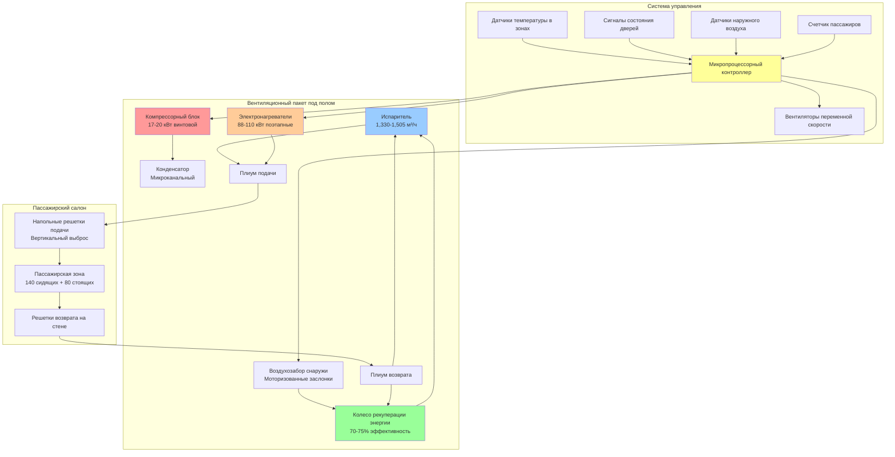
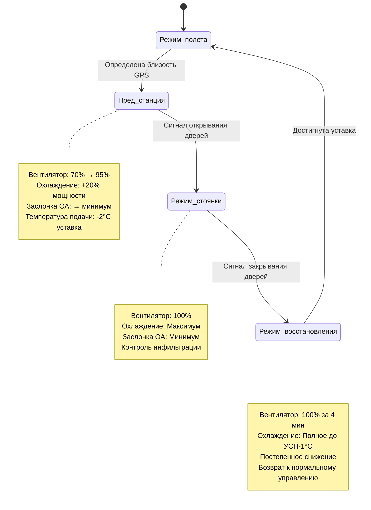

Системы HVAC региональных электропоездов работают в наиболее экстремальных условиях среди всех пассажирских железнодорожных систем. Частые остановки на станциях создают непрерывные нагрузки инфильтрации, пиковая часовая загрузка развивает экстремальные нагрузки от пассажиров, а быстрое температурное циклирование требует активного модулирования мощности. Проектные стратегии должны обеспечить комфорт пассажиров во время поездок продолжительностью 30-90 минут при соблюдении ограничений энергоэффективности, обусловленных ограниченной мощностью головной электростанции вагона.

## Профиль операционных нагрузок

Тепловые нагрузки систем HVAC региональных электропоездов варьируются резко в течение дня обслуживания, что обусловлено паттернами пассажирских потоков, частотой остановок и условиями окружающей среды.

### Характеристики пиковых периодов

Утренний и вечерний часы пик создают максимальные системные нагрузки:

**Типичные параметры пикового обслуживания**

| Параметр | Значение | Влияние |
|----------|----------|--------|
| Вместимость мест | 120-160 пассажиров | Базовая норма проектирования |
| Пиковая сверхнагрузка | 180-240 пассажиров | 150-200% вместимости мест |
| Частота остановок | Каждые 2-5 минут | Непрерывная инфильтрация |
| Время открывания дверей | 30-60 секунд | 8,000-15,000 кДж/ч на дверь |
| Период восстановления на станции | 3-6 минут | Ограничивает стабильность температуры |
| Продолжительность поездки | 30-90 минут | Умеренные требования к комфорту |
| Суточные циклы | 40-60 остановок | Тепловая усталость оборудования |

### Внепиковое и дневное обслуживание

Сниженная загруженность позволяет применять стратегии энергосбережения:

| Параметр | Значение внепика | Снижение от пика |
|----------|------------------|-----------------|
| Среднее количество пассажиров | 30-60 пассажиров | Снижение на 60-75% |
| Частота остановок | Каждые 5-10 минут | На 50% меньше событий инфильтрации |
| Использование мощности HVAC | 40-65% | Возможность поэтапного управления |
| Требование вентиляции | 450-900 CFM (765-1,530 м³/ч) | Пропорционально количеству пассажиров |

## Расчеты пиковых охлаждающих нагрузок

Охлаждающие нагрузки электропоездов объединяют непрерывные базовые нагрузки с переходными скачками инфильтрации.

### Формула общей охлаждающей нагрузки

$$Q_{\text{total}} = Q_{\text{envelope}} + Q_{\text{occupant}} + Q_{\text{infiltration}} + Q_{\text{equipment}} + Q_{\text{ventilation}}$$

Где каждый компонент рассчитывается следующим образом:

**Нагрузка через ограждающие конструкции**

$$Q_{\text{envelope}} = \sum (U_i \cdot A_i \cdot \Delta T) + \sum (A_{\text{glass},j} \cdot \text{SHGC}_j \cdot I_{\text{solar}})$$

**Параметры:**
- $U_i$ = коэффициент теплопередачи поверхности $i$ (кДж/ч·м²·°C)
  - Крыша: 0.85-1.13
  - Боковые стены: 1.42-1.70
  - Окна: 5.40-5.97
- $A_i$ = площадь поверхности (м²)
- $\Delta T$ = разность температур внутри и снаружи (°C)
- SHGC = коэффициент солнечного прироста тепла (0.35-0.45 для тонированного стекла)
- $I_{\text{solar}}$ = падающее солнечное излучение (570-795 кДж/ч·м²)

**Нагрузка от пассажиров**

$$Q_{\text{occupant}} = N_{\text{seated}}(264) + N_{\text{standing}}(368)$$

Где:
- $N_{\text{seated}}$ = количество сидящих пассажиров
- $N_{\text{standing}}$ = количество стоящих пассажиров
- Сидящие: 264 кДж/ч всего (210 явного тепла + 53 скрытого)
- Стоящие: 368 кДж/ч всего (263 явного тепла + 105 скрытого)

Для пикового проектирования при 200% вместимости мест с 60% стоящих пассажиров:

$$Q_{\text{occupant,peak}} = 140(264) + 80(368) = 36{,}960 + 29{,}440 = 66{,}400 \text{ кДж/ч}$$

**Нагрузка инфильтрации при открывании дверей**

$$Q_{\text{door}} = 1.20 \cdot \text{CFM}_{\text{infiltration}} \cdot \Delta T + 0.72 \cdot \text{CFM}_{\text{infiltration}} \cdot \Delta \omega$$

Для обслуживания электропоездов с 4 дверьми на вагон:

$$\text{CFM}_{\text{infiltration}} = N_{\text{doors}} \cdot \text{CFM}_{\text{per door}} \cdot \text{duty cycle}$$

Типичные значения:
- $\text{CFM}_{\text{per door}}$ = 800-1,200 (1,360-2,040 м³/ч) во время 45-секундного открывания
- Коэффициент включения = 0.15-0.25 (двери открыты 15-25% времени в пути)
- Эффективная непрерывная инфильтрация: 480-1,200 CFM (815-2,040 м³/ч)

При условиях проектирования (35°C сух. булб., 24°C влаж. булб. снаружи; 24°C сух. булб., 50% ОВ внутри):

$$Q_{\text{infiltration}} = 1.20(800)(11) + 0.72(800)(0.009) = 10{,}560 + 5{,}184 = 15{,}744 \text{ кДж/ч}$$

**Выделение тепла от оборудования**

$$Q_{\text{equipment}} = P_{\text{lighting}} + P_{\text{motors}} + P_{\text{electronics}}$$

Типичный вагон электропоезда:
- Светодиодное освещение: 2,640-3,695 кДж/ч
- Отходящее тепло от тягового двигателя (передаваемое): 1,585-2,640 кДж/ч
- Электроника и дисплеи: 1,055-1,585 кДж/ч
- Всего: 5,280-7,920 кДж/ч

**Нагрузка на приточный воздух вентиляции**

$$Q_{\text{ventilation}} = 1.20 \cdot \text{CFM}_{\text{OA}} \cdot \Delta T + 0.72 \cdot \text{CFM}_{\text{OA}} \cdot \Delta \omega$$

Минимальная вентиляция согласно ASHRAE 62.1 и стандартам APTA:
- 15 CFM на сидящего пассажира (25.5 м³/ч)
- 7.5 CFM на стоящего пассажира (12.75 м³/ч) (сниженное значение из-за короткой длительности)

Требование пиковой вентиляции:

$$\text{CFM}_{\text{OA}} = 140(15) + 80(7.5) = 2{,}100 + 600 = 2{,}700 \text{ CFM (4{,}590 м³/ч)}$$

При условиях проектирования:

$$Q_{\text{vent}} = 1.20(2700)(11) + 0.72(2700)(0.009) = 35{,}640 + 17{,}496 = 53{,}136 \text{ кДж/ч}$$

### Общая расчетная охлаждающая мощность

$$Q_{\text{total}} = 47{,}460 + 66{,}400 + 15{,}744 + 6{,}876 + 53{,}136 = 189{,}616 \text{ кДж/ч} \approx 18.9 \text{ кВт}$$

Стандартная мощность электропоезда: **190,000-232,000 кДж/ч (53-65 кВт)**

Коэффициент безопасности учитывает:
- Одновременное открывание нескольких дверей на загруженной станции
- Продленные остановки во время сбоев в обслуживании
- Снижение производительности оборудования при старении (10-15% потеря мощности за 15-летний срок службы)

## Анализ нагрузок на отопление

Зимние отопительные нагрузки должны преодолевать потери через ограждающие конструкции и обеспечивать быстрый прогрев при холодном пуске после ночного хранения.

### Установившаяся отопительная нагрузка

$$Q_{\text{heating}} = \sum (U_i \cdot A_i \cdot \Delta T) + 1.20 \cdot \text{CFM}_{\text{infiltration}} \cdot \Delta T + 1.20 \cdot \text{CFM}_{\text{OA}} \cdot \Delta T$$

При условиях проектирования зимы (-18°C снаружи, 21°C внутри):

**Потери через ограждающие конструкции:**
- Крыша (74 м² × 0.99 × 39°C): 2,862 кДж/ч
- Боковые стены (111 м² × 1.56 × 39°C): 6,744 кДж/ч
- Окна (32 м² × 5.68 × 39°C): 7,083 кДж/ч
- Пол (65 м² × 1.70 × 39°C): 4,316 кДж/ч
- Промежуточный итог: 21,005 кДж/ч

**Инфильтрация (800 CFM в среднем, 1,360 м³/ч):**

$$Q_{\text{inf}} = 1.20(800)(39) = 37,440 \text{ кДж/ч}$$

**Вентиляция (2,100 CFM при пиковой загруженности, 3,570 м³/ч):**

$$Q_{\text{vent}} = 1.20(2100)(39) = 97{,}920 \text{ кДж/ч}$$

**Общая установившаяся:** 156,365 кДж/ч

### Требование мощности для прогрева при холодном пуске

Вагоны, хранящиеся ночью в неотапливаемых депо, достигают теплового равновесия с наружной температурой. Пусконаладка в утренние часы требует быстрого прогрева:

$$Q_{\text{warm-up}} = \frac{m \cdot c_p \cdot \Delta T}{t_{\text{recovery}}}$$

Где:
- $m$ = тепловая масса кузова вагона (внутренние поверхности, сиденья, конструкция)
- $c_p$ = удельная теплоемкость материалов
- $\Delta T$ = повышение температуры от холодного пуска до комфорта (обычно 28-50°C)
- $t_{\text{recovery}}$ = приемлемое время прогрева (15-20 минут)

Для алюминиевого кузова с внутренней отделкой:

$$Q_{\text{warm-up}} \approx 158{,}000-211{,}000 \text{ кДж/ч дополнительной мощности}$$

**Общая расчетная отопительная мощность:** 316,000-352,000 кДж/ч (88-98 кВт электросопротивление или дизельный нагреватель)

## Архитектура систем и выбор оборудования

### Конфигурация вентиляционного пакета под полом

Доминирующая архитектура размещает все оборудование HVAC под полом пассажирского салона, обеспечивая:

**Преимущества:**
- Максимальное сохранение вместимости мест
- Защита от вандализма
- Акустическая изоляция от пассажирского пространства
- Низкий профиль транспортного средства и дорожный просвет
- Аэродинамическая эффективность

**Спецификации компонентов:**

| Компонент | Спецификация | Производительность |
|-----------|--------------|-------------------|
| Компрессор | Винтовой, 17-20 кВт, переменная скорость | Модулирование 1200-3600 об/мин |
| Холодильный агент | R-513A (ПГВ 631) или R-452B (ПГВ 676) | Переход с R-134a |
| Испаритель | Трубка медь/алюминиевое оребрение, 12-16 рядов | 1,330-1,505 м³/ч при 15-20 Па |
| Конденсатор | Микроканальный алюминий, двойная цепь | Работа до 52°C окружающей среды |
| Банки нагревателей | Электросопротивление, 4-5 ступеней | 16-20 кВт на ступень |
| Вентиляторы подачи | Центробежные, EC моторы переменной скорости | 70-85% КПД вентилятора |
| Фильтрация | MERV 8 предварительный фильтр + MERV 11 финальный | 2.0 м/с фронтальная скорость |

## Интеграция рекуперации энергии

Рекуперация энергии существенно снижает нагрузки вентиляции при пиковой загруженности.

### Производительность ротационного колеса энтальпии

Современные системы электропоездов включают ротационные колеса энтальпии между потоками отработанного и наружного воздуха:

$$\text{Эффективность} = \frac{h_{\text{наружный,выход}} - h_{\text{наружный,вход}}}{h_{\text{отработанный}} - h_{\text{наружный,вход}}}$$

**Параметры проектирования:**

| Параметр | Летнее охлаждение | Зимний нагрев |
|----------|------------------|--------------|
| Диаметр колеса | 610-760 мм | 610-760 мм |
| Глубина колеса | 200-305 мм | 200-305 мм |
| Скорость вращения | 15-25 об/мин | 15-25 об/мин |
| Эффективность явного тепла | 75-80% | 75-80% |
| Эффективность скрытого тепла | 65-70% | 65-70% |
| Общая эффективность | 70-75% | 70-75% |
| Падение давления | 20-30 Па | 20-30 Па |
| Перекрестное загрязнение | <2% | <2% |

### Расчет экономии энергии

При пиковой загруженности, требующей 2,700 CFM (4,590 м³/ч) наружного воздуха:

**Летние условия (35°C сух. булб. / 24°C влаж. булб. снаружи, 24°C сух. булб. / 50% ОВ возврата):**

Без рекуперации энергии:

$$Q_{\text{охлаждение,ОА}} = 2700(128.2 - 106.4) = 58{,}860 \text{ кДж/ч}$$

Преобразование в кДж/ч с использованием психрометрических свойств:

$$Q_{\text{без-ERV}} = 77,120 \text{ кДж/ч}$$

С колесом рекуперации 72% эффективности:

$$Q_{\text{с-ERV}} = 77{,}120(1 - 0.72) = 21{,}594 \text{ кДж/ч}$$

**Годовая экономия энергии:** 55,526 кДж/ч снижение × 2000 часов эксплуатации/год = 111 ГДж/год

При тарифе $0.12/кВт·ч и COP 3.0:

**Годовая экономия:** 1200-1500 доллар на вагон

**Зимние условия (4°C снаружи, 21°C возврата):**

Снижение предварительного нагрева через колесо рекуперации энтальпии:

$$Q_{\text{предн,сбереж}} = 1.20 \times 2700 \times (21-4) \times 0.75 = 61{,}560 \text{ кДж/ч}$$

За 1200 часов отопительного сезона: 74 ГДж/год = 500-700 долларов экономии электроэнергии

## Стратегии реакции на быстрое циклирование

Частые остановки на станциях создают непрерывные тепловые возмущения, требующие компенсации активного управления.

### Компенсация открывания дверей

**Алгоритм предварительного усиления:**

Когда ожидается открывание двери (определение по GPS близости к станции, обнаружение замедления):

1. **Увеличение объема подаваемого воздуха:** Скорость вентилятора возрастает с 70% до 95% (за 30 секунд до прибытия)
2. **Снижение приточного воздуха снаружи:** Закрытие заслонки до минимального положения во время стоянки (снижение нагрузки инфильтрации)
3. **Активация дополнительного охлаждения:** Подключение дополнительной ступени компрессора или усиление скорости вентилятора
4. **Снижение температуры подачи:** Понижение уставки на 2-3°C для предварительного охлаждения пространства

**Фаза восстановления:**

После закрытия дверей:

1. **Сохранение повышенной мощности:** Продолжение 100% выходной мощности 3-5 минут
2. **Постепенный сброс:** Снижение скорости вентилятора и мощности за 2-3 минуты
3. **Возврат в нормальный режим:** Восстановление нормального модулирования на основе нагрузки

### Реализация логики управления

## Управление спросом на основе загруженности

Загруженность электропоездов варьируется в соотношении 3:1 между пиковым и внепиковым обслуживанием, что позволяет достичь существенной экономии энергии при помощи управления вентиляцией на основе спроса.

### Интеграция автоматического подсчета пассажиров

Современные системы включают автоматические счетчики пассажиров (APC):
- Инфракрасные датчики в проемах дверей
- Стереоскопические камеры с компьютерным зрением
- Датчики веса на полу

**Модулирование вентиляции:**

$$\text{CFM}_{\text{ОА,требуемый}} = N_{\text{пассажиров}} \times 12 \text{ CFM/чел}$$

(Применяется усредненная ставка для смешанного соотношения сидящих/стоящих)

**Алгоритм управления:**

| Количество пассажиров | Положение заслонки ОА | Скорость вентилятора | Ступени компрессора |
|----------------------|----------------------|---------------------|-------------------|
| 0-40 | 20% (минимум) | 50% | 1 из 2 |
| 41-100 | 40% | 65% | 1 из 2 |
| 101-160 | 70% | 80% | 2 из 2 |
| 161-240 | 90% | 95-100% | 2 из 2 + усиление |

### Анализ влияния на энергию

**Сравнение внепика и пика:**

| Параметр | Внепик (50 чел) | Пик (200 чел) | Энергетическое соотношение |
|----------|-----------------|--------------|--------------------------|
| Вентиляция ОА | 600 CFM (1,020 м³/ч) | 2,400 CFM (4,080 м³/ч) | 4.0× |
| Охлаждающая нагрузка | 68,640 кДж/ч | 220,560 кДж/ч | 3.2× |
| Мощность вентилятора | 3.4 кВт | 8.9 кВт | 2.7× |
| Мощность компрессора | 12.6 кВт | 33.6 кВт | 2.7× |
| Общая мощность HVAC | 16 кВт | 42.5 кВт | 2.7× |

Управление спросом снижает среднесуточное потребление энергии на 25-35% в сравнении с работой при постоянном объеме.

## Соображения по техническому обслуживанию

Системы HVAC региональных электропоездов испытывают ускоренный износ вследствие непрерывного циклирования и воздействия окружающей среды.

### График профилактического обслуживания

| Компонент | Интервал проверки | Действие по обслуживанию |
|-----------|------------------|------------------------|
| Воздушные фильтры | 16,000-24,000 км | Замена (3-4 недели в пиковый сезон) |
| Конденсатор | 8,000 км | Очистка (ежемесячно в городском обслуживании) |
| Испаритель | 40,000 км | Проверка, очистка при необходимости |
| Масло компрессора | 80,000 км | Анализ проб, замена при деградации |
| Заряд хладагента | 40,000 км | Проверка давлений, проверка герметичности |
| Колесо рекуперации энергии | 24,000 км | Очистка, проверка вращения |
| Ременные приводы | 16,000 км | Проверка натяжения, замена |
| Калибровка управления | 80,000 км | Верификация датчиков температуры |
| Полная переборка | 240,000-320,000 км | Полное восстановление системы |

### Типичные режимы отказа

**Компоненты с высокой частотой циклирования:**

1. **Отказы компрессора:** Гидравлический удар жидкости вследствие быстрого циклирования (НАРАБОТКА 30,000-50,000 часов)
2. **Подшипники вентиляторов:** Вибрация и непрерывная работа (НАРАБОТКА 40,000-60,000 часов)
3. **Нестабильность расширительного клапана:** Быстрые изменения нагрузки, вызывающие нестабильность
4. **Дрейф датчиков управления:** Датчики температуры и влажности в суровой среде

**Стратегии снижения рисков:**
- Задержка мягкого пуска компрессора (минимум 3 минуты минимальных оборотов)
- Установка аккумулятора на стороне всасывания (предотвращает возврат жидкости)
- Электрические нагреватели картера для защиты ночью
- Вентиляторные подшипники премиум-класса с виброизоляцией
- Ежегодная калибровка датчиков управления

## Релевантные стандарты и спецификации

### Североамериканские стандарты

**APTA PR-M-S-015-06:** Системы вентиляции пассажирских вагонов
- Управление температурой: 20-24°C при условиях проектирования
- Влажность: Осушение для поддержания <65% ОВ при возможности
- Вентиляция: Минимум 15 CFM (25.5 м³/ч) на пассажира
- Быстродействие охлаждения: От 35°C до 24°C в салоне за 30 минут максимум

**ASHRAE Standard 62.1:** Вентиляция для приемлемого качества внутреннего воздуха
- Адаптация для транспортных средств с пониженными нормами для кратковременного пребывания
- Рекомендуется мониторинг CO₂ (поддерживать <1500 ppm в пиковые периоды)

**IEEE 1573:** Рекомендуемая практика электронного оборудования в вагонах городского транспорта
- Устойчивость ЭМИ/РЧИ для управления HVAC
- Устойчивость к вибрации: 5-15 Гц при 0.5g непрерывно

### Международные стандарты

**EN 14750-1:** Применение в железнодорожном транспорте - Кондиционирование воздуха для городских и пригородных вагонов
- Категории комфорта в зависимости от климатических зон
- Протоколы испытания производительности
- Требования энергоэффективности

**EN 13129-1:** Применение в железнодорожном транспорте - Кондиционирование воздуха машинистских кабин
- Применяется к кабинам машинистов, требующим более жесткого управления

## Тенденции технологии будущего

**Системы переменного расхода хладагента (VRF):**
- Независимое управление несколькими зонами
- Рекуперация тепла между зонами нагрева и охлаждения
- Экономия энергии 15-25% по сравнению с общепринятыми системами

**Системы с холодильным агентом CO₂ (R-744):**
- Практически нулевой ПГВ (ПГВ = 1)
- Превосходные характеристики отопления в холодном климате
- Работа трансскритического цикла >30°C окружающей среды

**Дополнительные устройства с элементом Пельтье:**
- Твердотельные тепловые насосы для локального охлаждения
- Отсутствие движущихся частей, бесшумная работа
- Интегрированные в спинки сидений или потолочные консоли

**Предсказывающее техническое обслуживание:**
- Алгоритмы машинного обучения для анализа операционных данных
- Предсказание отказов за 30-60 дней до наступления
- Оптимизированное планирование обслуживания, снижающее внеплановые простои

Системы HVAC региональных электропоездов представляют наиболее экстремальное приложение для управления климатом в пассажирском железнодорожном транспорте, требуя надежного оборудования, сложных систем управления и активного расчета мощности для сохранения комфорта пассажиров в экстремальных условиях загруженности и быстрого температурного циклирования, определяющих пиковый часовой режим обслуживания.
