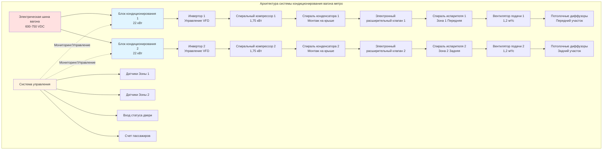

Системы кондиционирования вагонов метро работают в самых экстремальных условиях транспортного HVAC, объединяя экстремальные температуры окружающей среды в туннелях, высокую плотность пассажиров, ограниченный отвод тепла и критические требования надежности. Подземная среда создает замкнутый тепловой цикл, где отвод тепла оборудованием непрерывно повышает температуру в туннеле, снижая производительность системы при пиковом спросе на охлаждение. Правильное проектирование системы кондиционирования требует тщательного анализа компонентов нагрузки, производительности холодильного цикла при повышенных температурах конденсации и архитектуры с избыточностью для поддержания комфорта пассажиров.

## Методология расчета охлаждающей нагрузки

Точное определение нагрузки составляет основу расчета размера системы кондиционирования метро. Общее требование к охлаждению объединяет явные и скрытые компоненты из множественных одновременных источников.

### Нагрузки от солнечной радиации и теплопередачи

Наземные участки подвергают вагоны воздействию солнечной радиации через окна и кровельные поверхности. Подземная эксплуатация исключает прямой солнечный нагрев, но заменяет кондуктивный нагрев от повышенных температур воздуха в туннеле:

$$Q_{\text{cond}} = \sum_{i} U_i \cdot A_i \cdot (T_{\text{tunnel}} - T_{\text{interior}})$$

Где:
- $U_i$ = коэффициент теплопередачи элемента поверхности $i$ (Вт/(м²·K))
- $A_i$ = площадь элемента поверхности $i$ (м²)
- $T_{\text{tunnel}}$ = температура воздуха в туннеле (°C)
- $T_{\text{interior}}$ = целевая внутренняя температура (°C)

Для стандартного вагона метро длиной 23 м с общей площадью оболочки 353 м²:

| Компонент поверхности | Площадь (м²) | Коэффициент теплопередачи (Вт/(м²·K)) | ΔT (K) | Нагрузка (кВт) |
|-------------------|-----------|------------------------|---------|---------------|
| Панели крыши | 84 | 1,0 | 17 | 1,4 |
| Боковые панели | 167 | 1,4 | 17 | 4,0 |
| Конструкция пола | 84 | 1,7 | 8 | 1,1 |
| Окна/двери | 19 | 5,4 | 17 | 1,7 |
| **Итого кондукция** | **353** | - | - | **8,2** |

При температуре туннеля 40,6°C и внутренней установке 23,9°C, кондукция обеспечивает примерно 8,2 кВт явной нагрузки.

### Теплоделение пассажиров

Метаболическое тепло пассажиров доминирует в пиковых требованиях охлаждения. Стоящие пассажиры в условиях метро выделяют больше тепла, чем сидящие:

$$Q_{\text{occupant}} = N_{\text{seated}} \cdot q_{\text{seated}} + N_{\text{standing}} \cdot q_{\text{standing}}$$

Стандартные значения теплоделения пассажиров:
- Сидящий пассажир: 117 Вт (88 явное + 29 скрытое)
- Стоящий пассажир: 132 Вт (103 явное + 29 скрытое)

Расчет вместимости вагона метро:

| Условие нагрузки | Сидящие | Стоящие | Всего | Явная (кВт) | Скрытая (кВт) | Итого (кВт) |
|-------------------|--------|----------|-------|-------------------|-----------------|----------------|
| Нормальная вместимость | 40 | 80 | 120 | 11,7 | 3,0 | 14,7 |
| Проектная вместимость | 40 | 110 | 150 | 14,8 | 3,8 | 18,6 |
| Предельная вместимость | 40 | 140 | 180 | 17,9 | 4,6 | 22,5 |

Проектная вместимость (150 пассажиров) создает 18,6 кВт общей нагрузки, что является крупнейшим одиночным компонентом нагрузки.

### Нагрузки инфильтрации и вентиляции

Открытие дверей на станциях вызывает массивные нагрузки инфильтрации по мере обмена воздуха платформы с кондиционированным воздухом салона. Каждый цикл открытия двери на типичной станции:

$$Q_{\text{infiltration}} = \rho \cdot V_{\text{exchange}} \cdot c_p \cdot (T_{\text{platform}} - T_{\text{interior}}) + h_{fg} \cdot \Delta W$$

Анализ инфильтрации при открытии двери:
- Количество дверей: 8 (по 4 с каждой стороны, 2 стороны)
- Обмен воздуха за цикл двери: 1,4 м³
- Циклы дверей в час: 40 (20 станций, 2 цикла на станцию)
- Общая инфильтрация: 56 м³/час = 33 CFM (56 м³/ч)

При температуре платформы 35°C, 60% ОВ и внутренней температуре 23,9°C при 50% ОВ:
- Явная инфильтрация: 33 CFM × 1,08 × 11 K = 1,7 кВт
- Скрытая инфильтрация: 33 CFM × 0,68 × 0,008 кг/кг = 0,4 кВт
- Общая нагрузка инфильтрации: 2,1 кВт

Требование свежего воздуха по стандартам APTA: 3,5 м³/(ч·чел.)
- Проектная вместимость: 150 пассажиров
- Требуемая вентиляция: 525 м³/ч (309 CFM)
- Явная нагрузка вентиляции: 525 × 1,08 × 17 = 10,7 кВт
- Скрытая нагрузка вентиляции: 525 × 0,68 × 0,012 = 2,7 кВт
- Общая нагрузка вентиляции: 13,4 кВт

### Нагрузки от оборудования и освещения

Внутренние источники тепла включают светодиодное освещение, тепло от тяговых двигателей, проходящее через пол, вспомогательные системы электроснабжения и зарядку электроники пассажиров:

| Источник оборудования | Мощность (кВт) | Отвод тепла (кВт) |
|------------------|------------|----------------------|
| Светодиодное потолочное освещение | 1,8 | 1,8 |
| Моторы дверей и органы управления | 0,5 | 0,5 |
| Вентиляторы HVAC | 2,2 | 2,2 |
| Вспомогательная электроника | 1,0 | 1,0 |
| Проводимость тепла от тяги | - | 1,3 |
| Разъемы USB для зарядки | 0,8 | 0,8 |
| **Итого оборудование** | **6,3** | **6,4** |

### Общая производительность охлаждения системы

Объединение всех компонентов нагрузки для проектных условий:

$$Q_{\text{total}} = Q_{\text{cond}} + Q_{\text{occupant}} + Q_{\text{infiltration}} + Q_{\text{ventilation}} + Q_{\text{equipment}}$$

| Компонент нагрузки | Явная (кВт) | Скрытая (кВт) | Итого (кВт) |
|----------------|-------------------|-----------------|----------------|
| Кондукция | 8,2 | 0 | 8,2 |
| Пассажиры (150) | 14,8 | 3,8 | 18,6 |
| Инфильтрация | 1,7 | 0,4 | 2,1 |
| Вентиляция | 10,7 | 2,7 | 13,4 |
| Оборудование | 6,4 | 0 | 6,4 |
| **Проектный итог** | **41,8** | **6,9** | **48,7** |

Коэффициент явного тепла: 41,8 / 48,7 = 0,858

Стандартная практика применяет коэффициенты безопасности и операционные запасы:
- Коэффициент расчета нагрузки: 1,10 (учитывает неопределенности расчета)
- Отрегулированная проектная нагрузка: 48,7 × 1,10 = 53,6 кВт
- Номинальная производительность системы: 52,7 кВт (15 кВт охлаждения)

Большинство современных вагонов метро устанавливают номинальную производительность 35-44 кВт с пониманием, что температуры в туннелях могут ограничить фактическое достигаемое охлаждение в экстремальных условиях.

## Проблемы отвода тепла в туннелях

Фундаментальное ограничение в проектировании кондиционирования метро вытекает из отвода тепла в ограниченных туннельных пространствах. В отличие от наземных транспортных средств, отводящих тепло в неограниченный объем атмосферы, системы метро создают замкнутую тепловую среду.

### Анализ отвода тепла

Общее тепло, отводимое системой кондиционирования, превышает производительность охлаждения на величину работы компрессора:

$$Q_{\text{reject}} = Q_{\text{cooling}} + W_{\text{compressor}} = Q_{\text{cooling}} \cdot \left(1 + \frac{1}{\text{EER} \times 3.412}\right)$$

Для системы 44 кВт, работающей при EER = 8,0:
- Мощность компрессора: 44 / 8,0 = 5,5 кВт = 18,7 кВт
- Общий отвод тепла: 44 + 18,7 = 62,7 кВт на вагон

Поезд из 10 вагонов, работающий при полной производительности:
- Отвод тепла поезда: 62,7 × 10 = 627 кВт (179 кВт охлаждения)

Это огромное количество тепла непрерывно повышает температуру воздуха в туннеле. Без надлежащей вентиляции туннеля температура окружающей среды повышается на 1-3°C с прохождением каждого поезда в плохо вентилируемых участках.

### Кривая деградации производительности

Производительность холодильной системы снижается по мере повышения температуры воздуха, поступающего в конденсатор, следуя карты производителя. Типичная деградация:

$$Q_{\text{actual}} = Q_{\text{rated}} \cdot \left[1 - k \cdot (T_{\text{ECAT}} - T_{\text{rated}})\right]$$

Где $k$ = коэффициент деградации производительности (обычно 0,027-0,036 на K)

| Температура конденсатора | Производительность (% номинала) | Мощность (% номинала) | EER (% номинала) |
|----------------------|-------------------|----------------|---------------|
| 29,4°C (номинал) | 100% | 100% | 100% |
| 35°C | 92% | 107% | 86% |
| 40,6°C | 84% | 115% | 73% |
| 46,1°C | 76% | 124% | 61% |
| 51,7°C | 68% | 134% | 51% |

При температуре туннеля 46,1°C (обычная во время часов пик), номинально рассчитанная система 44 кВт доставляет только 33,4 кВт при потреблении на 24% больше энергии. Эта нелинейная деградация требует либо увеличения оборудования, либо скоординированной инфраструктуры вентиляции туннелей.

### Требования конструкции конденсатора

Конденсаторы метро должны максимизировать теплопередачу несмотря на повышенные температуры окружающей среды и ограниченный объем воздушного потока:

**Спецификации конденсатора:**
- Площадь поверхности спирали: 1,7-2,2 м² на 17,5 кВт охлаждения
- Расход воздуха: 47-59 м³/(ч·кВт) охлаждения
- Скорость лица: 2,0-2,8 м/с
- Плотность оребрения: 472-551 ребро/м
- Материал трубки: Медь с улучшенным внутренним оребрением
- Материал оребрения: Алюминий с гидрофильным покрытием

Конденсатор на крыше позволяет монтирование выше оболочки вагона, используя эффект поршня от движения поезда для дополнения воздушного потока, создаваемого вентилятором. При скорости 64 км/ч, воздух от движения обеспечивает 15-25% общего воздушного потока конденсатора.

## Архитектура и конфигурация системы

### Архитектура с избыточностью

Операции метро требуют исключительно высокой надежности, так как отказ системы кондиционирования создает небезопасные условия, когда вагоны не могут быть быстро эвакуированы из туннелей. Стандартная практика применяет несколько меньших блоков вместо одной крупной системы:

**Конфигурация N+0 (Минимально приемлемая):**
- Два блока по 22 кВт на вагон
- Общая производительность: 44 кВт
- Отказ одного блока снижает производительность до 22 кВт (50%)
- Приемлемо только при гарантированном быстром снятии вагона с эксплуатации

**Конфигурация N+1 (Предпочтительная):**
- Три блока по 18 кВт на вагон
- Общая производительность: 53 кВт
- Отказ одного блока сохраняет 35 кВт (66%)
- Позволяет продолжить эксплуатацию во время планового ремонта

**Распределенная конфигурация (Высокоемкие линии):**
- Четыре блока по 12 кВт на вагон
- Общая производительность: 47 кВт
- Отказ одного блока сохраняет 35 кВт (74%)
- Улучшенное распределение веса и управление зонами

### Стратегии расположения оборудования

Монтаж на крыше доминирует при установке систем кондиционирования вагонов метро благодаря нескольким преимуществам:

**Преимущества крышного монтажа:**
- Доступное обслуживание без нарушения интерьера вагона
- Естественный дренаж конденсата в стороне от занятого пространства
- Воздействие спирали конденсатора на воздушный поток, вызванный движением поезда
- Защита от обломков туннеля и стоячей воды
- Упрощенные трассы холодильных труб к потолочным испарителям

**Конструктивные ограничения крышного монтажа:**
- Ограничения просвета туннеля (обычно 4,1-4,4 м максимум)
- Соображения аэродинамического сопротивления при скоростях выше 72 км/ч
- Ограничения нагрузки на крышу (68-113 кг на блок с креплением)
- Требования изоляции от вибрации (0,5g непрерывно, 2,5g удар)
- Гидроизоляция и защита от мусора

Монтаж под полом появляется в некоторых современных конструкциях, где просветы туннелей это позволяют и низкий профиль вагона является приоритетом. Системы с подпольным монтажом требуют улучшенной герметизации против проникновения воды и сложного воздуховода к точкам потолочного распределения.

## Компоненты холодильной системы

### Выбор компрессора

Спиральные компрессоры доминируют в современных приложениях кондиционирования метро, заменяя поршневые конструкции:

**Преимущества спирального компрессора:**
- Меньшая амплитуда вибрации (важно для комфорта пассажиров)
- Более высокая объемная эффективность при частичных нагрузках
- Встроенное управление инвертором для модуляции производительности 25-100%
- Меньше движущихся частей, снижая интервалы обслуживания
- Лучшая переносимость жидкого холодильного агента при запуске

Типичные спецификации:
- Производительность: 15-23 кВт на компрессор
- Холодильный агент: R-134a (наследие) или R-513A (современный низкий GWP)
- Рабочий диапазон: -29°C до 60°C температура конденсации
- Электрическое: 600-750 VDC с инверторным приводом
- Монтаж: Пружинная изоляция с оплетенными холодильными трубками

### Конструкция теплообменника

Спирали конденсаторов используют микроканальную алюминиевую конструкцию для превосходной производительности:

**Спецификации микроканального конденсатора:**
- Геометрия трубки: 1,0-1,5 мм гидравлический диаметр параллельный поток
- Конструкция коллектора: Экструдированный алюминий с встроенным распределителем
- Глубина спирали: 38-51 мм (значительно тоньше, чем трубка-оребро)
- Секция охлаждения: Выделенные финальные проходы для 7-10K охлаждения
- Снижение заряда: На 40-50% меньше холодильного агента, чем эквивалентная конструкция трубка-оребро

Спирали испарителя используют традиционную медь/алюминиевую оребренную конструкцию:
- Диаметр трубки: 9,5 мм или 12,7 мм медь
- Расстояние между оребрами: 394-472 ребра/м для приложений метро
- Покрытие оребрения: Гидрофильное для улучшенного дренажа конденсата
- Скорость лица: 2,3-2,8 м/с при расчетном воздушном потоке
- Глубина рядов: 4-6 рядов в зависимости от требуемой производительности

### Устройства расширения и управления

Электронные расширительные клапаны (EEV) позволяют точное управление перегревом и оптимизацию производительности:

**Преимущества EEV:**
- Управление перегревом: Целевое значение 3-4K (против 4-7K для TXV)
- Время отклика нагрузки: <30 сек диапазон полный
- Интеграция с контроллером системы для оптимизированной эффективности
- Возможность обратного цикла (если включена работа тепловой помпы)

Оптимизация установки перегрева:

$$\dot{m}_{\text{refrigerant}} = \frac{Q_{\text{evaporator}}}{h_{fg} \cdot \eta_{\text{evap}}}$$

Более плотное управление перегревом увеличивает эффективность испарителя, доставляя на 3-7% выше производительность при эквивалентном потреблении энергии.

## Интеграция системы управления

Современные системы кондиционирования метро применяют архитектуру распределенного управления, интегрированную с компьютерами управления поезда:

**Входы управления:**
- Датчики температуры: 4-6 на вагон (потолочный возврат, воздух подачи, окружающая среда)
- Датчик влажности: Усредненный для вагона
- Статус двери: Логический для каждого комплекта дверей
- Счет пассажиров: Датчики зрения или нагрузки на полу
- Скорость поезда: От системы управления тягой
- Температура туннеля: От датчиков путей передаваемых поезду

**Выходы управления:**
- Скорость компрессора: 25-100% через инверторную частоту
- Скорость вентилятора конденсатора: Переменная скорость 40-100%
- Скорость вентилятора испарителя: Переменная скорость 60-100%
- Положение EEV: 0-100% открытия
- Демпфер свежего воздуха: Модулирующий 10-100% открытия

**Стратегии управления:**

*Модуляция производительности на основе спроса:*
- Вход счета пассажиров регулирует целевую производительность 50-100%
- Статус открытия двери повышает поток воздуха вентиляции до 125%
- Вход температуры туннеля модифицирует логику распределения компрессора

*Оптимизация эффективности:*
- Переустановка температуры воздуха подачи на основе температуры возвращаемого воздуха
- Модуляция скорости вентилятора конденсатора поддерживает минимум 5,6K охлаждения
- Экономайзер режим когда температура туннеля позволяет (редкий, но возможный при ночных операциях)

## Требования надежности и обслуживания

Стандарт APTA APTA PR-M-S-016-06 определяет целевые показатели надежности HVAC метро:

**Требования производительности:**
- Среднее время между отказами (MTBF): 12000 часов минимум
- Среднее время ремонта (MTTR): 2 часа максимум для модульной замены
- Срок эксплуатации: 15-20 лет с плановой заменой компонентов
- Доступность: Минимум 98,5% (позволяя 1,5% простоев на обслуживание)

**Интервалы планового обслуживания:**

| Компонент | Интервал проверки | Интервал замены |
|-----------|-------------------|---------------------|
| Воздушные фильтры | 500 часов работы | 1000 часов |
| Очистка спирали конденсатора | 1000 часов | - |
| Проверка спирали испарителя | 2000 часов | - |
| Анализ масла компрессора | 4000 часов | 8000 часов (замена масла) |
| Подшипники вентилятора | 4000 часов | 12000 часов |
| Калибровка EEV | - | 6000 часов |
| Проверка холодильного заряда | 2000 часов | По необходимости |
| Диагностика системы управления | 1000 часов | - |

Предсказательный мониторинг обслуживания отслеживает время работы компрессора, потребление энергии, давления холодильного агента и перегрев/охлаждение для выявления деградации до отказа. Удаленная телеметрия передает диагностические данные в центральные объекты обслуживания для анализа.

Интеграция высокой производительности охлаждения, ограничений отвода тепла в туннелях, архитектуры с избыточностью и сложного управления делает системы кондиционирования вагонов метро одними из наиболее сложных и требовательных приложений транспортного HVAC. Успешные конструкции балансируют комфорт пассажиров, энергетическую эффективность и операционную надежность при работе в термически враждебной подземной среде.
