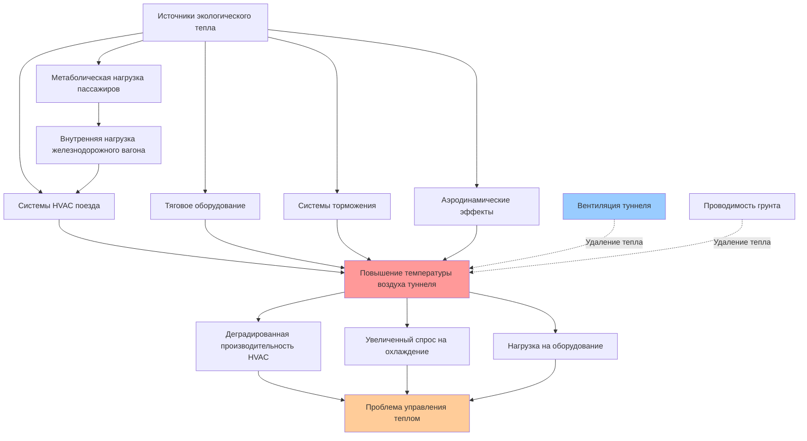

Подземные железнодорожные среды представляют экстремальные тепловые условия, которые принципиально отличаются от приложений наземного транзита. Температура окружающей среды туннеля обычно превышает условия наружного воздуха на 8-17°C, создавая враждебные рабочие среды для оборудования HVAC, одновременно увеличивая требования к охлаждению. Замкнутое пространство, кумулятивное накопление тепла от нескольких поездов, отпущенное тепло от тягового оборудования и аэродинамические явления объединяются для создания сложных требований по управлению теплом.

## Механизмы повышения температуры туннеля

Множество одновременно действующих источников тепла способствуют повышению температуры туннеля выше уровня земной поверхности.

**Отпуск тепла поездом**

Каждый работающий поезд выбрасывает существенную тепловую энергию в инфраструктуру туннеля через работу конденсатора HVAC, охлаждение тягового оборудования и рассеивание тормозов. Совокупное нагревание туннеля при прохождении одного поезда:

$$Q_{train} = Q_{HVAC} + Q_{traction} + Q_{braking} + Q_{auxiliary}$$

Где:
- $Q_{HVAC}$ = Отпуск тепла кондиционированием воздуха (127-148 кДж/с на вагон)
- $Q_{traction}$ = Охлаждение тягового двигателя и инвертора (26-42 кДж/с на вагон)
- $Q_{braking}$ = Рассеивание динамических и фрикционных тормозов (переменное, 53-212 кДж/с во время событий торможения)
- $Q_{auxiliary}$ = Освещение, системы управления и вспомогательные системы (3,2-5,3 кДж/с на вагон)

Для 10-вагонного поезда, работающего непрерывно, общее отпускание тепла достигает 1,6-2,1 ГДж/ч (442-593 кВт).

**Равновесие температуры туннеля**

Температура воздуха туннеля стабилизируется, когда добавление тепла равно удалению тепла через вентиляцию и проводимость в окружающую землю. Квазиустановившаяся температура туннеля:

$$T_{tunnel} = T_{ambient} + \frac{\sum Q_{sources}}{\.{m}_{vent} \times c_p}$$

Где:
- $T_{ambient}$ = Температура наружного воздуха (°C)
- $\sum Q_{sources}$ = Общая скорость добавления тепла (кДж/ч)
- $\.{m}_{vent}$ = Расходомер вентиляционного воздуха по массе (кг/ч)
- $c_p$ = Удельная теплоемкость воздуха (1,004 кДж/кг·°C)

Недостаточная вентиляция туннеля позволяет температуре непрерывно повышаться во время рабочих часов. Глубокие туннели с минимальной естественной вентиляцией могут достигать 40-46°C в периоды пиковой работы, создавая тепловой штраф, который снижает производительность системы HVAC именно тогда, когда требуется максимальная мощность.

## Поршневой эффект и аэродинамическое нагревание

Движение поезда через замкнутые сечения туннеля создает значительное движение воздуха и аэродинамическое нагревание через поршневой эффект.

**Основы поршневого эффекта**

Движущийся поезд вытесняет объем воздуха приблизительно равный его площади поперечного сечения, умноженной на скорость. В замкнутых туннелях это вытесняемый воздух должен ускориться вокруг и мимо поезда, создавая:

1. **Движение воздуха вперед** впереди поезда (40-60% скорости поезда)
2. **Обратный поток** вдоль сторон поезда и над/под поездом
3. **Турбулентность в следе** позади поезда

Объемный расход воздуха, индуцируемый поршневым эффектом:

$$Q_{piston} = A_{train} \times V_{train} \times \eta_{displacement}$$

Где:
- $A_{train}$ = Площадь поперечного сечения поезда (обычно 8,4-11,1 м²)
- $V_{train}$ = Скорость поезда (м/мин)
- $\eta_{displacement}$ = Эффективность вытеснения (0,4-0,7 в зависимости от отношения площадей туннеля к поезду)

Для поезда, движущегося со скоростью 72 км/ч (1206 м/мин) с площадью поперечного сечения 9,3 м² в туннеле с эффективностью вытеснения 60%, индуцируемый расход воздуха составляет 6,77 м³/ч (4,0 м³/с или 6748 CFM).

**Аэродинамическое нагревание**

Сжатие воздуха впереди движущегося поезда и трение вдоль поверхностей поезда/туннеля преобразует кинетическую энергию в тепловую энергию. Повышение температуры от аэродинамического сжатия:

$$\Delta T_{aero} = \frac{V^2}{2 \times c_p \times J}$$

Где:
- $V$ = Скорость воздуха относительно поезда (м/с)
- $c_p$ = Удельная теплоемкость (1,004 кДж/кг·°C)
- $J$ = Механический эквивалент тепла (1 кДж = 1 кДж)

При 72 км/ч (20 м/с), аэродинамическое сжатие производит повышение температуры примерно на 0,2°C в вытесняемом воздухе. Хотя скромно на один поезд, этот эффект усугубляется несколькими поездами и способствует общему нагреванию туннеля.

## Условия проектирования по конфигурации туннеля

Параметры проектирования туннеля существенно влияют на условия окружающей среды и требования к системе HVAC.

| Тип туннеля | Типичный диапазон окружающей среды | Пиковая температура | Стратегия вентиляции | Мощность удаления тепла |
|-------------|----------------------------------|------------------|----------------------|----------------------|
| **Неглубокий открытый туннель** | 29-38°C | 40°C | Естественная + механические шахты | 60-80% тепловой нагрузки |
| **Пробитый глубокий туннель** | 32-43°C | 46°C | Принудительная механическая вентиляция | 40-60% тепловой нагрузки |
| **Зоны станций** | 27-35°C | 38°C | Системы вентиляции станций | 70-90% тепловой нагрузки |
| **Подводный туннель** | 24-32°C | 35°C | Механическая вентиляция только | 50-70% тепловой нагрузки |
| **Горный туннель** | 29-40°C | 43°C | Вентиляция портала + шахты | 50-70% тепловой нагрузки |

**Влияние коэффициента блокировки туннеля/поезда**

| Коэффициент блокировки (A_train/A_tunnel) | Эффективность поршневого эффекта | Скорость воздуха мимо поезда | Повышение давления |
|-----------------------------------|--------------------------|------------------------|---------------|
| 0,30-0,40 | 40-50% | 29-35 км/ч | 0,3-0,7 кПа |
| 0,40-0,50 | 50-60% | 35-44 км/ч | 0,7-1,0 кПа |
| 0,50-0,60 | 60-70% | 44-51 км/ч | 1,0-1,7 кПа |
| 0,60-0,70 | 70-80% | 51-58 км/ч | 1,7-2,8 кПа |

Более высокие коэффициенты блокировки увеличивают эффективность поршневого эффекта, но также повышают аэродинамическое сопротивление и потребление энергии.

## Проблемы контроля влажности

Подземные среды обычно характеризуются высокой относительной влажностью из-за инфильтрации грунтовых вод, ограниченного воздухообмена и постоянного поступления влаги от пассажиров и оборудования.

**Источники влаги**

- **Потоотделение пассажиров**: 0,23-0,36 кг/ч на человека при сидячей активности
- **Фильтрация грунтовых вод**: 4,5-45 кг/ч на 304 м туннеля в зависимости от качества строительства
- **Конденсат оборудования**: Если не осушен должным образом, вновь испаряется в воздух туннеля
- **Операции очистки станций**: Значительное поступление влаги в часы неработы

**Ограничения осушения**

Системы HVAC вагонов метро обеспечивают определенную мощность скрытого охлаждения, но влажность воздуха туннеля не может быть эффективно контролирована только системами транспортных средств. Когда точка росы воздуха туннеля превышает 18-21°C, индивидуальное осушение вагона становится нецелесообразным из-за чрезмерной скрытой нагрузки. Требование скрытого охлаждения:

$$Q_{latent} = \.{m}_{air} \times \Delta W \times h_{fg}$$

Где:
- $\.{m}_{air}$ = Расход воздуха по массе (кг/ч)
- $\Delta W$ = Снижение отношения влажности (кг влаги/кг сухого воздуха)
- $h_{fg}$ = Скрытая теплота испарения (2,450 кДж/кг в типичных условиях)

Для входного наружного воздуха 708 л/мин (приблизительно 3058 кг/ч) со снижением отношения влажности с 0,016 до 0,010 (приблизительно 23°C, 70% ОВ до 24°C, 50% ОВ), скрытая нагрузка составляет 44,9 кВт, потребляя значительную мощность охлаждения.

**Управление влажностью на уровне туннеля**

Эффективный контроль влажности требует вмешательства на уровне инфраструктуры:

- **Механическое осушение** на станциях вентиляции туннеля
- **Системы дренажа грунтовых вод** для перехвата инфильтрации до контакта с воздухом
- **Воздухообмен** с наружным воздухом в благоприятных условиях
- **HVAC платформы станций** для кондиционирования воздуха, входящего в туннели

## Стандарты окружающей среды в метро

Множество стандартов регулируют приемлемые условия окружающей среды при эксплуатации метро.

**Руководящие принципы ASHRAE для окружающей среды метро**

Исследовательские проекты ASHRAE и Справочник проектирования окружающей среды метро устанавливают рекомендуемые условия:

- **Температура платформы**: максимум 26-28°C во время летних условий проектирования
- **Температура туннеля**: не должна превышать 38°C при нормальных условиях эксплуатации
- **Относительная влажность**: максимум 60% на платформах; влажность туннеля неконтролируемая
- **Скорость воздуха**: максимум 0,25-0,30 м/с на платформах от поршневого эффекта
- **Концентрация CO₂**: ниже 1000 частей на миллион на платформах и в транспортных средствах

**IEEE 1635 - Стандарт HVAC железнодорожного транзита**

Определяет производительность HVAC транспортного средства при определенных условиях окружающей среды туннеля:

- **Условие проектирования 1**: 35°C окружающая среда туннеля, 50% ОВ
- **Условие проектирования 2**: 40°C окружающая среда туннеля, 40% ОВ
- **Экстремальное условие**: 46°C окружающая среда туннеля, 30% ОВ

Системы должны поддерживать внутреннюю температуру 24°C ± 1,7°C при условиях проектирования с указанной загрузкой пассажиров.

**NFPA 130 - Системы фиксированного направления и железнодорожные системы пассажирского транзита**

Устраняет требования к аварийной вентиляции:

- **Контроль дыма**: Способность контролировать движение дыма в сценариях пожара
- **Пригодные условия**: Поддерживать дыхаемое качество воздуха во время аварийной эвакуации
- **Мощность вентиляции**: Достаточный расход воздуха для управления событием пожара 30 МВт в критических участках туннеля

## Сезонные изменения и суточные циклы

Температуры туннелей демонстрируют как сезонные, так и суточные паттерны изменения, хотя и с значительной тепловой инертностью по сравнению с условиями на поверхности.

**Летние пиковые условия**

Температуры туннеля достигают годового максимума спустя 2-4 недели после пиковых наружных температур из-за тепловой массы окружающей земли. Максимальная температура туннеля обычно возникает в конце августа или начале сентября даже если пиковая наружная температура произошла в июле. Эта тепловая инертность должна учитываться при планировании ежегодного технического обслуживания.

**Зимняя эксплуатация**

Неглубокие туннели могут приближаться к наружной температуре в течение продолжительных холодных периодов, требуя отопления, а не охлаждения. Глубокие туннели поддерживают 16-24°C в течение года из-за геотермального эффекта и изоляции от сезонных колебаний температуры. Эффективная температура туннеля в зимний период:

$$T_{tunnel,winter} = T_{ground} + \frac{Q_{trains}}{UA_{tunnel} + \.{m}_{vent} c_p}$$

Где $T_{ground}$ представляет невозмущенную температуру земли на глубине туннеля (обычно 10-16°C).

**Суточный цикл**

В рабочие часы температура туннеля повышается на 3-8°C из-за накопления тепла. Ночное отключение позволяет частичное охлаждение через:

- Естественную конвекцию и вентиляцию
- Проводимость к стенкам туннеля и окружающей земле
- Снижение тепловвода от деятельности станций

Это суточное колебание температуры требует разработки систем HVAC для условий конца дня обслуживания, когда температура туннеля достигает пика, а не для средних суточных условий.

## Эффекты термической стратификации

Термическая стратификация развивается вертикально в зонах станций и вдоль градиентов туннеля, создавая неоднородные тепловые среды.

**Вертикальная стратификация**

Тепло естественно поднимается, создавая повышенные температуры на уровне потолка платформы в сравнении с уровнем пути. Разница температур может достичь 5,6-8,3°C между полом и потолком в плохо перемешанных объемах станций. Эта стратификация:

- Концентрирует горячий воздух рядом с крышами поездов, увеличивая температуру входа конденсатора
- Создает неудобные условия для стоящих пассажиров
- Снижает эффективность потолочных систем вентиляции
- Требует вентиляторов дестратификации или стратегий смешивания в глубоких станциях

**Продольные градиенты**

Температура туннеля увеличивается по маршруту обслуживания по мере того, как каждая станция и промежуточная секция накапливают тепло. Повышение температуры 0,3-1,2°C на километр длины туннеля является обычным при сильно используемых маршрутах в периоды пиков.

Кумулятивный характер нагревания туннеля создает положительный цикл обратной связи, где повышенная температура туннеля снижает эффективность HVAC, увеличивая отпуск тепла, что дополнительно повышает температуру туннеля. Прерывание этого цикла требует существенной инфраструктуры вентиляции туннеля, работающей непрерывно в течение рабочих часов.

Понимание и точное предсказание условий окружающей среды в метро имеют существенное значение для надлежащего проектирования системы HVAC, выбора мощности и эксплуатационных стратегий, которые поддерживают комфорт пассажиров в этих уникально сложных подземных транзитных средах.
