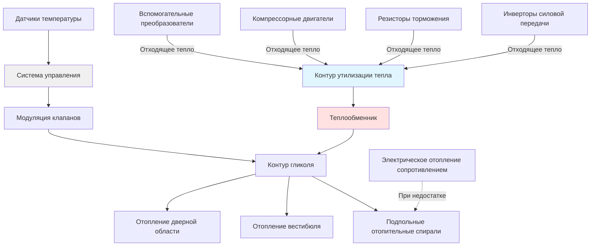

Системы отопления вагонов метро должны обеспечивать надежный тепловой комфорт во время зимних операций при работе от высоковольтных источников постоянного тока, выдерживая экстремальные вибрации и минимизируя энергопотребление. В отличие от охладительных систем, сталкивающихся с проблемами теплоотвода в замкнутых туннелях, отопительные системы извлекают пользу из тепловой инерции подземной инфраструктуры, которая смягчает зимние температурные экстремумы. Тем не менее, участки с наземной прокладкой, платформы станций и вестибюли требуют существенной отопительной мощности для обеспечения комфорта пассажиров.

## Расчеты теплоловых нагрузок

Зимняя теплоловая нагрузка вагона метро включает теплопередачу через оболочку транспортного средства, холодный воздух, проникающий через дверные проемы, и требования к нагреву вентиляционного воздуха.

**Теплопотери через оболочку**

Тепловые потери через стены, пол, крышу и окна следуют фундаментальному уравнению теплопроводности:

$$Q_{cond} = U \times A \times (T_{interior} - T_{ambient})$$

Для стандартного вагона метро длиной 23 м со следующими характеристиками:

| Поверхность | Площадь (м²) | U-значение (Вт/м²·°C) | ΔT (°C) | Тепловые потери (кВт) |
|-------------|--------------|----------------------|---------|----------------------|
| Стены | 167 | 1.59 | 50 | 13.3 |
| Крыша | 84 | 1.42 | 53 | 6.3 |
| Пол | 74 | 1.70 | 42 | 5.3 |
| Окна | 37 | 2.55 | 50 | 4.7 |
| **Итого** | **362** | - | - | **29.6** |

*Условия проектирования: -29°C снаружи, 21°C внутри*

**Тепловая нагрузка инфильтрации**

Дверные проемы на остановках станций вводят огромное количество холодного воздуха. Каждый цикл двери обменивает примерно 1,4-2,3 м³ внутреннего воздуха на воздух платформы. Для вагона с четырьмя дверными проемами, выполняющих 25 остановок в час:

$$Q_{inf} = \rho \times c_p \times V \times n \times (T_{interior} - T_{platform})$$

Где:
- ρ = плотность воздуха = 1.2 кг/м³
- c_p = удельная теплоемкость = 1.005 кДж/кг·°C
- V = объем на цикл двери = 1.7 м³
- n = циклы в час = 100 (4 двери × 25 остановок)
- ΔT = разность температур

При температуре платформы -6°C и внутренней температуре 21°C:

$$Q_{inf} = 1.2 \times 1.005 \times 1.7 \times 100 \times 27 = 5.5 \text{ кВт}$$

**Нагрев вентиляционного воздуха**

Требования к свежему воздуху согласно ASHRAE 62.1 и стандартам транзита указывают 3,4-4,7 л/(с·чел). Для 150 пассажиров при 3,8 л/с на каждого:

$$Q_{vent} = 1.2 \times 0.34 \times V \times (T_{interior} - T_{outdoor})$$

$$Q_{vent} = 1.2 \times 0.34 \times 0.57 \times (21 - (-29)) = 7.0 \text{ кВт}$$

**Общая тепловая нагрузка**

Объединение нагрузок оболочки, инфильтрации и вентиляции:

$$Q_{total} = Q_{cond} + Q_{inf} + Q_{vent} = 29.6 + 5.5 + 7.0 = 42.1 \text{ кВт}$$

Это требует примерно 42 кВт отопительной мощности для операций в экстремальном холодном климате.

## Системы электрического отопления сопротивлением

Электрическое отопление сопротивлением доминирует в приложениях метро благодаря простоте, надежности и совместимости с системами тяги постоянного тока.

**Подпольные отопительные элементы**

Подпольные нагреватели устанавливаются под напольным покрытием пассажирского отделения, обеспечивая лучистую и конвективную теплопередачу. Типичные конфигурации используют 10-15 кВт отопительных элементов, распределенных вдоль длины вагона. Работая от источников тяги 600-750 В постоянного тока, эти нагреватели достигают почти мгновенного реагирования через прямое резистивное преобразование:

$$P_{heating} = \frac{V^2}{R}$$

Для систем 600 В постоянного тока с сопротивлением 24 Ом на элемент:

$$P = \frac{600^2}{24} = 15,000 \text{ Вт} = 15.0 \text{ кВт}$$

**Потолочные электрические нагреватели**

Потолочные или боковые резистивные нагреватели обеспечивают дополнительное отопление и быструю возможность прогрева. Эти устройства обычно работают при 3-5 кВт на зону, с 4-6 зонами на вагон, позволяя независимое управление температурой. Устройства с принудительной циркуляцией воздуха улучшают распределение тепла, но добавляют механическую сложность и шум.

**Плинтусные нагреватели**

Расположенные вдоль стен под окнами, плинтусные нагреватели борются с холодными потоками воздуха вниз и обеспечивают локализованный комфорт. Работая при 1-2 кВт на секцию, эти устройства поддерживают тепло периметра без требования циркуляции принудительного воздуха.

## Системы тепловых насосов

Реверсивные системы отопления-охлаждения HVAC тепловые насосы обеспечивают как охлаждение, так и отопление от единого холодильного контура, предлагая улучшенную энергоэффективность по сравнению с отдельными системами.

**Коэффициент производительности**

Эффективность отопления теплового насоса значительно превышает электрическое отопление сопротивлением:

$$COP_{heating} = \frac{Q_{heating}}{W_{input}}$$

Современные транспортные тепловые насосы достигают COP 2,5-3,5 при умеренных наружных температурах, обеспечивая 2,5-3,5 кВт тепловой мощности на 1 кВт электрической входной мощности. Это представляет 250-350% эффективность по сравнению с теоретическими 100% электрического отопления сопротивлением.

**Ограничения эксплуатации**

Мощность и эффективность теплового насоса снижаются при уменьшении наружной температуры. Ниже примерно -7°C большинство систем требуют дополнительного отопления сопротивлением. Взаимосвязь между мощностью и температурой:

$$Q_{available} = Q_{rated} \times \left(1 - k \times (T_{rated} - T_{ambient})\right)$$

Где k представляет коэффициент деградации мощности (обычно 0,02-0,03 на °C).

**Циклы оттаивания**

При зимнем отоплении наружные змеевики накапливают иней, требующий периодических циклов оттаивания. Системы переключаются в режим охлаждения на 3-8 минут каждые 30-90 минут, временно снижая отопительную мощность. Управление оттаиванием по требованию контролирует дифференциал температуры змеевика для оптимизации частоты оттаивания.

## Системы утилизации тепла

Современные системы метро все чаще восстанавливают тепло от вспомогательного оборудования для уменьшения потребления энергии на отопление.

**Утилизация отходящего тепла инвертора**

Инверторы силовой передачи преобразуют 600-750 В постоянного тока в переменный ток переменной частоты для управления двигателем, с типичной эффективностью 95-97%. Для вагона метро, потребляющего 200 кВ при ускорении, потери инвертора достигают 6-10 кВт. Контуры жидкостного охлаждения извлекают это тепло для отопления пассажирского отделения.

**Утилизация тепла резистора торможения**

При рекуперативном торможении избыточная электрическая энергия рассеивается через сетки резисторов торможения. Хотя некоторые системы возвращают энергию в сеть тяги, сетки резисторов часто рассеивают 50-150 кВт при событиях торможения. Захват даже 30% этого прерывистого источника тепла обеспечивает 5-15 кВт в среднем за типичные циклы эксплуатации.

**Эффективность утилизации тепла**

Эффективность систем утилизации тепла:

$$\varepsilon = \frac{Q_{recovered}}{Q_{available}} = \frac{T_{fluid,out} - T_{fluid,in}}{T_{source} - T_{fluid,in}}$$

Хорошо спроектированные системы достигают эффективности 60-75%, восстанавливая существенную тепловую энергию, которая иначе требовала бы внешнего теплоотвода.

## Отопительная мощность по климатическим зонам

Транспортные агентства указывают отопительную мощность на основе местной суровости климата и профиля эксплуатации:

| Климатическая зона | Проектная температура (°C) | Мощность отопления (кВт/вагон) | Основная система | Резервная/дополнительная |
|-------------------|---------------------------|-------------------------------|------------------|-------------------------|
| Теплая (Майами, Лос-Анджелес) | 2 | 15-20 | Только тепловой насос | 5 кВт сопротивления |
| Умеренная (Сан-Франциско, Сиэтл) | -7 | 25-35 | Тепловой насос + утилизация | 15 кВт сопротивления |
| Холодная (Нью-Йорк, Чикаго) | -18 | 40-50 | Сопротивление + утилизация | Дополнение теплового насоса |
| Сильно холодная (Бостон, Торонто) | -23 | 55-70 | Основное сопротивление | Утилизация тепла |
| Экстремально холодная (Монреаль, Миннеаполис) | -29 | 65-85 | Основное сопротивление | Вся доступная утилизация |

**Критерии выбора системы**

Климатическая зона определяет оптимальную конфигурацию отопительной системы:

- **Теплые климаты**: Системы тепловых насосов обеспечивают адекватную мощность с минимальным резервным отоплением сопротивлением
- **Умеренные климаты**: Комбинированная система тепловой насос и утилизация тепла с дополнением сопротивлением
- **Холодные климаты**: Основное отопление сопротивлением с утилизацией тепла и дополнением теплового насоса
- **Экстремально холодные**: Максимальная мощность отопления сопротивлением со всей доступной утилизацией тепла

## Отопление вестибюлей и дверных областей

Вестибюльные области испытывают наиболее суровый тепловой стресс из-за прямого воздействия во время дверных проемов и сниженной изоляции у дверных механизмов.

**Требования к тепла в дверной области**

Отопление вестибюля обычно требует 150-200% мощности на квадратный метр по сравнению с основным пассажирским отделением. Выделенные резистивные нагреватели или системы теплых воздушных завес обеспечивают комфорт и предотвращают образование льда на дверных направляющих и порогах.

**Системы тепловых воздушных завес**

Высокоскоростные завесы из теплого воздуха через дверные проемы снижают потери инфильтрации во время стоянок на станциях. Работая при скорости 5-7,5 м/с и температуре на выходе 32-43°C, воздушные завесы создают тепловой барьер при минимизации холодных потоков воздуха, входящих в пассажирское пространство.

## Системы управления и оптимизация

Современные микропроцессорные системы управления оптимизируют работу отопительной системы через множество входов датчиков:

**Стратегия управления температурой**

Пропорционально-интегрально-дифференциальное (PID) управление поддерживает температуру установки при минимизации энергопотребления и термических циклов. Многозонные системы позволяют независимое управление:

- Кабина машиниста (20-22°C)
- Пассажирское отделение (21-23°C)
- Вестибюльные области (18-21°C)

**Предварительное прогнозирование нагрузки**

Продвинутые системы интегрируются с бортовыми компьютерами управления для предварительного прогнозирования требований к отоплению на основе:

- Топографии маршрута (подземные vs. наземные участки)
- Паттернов стоянок на станциях (частота открытия дверей)
- Предсказываемой загрузки пассажирами
- Прогнозов погоды

Это предсказательное управление предварительно кондиционирует пространства перед изменениями тепловой нагрузки, улучшая комфорт при снижении пиковой потребления энергии.

## Стандарты и спецификации

Системы отопления транзита должны соответствовать множеству промышленных стандартов:

- **IEEE 1635**: Стандарт вентиляции и теплового управления переменных экипажей постоянного тока
- **APTA PR-M-S-016**: Требования производительности для систем HVAC
- **NFPA 130**: Защита от пожара фиксированных транспортных систем
- **EN 14750**: Железнодорожные приложения - кондиционирование воздуха для городского и пригородного подвижного состава (европейский)

Требования надежности указывают среднее время между отказами (MTBF) превышающее 15 000 часов для систем отопления, с избыточными элементами обеспечивающими отсутствие полной потери отопления при единственном отказе.

Интеграция электрического отопления сопротивлением, технологии тепловых насосов и утилизации отходящего тепла создает эффективные, надежные системы отопления вагонов метро, способные поддерживать комфорт пассажиров во всем диапазоне условий эксплуатации транзита.
