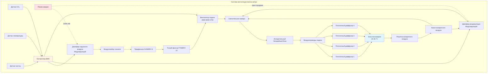

Системы вентиляции вагонов метро работают в самых сложных условиях среди всех приложений массового транзита. В отличие от наземных транспортных средств, которые забирают наружный воздух из чистых атмосферных источников, вагоны метро должны вентилироваться воздухом тоннеля, загрязненным тормозной пылью, частицами контакта колеса и рельса, дизельными выхлопами (в смешанных тоннелях) и накопленным теплом от работы поездов. Система вентиляции должна сбалансировать подачу свежего воздуха для здоровья пассажиров с требованиями фильтрации для предотвращения попадания частиц, сохраняя при этом тепловой комфорт в окружении, где температуры тоннеля обычно превышают 37 °C.

## Требования к свежему воздуху

Стандарты вентиляции транзита устанавливают минимальные скорости подачи наружного воздуха на основе загрузки пассажиров и продолжительности пребывания. ASHRAE Standard 62.1 и руководящие принципы APTA определяют обеспечение свежим воздухом для приложений метро.

**Скорость вентиляции на одного пассажира**

Фундаментальное уравнение вентиляции для вагонов метро:

$$Q_{oa} = N \times V_{pp} + A \times V_{area}$$

Где:
- $Q_{oa}$ = скорость потока наружного воздуха (CFM)
- $N$ = количество пассажиров
- $V_{pp}$ = скорость вентиляции на человека (CFM/чел.)
- $A$ = площадь пола вагона (м²)
- $V_{area}$ = скорость вентиляции по площади (CFM/м²)

Стандарты транзита обычно указывают 7–10 CFM (12–17 м³/ч) на одного пассажира для операций метро. Для стандартного вагона длиной 23 м с грузоподъемностью в условиях уплотнения 150 пассажиров:

$$Q_{oa} = 150 \times 10 = 1500 \text{ CFM (2540 м³/ч) минимум}$$

**Контроль концентрации CO₂**

Накопление диоксида углерода служит основным показателем адекватности вентиляции. Соотношение концентрации CO₂ в установившемся режиме:

$$C_{ss} = C_{oa} + \frac{G}{Q_{oa}}$$

Где:
- $C_{ss}$ = концентрация CO₂ в установившемся режиме (ppm)
- $C_{oa}$ = концентрация CO₂ в наружном воздухе (ppm)
- $G$ = скорость генерации CO₂ от пассажиров (CFM при концентрации CO₂)

Каждый пассажир вырабатывает примерно 0,3 CFM CO₂ при концентрации 1 000 000 ppm (100% CO₂). Для приемлемого качества внутреннего воздуха уровни CO₂ в вагонах метро не должны превышать 1000 ppm выше уровней на улице. При воздухе тоннеля на уровне 600–800 ppm CO₂ (повышенный от атмосферного уровня на улице 400 ppm из-за выхлопов поездов и замкнутости тоннеля):

$$Q_{oa} = \frac{N \times 0.3 \times 10^6}{1000} = \frac{150 \times 0.3 \times 10^6}{1000} = 45000 \text{ CFM (76300 м³/ч)}$$

Это теоретическое требование конфликтует с практическими ограничениями. Фактические системы нацелены на пиковый уровень CO₂ 1200–1500 ppm при уплотненной загрузке, полагаясь на время остановки станции для воздухообмена.

## Архитектура системы вентиляции

Вентиляция вагонов метро применяет несколько режимов работы для приспособления к различным условиям тоннеля, загрузке пассажиров и сценариям чрезвычайных ситуаций.

**Режимы работы вентиляции**

| Режим | Наружный воздух, % | Применение | Условия тоннеля | Скорость вентилятора |
|------|------------|-------------|-------------------|-----------|
| Максимальный свежий воздух | 100% | Остановка на станции, чрезвычайная ситуация | Воздух платформы < 29 °C | 100% |
| Нормальная вентиляция | 30–50% | Стандартная работа | Воздух тоннеля 29–38 °C | 75–100% |
| Минимальный свежий воздух | 15–20% | Экстремальная жара тоннеля | Воздух тоннеля > 38 °C | 60–80% |
| Рециркуляция | 0–10% | Пожар в тоннеле выше по течению | Загрязненный воздух тоннеля | 100% |
| Аварийная продувка | 100% | После инцидента | Очистка от дыма | 100% |

## Проблемы качества воздуха в тоннеле

Воздух тоннеля метро содержит несколько загрязнителей, которые отличают его от атмосферного воздуха на улице. Эффективная вентиляция должна решать как газообразные, так и твердые загрязнители.

**Состав твердых частиц**

Твердые частицы в тоннеле происходят в основном из механических источников, а не из сгорания (кроме дизельно-электрических систем). Анализ состава показывает:

| Источник частиц | Диапазон размеров | Массовая доля | Проблема со здоровьем |
|----------------|------------|---------------|----------------|
| Износ тормозов (железо, медь, барий) | 0,1–10 мкм | 35–45% | Раздражение дыхательных путей |
| Контакт колеса с рельсом (оксид железа) | 0,5–50 мкм | 25–35% | PM₁₀, PM₂.₅ |
| Пыль путепровода (кремнезем, минералы) | 1–100 мкм | 15–25% | Риск силикоза |
| Электрическая дуга (углерод, металлы) | 0,01–1 мкм | 5–10% | Ультратонкие частицы |
| Кожа, волокна одежды | 10–100 мкм | 5–10% | Аллергены |

Концентрация PM₁₀ в тоннелях часто достигает 200–500 мкг/м³ во время пиковых операций, в то время как уровни на улице в городах составляют 20–80 мкг/м³. Уровни PM₂.₅ в тоннелях составляют 100–300 мкг/м³, существенно превышая стандарты качества воздуха EPA.

**Газообразные загрязнители**

Помимо CO₂, воздух тоннеля содержит:

- **Озон (O₃)**: 10–40 ppb от электрической дуги (уровни на улице 20–60 ppb)
- **Оксиды азота (NOₓ)**: 50–200 ppb в дизельно-электрических тоннелях
- **Окись углерода (CO)**: 2–8 ppm при дизельной работе (< 1 ppm только электрические)
- **Летучие органические соединения (VOC)**: От смазочных материалов, чистящих средств, выделения материалами

## Системы фильтрации частиц

Фильтрация воздуха в вагоне метро должна удалять твердые частицы, сохраняя достаточный воздушный поток, несмотря на дополнительное падение давления, создаваемое фильтрами.

**Выбор и спецификация фильтра**

| Этап фильтрации | Класс фильтра | Эффективность | Размер частиц | Падение давления | Интервал замены |
|--------------|-------------|-----------|---------------|---------------|---------------------|
| Предфильтр | MERV 8 (G4) | 70–85% | > 3 мкм | 37–61 Па | 1000–1500 часов |
| Основной фильтр | MERV 13 (F7) | 85–95% | > 1 мкм | 85–122 Па | 1500–2500 часов |
| Тонкий фильтр (опционально) | MERV 14–15 (F8–F9) | > 95% | > 0,3 мкм | 122–195 Па | 2000–3000 часов |

Фильтрация MERV 13 обеспечивает оптимальный баланс между эффективностью захвата твердых частиц и пропускной способностью системы. Фильтры более высокой эффективности (MERV 15–16) снижают воздействие PM₂.₅ на 60–80%, но требуют увеличенных корпусов фильтров и более мощных вентиляторов для преодоления падения давления.

**Влияние падения давления фильтра**

Требуемая мощность вентилятора увеличивается с загрузкой фильтра:

$$P_{fan} = \frac{Q \times \Delta P_{total}}{6356 \times \eta_{fan}}$$

Где:
- $P_{fan}$ = мощность вентилятора (л.с.)
- $Q$ = скорость воздушного потока (CFM)
- $\Delta P_{total}$ = общее падение давления в системе (дюйм вод. ст.)
- $\eta_{fan}$ = КПД вентилятора (обычно 0,65–0,75)

Для вентилятора подачи 4500 CFM с падением давления чистого фильтра 0,40 дюйм вод. ст. и падением давления загруженного фильтра 0,85 дюйм вод. ст., увеличение мощности:

Чистый фильтр: $P_{fan} = \frac{4500 \times 0.40}{6356 \times 0.70} = 0.40$ л.с.

Загруженный фильтр: $P_{fan} = \frac{4500 \times 0.85}{6356 \times 0.70} = 0.86$ л.с.

Это увеличение мощности на 115% обосновывает системы мониторинга фильтра, которые отслеживают дифференциальное давление и информируют персонал обслуживания, когда требуется замена.

## Режимы аварийной вентиляции

Сценарии чрезвычайных ситуаций требуют немедленной переконфигурации системы вентиляции для защиты безопасности пассажиров во время пожаров в тоннелях, инцидентов с дымом или выбросов опасных материалов.

**Работа в режиме пожара**

При активации систем обнаружения пожара или ручного управления в чрезвычайных ситуациях:

1. **Демпферы наружного воздуха закрываются** для предотвращения попадания дыма из тоннеля
2. **Активируется режим рециркуляции** на 100% возвратного воздуха
3. **Вентиляторы подачи продолжают работу** для создания положительного давления внутри вагона относительно тоннеля
4. **Кондиционирование воздуха продолжается** для поддержания пригодных условий во время задержек эвакуации

Повышение давления внутри создает положительное давление 12–37 Па, предотвращая попадание дыма через уплотнения дверей и вентиляционные отверстия. Требуемый воздушный поток для повышения давления:

$$Q_{press} = \frac{A_{leak} \times \sqrt{\Delta P}}{\rho}$$

Поддержание положительного давления требует 380–710 м³/ч (800–1500 CFM) в зависимости от герметичности конструкции вагона и целостности уплотнений дверей.

**Режим продувки дыма**

После эвакуации или очистки дыма системой вентиляции тоннеля:

1. **Демпферы наружного воздуха открываются на 100%**
2. **Вентиляторы подачи работают на максимальной скорости**
3. **Активируются вентиляторы аварийного выброса** (если оборудованы)
4. **Демпферы возвратного воздуха модулируют** для создания сквозной вентиляции

Эта конфигурация достигает 20–30 воздухообменов в час, очищая остаточный дым за 5–10 минут.

## Стандарты скорости вентиляции и целевые показатели производительности

Транспортные агентства устанавливают спецификации производительности вентиляции на основе целей качества воздуха, требований к тепловому комфорту и соображений энергетической эффективности.

**Целевые показатели качества воздуха**

| Параметр | Максимальный лимит | Условие измерения | Стандартная ссылка |
|-----------|--------------|----------------------|-------------------|
| Концентрация CO₂ | 1200 ppm | Пиковая загрузка, работа тоннеля | ASHRAE 62.1 |
| Концентрация PM₁₀ | 150 мкг/м³ | Временно-взвешенное среднее за 8 часов | Рекомендации ВОЗ |
| Концентрация PM₂.₅ | 50 мкг/м³ | Временно-взвешенное среднее за 8 часов | EPA NAAQS |
| Температура | 26 °C макс. | Условия расчетного наружного воздуха | ASHRAE 55 |
| Относительная влажность | 65% макс. | Предел теплового комфорта | ASHRAE 55 |
| Скорость воздуха (зона занятости) | 0,25 м/с макс. | Предотвращение жалоб на сквозняки | ASHRAE 55 |

**Метрики производительности вентиляции**

| Метрика | Целевое значение | Применение |
|--------|-------------|------------|
| Воздухообмены в час (ACH) | 12–18 ACH | Нормальная работа |
| Доля свежего воздуха | 20–40% | Смешанный воздух тоннеля/рециркуляция |
| Объем подачи воздуха | 3500–5000 CFM (5950–8500 м³/ч) | На вагон длиной 23 м |
| Эффективность вентиляции | > 0,90 | Однородность распределения |
| Эффективность фильтра (PM₂.₅) | > 85% | MERV 13 минимум |

## Координация с системами вентиляции тоннеля

Вентиляция вагонов метро не работает независимо, но функционирует как один компонент в интегрированной системе контроля окружающей среды тоннеля. Вентиляторы тоннеля, системы выброса на станциях и оборудование аварийной дымоудаления коллективно управляют качеством воздуха в подземелье.

**Эффекты вентиляции тоннеля**

Большие вентиляторы тоннеля (мощность 235 000–950 000 м³/ч) создают объемный воздушный поток через тоннели метро со скоростью 150–360 м/мин. Этот воздушный поток в тоннеле:

- Поставляет наружный воздух на подземные станции
- Удаляет тепло, отклоняемое системами кондиционирования поездов
- Разбавляет накопление тормозной пыли и взвешенных частиц
- Обеспечивает аварийную дымоудаление во время пожаров в тоннелях

Движущиеся поезда создают поршневой воздушный поток, пропорциональный скорости поезда и площади поперечного сечения тоннеля. Поезд из 10 вагонов, движущийся со скоростью 64 км/ч в замкнутом тоннеле, генерирует примерно 380 000 м³/ч смещения воздуха. Этот воздушный поток либо дополняет, либо противодействует механической вентиляции тоннеля в зависимости от направления поезда и конфигурации системы.

**Обмен воздуха во время остановки на станции**

Во время 20–45 секундной остановки на станции двери открываются и происходит массивный воздухообмен между внутренним пространством вагона и платформой станции. Каждое открытие двери вводит 28–47 м³/ч (60–100 CFM) воздуха платформы через движение пассажиров и выравнивание давления. При 8–12 дверях на вагон общая инфильтрация через двери достигает 236–568 м³/ч (500–1200 CFM) во время остановки.

Если качество воздуха на платформе превышает условия внутри вагона (чище, прохладнее, менее загрязнено), эта инфильтрация обеспечивает полезную вентиляцию. Системы часто программируют демпферы наружного воздуха закрываться во время остановки на станции, позволяя естественному воздухообмену происходить через двери вместо энергоемкой механической вентиляции горячего воздуха тоннеля.

## Стратегии управления и мониторинг

Современные системы вентиляции метро применяют сложные алгоритмы управления, интегрирующие несколько входов датчиков для оптимизации качества воздуха при минимизации энергопотребления.

**Вентиляция, управляемая спросом**

Управление спросом на основе CO₂ модулирует положение демпфера наружного воздуха на основе измеренной концентрации:

$$\text{Положение демпфера НВ} = \frac{C_{измеренная} - C_{целевая}}{C_{макс.} - C_{целевая}} \times 100\%$$

Когда измеренная концентрация CO₂ превышает целевую уставку (обычно 1000 ppm), демпфер наружного воздуха открывается пошагово. Переопределение по температуре предотвращает чрезмерный забор наружного воздуха, когда температуры тоннеля превышают приемлемые пределы подачи воздуха.

**Мониторинг качества воздуха**

Системы непрерывного мониторинга отслеживают:

- Концентрацию CO₂ (датчики NDIR, точность ±50 ppm)
- Концентрацию PM₂.₅ (оптические счетчики частиц)
- Температуру и относительную влажность (несколько зон)
- Дифференциальное давление фильтра (магнитные манометры или датчики давления)

Логирование данных позволяет анализ тенденций, выявляющий закономерности деградации качества воздуха, скорости загрузки фильтра и производительность системы вентиляции во времени.

Интеграция защиты здоровья пассажиров, энергетической эффективности и надежности в работе делает вентиляцию вагонов метро одним из наиболее технически требовательных приложений HVAC. Успешные системы уравновешивают конкурирующие требования благодаря интеллектуальным стратегиям управления и надежной фильтрации, сохраняя тепловой комфорт в экстремальных подземных условиях.
