Системы вентиляции транспортных средств должны обеспечивать адекватный приток свежего воздуха для поддержания приемлемого качества воздуха в помещении при значительных колебаниях плотности пассажиров, частых открытиях дверей и быстрых изменениях нагрузки. Требования к вентиляции балансируют здоровье пассажиров, энергопотребление и ограничения мощности системы, уникальные для мобильных сред.

## Нормативно-правовая база и стандарты

Вентиляция транспортных средств регулируется несколькими взаимодополняющими стандартами, касающимися общественного здоровья, безопасности и комфорта пассажиров.

**Адаптация стандарта ASHRAE 62.1:**

Хотя ASHRAE 62.1 в первую очередь ориентирован на стационарные здания, транспортные агентства применяют его принципы к мобильным приложениям с модификациями с учетом операционной реальности. Процедура определения коэффициента вентиляции стандарта составляет основу специальных требований для транспорта.

**Требования Федеральной администрации транзита (FTA):**

- Минимальное количество наружного воздуха: 25.5 м³/ч (15 CFM) на пассажира при нормальных условиях эксплуатации
- Предел концентрации CO₂: 1000 ppm выше атмосферного уровня на улице при типичных сценариях нагрузки
- Режим аварийной вентиляции: Возможность подачи 100% наружного воздуха при дымлении или загрязнении
- Непрерывность вентиляции: Системы должны поддерживать минимальный приток свежего воздуха во всех режимах эксплуатации, включая холостой ход и низкоскоростную работу

**Стандарты APTA:**

Американская ассоциация общественного транспорта публикует рекомендуемую практику, которая дополняет нормативные минимумы:

- Подача свежего воздуха: 34-42.5 м³/ч (20-25 CFM) на пассажира для повышенного комфорта
- Коэффициент воздухообмена: Минимум 10-15 полных воздухообменов в час
- Фильтрация: Минимум MERV 8 для рециркулируемого воздуха, рекомендуется MERV 11-13
- Температурный градиент: Максимальное различие 2.8°C в пассажирском салоне

**Международные стандарты:**

Европейские стандарты EN 13129 и EN 14750 определяют классы комфорта на основе окружающих условий и устанавливают минимальную вентиляцию независимо от охлаждающей способности, обычно требуя 7-10 л/сек (25.5 м³/ч) на пассажира.

## Расчеты коэффициентов вентиляции

Требования к вентиляции транспортных средств зависят от вместимости пассажиров, объема салона и цикла эксплуатации.

### Метод расчета наружного воздуха на пассажира

Фундаментальное требование устанавливает минимальный приток свежего воздуха на основе занятости:

$$Q_{oa} = N_{pass} \times V_{pp} + Q_{infiltration}$$

Где:
- $Q_{oa}$ = общее требование наружного воздуха (м³/ч)
- $N_{pass}$ = количество пассажиров (чел.)
- $V_{pp}$ = коэффициент вентиляции на пассажира (м³/ч на чел.)
- $Q_{infiltration}$ = кредит инфильтрации от открытия дверей (м³/ч)

Стандартные значения $V_{pp}$:
- Нормативный минимум: 25.5 м³/ч на чел.
- Рекомендуемая практика: 34 м³/ч на чел.
- Премиум-сервис: 42.5-51 м³/ч на чел.

### Метод коэффициента воздухообмена в час

Альтернативный подход устанавливает объемный воздухообмен независимо от мгновенной занятости:

$$ACH = \frac{Q_{oa} \times 60}{V_{interior}}$$

Где:
- $ACH$ = воздухообмен в час (ч⁻¹)
- $Q_{oa}$ = коэффициент наружного воздуха (м³/ч)
- $V_{interior}$ = внутренний объем салона (м³)

Целевые значения ACH по типам транспортных средств:

| Тип транспорта | Внутренний объем | Минимум ACH | Рекомендуемый ACH |
|---|---|---|---|
| Стандартный автобус (12 м) | 79-91 м³ | 8-10 | 12-15 |
| Сочлененный автобус (18 м) | 119-136 м³ | 8-10 | 12-15 |
| Легкорельсовый вагон | 99-119 м³ | 10-12 | 14-18 |
| Вагон метро | 91-108 м³ | 10-12 | 15-20 |
| Пригородный железнодорожный транспорт | 127-156 м³ | 8-10 | 12-16 |

### Вентиляция, контролируемая по CO₂

Вентиляция по требованию регулирует приток наружного воздуха на основе измеренной концентрации CO₂ как показателя занятости и качества воздуха:

$$Q_{oa} = \frac{N \times G_{co2}}{\rho_{air} \times (C_{interior} - C_{ambient}) \times 10^6}$$

Где:
- $N$ = количество людей
- $G_{co2}$ = коэффициент выделения CO₂ на человека (0.012 м³/ч при умеренной активности)
- $\rho_{air}$ = плотность воздуха (1.2 кг/м³ при стандартных условиях)
- $C_{interior}$ = целевая концентрация CO₂ в помещении (ppm)
- $C_{ambient}$ = концентрация CO₂ на улице (обычно 400-450 ppm)

Для целевого предела 1000 ppm выше атмосферного (1400-1450 ppm всего):

$$Q_{oa} = N \times 25.5 \text{ м³/ч на чел.}$$

Это выведение подтверждает нормативный минимум 25.5 м³/ч на чел.

## Коэффициенты вентиляции по видам транспорта

Различные применения в транспорте требуют различных стратегий вентиляции на основе плотности пассажиров, времени стоянки и операционных схем.

| Вид транспорта | Вместимость пассажиров | Максимальная нагрузка | Мин. наружный воздух (м³/ч) | Рекомендуемый наружный воздух (м³/ч) | Целевое ACH |
|---|---|---|---|---|---|
| Городской автобус | 35-45 сидячих, 20-30 стоящих | 75 | 1 910 | 2 550 | 12-15 |
| Экспресс-автобус | 55-60 сидячих | 60 | 1 530 | 2 040 | 10-12 |
| Сочлененный автобус | 50-60 сидячих, 40-60 стоящих | 120 | 3 060 | 4 080 | 12-15 |
| Легкорельсовый вагон | 60-80 сидячих, 80-120 стоящих | 200 | 5 100 | 6 800 | 14-18 |
| Вагон метро | 40-50 сидячих, 100-150 стоящих | 200 | 5 100 | 6 800 | 15-20 |
| Пригородный железнодорожный транспорт | 90-110 сидячих, 20-40 стоящих | 130 | 3 320 | 4 420 | 12-16 |

## Критерии качества воздуха

Системы вентиляции должны поддерживать допустимые концентрации ключевых параметров качества воздуха.

**Пределы двуокиси углерода:**

CO₂ служит основным показателем адекватности вентиляции:

- Целевая концентрация: 1000 ppm выше наружного уровня
- Максимально допустимая: 1500 ppm выше наружного уровня (2000 ppm всего в городской среде)
- Место измерения: На уровне дыхания (122-152 см) в середине салона
- Время отклика: Вентиляция должна снизить повышенный CO₂ до целевого значения в течение 10 минут после снижения нагрузки пассажиров

**Взвешенные твердые частицы:**

- PM₂.₅: Поддерживать ниже 35 мкг/м³, когда позволяют наружные уровни
- PM₁₀: Поддерживать ниже 150 мкг/м³
- Эффективность фильтрации: Минимум 35% улавливания (MERV 8), рекомендуется 50-65% (MERV 11-13)

**Летучие органические соединения:**

Материалы в интерьере способствуют выделению летучих органических соединений, особенно в новых транспортных средствах:

- Общие летучие органические соединения (TVOC): Целевое значение ниже 500 мкг/м³
- Формальдегид: Максимум 50 ppb
- Разбавление свежим воздухом обеспечивает основную стратегию контроля

**Температура и влажность:**

Хотя это не совсем параметры вентиляции, тепловой комфорт напрямую связан с распределением воздуха:

- Температурный диапазон: 20-24°C при проектных условиях
- Относительная влажность: 30-60%, когда позволяют наружные условия
- Вертикальный температурный градиент: Максимум 2.8°C от пола к потолку

## Архитектура системы и распределение воздуха

Системы вентиляции транспорта интегрируют подачу свежего воздуха с функциями отопления и охлаждения через различные конфигурации.

```mermaid
graph TB
    subgraph "Система вентиляции транспортного средства"
        OA[Забор наружного воздуха<br/>Переменное положение<br/>Фильтровано MERV 8-13]
        RA[Возвратный воздух<br/>Из салона пассажиров]
        MIX[Смесительная камера<br/>Управление заслонкой]
        FILTER[Фильтр рециркуляции<br/>MERV 11-13]
        EVAP[Испаритель<br/>Охлаждение и осушение]
        HEAT[Нагревательный змеевик<br/>Электрический или водяной]
        FAN[Вентилятор подачи<br/>Переменная скорость 1 360-3 400 м³/ч]
        DIST[Воздуховоды распределения<br/>Потолочные или подпольные]
        DIFF[Диффузоры подачи<br/>Линейные или круглые]
        CABIN[Салон пассажиров<br/>79-156 м³]
        CO2[Датчики CO₂<br/>3-4 на транспортное средство]
        CTRL[Контроллер вентиляции<br/>BACnet/LonWorks]
        DOOR[Вход состояния двери]
        PASS[Счетчик пассажиров]

        OA --> MIX
        RA --> MIX
        MIX --> FILTER
        FILTER --> EVAP
        EVAP --> HEAT
        HEAT --> FAN
        FAN --> DIST
        DIST --> DIFF
        DIFF --> CABIN
        CABIN --> RA

        CO2 -.->|Обратная связь| CTRL
        DOOR -.->|Состояние| CTRL
        PASS -.->|Счет| CTRL
        CTRL -.->|Положение заслонки| MIX
        CTRL -.->|Скорость вентилятора| FAN
    end

    style OA fill:#e1f5ff
    style CABIN fill:#fff4e1
    style CTRL fill:#f0e1ff
    style CO2 fill:#ffe1e1
```

**Расположение забора свежего воздуха:**

- Автобусы: Забор на крыше впереди блока HVAC, чтобы избежать загрязнения дизельными выхлопами
- Вагоны метро: Подпольный забор с туннельной фильтрацией воздуха
- Легкорельсовый транспорт: Забор на крыше или сбоку в зависимости от конфигурации платформы
- Скорость на входе: 1.5-2.5 м/сек для предотвращения попадания дождя при обеспечении адекватного потока

**Работа экономайзера:**

Современные системы HVAC транспорта используют воздушные экономайзеры для снижения механического охлаждения:

- Управление на основе энтальпии: Сравнение энтальпии наружного воздуха и возвратного воздуха
- Управление на основе температуры: Увеличение наружного воздуха при $T_{outdoor} < T_{return} - 2.8°C$
- Режим максимального наружного воздуха: 80-100% при благоприятных условиях
- Блокировка: Предотвращение работы экономайзера, когда температура наружного воздуха превышает 18-21°C или влажность превышает 70% ОВ

**Вентиляция, контролируемая по требованию:**

DCV на основе CO₂ регулирует положение заслонки наружного воздуха:

$$D_{position} = D_{min} + \frac{(CO_2 - CO_{2,min}) \times (D_{max} - D_{min})}{(CO_{2,max} - CO_{2,min})}$$

Где:
- $D_{position}$ = положение заслонки (% открыто)
- $D_{min}$ = минимальное положение заслонки (обычно 20-30%)
- $D_{max}$ = максимальное положение заслонки (обычно 80-100%)
- $CO_{2,min}$ = уставка (обычно 800-1000 ppm)
- $CO_{2,max}$ = верхний предел (обычно 1200-1500 ppm)

## Сценарии загрузки пассажирами

Вентиляция транспорта должна соответствовать экстремальным колебаниям занятости между внепиковым и часами пик.

**Условия проектной загрузки:**

| Сценарий | Уровень занятости | Продолжительность | Стратегия вентиляции |
|---|---|---|---|
| Внепиковое время | 10-20% мощности | 40-60% часов обслуживания | Сниженный наружный воздух, приоритет экономайзера |
| Нормальное | 40-60% мощности | 25-35% часов обслуживания | Стандартные коэффициенты вентиляции |
| Пиковое | 80-100% мощности | 10-15% часов обслуживания | Максимальный наружный воздух, сниженная рециркуляция |
| Предельное | 120-150% мощности | <5% часов обслуживания | 100% наружный воздух, если позволяет мощность |

**Влияние открытия дверей:**

Частые остановки на станциях создают значительную инфильтрацию, которая может учитываться при требованиях вентиляции:

$$Q_{door} = A_{door} \times V_{air} \times t_{open} \times f_{stops}$$

Где:
- $A_{door}$ = площадь проема двери (обычно 1.9-3.3 м² на пару дверей)
- $V_{air}$ = скорость воздуха через проем (0.5-1.5 м/сек в зависимости от давления в транспортном средстве)
- $t_{open}$ = среднее время стоянки (15-45 сек)
- $f_{stops}$ = частота остановок (остановки/ч)

Для типичного автобуса с 2 парами дверей, 30-секундной стоянкой и 20 остановками/ч:

$$Q_{door} = 1.9 \text{ м}^2 \times 1 \text{ м/сек} \times 0.5 \text{ мин} \times 20 = 19 \text{ м}^3\text{/мин} = 1 140 \text{ м³/ч в среднем}$$

Эта инфильтрация обеспечивает значительный наружный воздух, хотя ее вклад прерывистый и неконтролируемый. Консервативные проекты учитывают только 30-50% рассчитанной инфильтрации при требованиях вентиляции.

## Требования к фильтрации

Фильтрация транспортных средств балансирует улучшение качества воздуха с сопротивлением потоку воздуха и обслуживанием.

**Минимальные стандарты:**

- Забор наружного воздуха: MERV 8 (35% улавливания)
- Воздух рециркуляции: MERV 8-11 (35-65% эффективность)
- Интервал замены фильтра: 3-6 месяцев или по датчику перепада давления

**Усиленная фильтрация:**

Системы с высокой пропускной способностью пассажиров все чаще указывают фильтрацию MERV 13 или HEPA:

- MERV 13: 50% эффективность при 0.3-1.0 мкм, эффективна для большинства частиц
- MERV 14-15: 75-90% эффективность при 0.3-1.0 мкм
- HEPA (H13): 99.95% при 0.3 мкм, используется в приложениях борьбы с пандемией

Соображения по падению давления:

| Тип фильтра | Начальное ΔP | Финальное ΔP (замена) | Влияние на поток воздуха |
|---|---|---|---|
| MERV 8 | 37-62 Па | 123-147 Па | Минимальное (<5%) |
| MERV 11 | 62-86 Па | 172-221 Па | Умеренное (5-10%) |
| MERV 13 | 98-135 Па | 245-320 Па | Значительное (10-15%) |
| HEPA | 196-294 Па | 490-613 Па | Тяжелое (20-30%) |

Высокоэффективная фильтрация требует увеличения размера двигателя вентилятора или привода с переменной скоростью для поддержания проектного воздушного потока на протяжении всего срока службы фильтра.

## Проверка производительности и испытания

Приемочное испытание транспортного средства включает проверку производительности вентиляции.

**Измерение воздушного потока:**

- Общий воздушный поток подачи: Траверс на выходе воздуховода подачи или вентилятора
- Доля наружного воздуха: Тест затухания CO₂ или разбавление газ-трассер
- Равномерность распределения: Измерения скорости в 8-12 местах диффузоров
- Критерии приемки: ±10% проектного потока воздуха, ±15% вариация от диффузора к диффузору

**Протокол испытания CO₂:**

1. Загрузить транспортное средство до проектной занятости с использованием симуляторов метаболизма (тепловые лампы) или тестовых пассажиров
2. Работать при минимальном наружном воздухе до стабилизации CO₂ на повышенном уровне (>1500 ppm)
3. Вернуться в нормальный режим вентиляции и записать затухание CO₂
4. Рассчитать эффективный коэффициент вентиляции по кривой затухания:

$$Q_{oa} = \frac{V \times ln\left(\frac{C_1 - C_{amb}}{C_2 - C_{amb}}\right)}{t_2 - t_1} \times 60$$

Где $V$ - объем салона, $C_1$ и $C_2$ - концентрации в момент времени $t_1$ и $t_2$.

**Проверка теплового комфорта:**

При условиях проектной нагрузки (максимальная занятость, максимальная окружающая температура):
- Измерить температуру сухого термометра в 15-20 местах в пассажирском пространстве
- Записать относительную влажность в 4-6 местах
- Проверить, что все измерения находятся в пределах указанного диапазона комфорта
- Документировать время снижения температуры с перегретого состояния

Требования к вентиляции транспортных средств общественного транспорта обеспечивают здоровье и комфорт пассажиров посредством предписывающих минимальных коэффициентов наружного воздуха, пределов качества воздуха и стандартов фильтрации. Надлежащее проектирование системы учитывает экстремальные колебания занятости, интеграцию с тепловым контролем и проблемы мобильной среды для обеспечения надежной работы при всех условиях эксплуатации.
