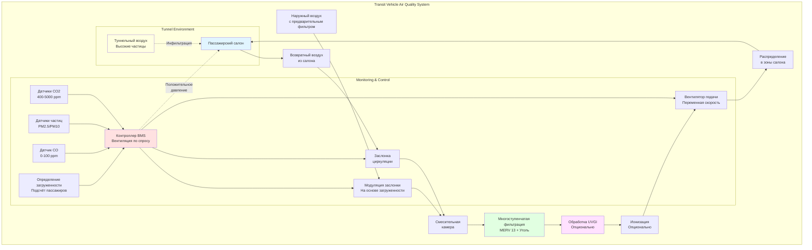

Контроль качества воздуха в транспортных средствах общественного транспорта представляет уникальные проблемы из-за высокой плотности пассажиров, переменных скоростей вентиляции, работы в туннелях и необходимости балансировки комфорта пассажиров с энергоэффективностью. Эффективное управление качеством воздуха требует непрерывного мониторинга, надлежащей фильтрации и оптимизированных стратегий вентиляции.

## Мониторинг CO2 и загрязняющих веществ

Мониторинг диоксида углерода служит основным индикатором эффективности вентиляции в транспортных средствах. Взаимосвязь между концентрацией CO2 и подачей наружного воздуха соответствует уравнению стационарного массового баланса:

$$C_{ss} = C_o + \frac{N \cdot G}{Q}$$

где $C_{ss}$ — стационарная концентрация CO2 (ppm), $C_o$ — концентрация CO2 на улице (обычно 400-450 ppm), $N$ — количество пассажиров, $G$ — скорость генерации CO2 на человека (0,3-0,5 CFM CO2 на уровне моря), и $Q$ — скорость вентиляции наружным воздухом (CFM).

Для полностью загруженного вагона метро с 150 пассажирами и 750 CFM наружного воздуха:

$$C_{ss} = 400 + \frac{150 \times 0,4}{750} = 400 + 80 = 480 \text{ ppm}$$

Системы общественного транспорта мониторят дополнительные загрязняющие вещества, включая:

- **Твёрдые частицы (PM2.5, PM10)**: критичны в туннельной среде, где накапливаются дизельные частицы и пыль тормозов
- **Летучие органические соединения (VOC)**: из материалов, чистящих средств и пассажиров
- **Моноксид углерода (CO)**: особенно важен для дизельных автобусов и подземных операций
- **Оксиды азота (NOx)**: из дизельных двигателей и процессов сгорания
- **Озон (O3)**: может проникать из наружного воздуха в зонах с высоким уровнем загрязнения

Системы мониторинга в реальном времени позволяют динамический контроль вентиляции, увеличивая подачу наружного воздуха при превышении пороговых уровней загрязняющих веществ.

## Требования к фильтрации частиц

Транспортные средства общественного транспорта требуют надёжной фильтрации для защиты пассажиров от наружных и туннельных частиц. Эффективность фильтрации прямо влияет на концентрацию частиц в помещении:

$$C_i = \frac{(1-\eta) \cdot Q_o \cdot C_o + S}{Q_o + Q_r + k \cdot V}$$

где $\eta$ — эффективность фильтра, $Q_o$ — скорость подачи наружного воздуха, $Q_r$ — скорость циркуляции воздуха, $C_o$ — концентрация наружных частиц, $S$ — скорость внутреннего образования, $k$ — константа скорости осаждения, и $V$ — объём транспортного средства.

Стандартные требования к фильтрации по видам транспорта:

| Вид транспорта | Минимальный фильтр | Рекомендуемый фильтр | Специальные требования |
|----------------|-------------------|----------------------|------------------------|
| Метро/Подземная железная дорога | MERV 11 | MERV 13-14 | Активированный уголь для туннельных газов |
| Лёгкий рельсовый транспорт | MERV 8 | MERV 11 | Электростатический предварительный фильтр опционально |
| Пригородный поезд | MERV 8 | MERV 11 | Высокая пылеёмкость |
| Городской автобус | MERV 8 | MERV 11 | Фильтрация дизельных частиц |
| Дизельный автобус | MERV 11 | MERV 13 + Уголь | Удаление CO и NOx |

HEPA-фильтрация (MERV 17+) становится стандартом для новых вагонов метро, работающих в туннелях с высокой нагрузкой частиц, достигая 99,97% удаления частиц ≥0,3 мкм.

## Особенности качества воздуха в туннелях

Подземные системы общественного транспорта сталкиваются с серьёзными проблемами качества воздуха из-за замкнутых пространств, ограниченной вентиляции и накопления:

- **Пыли тормозов**: частиц оксида железа от фрикционного торможения (PM10, PM2.5)
- **Износа колеса и рельса**: металлических частиц от качения
- **Дизельных частиц**: от обслуживающих машин и старого подвижного состава
- **Накопленных загрязняющих веществ**: ограниченный воздухообмен в туннелях концентрирует загрязнители

Дифференциал давления туннель-транспортное средство определяет скорость инфильтрации:

$$Q_{inf} = C_d \cdot A \cdot \sqrt{\frac{2\Delta P}{\rho}}$$

где $C_d$ — коэффициент расхода (0,6-0,7), $A$ — эффективная площадь утечки (м²), $\Delta P$ — дифференциал давления (Па), и $\rho$ — плотность воздуха (кг/м³).

Стратегии минимизации инфильтрации туннельного воздуха:

- **Положительное давление**: поддерживать 12-37 Па избыточного давления внутри транспортных средств
- **Воздушные завесы**: у дверных проёмов во время остановок на станциях
- **Герметичные корпуса вагонов**: минимизация инфильтрации через протечки оболочки
- **Системы вентиляции туннелей**: разбавление туннельного воздуха свежим воздухом между поездами

## Коэффициенты циркуляции для эффективности

Циркуляция снижает потребление энергии при поддержании приемлемого качества воздуха. Оптимальный коэффициент циркуляции зависит от загруженности и качества наружного воздуха:

$$\text{Коэффициент циркуляции} = \frac{Q_r}{Q_o + Q_r}$$

Типичные коэффициенты циркуляции:

- **Низкая загруженность** (0-25% вместимости): 70-80% циркуляция
- **Средняя загруженность** (25-75% вместимости): 50-60% циркуляция
- **Высокая загруженность** (75-100% вместимости): 30-40% циркуляция
- **Пиковая нагрузка/переполнение**: 20-30% циркуляция (максимум наружного воздуха)

Экономия энергии от циркуляции:

$$\text{Экономия энергии} = Q_o \cdot \rho \cdot c_p \cdot (T_o - T_i) \cdot \frac{\text{КЦ}}{1-\text{КЦ}}$$

где КЦ — коэффициент циркуляции, $T_o$ — температура наружного воздуха, и $T_i$ — температура внутреннего воздуха.

Для вагона метро с общей воздушной массой 500 м³/ч и 70% циркуляцией сбережения составляют приблизительно:

$$Q_o = 150 \text{ м³/ч}, \, Q_r = 350 \text{ м³/ч}$$
$$\text{Сокращение энергии} \approx 70\% \text{ в сравнении со 100% наружным воздухом}$$

## Технологии очистки воздуха в транспорте

Продвинутые технологии очистки воздуха дополняют фильтрацию:

**Ультрафиолетовое бактерицидное излучение (UVGI)**
- УФ-С лампы верхнего расположения или встроенные в воздуховод (длина волны 254 нм)
- Инактивирует переносимые по воздуху патогены (бактерии, вирусы)
- Требуемая доза: 1500-5000 мкВт·с/см² для 90% инактивации
- Всё более распространено после пандемии для контроля передачи болезней

**Фотокаталитическое окисление (PCO)**
- УФ-свет активирует катализатор диоксида титана
- Окисляет VOC и запахи в CO2 и воду
- Эффективно для удаления органических загрязнений
- Ограниченная способность удаления частиц

**Системы ионизации**
- Биполярная ионизация или игольчатая ионизация
- Генерирует положительные и отрицательные ионы, которые группируются вокруг частиц
- Улучшает удаление частиц и снижает переносимые по воздуху патогены
- Требует проверочного тестирования на пределы образования озона

**Фильтрация активированным углём**
- Необходима для дизельных автобусов и поездов, работающих в туннелях
- Удаляет CO, NOx, VOC и запахи
- Типичный срок службы: 6-12 месяцев в зависимости от уровня загрязнения
- Часто комбинируется с фильтрами частиц в многослойных средах

## Стандарты и нормативные акты для IAQ в транспорте

### Международные стандарты

| Стандарт | Юрисдикция | Ключевые требования |
|----------|-----------|-------------------|
| EN 13129 | Европейский союз | Применение на железных дорогах — кондиционирование воздуха для подвижного состава основных линий |
| EN 14750 | Европейский союз | Применение на железных дорогах — кондиционирование воздуха для городского и пригородного подвижного состава |
| IEEE 1653 | Международный | HVAC для рельсовых транспортных средств (рекомендуемая практика) |
| ASHRAE 62.1 | Северная Америка | Вентиляция для приемлемого качества воздуха в помещениях (адаптировано для транспорта) |
| ISO 16000 | Международный | Серия стандартов по качеству воздуха в помещениях |

### Требования Северной Америки

**Рекомендации FTA (Федеральной администрации транзита)**:
- Минимум наружного воздуха: 14,2 м³/ч на пассажира или 0,25 воздухообмена в минуту
- Предел CO2: <2500 ppm в занимаемых помещениях
- Предел CO: <9 ppm (средневзвешенное за 8 часов), 35 ppm (пиковое за 1 час)
- Фильтрация частиц: минимум MERV 8, MERV 11+ рекомендуется

**Стандарты APTA (Ассоциации общественного транспорта Америки)**:
- APTA RT-HVAC-S-001: Стандарт для систем HVAC на рельсовых транспортных средствах
- Определяет испытания производительности, требования к фильтрации и протоколы обслуживания
- Требует проверочного испытания качества воздуха при проектных условиях

### Целевые показатели качества воздуха

| Параметр | Целевой уровень | Максимальный уровень | Метод измерения |
|----------|-----------------|----------------------|-----------------|
| CO2 | <1000 ppm | 2500 ppm | NDIR датчик, непрерывно |
| PM2.5 | <25 мкг/м³ | 75 мкг/м³ | Оптический счётчик частиц |
| PM10 | <50 мкг/м³ | 150 мкг/м³ | Гравиметрический или оптический |
| CO | <5 ppm | 9 ppm (8-ч) | Электрохимический датчик |
| VOC | <500 мкг/м³ | 1000 мкг/м³ | Датчик PID или FID |
| Относительная влажность | 30-60% | 20-70% | Ёмкостный датчик |

Эффективный контроль качества воздуха в общественном транспорте требует интегрированных систем, которые мониторят несколько параметров, динамически регулируют вентиляцию на основе загруженности и уровней загрязнения, и используют надлежащие технологии фильтрации и очистки воздуха. По мере возврата пассажиропотока после пандемии и интенсификации экологических проблем, агентства общественного транспорта инвестируют в продвинутые системы управления качеством воздуха для обеспечения здоровья и комфорта пассажиров при сохранении операционной эффективности.
