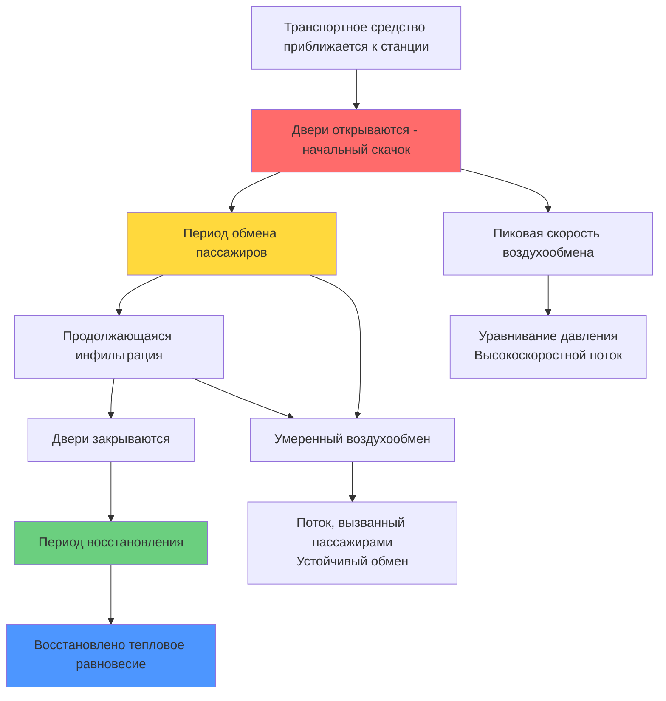

События открывания дверей представляют собой значительный и часто недооцениваемый источник нагрузки инфильтрации в системах HVAC массового транспорта. Каждый цикл открывания двери вводит некондиционированный воздух со станции в транспортное средство, создавая мгновенные тепловые и влажностные нагрузки, которые система HVAC должна компенсировать во время последующих участков маршрута.

## Воздухообмен при открывании дверей

Скорость воздухообмена при открывании двери зависит от перепада давления между транспортным средством и станцией, геометрии двери, продолжительности открывания и моделей воздушного потока, создаваемых движением пассажиров. Объем инфильтрации на одно событие открывания двери составляет:

$$Q_{inf} = A_{door} \cdot v_{avg} \cdot t_{open} \cdot E$$

Где $A_{door}$ — площадь открывания двери (м²), $v_{avg}$ — средняя скорость воздуха через отверстие (м/с), $t_{open}$ — продолжительность открывания двери (с), и $E$ — коэффициент эффективности смешивания (обычно 0,6–0,8).

Мгновенная чувствительная нагрузка от инфильтрации составляет:

$$q_s = \dot{m}_{air} \cdot c_p \cdot (T_{station} - T_{vehicle})$$

$$q_s = \rho \cdot Q_{inf} \cdot c_p \cdot \Delta T$$

Для типичного вагона метро с 4 дверями, каждая шириной 1,5 м × высотой 2,0 м, открытыми в течение 30 секунд со средней скоростью воздуха 1,0 м/с:

$$Q_{inf} = 4 \times (1,5 \times 2,0) \times 1,0 \times 30 \times 0,7 = 252 \text{ м}^3$$

При летних условиях с $\Delta T$ = 15°C это создает мгновенную чувствительную нагрузку приблизительно 3 150 кДж на одной остановке.

## Влияние времени стоянки на нагрузки

Время стоянки на станции прямо коррелирует с общим объемом инфильтрации. Системы городского транспорта обычно имеют:

- **Скоростные маршруты**: 15–20 секунд времени стоянки
- **Локальное обслуживание**: 30–45 секунд времени стоянки
- **Конечные станции**: 60–120 секунд времени стоянки
- **Перегруженность в часы пик**: 45–90 секунд времени стоянки

Кумулятивная суточная нагрузка инфильтрации составляет:

$$Q_{daily} = n_{stops} \cdot Q_{inf,avg} \cdot \rho \cdot c_p \cdot |\Delta T_{avg}|$$

Где $n_{stops}$ — количество остановок в день работы. Для вагона метро, совершающего 600 остановок в день со средней инфильтрацией 250 м³ на остановку и $\Delta T$ = 12°C, суточная чувствительная нагрузка от одной инфильтрации составляет приблизительно 2 160 МДж (600 кВт·ч).

## Скорости инфильтрации по типам дверей

| Тип двери | Площадь открывания (м²) | Типичное время стоянки (с) | Скорость воздухообмена (м³/с) | Объем на цикл (м³) | Относительная нагрузка |
|-----------|-------------------------|---------------------------|------------------------------|--------------------|------------------------|
| Одностворчатая раздвижная | 3,0 | 30 | 2,1 | 63 | 1,0× |
| Двустворчатая раздвижная | 3,0 | 30 | 1,8 | 54 | 0,86× |
| Герметичная дверь | 2,8 | 25 | 1,6 | 40 | 0,63× |
| Центрально-раздвижная | 3,4 | 35 | 2,3 | 81 | 1,29× |
| Широкая дверь для инвалидов | 4,5 | 40 | 3,2 | 128 | 2,03× |
| Вход через тамбур | 3,0 | 30 | 1,2 | 36 | 0,57× |

## Стратегии с применением тамбуров и воздушных завес

Тамбуры создают тепловую буферную зону, которая снижает прямую инфильтрацию в кондиционируемые помещения. Эффективность тамбура зависит от его объема и последовательности открывания дверей:

$$\eta_{vestibule} = 1 - \frac{Q_{into\_cabin}}{Q_{into\_vestibule}}$$

Хорошо спроектированные тамбуры достигают снижения инфильтрации в кабину на 40–60%. Критические параметры проектирования включают:

**Объем тамбура**: Минимум 3–4 м³ на открывание двери для обеспечения адекватной буферной емкости.

**Синхронизация блокировки дверей**: Последовательное открывание предотвращает одновременное открывание обеих дверей тамбура и кабины, сохраняя функцию воздушного замка.

**Управление давлением**: Слегка повышенное давление (5–10 Па) в тамбуре относительно кабины и станции снижает двусторонний поток.

Воздушные завесы предоставляют альтернативную или дополнительную стратегию, используя высокоскоростные воздушные струи (8–15 м/с) через отверстие двери. Эффективность герметизации составляет:

$$\eta_{curtain} = \frac{v_{jet}}{v_{jet} + v_{infiltration}}$$

Эффективная установка воздушной завесы требует 250–400 Вт на погонный метр ширины двери. Для транзитных приложений воздушные завесы наиболее практичны на одиночных дверях пригородных поездов с тамбурами, а не на многодверных вагонах метро из-за ограничений по мощности и пространству.

## Время восстановления после закрывания дверей

После закрывания дверей система HVAC должна восстановить условия в кабине. Время восстановления зависит от запаса мощности системы:

$$t_{recovery} = \frac{m_{air} \cdot c_p \cdot \Delta T_{rise}}{q_{cooling} - q_{baseline}}$$

Где $q_{cooling}$ — общая охлаждающая мощность и $q_{baseline}$ — нагрузка от всех остальных источников. Транзитные системы, спроектированные с запасом мощности 25–35% выше базовой нагрузки, могут восстановить температуру в течение 2–4 минут при типичных временах движения между станциями.

Повышение температуры от одного события открывания двери составляет:

$$\Delta T_{rise} = \frac{Q_{inf} \cdot \rho \cdot c_p \cdot (T_{station} - T_{initial})}{m_{cabin} \cdot c_p}$$

Для транспортного средства массой 20 000 кг с инфильтрацией 250 м³ и $\Delta T$ = 15°C мгновенное повышение температуры составляет приблизительно 0,5–0,8°C, заметное для пассажиров.

## Энергетическое воздействие частых остановок

Маршруты с высокой частотой обслуживания и близко расположенными станциями испытывают наибольший энергетический штраф от инфильтрации через двери. Годовое потребление энергии, связанное с инфильтрацией, составляет:

$$E_{annual} = n_{stops,annual} \cdot Q_{inf} \cdot \rho \cdot c_p \cdot \overline{|\Delta T|} \cdot \frac{1}{COP}$$

Для линии метро, работающей 20 часов в день, 365 дней в году с поездами, останавливающимися каждые 90 секунд (800 остановок на одно транспортное средство в день):

- Годовое количество остановок на одно транспортное средство: 292 000
- Объем инфильтрации на остановку: 250 м³
- Средний температурный перепад: 10°C
- COP системы: 2,5

Это дает приблизительно 120 000 кВт·ч годового потребления энергии на одно транспортное средство исключительно из инфильтрации через двери, что представляет 15–25% от общего потребления энергии HVAC на высокочастотных городских маршрутах.

## Проектирование для маршрутов с высокой частотой обслуживания

Системы HVAC транзита, обслуживающие маршруты с остановками каждые 1–2 минуты, требуют специальных рассмотрений при проектировании:

**Увеличенная мощность**: Предоставить запас мощности 30–40% выше расчетных установившихся нагрузок для обработки повторных импульсов инфильтрации без дрейфа температуры в кабине.

**Управление быстрого реагирования**: Быстродействующие термостатические расширительные вентили и компрессоры с переменной скоростью, реагирующие в течение 10–15 секунд на внезапные изменения нагрузки.

**Интеграция тепловой массы**: Стратегическое размещение тепловой массы (водяные резервуары, материалы с фазовым переходом) для поглощения скачков температуры и снижения циклирования.

**Прогностические алгоритмы**: Системы управления на основе GPS, которые предвосхищают предстоящие остановки на станциях и предварительно охлаждают кабину для компенсации ожидаемой инфильтрации.

**Оптимизация дверей**: Минимизировать время стоянки путем улучшения потока пассажиров, экранирующих дверей платформ на станциях и более быстрого срабатывания дверей (сокращение времени стоянки с 30 до 20 секунд сэкономит 33% инфильтрации на остановку).

Экранирующие двери платформ, все более распространенные в современных системах метро, практически исключают инфильтрацию при надлежащей герметизации, снижая потребление энергии HVAC на 20–30% при одновременном улучшении теплового комфорта платформы и безопасности.
