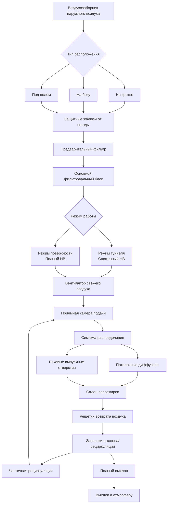

# Требования к наружному воздуху для HVAC-систем массового общественного транспорта

Вентиляция наружным воздухом в транспортных средствах массового общественного транспорта представляет уникальные вызовы по сравнению со стационарными зданиями. Системы общественного транспорта должны обеспечивать адекватный приток свежего воздуха при сильно переменной заполняемости, при работе в разнообразных условиях, включая туннели, эстакады и участки на уровне земли. Надлежащее управление наружным воздухом непосредственно влияет на комфорт пассажиров, качество воздуха и энергоэффективность системы.

## Стандарты наружного воздуха на пассажира

Вентиляция транспортных средств следует рекомендациям стандартов ASHRAE 62.1 и 62.2, адаптированных для мобильных приложений. Рекомендуемый расход наружного воздуха на пассажира варьируется в зависимости от типа транспорта и условий эксплуатации.

Базовое требование по наружному воздуху выражается как:

$$Q_{oa} = N_{pass} \times V_{pp} + A_{floor} \times V_{area}$$

где $Q_{oa}$ — общий расход наружного воздуха (CFM), $N_{pass}$ — количество пассажиров, $V_{pp}$ — наружный воздух на человека (обычно 7,5–15 CFM или 12,7–25,5 м³/ч), $A_{floor}$ — площадь пола (м²), и $V_{area}$ — расход вентиляции по площади (0,645 м³/(ч·м²)).

| Тип транспорта | Наружный воздух на пассажира | Проектная заполняемость | Общее требование по НВ |
|----------------|------------------------------|------------------------|------------------------|
| Метро/Метрополитен | 10 CFM/чел. (17 м³/(ч·чел.)) | 150 пассажиров | 1 500 CFM (2 550 м³/ч) |
| Легкорельсовый транспорт | 12 CFM/чел. (20 м³/(ч·чел.)) | 80 пассажиров | 960 CFM (1 631 м³/ч) |
| Пригородный поезд | 15 CFM/чел. (25,5 м³/(ч·чел.)) | 120 пассажиров | 1 800 CFM (3 058 м³/ч) |
| Городской автобус | 12 CFM/чел. (20 м³/(ч·чел.)) | 40 пассажиров | 480 CFM (816 м³/ч) |
| Туристический/Дальнобойный автобус | 15 CFM/чел. (25,5 м³/(ч·чел.)) | 55 пассажиров | 825 CFM (1 401 м³/ч) |
| Скоростной автобусный транспорт | 10 CFM/чел. (17 м³/(ч·чел.)) | 60 пассажиров | 600 CFM (1 020 м³/ч) |

Эти значения представляют минимальные требования при нормальных условиях эксплуатации. Фактические проектные значения часто включают коэффициенты безопасности 1,2–1,5 для учета открывания дверей, потерь на инфильтрацию и деградации производительности фильтра.

## Проектные аспекты высокой заполняемости

Транспортные средства часто эксплуатируются при полной или превышающей проектную заполняемость, при этом стоящие пассажиры значительно увеличивают плотность занятия. Условия высокой заполняемости требуют надежных стратегий вентиляции.

Подходы к проектированию для переполненных условий включают:

**Расчеты пиковых нагрузок**: Базирование систем наружного воздуха на предельных условиях заполняемости (обычно 6–8 стоящих пассажиров на квадратный метр) вместо одного лишь расчета по сидячим местам. Это приводит к системам наружного воздуха в 1,5–2,0 раза больше, чем предполагали бы расчеты только по сидячим местам.

**Равномерность распределения**: При блокировании стоящими пассажирами путей потока воздуха наружный воздух должен подаваться в несколько мест. Потолочные диффузоры с высокими коэффициентами индукции обеспечивают лучшее перемешивание, чем сосредоточенные боковые выпускные отверстия.

**Мониторинг CO₂**: Датчики углекислого газа в реальном времени позволяют динамически регулировать подачу наружного воздуха. Целевые уровни CO₂ составляют 800–1000 ppm выше атмосферного, что указывает на надлежащую вентиляцию даже при максимальной переполненности.

Эффективный расход вентиляции с учетом перемешивания составляет:

$$Q_{eff} = Q_{oa} \times \epsilon_{mixing}$$

где $\epsilon_{mixing}$ — коэффициент эффективности вентиляции, обычно 0,8–0,95 для хорошо спроектированных систем общественного транспорта.

## Расположение воздухозаборника наружного воздуха

Расположение воздухозаборника критически влияет на качество воздуха и производительность системы. Проектные аспекты варьируются в зависимости от типа транспортного средства и условий эксплуатации.

**Наземные транспортные средства (автобусы, трамваи)**: Воздухозаборники, установленные на крыше, минимизируют воздействие выхлопных газов на уровне улицы, пыли и загрязнений. Воздухозаборники на крыше следует размещать:
- На минимальной высоте 1,5 м над уровнем земли
- В направлении движения для использования давления тарана при движении
- С жалюзи, наклоненными под углом 30–45° для предотвращения попадания дождя
- На расстоянии не менее 3 м от выпускных отверстий выхлопа

**Рельсовые транспортные средства**: Воздухозаборники под полом распространены, но подвергают систему воздействию загрязнений на уровне рельсов, пыли колес и частиц тормозов. Воздухозаборники на крыше обеспечивают более чистый воздух, но требуют защиты от погодных условий и могут создавать аэродинамическое сопротивление. Боковые воздухозаборники на уровне окон предлагают компромиссные решения.

**Эксплуатация в туннелях**: Воздухозаборники должны учитывать качество воздуха в туннеле, которое может быть ухудшено:
- Дизельным твердым топливом (в невelektrифицированных туннелях)
- Пылью от тормозов и частицами от шлифовки рельсов
- Сниженным уровнем кислорода в длинных туннелях
- Температурными экстремумами (туннели часто на 10–20°C теплее поверхности)

## Фильтрация наружного воздуха

Наружный воздух в транспорте требует агрессивной фильтрации из-за повышенного воздействия твердых частиц и невозможности контролировать качество входящего воздуха.

**Выбор фильтра**: Многоступенчатая фильтрация является стандартом:
- Предварительные фильтры (MERV 8–10): удаляют крупные частицы, защищают нижестоящее оборудование
- Основные фильтры (MERV 13–14): захватывают тонкие твердые частицы, PM2.5, дизельную сажу
- Дополнительный активированный уголь: поглощают запахи, VOC и газообразные загрязнители

Рельсовые системы в туннелях или в условиях дизельного загрязнения часто использует фильтры MERV 14 или HEPA (MERV 17–20) несмотря на увеличенный штраф по энергии вентилятора.

**Техническое обслуживание фильтра**: Интервалы замены фильтров в транспорте значительно короче, чем в зданиях:
- Предварительные фильтры: 1–3 месяца
- Основные фильтры: 3–6 месяцев
- Среды с высокой запыленностью: требуется замена ежемесячно

Мониторинг перепада давления по фильтровальным блокам инициирует предупреждения о техническом обслуживании, обычно при 124–248 Па для конечных фильтров.

## Переменный наружный воздух для повышения эффективности

Фиксированная подача наружного воздуха тратит энергию при низкой заполняемости. Системы переменного наружного воздуха регулируют вентиляцию в соответствии с фактическими нагрузками пассажиров.

**Вентиляция с контролем спроса (DCV)**: Датчики CO₂ модулируют заслонки наружного воздуха для поддержания целевых уровней. Положение заслонки наружного воздуха контролируется:

$$POS_{damper} = POS_{min} + K \times (CO_2_{actual} - CO_2_{setpoint})$$

где $POS_{min}$ — минимальное положение заслонки (обычно 20–30% для соответствия кодексу), $K$ — коэффициент усиления управления, и значения CO₂ в ppm.

**Управление на основе заполняемости**: Автоматизированные системы подсчета пассажиров (APC) позволяют прямую корреляцию между нагрузкой пассажиров и вентиляцией:

$$Q_{oa,variable} = \max(Q_{min}, N_{counted} \times V_{pp})$$

Этот подход обеспечивает более отзывчивое управление, чем системы на основе CO₂, которые отстают от изменений заполняемости на 10–20 минут.

Экономия энергии от переменного управления наружным воздухом обычно составляет 15–30% от общей энергии HVAC, с большей экономией на малозагруженных маршрутах и в часы пик-минимума.

## Различия между эксплуатацией в туннеле и на поверхности

Среда эксплуатации драматически влияет на стратегию наружного воздуха. Рельсовые системы должны адаптировать вентиляцию к условиям туннеля и поверхности.

**Аспекты эксплуатации в туннеле**:

- **Сниженное качество воздуха**: Воздух в туннеле содержит повышенные уровни CO₂, твердые частицы и тепло от предыдущих поездов. Заслонки наружного воздуха могут частично закрываться, увеличивая коэффициенты рециркуляции с типичных 60–70% до 80–90%.

- **Перепад температур**: Туннели часто работают на 10–20°C теплее, чем поверхность, снижая охлаждающий эффект наружного воздуха и потенциально требуя полной рециркуляции летом.

- **Переходные процессы давления**: Прохождение поезда через туннель создает волны давления, влияющие на производительность воздухозаборника. Воздухозаборники требуют обратных заслонок и сброса давления для предотвращения повреждения системы.

- **Расположение вентиляционных шахт туннеля**: Наружный воздух, поступающий рядом с вентиляционными шахтами туннеля, выигрывает от поступающего в шахту свежего воздуха. Системы координируют со графиками вентиляции туннелей.

**Эксплуатация на поверхности**:

- **Воздействие погодных условий**: Прямое воздействие окружающих условий позволяет работу экономайзера в мягкую погоду. Свободное охлаждение становится доступным при $T_{наружн} < T_{возврат} - 2,8°C$.

- **Максимальный наружный воздух**: Эксплуатация на поверхности допускает 100% наружный воздух в условиях умеренной погоды, улучшая качество воздуха и снижая проблемы, связанные с рециркуляцией.

- **Аэродинамические эффекты**: Скорость транспортного средства создает давление тарана в воздухозаборниках, обращенных вперед, обеспечивая прирост 24–73 Па при скорости 97 км/ч, слегка снижая требования мощности вентилятора.

**Переключение режимов**: Автоматизированные системы управления обнаруживают вход в туннель/выход из туннеля и соответственно регулируют заслонки наружного воздуха. Типичная последовательность переходов:
1. Обнаружен вход в туннель (GPS, маяк рельсовой линии или датчик света)
2. Заслонки наружного воздуха закрываются до минимального положения в течение 10–30 секунд
3. Рециркуляция увеличивается для поддержания общего расхода воздуха
4. При выходе из туннеля заслонки открываются на поверхностные параметры в течение 30–60 секунд

Эта экологическая адаптация поддерживает приемлемое качество воздуха при минимизации потребления энергии и защите пассажиров от специфических для туннеля проблем качества воздуха.

## Заключение

Требования к наружному воздуху для HVAC-систем массового общественного транспорта уравновешивают соответствие кодексам, комфорт пассажиров, качество воздуха и энергоэффективность в уникально сложных условиях. Надлежащее проектирование учитывает экстремальные вариации заполняемости, разнообразные среды эксплуатации и ограничения мобильной платформы. Стратегии переменного наружного воздуха в сочетании с надежной фильтрацией и управлением с адаптацией к среде обеспечивают оптимальную производительность во всем диапазоне условий эксплуатации транспорта.
