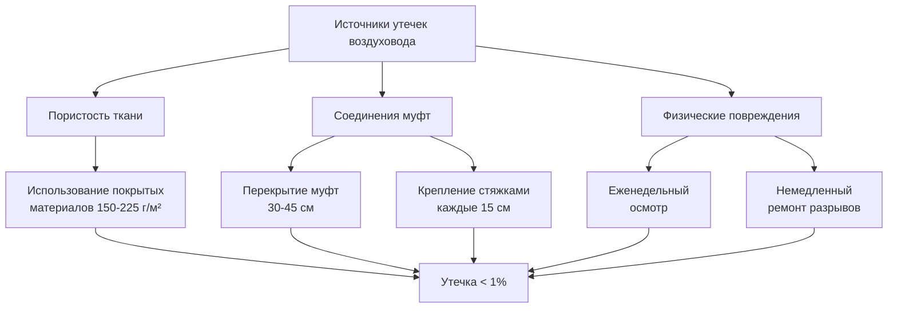
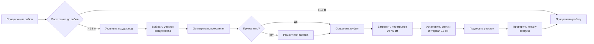

## Типы систем воздуховодов

Вспомогательные вентиляционные воздуховоды шахт транспортируют воздух от вентиляторов к забоям через замкнутые пространства, где основная вентиляция не может проникнуть. Выбор воздуховода напрямую влияет на подачу воздуха, требования к давлению системы и эксплуатационные расходы.

### Гибкие воздуховоды

**Плоский (складной) воздуховод** состоит из материала с покрытием, армированного стальной проволокой или синтетическим шнуром. При подаче давления воздуховод расширяется в круглое поперечное сечение; при отсутствии давления он складывается в плоскую форму для транспортировки. Распространенные материалы включают:

- Полиэстер с ПВХ-покрытием (наиболее распространен, диапазон рабочих температур от -29°C до 66°C)
- Нейлон с неопреновым покрытием (приложения, стойкие к пожару)
- Ткань с полиуретановым покрытием (устойчивость к истиранию)

**Жесткий спиральный воздуховод** использует стальную спираль с блокирующимися швами. Хотя он тяжелее и дороже, чем плоский воздуховод, спиральный воздуховод обеспечивает:

- Более низкие потери трения (гладкая внутренняя поверхность)
- Устойчивость к коллапсу при приложениях с отрицательным давлением
- Увеличенный срок службы при постоянной установке

### Сравнение типов воздуховодов

| Параметр | Плоский воздуховод | Жесткий спиральный воздуховод |
|-----------|--------------|-------------------|
| Коэффициент трения (f) | 0,025-0,035 | 0,018-0,022 |
| Вес (кг/м, диаметр 91 см) | 1,8-2,7 | 6,7-8,9 |
| Соотношение объема транспортировки | 1:20 свернутый | 1:1 |
| Типичный срок службы | 2-5 лет | 10-15 лет |
| Предел давления | 2,0-3,0 кПа | 5,0-7,5 кПа |
| Стоимость (руб./м, диаметр 91 см) | 2600-3900 | 8150-13000 |

## Методология выбора размера воздуховода

Выбор диаметра воздуховода уравновешивает подачу воздуха против потребления энергии вентилятором. Недостаточный размер воздуховода создает чрезмерные потери давления; слишком большие воздуховоды увеличивают утечки и стоимость материалов.

### Выбор размера на основе скорости

Рекомендации MSHA предлагают поддерживать скорость воздуховода от 12,7 до 20,3 м/с для оптимальной производительности. Необходимый диаметр следует из уравнения неразрывности:

$$D = \sqrt{\frac{4Q}{\pi V}}$$

Где:
- $D$ = диаметр воздуховода (м)
- $Q$ = требуемая подача воздуха (м³/ч)
- $V$ = скорость проектирования (м/с)

**Пример:** Для $Q = 9 425$ м³/ч при $V = 17,8$ м/с:

$$D = \sqrt{\frac{4 \times 9425}{\pi \times 17,8}} = \sqrt{67,0} = 8,18 \text{ м} = 82 \text{ см}$$

Выбор стандартного размера: воздуховод диаметром 91 см.

### Расчеты потерь давления

Общие потери давления в системах гибких воздуховодов превышают предсказания по формулам для гладких труб из-за шероховатости поверхности и движения воздуховода. Падение давления на единицу длины составляет:

$$\Delta P_L = f \frac{L}{D} \frac{\rho V^2}{2}$$

Где:
- $\Delta P_L$ = потеря давления (кПа)
- $f$ = коэффициент трения (безразмерный)
- $L$ = длина воздуховода (м)
- $D$ = диаметр воздуховода (м)
- $\rho$ = плотность воздуха (кг/м³, обычно 1,2)
- $V$ = скорость (м/с)

**Преобразование в практические единицы (кПа):**

$$\Delta P_{кПа} = f \frac{L}{D} \frac{\rho V^2}{2000}$$

Где $V$ выражена в м/с, а $D$ в метрах.

Для предыдущего примера с воздуховодом из плоской ткани длиной 305 м и диаметром 91 см ($f = 0,030$):

$$\Delta P_{кПа} = 0,030 \times \frac{305}{0,91} \times \frac{1,2 \times 17,8^2}{2000} = 2,67 \text{ кПа}$$

### Рассмотрение коэффициента трения

Коэффициенты трения гибких воздуховодов превышают значения для жестких воздуховодов из-за:

1. **Неровностей поверхности** от переплетения ткани и текстуры покрытия
2. **Провисания воздуховода** между точками подвески, создающего турбулентность
3. **Продольные складки** в частично надутых участках
4. **Неправильное совмещение** соединений на стыках

Фактические коэффициенты трения варьируются в зависимости от возраста воздуховода, качества установки и рабочего давления. Используйте консервативные значения (верхний диапазон) для предварительного проектирования.

## Допуски на утечки

Утечки воздуховода происходят через пористость ткани, зазоры соединений и повреждения. MSHA 30 CFR 75.330 требует достаточной подачи воздуха с учетом утечек.

### Расчет утечек

Эмпирический расход утечки для гибкого воздуховода:

$$Q_L = k P^{0.6} D L$$

Где:
- $Q_L$ = расход утечки (м³/ч)
- $k$ = коэффициент утечки (0,0008-0,0024 для нового воздуховода, 0,0032-0,0060 для старого воздуховода)
- $P$ = статическое давление воздуховода (кПа)
- $D$ = диаметр (см)
- $L$ = длина (сотни метров)

**Пример:** 305 м воздуховода диаметром 91 см при давлении 1,92 кПа, состояние старого воздуховода ($k = 0,004$):

$$Q_L = 0,004 \times 1,92^{0.6} \times 91 \times 3,05 = 0,004 \times 1,47 \times 277,4 = 1,63 \text{ м³/ч на 100 м}$$

Общая утечка: $1,63 \times 3,05 = 4,97$ м³/ч (0,53% подачи 9425 м³/ч).

### Снижение утечек

## Методы подвески воздуховода

Надлежащая подвеска предотвращает провисание, поддерживает пропускную способность воздуховода и уменьшает физические повреждения. MSHA требует безопасного крепления для предотвращения падения на рабочих или оборудование.

### Расстояние между подвесками

Максимальное расстояние между подвесками зависит от диаметра воздуховода и материала:

| Диаметр воздуховода | Плоский (м) | Жесткий спиральный (м) |
|---------------|--------------|-------------------|
| 45-61 см | 2,4-3,0 | 3,7-4,6 |
| 76-91 см | 1,8-2,4 | 3,0-3,7 |
| 107-122 см | 1,5-1,8 | 2,4-3,0 |
| 137-152 см | 1,2-1,5 | 1,8-2,4 |

### Типы подвесок

1. **Тросовые строп** - стальной трос, обвитый вокруг воздуховода, подвешенный к анкерным болтам
2. **Полосовые подвески** - нейлоновые или стальные полосы с регулируемым натяжением
3. **Жесткие скобы** - стальные скобы, привинченные к ребрам (постоянные установки)
4. **Монорельсовые системы** - верхний рельс со скользящими подвесками (мобильные приложения)

**Критическая практика установки:** Подвешивайте воздуховод в соединениях муфт для предотвращения разделения под нагрузкой. Допускайте провисание 2-3% между подвесками во избежание повреждения от натяжения.

## Предотвращение повреждений

Физические повреждения снижают подачу воздуха и создают опасности для безопасности. Распространенные режимы отказа включают:

### Механические удары

- Позиционируйте воздуховод минимум на 30 см от путей мобильного оборудования
- Установите защитные барьеры на пересечениях
- Используйте спиральный воздуховод в местах с интенсивным движением

### Тепловое воздействие

Материалы воздуховода деградируют при воздействии чрезмерного тепла:

- Ткани с ПВХ-покрытием: максимум 66°C непрерывно, 82°C прерывистый режим
- Тепло от взрывных работ требует 24-часового охлаждения перед повторным входом воздуховода
- Используйте высокотемпературные материалы (стекловолокно с кремнийорганическим покрытием) вблизи источников тепла

### Химическое воздействие

- Частицы дизельного топлива накапливаются на внутренней поверхности воздуховода (ежегодная чистка)
- Контакт с кислотной шахтной водой разрушает ПВХ-покрытия
- Используйте химически устойчивые материалы в коррозионной среде

## Процедуры удлинения воздуховода

MSHA 30 CFR 75.330(a)(1) требует завершения воздуховода в пределах 15 м от забоя для угольных шахт. Шахты по добыче металла и неметаллических полезных ископаемых следуют аналогичным государственным требованиям.

## Проверка производительности

Проверка подачи воздуха подтверждает адекватность системы:

1. **Измерьте скорость** на выходе воздуховода с помощью крыльчатого анемометра
2. **Рассчитайте расход**: $Q = V \times A$, где $A = 0,785D^2$
3. **Сравните с требуемой вентиляцией** согласно таблице MSHA 70-1
4. **Задокументируйте измерения** ежемесячно в соответствии с 30 CFR 75.361

**Критерии приемки:** Подача воздуха должна соответствовать или превышать расчетное требование, включая допуск на утечки и стандарт вентиляции забоя.

---

**Смежные темы:**
- Выбор и расчет вспомогательных вентиляторов
- Планирование вентиляции шахты
- Требования к контролю качества воздуха
